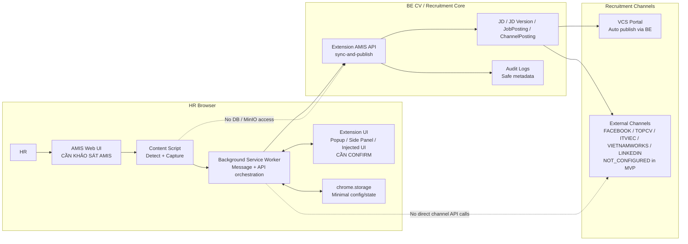

# 02. Extension Architecture

## 1. Mục tiêu tài liệu

Tài liệu này mô tả kiến trúc kỹ thuật dự kiến cho Browser Extension kết nối AMIS với BE CV / Recruitment Core trước khi bước vào development.

Phạm vi của tài liệu là mô tả component, boundary, runtime flow, message flow, data flow, storage, permission, security boundary và failure boundary ở mức specification. Tài liệu này không implement code, không tạo source extension, không sửa backend và không chốt các chi tiết phụ thuộc AMIS UI/API/field/selector khi chưa có khảo sát thực tế.

Các quyết định chưa có dữ liệu hoặc chưa được confirm sẽ được đánh dấu `CẦN CONFIRM` hoặc `CẦN KHẢO SÁT AMIS`.

## 2. Architecture principles

Các nguyên tắc kiến trúc kế thừa từ `01_extension_context_and_scope.md`:

- AMIS là HR primary workspace. HR tiếp tục thao tác tuyển dụng chính trên AMIS.
- Extension chỉ là lớp hỗ trợ thao tác, không thay thế AMIS.
- Extension chỉ capture / preview / trigger.
- Extension không xử lý nghiệp vụ nặng.
- Extension không ghi DB trực tiếp.
- Extension không gọi MinIO hoặc object storage trực tiếp.
- Extension không gọi API của recruitment channel trực tiếp.
- Extension chỉ gọi BE CV / Recruitment Core API.
- BE CV là nơi validate payload, enforce JWT/role, xử lý idempotency, audit, publish và workflow.
- Extension không log full snapshot, full JD payload, token hoặc dữ liệu nhạy cảm.
- Extension không tự động sync/publish nếu HR chưa xác nhận.
- Mọi chi tiết phụ thuộc AMIS UI, AMIS URL, DOM selector, internal API, field mapping hoặc HR flow phải được khảo sát trước khi chốt.

## 3. Proposed technical stack

Stack đề xuất ở mức cần confirm:

| Layer | Đề xuất | Trạng thái |
| --- | --- | --- |
| Language | TypeScript | `CẦN CONFIRM` |
| UI | React | `CẦN CONFIRM` |
| Build tool | Vite | `CẦN CONFIRM` |
| Extension platform | Chrome Extension Manifest V3 | `CẦN CONFIRM` |
| Runtime APIs | `chrome.runtime`, `chrome.storage`, `chrome.tabs`, `chrome.scripting` | `CẦN CONFIRM` theo permission thực tế |
| Optional UI API | `chrome.sidePanel` nếu chọn side panel | `CẦN CONFIRM` |

Ghi chú:

- Tài liệu này chưa chốt popup, side panel, injected panel hoặc mô hình kết hợp là UI final.
- Nếu chọn side panel, cần xác nhận browser target và availability của `chrome.sidePanel`.
- Nếu chọn popup, cần xác nhận UX preview có đủ không gian để review JD và channel result.
- Nếu chọn injected panel trong AMIS page, cần khảo sát ràng buộc DOM/CSS và policy bảo mật AMIS. `CẦN KHẢO SÁT AMIS`.

## 4. Extension component overview

| Component | Vai trò | Boundary / ghi chú |
| --- | --- | --- |
| Manifest | Khai báo permission, host permission, content script, background service worker và UI entry. | Không chốt domain AMIS/BE tại file này. |
| Content Script | Chạy trong AMIS page, detect screen, extract AMIS Job Snapshot ở mức có thể, gửi message nội bộ. | Mọi logic detect/extract phụ thuộc AMIS là `CẦN KHẢO SÁT AMIS`. |
| Background Service Worker | Điều phối message, gọi BE API, quản lý token/config tối thiểu, xử lý response. | Không xử lý nghiệp vụ backend; chỉ orchestration client-side. |
| Popup / Side Panel UI | Hiển thị preview, missing fields, channel selection, confirmation và sync result. | UI pattern final là `CẦN CONFIRM`. |
| Backend API Client | Wrapper gọi BE CV API, attach JWT và request metadata. | Chỉ gọi BE CV; không gọi DB/MinIO/channel API. |
| Storage Layer | Lưu token/config/sync state tối thiểu bằng `chrome.storage` nếu được confirm. | Auth/token storage là `CẦN CONFIRM`. |
| Domain Types | Định nghĩa object nội bộ như `AmisJobSnapshot`, `ChannelSelection`, `SyncResult`. | Field AMIS chi tiết không chốt trước khảo sát. |
| Logger / Error Handler | Log an toàn và normalize lỗi cho UI. | Không log full snapshot, full JD payload, token hoặc PII không cần thiết. |

## 5. High-level architecture diagram



Boundary chính:

- CoreDB/MinIO không được expose cho extension.
- External channels không được gọi trực tiếp từ extension.
- AMIS Web UI chi tiết chưa khảo sát: `CẦN KHẢO SÁT AMIS`.
- Extension chỉ gọi BE CV API qua endpoint được backend kiểm soát bằng JWT/role.

## 6. Runtime flow

Runtime flow dự kiến:

```text
HR mở AMIS recruitment page
-> Content Script detect page
-> Content Script extract snapshot ở mức có thể
-> Extension UI hiển thị preview
-> HR confirm action + selected channels
-> Background gọi BE sync-and-publish API
-> BE validate JWT/role/payload/idempotency
-> BE sync JD / JD Version / JobPosting / ChannelPosting
-> BE publish VCS Portal nếu được chọn
-> BE trả result
-> Extension UI hiển thị result từng channel
```

Các điểm chưa chốt:

- Cách Content Script nhận diện AMIS recruitment page: `CẦN KHẢO SÁT AMIS`.
- Cách extract snapshot từ DOM hoặc internal API: `CẦN KHẢO SÁT AMIS`.
- UI entry point là popup, side panel, injected button hay kết hợp: `CẦN CONFIRM`.
- Extension có tự refresh trạng thái khi HR mở lại cùng AMIS job hay không: `CẦN CONFIRM`.

## 7. Message flow inside extension

Message flow nội bộ dự kiến:

```text
Content Script -> Background: AMIS_JOB_DETECTED
Content Script -> Background: AMIS_JOB_SNAPSHOT_EXTRACTED
UI -> Background: SYNC_AND_PUBLISH_REQUESTED
Background -> BE API: sync-and-publish
Background -> UI: SYNC_AND_PUBLISH_RESULT
Background -> UI: ERROR
```

Contract message ở mức specification:

| Message | Source | Target | Payload dự kiến | Ghi chú |
| --- | --- | --- | --- | --- |
| `AMIS_JOB_DETECTED` | Content Script | Background | URL/page metadata tối thiểu, detection status | Không log full page content. AMIS detection là `CẦN KHẢO SÁT AMIS`. |
| `AMIS_JOB_SNAPSHOT_EXTRACTED` | Content Script | Background | `AmisJobSnapshot`, extraction warnings, missing fields | Field mapping là `CẦN KHẢO SÁT AMIS`. |
| `SYNC_AND_PUBLISH_REQUESTED` | UI | Background | action, selectedChannels, preview snapshot, optional request metadata | Chỉ gửi sau HR confirm. |
| `sync-and-publish` | Background | BE API | `ExtensionSyncRequest` qua HTTP | Backend là source of truth. |
| `SYNC_AND_PUBLISH_RESULT` | Background | UI | `ExtensionSyncResult` | Hiển thị result theo channel. |
| `ERROR` | Background | UI | safe error code/message/context tối thiểu | Không chứa full payload nhạy cảm. |

## 8. Data flow

Các data object chính:

### 8.1. `AmisJobSnapshot`

Object capture từ AMIS trước khi gửi backend.

| Field dự kiến | Ý nghĩa | Trạng thái |
| --- | --- | --- |
| `title` | Tiêu đề tin tuyển dụng / JD. | `CẦN CONFIRM FIELD MAPPING` |
| `description` | Mô tả công việc. | `CẦN CONFIRM FIELD MAPPING` |
| `requirements` | Yêu cầu ứng viên / kỹ năng / kinh nghiệm. | `CẦN CONFIRM FIELD MAPPING` |
| `benefits` | Phúc lợi nếu AMIS có dữ liệu tương ứng. | `CẦN CONFIRM FIELD MAPPING` |
| other AMIS metadata | Dữ liệu phụ trợ nếu cần. | `CẦN KHẢO SÁT AMIS` |

Không chốt field AMIS chi tiết trong file này.

### 8.2. `ExtensionSyncRequest`

Object extension gửi BE qua API đã có:

| Field | Ý nghĩa | Trạng thái |
| --- | --- | --- |
| `amisRecruitmentId` | External recruitment id từ AMIS. | BE yêu cầu; nguồn lấy từ AMIS là `CẦN KHẢO SÁT AMIS`. |
| `amisUrl` | URL AMIS hiện tại hoặc URL job detail nếu có. | `CẦN KHẢO SÁT AMIS`. |
| `action` | `PUBLISH`, `UPDATE`, hoặc `CLOSE`. | Đã có trong backend contract. |
| `snapshot` | AMIS Job Snapshot đã preview. | Field mapping là `CẦN KHẢO SÁT AMIS`. |
| `selectedChannels` | Danh sách channel HR chọn. | Default selection là `CẦN CONFIRM`. |

Extension nên gửi thêm headers nếu có:

- `X-Request-Id`
- `Idempotency-Key`
- `X-Extension-Version`

### 8.3. `ExtensionSyncResult`

Object kết quả BE trả về cho extension:

| Field | Ý nghĩa |
| --- | --- |
| `resultCode` | `OK` hoặc `DUPLICATE_OR_IDEMPOTENT_REPLAY`. |
| `jobDescriptionId` | ID JobDescription trong BE CV. |
| `jobDescriptionVersionId` | ID active version sau sync. |
| `jobPostingId` | ID JobPosting trong BE CV. |
| `amisRecruitmentId` | AMIS recruitment id đã sync. |
| `snapshotChanged` | Snapshot có thay đổi so với lần sync trước không. |
| `channelPostings` | Kết quả từng channel. |

### 8.4. `ChannelPostingResult`

Object result theo channel:

| Field | Ý nghĩa |
| --- | --- |
| `channel` | `VCS_PORTAL`, `FACEBOOK`, `TOPCV`, `ITVIEC`, `VIETNAMWORKS`, `LINKEDIN` hoặc channel được backend hỗ trợ. |
| `status` | Ví dụ `PUBLISHED`, `UPDATED`, `CLOSED`, `NOT_CONFIGURED`. |
| `publishedUrl` | URL public nếu backend có. |
| `errorCode` | Safe error code nếu có. |
| `manualActionRequired` | Có cần HR xử lý ngoài hệ thống hay không. |

## 9. Storage architecture

Extension chỉ được lưu dữ liệu tối thiểu cần cho UX và auth đã được confirm.

Có thể lưu:

- BE API base URL. `CẦN CONFIRM`
- JWT/access token hoặc auth state nếu cơ chế auth được confirm. `CẦN CONFIRM`
- Extension config tối thiểu.
- Last sync result tối thiểu để hiển thị lại trạng thái gần nhất. `CẦN CONFIRM`
- Selected channel preference nếu được confirm. `CẦN CONFIRM`
- Extension version/runtime settings không nhạy cảm.

Không được lưu:

- Full JD payload lâu dài nếu không cần.
- Token/secret của recruitment channel.
- Raw CV.
- PII không cần thiết.
- Full audit payload.
- Full AMIS page content.
- Password hoặc credential AMIS.

Storage candidate:

| Storage | Use case dự kiến | Trạng thái |
| --- | --- | --- |
| `chrome.storage.local` | Config/token/state tối thiểu trên máy local. | `CẦN CONFIRM` theo auth policy. |
| `chrome.storage.session` | Runtime-only state nếu cần giảm persistence. | `CẦN CONFIRM`. |
| In-memory state | Preview hiện tại và transient message state. | Preferred cho dữ liệu snapshot nhạy cảm nếu UX cho phép. |

## 10. Permission and host boundary

Permission dự kiến, chưa chốt final:

| Permission | Mục đích | Trạng thái |
| --- | --- | --- |
| `storage` | Lưu config/auth/sync state tối thiểu. | `CẦN CONFIRM` |
| `activeTab` | Truy cập tab hiện tại khi HR kích hoạt extension. | `CẦN CONFIRM` |
| `scripting` | Inject hoặc execute content script nếu cần. | `CẦN CONFIRM` |
| `tabs` | Chỉ dùng nếu thật sự cần đọc tab metadata hoặc điều phối tab. | `CẦN CONFIRM` |
| `sidePanel` | Chỉ dùng nếu chọn side panel. | `CẦN CONFIRM` |

Host permissions:

| Host | Purpose | Trạng thái |
| --- | --- | --- |
| AMIS host permission | Cho content script chạy trên AMIS recruitment page. | `CẦN KHẢO SÁT AMIS DOMAIN` |
| BE API host permission | Cho extension gọi BE CV API. | `CẦN CONFIRM` |
| External channel host permission | Không dùng trong MVP. | Không cấp nếu extension không gọi trực tiếp channel API. |

Nguyên tắc permission:

- Xin ít permission nhất có thể.
- Không chốt AMIS domain cụ thể khi chưa khảo sát.
- Không cấp wildcard rộng nếu không cần.
- Không cấp host permission cho external channel nếu extension không gọi trực tiếp các channel đó.

## 11. Security boundary

Security boundary:

- Extension chỉ chạy trên AMIS domain allowlist. AMIS domain cụ thể là `CẦN KHẢO SÁT AMIS DOMAIN`.
- Extension chỉ gọi BE CV API.
- Extension không gọi DB, MinIO, object storage hoặc channel API trực tiếp.
- Extension không lưu secret channel.
- Extension không log full AMIS snapshot hoặc full JD payload.
- Extension không log JWT/access token.
- Backend JWT/role kiểm soát quyền `HR`/`ADMIN`.
- Request nên có `X-Request-Id`, `Idempotency-Key`, `X-Extension-Version` nếu extension có thể tạo/propagate.
- Backend xử lý idempotency, audit và publish; extension không tự quyết định nghiệp vụ.
- Auth flow của extension là `CẦN CONFIRM`.

Sensitive data handling:

| Data | Client handling |
| --- | --- |
| AMIS Job Snapshot | Chỉ giữ transient để preview/sync; không persist lâu dài nếu không cần. |
| JWT/access token | Chỉ lưu theo auth policy đã confirm. `CẦN CONFIRM` |
| Channel credential | Không lưu trong extension. |
| CV / candidate data | Không thuộc phạm vi extension MVP. |
| Audit metadata | Chỉ gửi request metadata tối thiểu; backend ghi audit an toàn. |

## 12. Failure boundary

| Vị trí lỗi | Ví dụ lỗi | Cách xử lý dự kiến |
| --- | --- | --- |
| AMIS Detection | Không nhận diện được màn hình AMIS recruitment. | Hiển thị trạng thái không hỗ trợ / cần khảo sát; không auto sync. |
| Snapshot Extraction | Thiếu title, description hoặc requirements. | Hiển thị missing fields; không gọi BE khi dữ liệu bắt buộc thiếu. |
| Extension UI | HR cancel hoặc đóng preview. | Không gọi BE; không lưu payload dài hạn. |
| Storage | Không đọc được token/config. | Yêu cầu login/config lại; không retry vô hạn. |
| BE API | `401` / `403`. | Yêu cầu login lại hoặc báo không đủ quyền. |
| BE API | Validation error. | Hiển thị safe message và field thiếu nếu backend trả. |
| BE API | Duplicate replay. | Hiển thị đã đồng bộ, không coi là lỗi nghiêm trọng. |
| BE API | Invalid state transition. | Hiển thị safe error và hướng dẫn HR kiểm tra trạng thái job. |
| Channel | `NOT_CONFIGURED`. | Hiển thị channel chưa cấu hình/chưa verify; không fail toàn bộ request. |
| Network | Timeout hoặc mất kết nối. | Cho HR retry có kiểm soát; dùng idempotency key để tránh duplicate. |

Các copy UI cụ thể cho từng lỗi là `CẦN CONFIRM` và nên được chốt trong `09_extension_state_and_error_handling.md`.

## 13. Architecture decisions confirmed

Các quyết định đã có từ bối cảnh hiện tại:

- AMIS là nơi HR thao tác chính.
- Extension không thay thế AMIS.
- Extension chỉ capture / preview / trigger.
- Extension không xử lý nghiệp vụ nặng.
- Extension không ghi DB trực tiếp.
- Extension không gọi MinIO/object storage trực tiếp.
- Extension không tự publish external channel.
- Extension chỉ gọi BE CV / Recruitment Core API.
- BE CV / Recruitment Core là source of truth.
- BE xử lý idempotency theo `sourceSystem=AMIS + amisRecruitmentId + snapshotHash`.
- Snapshot không đổi trả `resultCode: DUPLICATE_OR_IDEMPOTENT_REPLAY`.
- Snapshot thay đổi thì BE update JD và tạo JobDescriptionVersion active mới.
- `VCS_PORTAL` là channel auto publish đã có ở BE.
- Các channel chưa verify như `FACEBOOK`, `TOPCV`, `ITVIEC`, `VIETNAMWORKS`, `LINKEDIN` trả `NOT_CONFIGURED` từ BE và không fail toàn bộ request.
- Backend audit logs ghi requested/succeeded/failed events nhưng không lưu full request payload.

## 14. Architecture decisions pending

Các quyết định cần confirm trước khi thiết kế chi tiết hoặc implement:

1. Extension UI dùng popup, side panel, injected panel hay kết hợp? `CẦN CONFIRM`
2. Stack TypeScript + React + Vite + Manifest V3 có được chốt không? `CẦN CONFIRM`
3. AMIS domain chính xác là gì? `CẦN KHẢO SÁT AMIS`
4. AMIS recruitment page URL pattern là gì? `CẦN KHẢO SÁT AMIS`
5. BE API domain/env config cho extension là gì? `CẦN CONFIRM`
6. Extension auth flow dùng JWT login riêng, reuse token từ web app, SSO/OAuth hay cơ chế khác? `CẦN CONFIRM`
7. Token/JWT có được lưu trong `chrome.storage` không? `CẦN CONFIRM`
8. Có lưu selected channel preference không? `CẦN CONFIRM`
9. Có cần sync status khi HR mở lại AMIS job detail không? `CẦN CONFIRM`
10. Có cần extension badge/status trên AMIS job list không? `CẦN CONFIRM`
11. Content Script đọc dữ liệu từ DOM hay từ AMIS internal API? `CẦN KHẢO SÁT AMIS`
12. Có được phép phụ thuộc vào AMIS internal API không? `CẦN CONFIRM`
13. Field mapping AMIS -> `AmisJobSnapshot` là gì? `CẦN KHẢO SÁT AMIS`
14. Default selected channels trong MVP là gì? `CẦN CONFIRM`
15. UI copy cho `NOT_CONFIGURED`, validation error, auth error và duplicate replay là gì? `CẦN CONFIRM`

## 15. Relationship với các file specification sau

File này chỉ chốt kiến trúc tổng quan và boundary ở mức specification. File này không chốt AMIS DOM/API/field mapping, không chốt UI pattern final và không chốt auth flow.

Các phần chi tiết sẽ nằm ở các file sau:

- `03_extension_user_flow_hr_posting.md`: mô tả user flow HR, confirmation points, happy path và alternate path.
- `04_amis_screen_and_capture_requirement.md`: khảo sát màn hình AMIS, URL, DOM/API, detection và capture requirement. Phụ thuộc dữ liệu khảo sát AMIS thực tế.
- `05_amis_job_snapshot_mapping.md`: mapping AMIS fields sang backend snapshot. Không được chốt nếu chưa khảo sát AMIS.
- `06_extension_backend_api_contract.md`: contract gọi BE API, headers, request/response, error code.
- `07_extension_ui_specification.md`: popup/side panel/injected UI, preview, channel selection và result display.
- `08_extension_auth_security_audit.md`: auth flow, token storage, permission, audit và privacy.
- `09_extension_state_and_error_handling.md`: state machine, retry, duplicate replay, validation và channel errors.
- `10_extension_implementation_task_breakdown.md`: task breakdown sau khi các quyết định pending đã được confirm.
