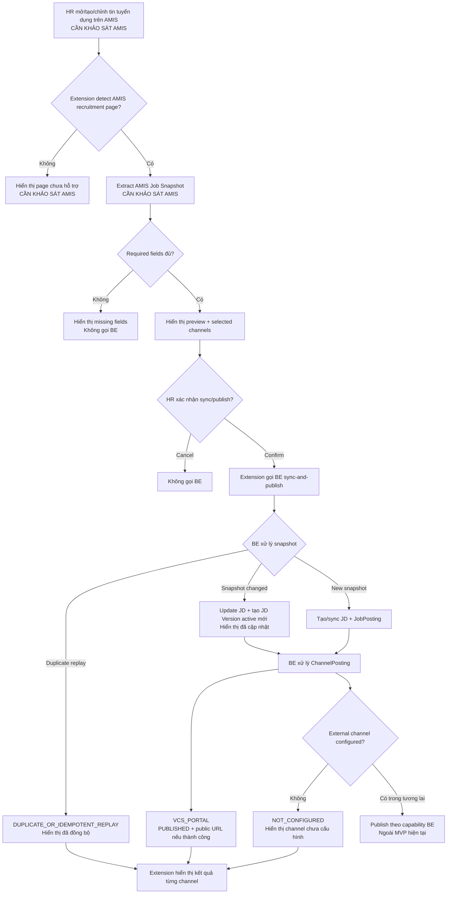

# 03. Extension User Flow - HR Posting

## 1. Mục tiêu tài liệu

Tài liệu này mô tả luồng thao tác của HR cho use case đăng tin tuyển dụng từ AMIS sang BE CV / Recruitment Core và các recruitment channels thông qua Browser Extension.

Mục tiêu là chốt user flow ở mức nghiệp vụ và tương tác hệ thống trước khi đi vào các specification chi tiết hơn. File này không mô tả DOM selector, AMIS internal API, field mapping chi tiết hoặc UI layout chi tiết. Các phần phụ thuộc AMIS thực tế được đánh dấu `CẦN KHẢO SÁT AMIS`; các quyết định sản phẩm/kỹ thuật chưa chốt được đánh dấu `CẦN CONFIRM`.

## 2. Actor và hệ thống tham gia

| Actor / Hệ thống | Vai trò trong flow | Ghi chú |
| --- | --- | --- |
| HR | Người thao tác chính, tạo/chỉnh/đăng tin tuyển dụng trên AMIS, kiểm tra preview và xác nhận sync/publish. | Quyền cụ thể trên AMIS là `CẦN KHẢO SÁT AMIS`. |
| AMIS Web UI | Nơi HR thao tác tuyển dụng chính. | Màn hình, URL pattern, field và flow thao tác là `CẦN KHẢO SÁT AMIS`. |
| Browser Extension | Hỗ trợ phát hiện trang AMIS, capture snapshot, hiển thị preview, nhận xác nhận và gửi trigger tới BE CV. | Extension chỉ detect/capture/preview/trigger; không xử lý nghiệp vụ nặng. |
| BE CV / Recruitment Core | Source of truth cho sync, publish, idempotency, audit, JD versioning và ChannelPosting. | Extension chỉ gọi BE API; BE quyết định business rule. |
| VCS Portal | Channel public job nội bộ đã có khả năng publish qua BE. | BE trả public URL nếu publish thành công. |
| External Channels | Facebook, TopCV, ITviec, VietnamWorks, LinkedIn. | BE tạo `ChannelPosting = NOT_CONFIGURED` trong MVP; extension không gọi trực tiếp. |

Nguyên tắc vai trò:

- HR thao tác chính trên AMIS.
- Extension chỉ hỗ trợ phát hiện, preview, xác nhận và gửi trigger.
- BE CV xử lý sync, publish, idempotency và audit.
- External channels nhận trạng thái từ BE; extension không gọi trực tiếp external channel API.

## 3. MVP flow tổng quan

```text
HR đăng nhập AMIS
→ HR mở/tạo/chỉnh tin tuyển dụng trên AMIS
→ HR bấm đăng tin hoặc kích hoạt hành động sync qua extension
→ Extension phát hiện màn/tin tuyển dụng
→ Extension lấy AMIS Job Snapshot ở mức có thể
→ Extension hiển thị preview cho HR
→ HR kiểm tra dữ liệu
→ HR chọn channel
→ HR xác nhận sync/publish
→ Extension gọi BE CV API
→ BE trả kết quả
→ Extension hiển thị trạng thái từng channel
```

Các bước phụ thuộc AMIS chưa khảo sát:

- HR đăng nhập AMIS và mở đúng màn tuyển dụng: `CẦN KHẢO SÁT AMIS`.
- HR bấm nút AMIS "Đăng tin" hay kích hoạt extension riêng: `CẦN CONFIRM TRIGGER`.
- Extension phát hiện màn/tin tuyển dụng AMIS: `CẦN KHẢO SÁT AMIS`.
- Extension lấy AMIS Job Snapshot từ DOM/API/page state: `CẦN KHẢO SÁT AMIS`.

## 4. Precondition

Điều kiện trước khi flow chạy:

- HR có tài khoản AMIS và đang ở màn tuyển dụng phù hợp. `CẦN KHẢO SÁT AMIS`
- HR có quyền tạo/sửa/đăng tin trên AMIS. `CẦN KHẢO SÁT AMIS`
- Extension đã được cài trong browser.
- Extension đã cấu hình BE API endpoint. `CẦN CONFIRM`
- Extension đã xác thực với BE bằng cơ chế hợp lệ. `CẦN CONFIRM AUTH FLOW`
- BE đã có API nhận AMIS Job Snapshot.
- BE đã hỗ trợ idempotency theo `sourceSystem=AMIS + amisRecruitmentId + snapshotHash`.
- BE đã hỗ trợ `VCS_PORTAL` publish và trả public URL.
- Các channel ngoài chưa verify sẽ trả `NOT_CONFIGURED` và không làm fail toàn bộ request.

## 5. Main success flow

| Step | Actor | Action | System behavior | Output |
| --- | --- | --- | --- | --- |
| 1 | HR | Mở AMIS recruitment page. | AMIS hiển thị màn hình tuyển dụng nếu HR có quyền. | AMIS page đang mở. `CẦN KHẢO SÁT AMIS` |
| 2 | Browser Extension | Detect trang AMIS recruitment. | Content Script hoặc cơ chế tương đương nhận diện ngữ cảnh AMIS. | State `AMIS_PAGE_DETECTED` nếu nhận diện được. `CẦN KHẢO SÁT AMIS` |
| 3 | HR | Tạo hoặc chỉnh tin tuyển dụng trên AMIS. | AMIS lưu/hiển thị dữ liệu theo flow AMIS. | Tin tuyển dụng sẵn sàng để HR xem lại. `CẦN KHẢO SÁT AMIS` |
| 4 | HR | Bấm đăng tin hoặc mở extension để sync. | Trigger chính thức chưa chốt. Extension chỉ tiếp tục nếu HR chủ động. | Sync intent được tạo. `CẦN CONFIRM TRIGGER` |
| 5 | Browser Extension | Extract AMIS Job Snapshot. | Extension capture dữ liệu ở mức có thể từ AMIS page/API/page state. | Draft `AmisJobSnapshot`. `CẦN KHẢO SÁT AMIS` |
| 6 | Browser Extension | Validate sơ bộ required fields. | Extension kiểm tra title và các field backend yêu cầu ở mức có thể. | Missing fields hoặc `SNAPSHOT_READY`. `CẦN CONFIRM FIELD MAPPING` |
| 7 | Browser Extension | Hiển thị preview. | UI hiển thị dữ liệu snapshot, missing fields và cảnh báo nếu có. | HR nhìn thấy preview trước khi sync/publish. |
| 8 | HR | Chọn channel. | Extension hiển thị channel selection theo backend-supported channels. | `selectedChannels` được chọn. Default là `CẦN CONFIRM DEFAULT SELECTED CHANNELS` |
| 9 | HR | Bấm "Đồng bộ và đăng bài". | Extension xác nhận explicit consent từ HR. | Request được phép gửi BE. |
| 10 | Browser Extension | Gửi request tới BE. | Background/API client gọi `POST /api/extension/amis/job-postings/sync-and-publish` với JWT và metadata nếu có. | BE nhận request. |
| 11 | BE CV / Recruitment Core | Xử lý idempotency, sync và publish. | BE tạo/cập nhật JD, JD Version, JobPosting, ChannelPosting, audit và publish `VCS_PORTAL` nếu được chọn. | Sync result theo backend contract. |
| 12 | Browser Extension | Hiển thị kết quả. | UI hiển thị trạng thái tổng thể, snapshot changed/duplicate và trạng thái từng channel. | HR thấy kết quả sync/publish. |

## 6. HR confirmation rule

Nguyên tắc xác nhận của HR:

- Extension không tự động gọi BE để publish nếu HR chưa xác nhận.
- HR phải nhìn thấy preview trước khi sync/publish.
- HR phải thấy action sẽ gửi, ví dụ `PUBLISH`, `UPDATE` hoặc `CLOSE` nếu các action này được bật trong UI.
- HR phải thấy selected channels trước khi xác nhận.
- Nếu thiếu field bắt buộc thì extension phải cảnh báo và không auto sync/publish.
- Nếu dữ liệu chưa đủ tin cậy do AMIS chưa khảo sát, extension phải hiển thị trạng thái cần kiểm tra hoặc missing data thay vì tự suy luận. `CẦN KHẢO SÁT AMIS`
- Copy cụ thể của nút xác nhận và cảnh báo là `CẦN CONFIRM UI COPY`.

## 7. Channel selection flow

Channel behavior trong MVP:

- `VCS_PORTAL` là channel auto publish đã có ở BE.
- `FACEBOOK`, `TOPCV`, `ITVIEC`, `VIETNAMWORKS`, `LINKEDIN` là channel chưa verify; BE trả `NOT_CONFIGURED`.
- Extension hiển thị kết quả theo response BE.
- Extension không tự gọi API channel.
- Extension không lưu hoặc xử lý credential của external channels.

Flow chọn channel:

```text
Extension hiển thị danh sách channel
→ HR chọn một hoặc nhiều channel
→ HR xác nhận sync/publish
→ BE tạo ChannelPosting cho từng channel
→ Extension hiển thị status từng channel từ BE response
```

Default selected channels chưa được confirm: `CẦN CONFIRM DEFAULT SELECTED CHANNELS`.

## 8. Duplicate / idempotent replay flow

Khi HR sync lại cùng một tin với snapshot không đổi:

1. Extension gửi cùng `amisRecruitmentId` và snapshot tương đương lần trước.
2. BE tính snapshot hash và phát hiện không đổi.
3. BE trả `resultCode: DUPLICATE_OR_IDEMPOTENT_REPLAY`.
4. BE không tạo duplicate JobDescription, JobDescriptionVersion hoặc JobPosting.
5. Extension hiển thị cho HR: "Tin này đã được đồng bộ, không tạo bản ghi mới".
6. Extension không coi đây là lỗi nghiêm trọng.

Ghi chú:

- Cách extension ổn định `amisRecruitmentId` phụ thuộc AMIS: `CẦN KHẢO SÁT AMIS`.
- Copy UI final cho duplicate replay là `CẦN CONFIRM UI COPY`.

## 9. Changed snapshot flow

Khi HR sửa tin trên AMIS rồi sync lại:

1. HR cập nhật nội dung tin tuyển dụng trên AMIS. `CẦN KHẢO SÁT AMIS`
2. Extension lấy snapshot mới.
3. Extension hiển thị preview để HR kiểm tra lại.
4. HR xác nhận update/sync.
5. BE phát hiện `snapshotHash` thay đổi.
6. BE update JobDescription.
7. BE tạo JobDescriptionVersion active mới.
8. BE cập nhật JobPosting liên quan theo convention backend hiện có.
9. Extension hiển thị: "Đã cập nhật phiên bản JD mới".

Các quyết định còn pending:

- Trigger update là cùng nút sync/publish hay action `UPDATE` riêng: `CẦN CONFIRM UPDATE FLOW`.
- AMIS save/update event mà extension nên bám vào là gì: `CẦN KHẢO SÁT AMIS`.
- Copy UI final cho updated snapshot là `CẦN CONFIRM UI COPY`.

## 10. Error / exception flows

| Case | Expected behavior |
| --- | --- |
| Extension không nhận diện được AMIS page | Hiển thị page chưa hỗ trợ / `CẦN KHẢO SÁT AMIS`; không auto sync. |
| Không lấy được `amisRecruitmentId` | Không sync; yêu cầu khảo sát hoặc HR kiểm tra ngữ cảnh AMIS. |
| Thiếu field bắt buộc | Hiển thị missing field; không auto publish. |
| HR cancel | Không gọi BE. |
| BE trả `401` / `403` | Yêu cầu login lại hoặc kiểm tra quyền HR/Admin. |
| BE trả validation error | Hiển thị lỗi field an toàn, không log full payload. |
| BE trả duplicate replay | Hiển thị đã sync, không tạo mới; không coi là lỗi nghiêm trọng. |
| BE trả `NOT_CONFIGURED` channel | Hiển thị channel chưa cấu hình/chưa verify. |
| BE lỗi `500` / network | Cho phép retry có kiểm soát; không tạo quyết định mới. |

Các error copy final và retry policy chi tiết sẽ nằm ở `09_extension_state_and_error_handling.md`.

## 11. UX state trong flow

Các user-facing state chính của extension:

| State | Ý nghĩa | User-facing behavior |
| --- | --- | --- |
| `IDLE` | Extension chưa detect hoặc chưa có action. | Hiển thị trạng thái chờ hoặc entry point tối thiểu. |
| `AMIS_PAGE_DETECTED` | Extension nhận diện được AMIS recruitment page. | Cho phép capture/preview nếu đủ điều kiện. `CẦN KHẢO SÁT AMIS` |
| `EXTRACTING` | Extension đang lấy snapshot. | Hiển thị loading, không cho submit trùng. |
| `SNAPSHOT_READY` | Snapshot đã sẵn sàng để preview. | Hiển thị preview cho HR. |
| `MISSING_REQUIRED_FIELDS` | Snapshot thiếu field bắt buộc. | Hiển thị missing fields; disable sync/publish. |
| `READY_TO_SYNC` | HR đã có preview và dữ liệu đủ điều kiện. | Cho phép HR xác nhận sync/publish. |
| `SYNCING` | Extension đang gọi BE. | Hiển thị progress; tránh double submit. |
| `SYNC_SUCCEEDED` | BE sync/publish thành công hoặc có kết quả hợp lệ. | Hiển thị IDs, public URL nếu có và channel statuses. |
| `DUPLICATE_REPLAY` | BE trả idempotent replay. | Hiển thị đã đồng bộ, không tạo mới. |
| `SYNC_FAILED` | Sync thất bại. | Hiển thị safe error và action tiếp theo. |
| `CHANNEL_NOT_CONFIGURED` | Một hoặc nhiều channel trả `NOT_CONFIGURED`. | Hiển thị channel chưa cấu hình/chưa verify. |

State machine chi tiết không thuộc file này.

## 12. Data displayed to HR

Dữ liệu extension nên hiển thị trong preview:

| Data | Mục đích hiển thị | Trạng thái mapping |
| --- | --- | --- |
| Title | HR kiểm tra tiêu đề tin tuyển dụng. | `CẦN CONFIRM FIELD MAPPING` |
| Position | HR kiểm tra vị trí tuyển dụng. | `CẦN KHẢO SÁT AMIS` |
| Department | HR kiểm tra phòng ban. | `CẦN KHẢO SÁT AMIS` |
| Level | HR kiểm tra cấp bậc. | `CẦN KHẢO SÁT AMIS` |
| Quantity | HR kiểm tra số lượng tuyển. | `CẦN KHẢO SÁT AMIS` |
| Location | HR kiểm tra địa điểm làm việc. | `CẦN CONFIRM FIELD MAPPING` |
| Working mode | HR kiểm tra hình thức làm việc. | `CẦN KHẢO SÁT AMIS` |
| Deadline | HR kiểm tra hạn ứng tuyển. | `CẦN CONFIRM FIELD MAPPING` |
| Description summary | HR kiểm tra tóm tắt mô tả công việc. | `CẦN CONFIRM FIELD MAPPING` |
| Requirements summary | HR kiểm tra tóm tắt yêu cầu. | `CẦN CONFIRM FIELD MAPPING` |
| Benefits summary | HR kiểm tra tóm tắt phúc lợi. | `CẦN CONFIRM FIELD MAPPING` |
| Selected channels | HR kiểm tra nơi sẽ publish/track. | `CẦN CONFIRM DEFAULT SELECTED CHANNELS` |
| Missing fields | HR biết field nào cần bổ sung trước khi sync. | Phụ thuộc backend validation và AMIS mapping. |
| AMIS source id | HR/Support trace ngược AMIS job nếu lấy được. | `CẦN KHẢO SÁT AMIS` |

Không hiển thị hoặc lưu lâu dài full payload nếu không cần. Preview cần đủ để HR xác nhận trước khi gửi BE.

## 13. Mermaid user flow diagram



## 14. Out of scope trong user flow này

Không thuộc phạm vi file này:

- DOM selector chi tiết.
- AMIS internal API contract.
- Field mapping chi tiết AMIS -> BE.
- Extension UI layout chi tiết.
- Auth implementation.
- Token storage implementation.
- Channel auto publish thật cho external channels.
- Credential/config của external channels.
- CV processing.
- Mapping CV-JD.
- Form/AI Screening/HR Review.
- Interview/evaluation flow cũ.
- Backend behavior changes.
- Extension source code hoặc implementation task chi tiết.

## 15. Open Questions / Cần confirm trước file tiếp theo

Các câu hỏi cần confirm trước khi tạo file tiếp theo:

1. HR trigger sync/publish bằng nút AMIS "Đăng tin", nút extension, hay cả hai? `CẦN CONFIRM TRIGGER`
2. Extension UI dùng Side Panel, Popup, Injected Panel hay kết hợp? `CẦN CONFIRM`
3. Stack TypeScript + React + Vite + Manifest V3 đã chốt chưa? `CẦN CONFIRM`
4. AMIS domain và URL pattern cụ thể là gì? `CẦN KHẢO SÁT AMIS`
5. `amisRecruitmentId` lấy từ URL, API response, DOM hay nguồn nào? `CẦN KHẢO SÁT AMIS`
6. Content Script đọc dữ liệu từ DOM, AMIS internal API, page state hay kết hợp? `CẦN KHẢO SÁT AMIS`
7. Có được phép phụ thuộc AMIS internal API không? `CẦN CONFIRM`
8. Field AMIS nào map sang `title`, `description`, `requirements`, `benefits`, `location`, `deadline`? `CẦN KHẢO SÁT AMIS`
9. Auth flow extension với BE là gì? `CẦN CONFIRM AUTH FLOW`
10. Channel nào được chọn mặc định trong MVP? `CẦN CONFIRM DEFAULT SELECTED CHANNELS`
11. Có cần extension hiển thị badge/status khi HR mở lại AMIS job detail/list không? `CẦN CONFIRM`
12. Có cần support update/close ngay trong MVP không, hay chỉ publish? `CẦN CONFIRM`
13. Extension có cần lưu last sync result để hiển thị lại không? `CẦN CONFIRM`
14. Copy UI cho duplicate replay, changed snapshot, validation error và `NOT_CONFIGURED` là gì? `CẦN CONFIRM UI COPY`
15. Có policy bảo mật nội bộ nào giới hạn extension đọc nội dung JD trên AMIS không? `CẦN CONFIRM`
