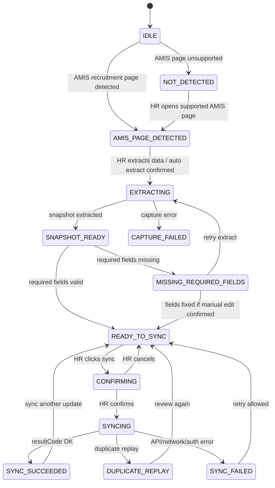

# 07. Extension UI Specification

## 1. Mục tiêu tài liệu

Tài liệu này định nghĩa UI/UX specification cho Browser Extension ở mức trước khi development. Mục tiêu là mô tả các mode UI có thể dùng, entry point, screen/state, preview field, channel selection, confirm flow, result display, warning/error handling và các câu hỏi cần confirm.

File này kế thừa scope từ các spec trước:

- AMIS là nơi HR thao tác chính.
- Extension chỉ detect/capture/preview/confirm/trigger.
- Extension không xử lý nghiệp vụ nặng, không ghi DB, không gọi MinIO và không gọi external channel API trực tiếp.
- BE CV / Recruitment Core là source of truth cho validation, idempotency, versioning, audit và channel publishing.
- Backend API chính đã có: `POST /api/extension/amis/job-postings/sync-and-publish`.

File này không chốt UI mode cuối cùng, không implement code, không tạo source extension, không sửa backend, không tự bịa AMIS URL/API/selector/field mapping và không sửa legacy modules.

## 2. UI principles

- HR thao tác chính trên AMIS; extension UI chỉ bổ sung lớp hỗ trợ.
- Extension UI chỉ phục vụ preview, warning, confirmation, sync result và retry có kiểm soát.
- Extension không tự động sync/publish nếu HR chưa xác nhận.
- Extension phải làm rõ dữ liệu nào được capture từ AMIS và dữ liệu nào còn thiếu/chưa đủ tin cậy.
- Missing required fields phải rõ ràng, dễ hiểu và không bị chôn trong log kỹ thuật.
- Không hiển thị hoặc log dữ liệu nhạy cảm không cần thiết.
- Không log full AMIS snapshot, full JD payload, token/JWT hoặc contact info nếu không cần.
- Duplicate replay từ BE không được hiển thị như lỗi nghiêm trọng.
- Channel `NOT_CONFIGURED` không làm fail toàn bộ flow; UI cần tách rõ "đồng bộ thành công" và "channel chưa cấu hình".
- UI phải thể hiện rõ BE là nơi xử lý chính: tạo/cập nhật JD, versioning, publish, audit và idempotency.
- UI không tự suy luận AMIS field mapping khi chưa khảo sát; các điểm chưa biết phải ghi `CẦN KHẢO SÁT AMIS` hoặc `CẦN CONFIRM`.

## 3. UI mode options

UI mode cuối cùng chưa được confirm. Các phương án dưới đây chỉ là lựa chọn thiết kế để so sánh:

| UI mode | Mô tả | Ưu điểm | Nhược điểm | Status |
| --- | --- | --- | --- | --- |
| Popup | Mở từ icon extension, phù hợp thao tác nhanh | Gọn, quen thuộc với browser extension | Không phù hợp preview JD dài, dễ mất context khi popup đóng | `CẦN CONFIRM UI MODE` |
| Side Panel | Panel bên phải browser, phù hợp preview JD dài | Rộng, dễ xem field/channel/status, giữ được context khi HR nhìn AMIS | Cần xác nhận browser target, permission và support `chrome.sidePanel` | `CẦN CONFIRM UI MODE` |
| Injected Panel | Gắn trực tiếp vào AMIS page | Gần flow HR, có thể đặt cạnh nội dung đang xem | Rủi ro ảnh hưởng AMIS UI/CSS, phụ thuộc DOM, cần khảo sát kỹ | `CẦN CONFIRM UI MODE` / `CẦN KHẢO SÁT AMIS` |
| Hybrid | Popup mở nhanh + Side Panel preview chi tiết | Linh hoạt, popup dùng làm launcher còn panel dùng cho review dài | Phức tạp hơn, cần thêm state/message flow | `CẦN CONFIRM UI MODE` |

Không coi bất kỳ phương án nào là final trong file này.

## 4. Recommended MVP UI direction - CẦN CONFIRM

Recommendation / `CẦN CONFIRM`:

- Dùng Side Panel làm UI chính cho preview, channel selection, confirmation và sync result.
- Dùng Popup như entry nhanh để hiển thị trạng thái ngắn và mở Side Panel nếu cần.
- Chưa dùng Injected Panel trong MVP nếu chưa khảo sát AMIS UI/CSS/DOM kỹ, vì rủi ro ảnh hưởng trải nghiệm AMIS.

`CẦN CONFIRM: Đây là recommendation, chưa phải quyết định cuối.`

Lý do recommendation:

- JD/tin tuyển dụng thường có nội dung dài như description, requirements và benefits.
- HR cần xem đồng thời AMIS page và preview extension.
- Channel result có nhiều trạng thái, cần không gian để hiển thị rõ `PUBLISHED`, `UPDATED`, `NOT_CONFIGURED`, duplicate replay và lỗi validation.

## 5. UI entry points

| Entry point | Mô tả | Status |
| --- | --- | --- |
| Click extension icon | HR mở popup/panel thủ công | `CẦN CONFIRM` |
| Auto detect AMIS page | Extension nhận diện page AMIS và hiển thị trạng thái hỗ trợ | `CẦN KHẢO SÁT AMIS` |
| Click button trong extension | HR chủ động extract/sync/publish từ UI extension | `CẦN CONFIRM` |
| Hook vào nút AMIS "Đăng tin" | Extension bắt sự kiện AMIS publish để mở preview/confirm | `CẦN KHẢO SÁT AMIS` / `CẦN CONFIRM TRIGGER` |
| Badge/status trên AMIS list/detail | Hiển thị trạng thái đã sync/chưa sync khi HR mở lại job | Optional / `CẦN CONFIRM` |

Nguyên tắc entry point:

- Không tự động gửi BE chỉ vì phát hiện AMIS page.
- Không hook nút AMIS nếu chưa khảo sát DOM/event flow và chưa có confirm về policy.
- Nếu phát hiện page chưa hỗ trợ, UI chỉ hiển thị trạng thái hướng dẫn, không hiển thị nút sync.
- Trigger chính là nút trong extension, nút AMIS hay kết hợp vẫn là `CẦN CONFIRM TRIGGER`.

## 6. Main UI screens/states

### 6.1. Not Detected State

Khi HR chưa ở màn AMIS recruitment được hỗ trợ hoặc extension chưa nhận diện được page.

Hiển thị:

- "Chưa phát hiện màn tuyển dụng AMIS được hỗ trợ".
- Gợi ý mở màn tuyển dụng AMIS phù hợp. Nội dung cụ thể là `CẦN KHẢO SÁT AMIS`.
- Trạng thái AMIS domain/page là `CẦN KHẢO SÁT AMIS` nếu chưa xác định được.
- Không hiển thị nút sync/publish.
- Có thể hiển thị nút refresh/detect lại nếu UI mode hỗ trợ. `CẦN CONFIRM`.

Không hiển thị:

- Không hiển thị form channel selection.
- Không hiển thị button gửi BE.
- Không log full page content.

### 6.2. AMIS Page Detected State

Khi extension phát hiện màn AMIS recruitment.

Hiển thị:

- "Đã phát hiện tin tuyển dụng trên AMIS".
- AMIS URL hoặc source context nếu an toàn để hiển thị. `CẦN KHẢO SÁT AMIS`.
- Button "Trích xuất dữ liệu" hoặc auto extract nếu đã confirm.
- Capture source dự kiến: `API`, `PAGE_STATE`, `DOM`, `MANUAL_CONFIRMATION` hoặc `CẦN KHẢO SÁT AMIS`.
- Warning nếu capture source chưa đủ tin cậy.

Chưa chốt:

- Extension auto extract ngay khi detect page hay chờ HR click. `CẦN CONFIRM`.
- Có hiển thị badge/status trên AMIS page không. `CẦN CONFIRM`.

### 6.3. Extracting State

Khi extension đang lấy AMIS Job Snapshot.

Hiển thị:

- Loading/progress ngắn gọn.
- Capture source đang thử, nếu có.
- Button cancel nếu flow extract có thể kéo dài. `CẦN CONFIRM`.

Behavior:

- Disable sync/publish trong lúc extract.
- Không cho HR gửi nhiều request song song.
- Không lưu full snapshot lâu dài nếu chưa cần.
- Nếu extract fail, chuyển sang error/capture warning state.

### 6.4. Snapshot Preview State

Khi snapshot đã capture được ở mức đủ để preview.

Hiển thị các nhóm thông tin:

- Source: AMIS Recruitment ID, AMIS URL nếu có, capture source.
- Basic info: title, position, department, level, quantity nếu capture được.
- Work info: location, working mode, deadline, salary range nếu capture được.
- Job content: description, requirements, benefits.
- Channel selection.
- Missing fields.
- Warnings: field chưa chắc chắn, rich text transform chưa confirm, contact info/PII nếu có.

Quy tắc preview:

- `snapshot.description` nên hiển thị dạng summary + expand/collapse.
- `snapshot.requirements` hiện BE yêu cầu JSON object, UI cần render thành summary dễ đọc. Schema transform là `CẦN CONFIRM`.
- `snapshot.benefits` optional, nếu có cũng là JSON object theo BE hiện tại.
- Không hiển thị raw JSON dài cho HR nếu có thể render thành nội dung dễ hiểu.
- Nếu phải hiển thị raw JSON trong giai đoạn debug, cần ẩn sau debug mode và không bật mặc định. `CẦN CONFIRM`.

### 6.5. Missing Required Fields State

Required fields theo BE contract hiện tại:

- `amisRecruitmentId`
- `action`
- `snapshot.title`
- `snapshot.description`
- `snapshot.requirements` dạng JSON object
- `selectedChannels` không rỗng

Hiển thị:

- Danh sách field thiếu hoặc sai format.
- Hướng xử lý ngắn gọn cho HR.
- Nếu thiếu AMIS field do chưa khảo sát, ghi rõ cần kiểm tra lại màn AMIS hoặc mapping.

Behavior:

- Không gọi BE nếu required field thiếu hoặc sai format.
- Không cho gửi `requirements` dạng plain string nếu chưa transform thành JSON object theo rule đã confirm.
- Không cho gửi khi `selectedChannels` rỗng.
- Việc cho HR nhập tay field thiếu trong extension là `CẦN CONFIRM`.

### 6.6. Ready To Sync State

Khi preview đủ required fields và HR có thể chuẩn bị gửi BE.

Hiển thị:

- Preview đã đủ required fields.
- Action sẽ gửi: `PUBLISH`, `UPDATE` hoặc `CLOSE`.
- Channel selection.
- Warning external channels chưa cấu hình nếu selected.
- Button chính, ví dụ draft copy: "Đồng bộ và đăng bài".

Behavior:

- Button chính chỉ enable khi required fields hợp lệ và có ít nhất một selected channel.
- Nếu selected channel ngoài `VCS_PORTAL`, UI cần báo trước khả năng BE trả `NOT_CONFIGURED`.
- Nếu action `UPDATE` hoặc `CLOSE` được bật trong UI MVP, cần copy và validation riêng. `CẦN CONFIRM UPDATE/CLOSE UI`.

### 6.7. Confirm Dialog/State

Trước khi gọi BE, HR phải xác nhận.

Nội dung confirm nên nêu rõ:

- Sẽ gửi dữ liệu tin tuyển dụng từ AMIS sang BE CV / Recruitment Core.
- BE sẽ tạo/cập nhật JobDescription, JobDescriptionVersion, JobPosting và ChannelPosting.
- `VCS_PORTAL` có thể được publish nếu được chọn và BE xử lý thành công.
- External channels chưa verify sẽ trả `NOT_CONFIGURED` và không được extension đăng trực tiếp.
- Extension không gửi dữ liệu trực tiếp đến Facebook, TopCV, ITviec, VietnamWorks hoặc LinkedIn.

Button draft:

- Primary: "Xác nhận đồng bộ".
- Secondary: "Quay lại kiểm tra".

Copy final là `CẦN CONFIRM UI COPY`.

### 6.8. Syncing State

Khi extension đang gọi BE API.

Hiển thị:

- Loading state.
- Text ngắn: "Đang đồng bộ với BE CV".
- Disable submit button.
- Không cho gửi song song cùng request.

Request metadata:

- Nên gửi `X-Request-Id` nếu extension sinh được.
- Nên gửi `Idempotency-Key` nếu extension sinh được cho trace/retry, dù BE hiện chưa dùng header này làm idempotency chính.
- Nên gửi `X-Extension-Version` nếu có.

### 6.9. Success State

Khi BE trả `success=true` và `data.resultCode=OK`.

Hiển thị:

- "Đồng bộ thành công".
- `snapshotChanged` nếu cần giải thích đã tạo/cập nhật version.
- `jobPostingId` hoặc link support nếu cần. Không bắt buộc hiển thị mọi internal ID cho HR.
- `VCS_PORTAL` public URL nếu có trong `channelPostings[].publishedUrl`.
- Channel result list.

Không nên hiển thị:

- Không hiển thị full response JSON cho HR ở mode thường.
- Không hiển thị audit metadata chi tiết nếu không cần.

### 6.10. Duplicate Replay State

Khi BE trả `data.resultCode=DUPLICATE_OR_IDEMPOTENT_REPLAY`.

Hiển thị:

- "Tin này đã được đồng bộ trước đó, không tạo bản ghi mới".
- `snapshotChanged=false`.
- Channel status hiện tại nếu BE trả `channelPostings`.
- Public URL nếu `VCS_PORTAL` có `publishedUrl`.

Behavior:

- Không coi duplicate replay là lỗi nghiêm trọng.
- Không hiển thị màu/copy giống failure.
- Có thể cho HR refresh lại snapshot hoặc quay lại AMIS nếu muốn kiểm tra thay đổi.

### 6.11. Error State

Các nhóm lỗi cần hiển thị:

- Validation error từ BE hoặc client-side precheck.
- Auth error `401`.
- Forbidden `403`.
- Network error/timeout.
- BE internal error `500`.
- AMIS capture error.
- Invalid state transition.

Behavior:

- Chỉ hiển thị safe message.
- Không hiển thị stack trace.
- Không log full payload.
- Cho retry khi lỗi network hoặc lỗi hệ thống có thể recover.
- Không retry tự động vô hạn.

## 7. Field Preview Specification

| UI Field | Source Snapshot Field | Required? | Display Rule | Status |
| --- | --- | ---: | --- | --- |
| AMIS Recruitment ID | `amisRecruitmentId` | Yes | Plain text; mask nếu policy yêu cầu | `CẦN KHẢO SÁT AMIS` |
| AMIS URL | `amisUrl` | No | Link hoặc plain text nếu không chứa query nhạy cảm | `CẦN KHẢO SÁT AMIS` / `CẦN CONFIRM` |
| Title | `snapshot.title` | Yes | Full text | Pending mapping |
| Description | `snapshot.description` | Yes | Summary + expand/collapse | Pending mapping |
| Requirements | `snapshot.requirements` | Yes | Render object thành summary + expand/collapse | `CẦN CONFIRM TRANSFORM` |
| Benefits | `snapshot.benefits` | Optional | Summary + expand/collapse nếu có | `CẦN CONFIRM TRANSFORM` |
| Position | `snapshot.position` hoặc field tương ứng | `CẦN CONFIRM` | Plain text | `CẦN KHẢO SÁT AMIS` |
| Department | `snapshot.department` hoặc field tương ứng | `CẦN CONFIRM` | Plain text | `CẦN KHẢO SÁT AMIS` |
| Level | `snapshot.level` hoặc field tương ứng | `CẦN CONFIRM` | Plain text | `CẦN KHẢO SÁT AMIS` |
| Quantity | `snapshot.quantity` hoặc field tương ứng | `CẦN CONFIRM` | Number | `CẦN KHẢO SÁT AMIS` |
| Location | `snapshot.location` hoặc field tương ứng | `CẦN CONFIRM` | Plain text | Pending |
| Working mode | `snapshot.workingMode` hoặc field tương ứng | `CẦN CONFIRM` | Plain text | `CẦN KHẢO SÁT AMIS` |
| Salary range | `snapshot.salaryRange` hoặc field tương ứng | Optional / `CẦN CONFIRM` | Plain text; không tự parse nếu chưa chốt | `CẦN KHẢO SÁT AMIS` |
| Deadline | `snapshot.deadline` hoặc field tương ứng | `CẦN CONFIRM` | Date format dễ đọc | Pending |
| Contact info | `snapshot.contactInfo` hoặc field tương ứng | `CẦN CONFIRM` | Mask nếu PII | `CẦN CONFIRM` |
| Selected Channels | `selectedChannels` | Yes | Checkbox/list | Pending default |
| Capture source | Extension metadata | Recommended | Badge/text ngắn | `CẦN CONFIRM` |
| Missing fields | Derived validation | Yes khi thiếu | List lỗi rõ ràng | Confirmed behavior |

Field display notes:

- HR-facing UI nên dùng label nghiệp vụ, ví dụ "Tiêu đề", "Mô tả công việc", "Yêu cầu", "Phúc lợi".
- Technical field name như `snapshot.requirements` chỉ nên dùng trong debug/detail hoặc tài liệu support.
- Nếu contact info được capture, phải có masking rule trước khi hiển thị/log. `CẦN CONFIRM`.

## 8. Channel Selection UI

Channel source:

- UI có thể lấy list channel từ enum/contract BE hoặc config. Cách lấy chính thức là `CẦN CONFIRM`.
- BE contract hiện support: `VCS_PORTAL`, `FACEBOOK`, `ITVIEC`, `LINKEDIN`, `TOPCV`, `VIETNAMWORKS`, `MANUAL`, `OTHER`.
- MVP business channel được nhắc trong spec gồm `VCS_PORTAL`, `FACEBOOK`, `TOPCV`, `ITVIEC`, `VIETNAMWORKS`, `LINKEDIN`.

Channel behavior:

- `VCS_PORTAL` là channel có publish URL qua BE.
- External channels như `FACEBOOK`, `TOPCV`, `ITVIEC`, `VIETNAMWORKS`, `LINKEDIN` hiện BE trả `NOT_CONFIGURED`.
- UI phải giải thích `NOT_CONFIGURED` không phải lỗi toàn bộ request.
- Default selected channels chưa chốt: `CẦN CONFIRM DEFAULT SELECTED CHANNELS`.

| Channel | Default selected? | Expected BE behavior | UI note |
| --- | ---: | --- | --- |
| `VCS_PORTAL` | `CẦN CONFIRM` | `PUBLISHED` hoặc `UPDATED` nếu thành công | Có thể có public URL |
| `FACEBOOK` | `CẦN CONFIRM` | `NOT_CONFIGURED` | Chưa cấu hình/verify |
| `TOPCV` | `CẦN CONFIRM` | `NOT_CONFIGURED` | Chưa cấu hình/verify |
| `ITVIEC` | `CẦN CONFIRM` | `NOT_CONFIGURED` | Chưa cấu hình/verify |
| `VIETNAMWORKS` | `CẦN CONFIRM` | `NOT_CONFIGURED` | Chưa cấu hình/verify |
| `LINKEDIN` | `CẦN CONFIRM` | `NOT_CONFIGURED` | Chưa cấu hình/verify |
| `MANUAL` | `CẦN CONFIRM` | Theo BE hiện tại không phải `VCS_PORTAL` nên có thể `NOT_CONFIGURED` | Có hiển thị trong MVP không? `CẦN CONFIRM` |
| `OTHER` | `CẦN CONFIRM` | Theo BE hiện tại không phải `VCS_PORTAL` nên có thể `NOT_CONFIGURED` | Có hiển thị trong MVP không? `CẦN CONFIRM` |

Channel UI behavior:

- Sử dụng checkbox hoặc toggle cho channel selection.
- Disable submit nếu không có channel nào được chọn.
- Nếu HR chọn external channel chưa cấu hình, hiển thị warning trước confirm.
- Nếu BE trả `manualActionRequired=true`, hiển thị trạng thái cần thao tác thủ công/chưa cấu hình.

## 9. BE Result Display Mapping

| BE response | UI display |
| --- | --- |
| `success=true`, `data.resultCode=OK` | "Đồng bộ thành công" |
| `data.snapshotChanged=true` | "Thông tin đã được cập nhật từ AMIS" hoặc copy tương đương `CẦN CONFIRM UI COPY` |
| `data.resultCode=DUPLICATE_OR_IDEMPOTENT_REPLAY` | "Đã đồng bộ trước đó, không tạo trùng" |
| Channel `PUBLISHED` | Hiển thị thành công + URL nếu có |
| Channel `UPDATED` | Hiển thị đã cập nhật public job |
| Channel `CLOSED` | Hiển thị đã đóng |
| Channel `NOT_CONFIGURED` | Hiển thị chưa cấu hình, không coi là lỗi toàn bộ |
| Channel `MANUAL_REQUIRED` | Hiển thị cần thao tác thủ công nếu BE trả |
| Channel `PUBLISH_FAILED` | Hiển thị lỗi channel, cho retry nếu policy hỗ trợ |
| `400 VALIDATION_ERROR` | Hiển thị field lỗi và hướng xử lý |
| `400 INVALID_STATE_TRANSITION` | Hiển thị trạng thái không hợp lệ, yêu cầu HR kiểm tra job |
| `401` | Yêu cầu đăng nhập lại |
| `403` | Hiển thị không đủ quyền |
| Network error | Cho retry có kiểm soát |
| `500 INTERNAL_ERROR` | Hiển thị lỗi hệ thống, cho retry nếu phù hợp |

Response detail display:

- `channelPostings[].publishedUrl`: show link mở public job.
- `channelPostings[].errorCode=CHANNEL_NOT_CONFIGURED`: show copy "Kênh này chưa được cấu hình".
- `meta.requestId`: có thể show trong phần "Mã tra cứu hỗ trợ" nếu cần. `CẦN CONFIRM`.
- Internal IDs như `jobDescriptionId`, `jobDescriptionVersionId`, `jobPostingId`: nên ẩn mặc định, chỉ show trong debug/support detail nếu cần.

## 10. Validation And Warning UI

Client-side precheck trước khi HR submit:

| Rule | UI behavior |
| --- | --- |
| Thiếu `amisRecruitmentId` | Block submit, hiển thị "Chưa xác định được mã tin AMIS" |
| Thiếu `action` | Block submit, hiển thị lỗi cấu hình action |
| Thiếu `snapshot.title` | Block submit, hiển thị "Thiếu tiêu đề" |
| Thiếu `snapshot.description` | Block submit, hiển thị "Thiếu mô tả công việc" |
| `snapshot.requirements` thiếu hoặc không phải JSON object | Block submit, hiển thị "Thiếu hoặc sai định dạng yêu cầu ứng viên" |
| `selectedChannels` rỗng | Block submit, yêu cầu chọn ít nhất một channel |
| Capture source là DOM | Có thể hiển thị warning độ tin cậy nếu rule được confirm |
| Rich text transform chưa confirm | Hiển thị warning ở preview/spec, không tự transform tùy tiện |
| Contact info/PII có trong snapshot | Mask hoặc không hiển thị nếu chưa confirm |

Warning categories:

- Blocking: không cho submit.
- Non-blocking: cho submit nhưng cần HR biết.
- Info: chỉ giải thích trạng thái, ví dụ external channel chưa cấu hình.

Việc cho HR sửa/nhập tay field thiếu ngay trong extension là `CẦN CONFIRM`.

## 11. Auth UI

Auth flow chính thức chưa chốt. UI chỉ mô tả behavior theo trạng thái:

| Auth state | UI behavior | Status |
| --- | --- | --- |
| Chưa authenticated | Hiển thị cần đăng nhập trước khi sync | `CẦN CONFIRM AUTH FLOW` |
| Token expired / `401` | Yêu cầu đăng nhập lại | `CẦN CONFIRM AUTH FLOW` |
| Role không phải `ADMIN`/`HR` / `403` | Hiển thị không đủ quyền | Confirmed role requirement |
| Auth loading | Hiển thị loading ngắn, không cho submit | Pending implementation |
| Auth configured | Cho phép preview/sync nếu các validation khác pass | Pending implementation |

Không chốt trong file này:

- Login bằng JWT hiện tại hay Google OAuth/SSO.
- Reuse token từ web app hay login riêng trong extension.
- Token lưu trong `chrome.storage.local`, `chrome.storage.session` hay memory.
- Refresh token/expiry policy.
- Logout/revoke flow.

Tất cả là `CẦN CONFIRM AUTH FLOW`.

## 12. Config UI

Các cấu hình có thể cần trong UI hoặc settings:

| Config | Purpose | Status |
| --- | --- | --- |
| BE API base URL | Chọn backend environment local/dev/staging/prod | `CẦN CONFIRM` |
| Extension environment | Hiển thị/chọn môi trường runtime | `CẦN CONFIRM` |
| Default channels | Chọn channel mặc định khi preview | `CẦN CONFIRM DEFAULT SELECTED CHANNELS` |
| AMIS domain allowlist | Giới hạn domain extension hoạt động | `CẦN KHẢO SÁT AMIS DOMAIN` |
| Debug mode | Show requestId/internal IDs/safe diagnostics | `CẦN CONFIRM` |
| Last sync result | Hiển thị lại trạng thái gần nhất | `CẦN CONFIRM` |

Config principles:

- Không lưu channel credentials trong extension.
- Không lưu full snapshot lâu dài nếu không cần.
- Không expose secret hoặc token trong UI.
- Nếu có settings screen, cần xác định ai được sửa config. `CẦN CONFIRM`.

## 13. Accessibility And Usability Notes

- Button phải rõ ràng về hành động, ví dụ "Trích xuất dữ liệu", "Đồng bộ và đăng bài", "Quay lại kiểm tra".
- Lỗi phải dễ hiểu với HR, tránh dùng quá nhiều thuật ngữ kỹ thuật ở màn chính.
- Technical details có thể nằm trong "Chi tiết hỗ trợ" hoặc debug mode.
- Có loading state cho extract và sync.
- Có retry/cancel rõ ràng khi lỗi recoverable.
- Text dài như description/requirements/benefits nên có expand/collapse.
- Missing fields nên có danh sách cụ thể, không chỉ báo lỗi chung.
- Không làm thay đổi dữ liệu AMIS nếu HR chưa xác nhận.
- Không tự động đóng UI ngay sau sync; HR cần thấy result và copy/link.
- Public URL nên có action mở link/copy link nếu được confirm. `CẦN CONFIRM`.
- UI phải hoạt động tốt với nội dung JD dài và nhiều channel result.

## 14. UI Copy Draft

Các text dưới đây là draft copy, có thể chỉnh sau:

| Context | Draft copy |
| --- | --- |
| AMIS detected | "Đã phát hiện tin tuyển dụng trên AMIS" |
| Not detected | "Chưa phát hiện màn tuyển dụng AMIS được hỗ trợ" |
| Preview title | "Kiểm tra thông tin trước khi đồng bộ" |
| Missing fields | "Thiếu thông tin bắt buộc" |
| Extract button | "Trích xuất dữ liệu" |
| Main submit | "Đồng bộ và đăng bài" |
| Confirm title | "Xác nhận đồng bộ tin tuyển dụng" |
| Confirm body | "Dữ liệu sẽ được gửi sang BE CV để đồng bộ JD, JobPosting và trạng thái channel." |
| Success | "Đồng bộ thành công" |
| Duplicate replay | "Tin này đã được đồng bộ trước đó, không tạo bản ghi mới" |
| Channel not configured | "Kênh này chưa được cấu hình" |
| Not authorized | "Không đủ quyền thực hiện thao tác" |
| Login required | "Vui lòng đăng nhập lại" |
| Network error | "Không kết nối được backend. Vui lòng thử lại." |
| Internal error | "Có lỗi hệ thống khi đồng bộ. Vui lòng thử lại hoặc liên hệ hỗ trợ." |

Copy final là `CẦN CONFIRM UI COPY`.

## 15. Mermaid UI State Diagram

State notes:

- `DUPLICATE_REPLAY` là success-like state, không phải failure state.
- `CHANNEL_NOT_CONFIGURED` nên là channel sub-state trong result list, không nhất thiết là top-level failure.
- `CAPTURE_FAILED` không được tự gửi BE.

## 16. Out Of Scope

File UI spec này không chốt:

- AMIS DOM selector.
- AMIS internal API.
- AMIS URL/domain thật.
- Field mapping AMIS thật.
- Auth implementation cụ thể.
- Token storage implementation.
- Final UI framework implementation.
- Final UI mode.
- External channel publishing UI chi tiết ngoài BE response hiện có.
- Direct integration với Facebook, TopCV, ITviec, VietnamWorks hoặc LinkedIn.
- CV processing.
- Mapping CV-JD.
- Form/AI Screening/HR Review.
- Interview/evaluation legacy flow.
- Backend behavior changes.

## 17. Open Questions / Cần confirm

1. UI mode cuối cùng là Popup, Side Panel, Injected Panel hay Hybrid? `CẦN CONFIRM UI MODE`
2. Có chốt recommendation Side Panel làm UI chính không? `CẦN CONFIRM`
3. Popup có cần tồn tại không, hay chỉ Side Panel? `CẦN CONFIRM`
4. Extension trigger bằng nút trong UI, nút AMIS "Đăng tin", hay cả hai? `CẦN CONFIRM TRIGGER`
5. Default selected channels là gì? `CẦN CONFIRM DEFAULT SELECTED CHANNELS`
6. Có cần cho HR chọn external channels dù BE đang trả `NOT_CONFIGURED` không? `CẦN CONFIRM`
7. Auth flow cụ thể là gì? `CẦN CONFIRM AUTH FLOW`
8. Token/JWT có được lưu trong `chrome.storage` không? `CẦN CONFIRM`
9. BE API base URL lấy từ config nào? `CẦN CONFIRM`
10. Có cần màn Settings không? `CẦN CONFIRM`
11. Có cần hiển thị badge/status trên AMIS list/detail không? `CẦN CONFIRM`
12. Có cho HR nhập tay field thiếu không, hay bắt quay lại AMIS chỉnh? `CẦN CONFIRM`
13. Có hiển thị contact info không, nếu có thì mask như thế nào? `CẦN CONFIRM`
14. Có cần hỗ trợ `UPDATE`/`CLOSE` trong UI MVP không? `CẦN CONFIRM`
15. Rich text preview hiển thị safe HTML hay plain text? `CẦN CONFIRM`
16. `snapshot.requirements` và `snapshot.benefits` render từ JSON object theo schema nào? `CẦN CONFIRM`
17. Có cần show internal IDs/requestId cho HR hay chỉ trong debug/support detail? `CẦN CONFIRM`
18. Retry policy cho network/500 là gì? `CẦN CONFIRM`
