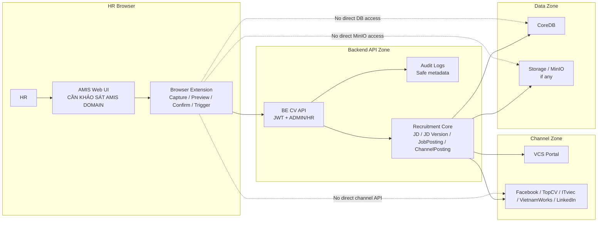

# 08. Extension Auth, Security and Audit Specification

## 1. Mục tiêu tài liệu

Tài liệu này định nghĩa nguyên tắc bảo mật, xác thực, phân quyền, permission, audit và logging cho Browser Extension khi kết nối AMIS với BE CV / Recruitment Core.

Mục tiêu là trả lời ở mức specification:

- Extension được phép chạy ở đâu.
- Extension được phép gọi API nào.
- Extension xác thực với BE như thế nào.
- Role nào được gọi API.
- Token/JWT được xử lý thế nào.
- Dữ liệu nào được phép lưu trong extension.
- Dữ liệu nào không được log.
- Audit event nào BE đang ghi và metadata nào an toàn.
- Security boundary giữa AMIS, Extension, BE, DB, storage/MinIO và recruitment channels.

File này kế thừa contract thật từ `06_extension_backend_api_contract.md` và UI constraints từ `07_extension_ui_specification.md`. File này không chốt auth flow cuối cùng, không chốt token storage, không tự điền AMIS/BE domain thật, không implement code, không tạo source extension, không sửa backend và không sửa legacy modules.

## 2. Security principles

- Extension chỉ chạy trên AMIS domain allowlist. AMIS domain thật là `CẦN KHẢO SÁT AMIS DOMAIN`.
- Extension chỉ gọi BE CV / Recruitment Core API.
- Extension không gọi DB trực tiếp.
- Extension không gọi MinIO/object storage trực tiếp.
- Extension không gọi external channel API trực tiếp.
- Extension không lưu channel secret.
- Extension không log full AMIS Job Snapshot.
- Extension không log full JD content, token/JWT, AMIS cookie/session hoặc raw HTML nhạy cảm.
- HR phải xem preview và confirm trước khi sync/publish.
- BE là nơi validate chính, xử lý idempotency, audit, versioning, publish và business rule.
- Mọi action quan trọng phải có audit ở BE hoặc event tracking đã được confirm.
- Không expose stack trace hoặc sensitive internal error ra extension UI.
- Các giá trị chưa xác định từ source hoặc chưa được confirm phải ghi `CẦN CONFIRM` hoặc `CẦN KHẢO SÁT AMIS`.

## 3. Security boundary

| Zone | Thành phần | Quyền |
| --- | --- | --- |
| HR Browser | AMIS Web UI + Browser Extension | Chỉ capture/preview/trigger sau khi HR xác nhận |
| Backend API Zone | BE CV / Recruitment Core | Validate, auth, role check, sync, publish, audit |
| Data Zone | CoreDB, storage/MinIO nếu có | Extension không được truy cập trực tiếp |
| Channel Zone | VCS Portal, Facebook, TopCV, ITviec, VietnamWorks, LinkedIn | Chỉ BE xử lý; Extension không gọi trực tiếp |



Boundary rules:

- AMIS credentials/session stay in AMIS/browser context; extension must not extract or forward them.
- Extension may capture only the AMIS data needed for Job Snapshot after HR review/confirmation.
- BE is the only layer that writes JD, JobPosting, ChannelPosting and audit records.
- External channels that are not configured must remain BE-controlled and represented as `NOT_CONFIGURED`, not called from extension.

## 4. Extension runtime permission

Runtime permissions are not final. Proposed permissions must follow least privilege:

| Permission | Purpose | Status |
| --- | --- | --- |
| `storage` | Lưu config/auth state tối thiểu nếu policy cho phép | `CẦN CONFIRM TOKEN STORAGE` |
| `activeTab` | Tương tác tab hiện tại khi HR mở AMIS | `CẦN CONFIRM` |
| `scripting` | Inject/execute content script nếu cần | `CẦN CONFIRM` |
| `tabs` | Đọc URL tab để detect AMIS page nếu thật sự cần | `CẦN CONFIRM` |
| `sidePanel` | Nếu dùng Side Panel | `CẦN CONFIRM UI MODE` |

Host permissions:

| Host permission | Purpose | Status |
| --- | --- | --- |
| AMIS domain | Cho content script chạy trên AMIS recruitment page | `CẦN KHẢO SÁT AMIS DOMAIN` |
| BE API domain | Cho extension gọi BE CV API | `CẦN CONFIRM BE API DOMAIN` |
| External channel domains | Không dùng trong MVP | Không cấp nếu extension không gọi trực tiếp channel API |

BE runtime/CORS note từ source:

- Backend hiện enable CORS với `origin = FRONTEND_URL || http://localhost:4000`.
- Extension origin/domain policy cho BE API chưa được chốt.
- Nếu extension gọi BE trực tiếp từ extension UI/background, cần xác nhận CORS/host permission/deployment policy: `CẦN CONFIRM BE API DOMAIN/CORS`.

Không tự điền domain thật trong file này.

## 5. Auth flow options - CẦN CONFIRM

BE source hiện tại:

- `JwtStrategy` lấy JWT từ `Authorization: Bearer <token>`.
- `ignoreExpiration: false`, token hết hạn sẽ bị reject.
- JWT secret lấy từ `JWT_SECRET`.
- JWT expiry lấy từ `JWT_EXPIRES_IN`, mặc định `15m`.
- Payload được validate thành `{ id: payload.sub, email: payload.email, role: payload.role }`.
- `AuthService.login` trả `{ accessToken, user }`.
- Có auth API chung: `POST /api/auth/login`, `GET /api/auth/me`, Google OAuth redirect/callback.

Auth flow cụ thể cho extension chưa được chốt. Các option:

| Option | Mô tả | Ưu điểm | Nhược điểm | Status |
| --- | --- | --- | --- | --- |
| Extension login bằng JWT hiện tại | HR đăng nhập qua BE auth API hiện có và extension giữ access token theo policy được confirm | Tận dụng BE hiện có | Cần UI login/token storage/refresh/logout | `CẦN CONFIRM AUTH FLOW` |
| Reuse token từ web app | Extension đọc/reuse auth state nếu cùng domain và hợp lệ | Tiện cho HR | Rủi ro bảo mật, phụ thuộc implementation, có thể không phù hợp browser boundary | `CẦN CONFIRM AUTH FLOW` |
| Google OAuth/SSO | Extension dùng OAuth/SSO rồi nhận BE token | Phù hợp enterprise | Phức tạp hơn, cần extension redirect flow và security review | `CẦN CONFIRM AUTH FLOW` |
| Extension API token riêng | Token riêng cho extension | Tách biệt lifecycle | Cần quản lý cấp phát, revoke, expiry, audit | `CẦN CONFIRM AUTH FLOW` |

Confirmed:

- Endpoint sync/publish hiện yêu cầu JWT + role `ADMIN` hoặc `HR`.

Not confirmed:

- Extension dùng option auth nào.
- Token được lưu ở đâu.
- Refresh/logout/revoke flow.
- Extension có dùng Google OAuth callback hiện tại hay không.

## 6. Token storage policy - CẦN CONFIRM

Token handling principles:

- Không lưu token trong `localStorage` của AMIS page.
- Không inject token vào DOM.
- Không log token.
- Không gửi token cho AMIS hoặc external channel.
- Không gửi token vào audit metadata.
- Nếu dùng `chrome.storage`, cần chốt loại storage, retention, logout và cleanup.
- Cần xác định token expiry/refresh/logout trước khi implement.

| Storage option | Mô tả | Risk | Status |
| --- | --- | --- | --- |
| `chrome.storage.local` | Lưu local trong extension | Persist lâu hơn; cần bảo vệ, clear khi logout và cân nhắc shared machine | `CẦN CONFIRM TOKEN STORAGE` |
| `chrome.storage.session` | Lưu theo session nếu browser hỗ trợ | Ít persistence hơn; UX có thể yêu cầu login lại | `CẦN CONFIRM TOKEN STORAGE` |
| In-memory only | Chỉ giữ runtime memory | Mất khi service worker reload, UX khó hơn | `CẦN CONFIRM TOKEN STORAGE` |

Token lifecycle questions:

- Access token hết hạn sau bao lâu trong môi trường thực tế? Source default là `15m`, nhưng env có thể đổi.
- Có refresh token không? Source hiện chỉ thấy `accessToken` trong `AuthService.login`; refresh token flow cho extension chưa thấy.
- Logout xóa token ở đâu?
- Có revoke/blacklist token không? `CẦN KIỂM TRA SOURCE` nếu cần chốt sâu hơn.

Không tự chốt token storage trong file này.

## 7. Authorization and role rule

Source thật:

- `UserRole` enum trong shared gồm `ADMIN`, `INTERVIEWER`, `HR`.
- Endpoint extension dùng `@UseGuards(JwtAuthGuard, RolesGuard)`.
- Endpoint extension dùng `@Roles(UserRole.ADMIN, UserRole.HR)`.
- `RolesGuard` kiểm tra `requiredRoles.includes(user?.role)`.

Allowed roles for extension sync/publish:

| Role | Allowed? | Note |
| --- | ---: | --- |
| `ADMIN` | Yes | Có thể gọi endpoint sync/publish |
| `HR` | Yes | Có thể gọi endpoint sync/publish |
| `INTERVIEWER` | No | Không nằm trong `@Roles` của endpoint extension |

UI behavior:

- Không có token: hiển thị cần đăng nhập.
- Token hết hạn hoặc invalid: BE trả `401`; UI yêu cầu đăng nhập lại.
- Role không hợp lệ: BE trả forbidden theo Nest guard behavior; UI hiển thị không đủ quyền.
- Không retry vô hạn khi `401`/`403`.
- Không hiển thị stack trace hoặc raw error không cần thiết.

Error response note:

- `JwtAuthGuard` kế thừa Passport `AuthGuard('jwt')`; source không customize error envelope.
- `RolesGuard` return `false` khi role không hợp lệ; Nest sẽ trả forbidden mặc định.
- Exact body cho `401/403` cần kiểm tra runtime nếu UI parser cần chốt tuyệt đối: `CẦN KIỂM TRA RUNTIME`.

## 8. Request security requirements

Endpoint chính:

```text
POST /api/extension/amis/job-postings/sync-and-publish
```

Required/optional headers:

| Header | Required? | Security purpose | Source behavior |
| --- | ---: | --- | --- |
| `Authorization: Bearer <token>` | Yes | Authenticate HR/Admin | `JwtStrategy` reads bearer token |
| `X-Request-Id` | No / Recommended | Trace request end-to-end | Controller reads and returns in `meta` |
| `Idempotency-Key` | No / Recommended | Retry metadata/audit correlation | Controller reads; service hashes in audit metadata |
| `X-Extension-Version` | No / Recommended | Debug compatibility | Controller reads and returns in `meta` |

Important behavior:

- `Idempotency-Key` hiện chỉ là metadata/audit, không phải khóa idempotency chính.
- BE tự tính `snapshotHash` bằng stable JSON + SHA-256.
- Extension không cần gửi `snapshotHash` theo contract hiện tại.
- Extension nên gửi `X-Request-Id` để support trace nếu có thể.
- Extension không gửi dữ liệu ngoài scope Job Snapshot.
- Extension không gửi AMIS cookie/session, channel secret, raw DOM toàn trang hoặc CV/raw file.

## 9. Data minimization

Extension chỉ được gửi dữ liệu tối thiểu cần cho sync/publish:

- `amisRecruitmentId`
- `amisUrl` nếu an toàn/có ích
- `action`
- `snapshot` với field cần thiết cho JD/JobPosting
- `selectedChannels`
- Optional request metadata headers

Không gửi:

- Raw DOM toàn trang.
- AMIS cookie/session/token.
- Channel secret.
- BE token ở nơi khác ngoài `Authorization` header.
- CV/raw file.
- PII không cần thiết.
- Full AMIS network payload nếu có field thừa/nhạy cảm.
- Debug trace chứa full JD.

Contact info:

- Contact info có capture hay không là `CẦN CONFIRM`.
- Nếu capture, cần confirm display/masking/logging rule trước khi implement.
- Nếu không cần cho job posting, không đưa vào snapshot.

## 10. Logging policy

Extension log được phép có, nếu cần debug:

- `requestId`
- `amisRecruitmentId`
- `action`
- `selectedChannels`
- `resultCode`
- channel status
- field presence hoặc field length nếu cần
- extension version
- safe error code
- snapshot hash chỉ nếu BE trả hoặc extension được confirm tính hash

Extension log không được có:

- Full AMIS Job Snapshot.
- Full JD content.
- Token/JWT.
- AMIS cookies/session/auth data.
- Channel secret.
- Raw HTML chứa dữ liệu nhạy cảm.
- Full contact phone/email nếu không có masking rule.
- Password hoặc credential.

Backend/audit logging:

- Audit metadata hiện lưu safe identifiers, hash và trạng thái.
- Audit không lưu full request payload trong metadata.
- `JobDescriptionVersion.snapshot` hiện có thể lưu `amisSnapshot` cho versioning nghiệp vụ, nên extension phải tránh gửi field thừa/PII không cần thiết ngay từ đầu.

## 11. Audit event specification

Source thật trong `ExtensionIntegrationService` đang ghi các audit events:

| Event | Khi nào ghi |
| --- | --- |
| `EXTENSION_AMIS_SYNC_REQUESTED` | Sau khi request normalize thành công |
| `EXTENSION_AMIS_PUBLISH_REQUESTED` | Sau khi normalize thành công và `action = PUBLISH` |
| `EXTENSION_AMIS_SYNC_SUCCEEDED` | Sau transaction sync thành công |
| `EXTENSION_AMIS_PUBLISH_SUCCEEDED` | Sau transaction thành công và `action = PUBLISH` |
| `EXTENSION_AMIS_SYNC_FAILED` | Khi service throw error |
| `EXTENSION_AMIS_PUBLISH_FAILED` | Khi action đã normalize là `PUBLISH` và service throw error |

Audit entity thật:

| Field | Meaning |
| --- | --- |
| `actorType` | Ví dụ `USER` |
| `actorId` | User id nếu có |
| `action` | Audit event name |
| `objectType` | Với extension là `AMIS_JOB_POSTING` |
| `objectId` | AMIS recruitment id nếu có |
| `applicationId` | `null` với extension event hiện tại |
| `metadata` | JSONB safe metadata |
| `ipAddress` | Request IP nếu có |
| `userAgent` | User agent nếu có |
| `createdAt` | Audit timestamp |

Audit metadata thật đang ghi khi success/requested:

- `requestId`
- `extensionVersion`
- `hasIdempotencyKey`
- `idempotencyKeyHash`
- `sourceSystem`
- `externalRecruitmentId`
- `action`
- `selectedChannels`
- `snapshotHash`
- `resultCode`
- `snapshotChanged`
- `jobDescriptionId`
- `jobDescriptionVersionId`
- `jobPostingId`
- `channelCount`

Audit metadata thật đang ghi khi failure:

- `requestId`
- `extensionVersion`
- `hasIdempotencyKey`
- `idempotencyKeyHash`
- `sourceSystem`
- `externalRecruitmentId`
- `action`
- `selectedChannels`
- `snapshotHash`
- `errorCode`

Audit metadata không được có:

- Full request payload.
- Full JD content.
- JWT/token.
- AMIS cookie/session.
- Raw HTML.
- Secret.
- Full contact email/phone nếu không có policy rõ ràng.

Potential audit gaps / `CẦN CONFIRM`:

- Source hiện không lưu `userRole` trong audit metadata, dù context có `userRole`.
- Source hiện không lưu per-channel statuses trong audit metadata, chỉ lưu `channelCount`.
- Nếu compliance cần `role` hoặc `channelStatuses`, cần BE thay đổi sau này. `CẦN CONFIRM / BE GAP`.

## 12. Sensitive data classification

| Data | Classification | Extension handling | Audit/log handling |
| --- | --- | --- | --- |
| `amisRecruitmentId` | Internal identifier | Có thể hiển thị cho HR/support nếu cần | Có thể audit |
| `amisUrl` | Internal URL | Có thể hiển thị một phần nếu không chứa query nhạy cảm | Audit nếu cần; tránh full URL nếu chứa secret/query nhạy cảm |
| Title | Business data | Preview được | Không log full nếu không cần; có thể log length/hash |
| Description | Business content | Preview summary/expand | Không audit/log full trong metadata |
| Requirements | Business content | Preview summary/expand | Không audit/log full trong metadata |
| Benefits | Business content | Preview summary/expand | Không audit/log full trong metadata |
| Contact name/email/phone | PII/contact | `CẦN CONFIRM` display/mask | Không log full |
| JWT/access token | Secret | Không hiển thị, chỉ dùng trong `Authorization` header | Không log |
| AMIS cookie/session | Secret | Không đọc/gửi/lưu | Không log |
| Channel credential/secret | Secret | Không lưu trong extension | Không log |
| Raw DOM/raw HTML | Potentially sensitive | Không gửi/lưu nếu không cần | Không log |
| Request id | Operational metadata | Có thể hiển thị trong support detail | Có thể audit |
| Idempotency key | Operational secret-ish metadata | Không hiển thị raw nếu không cần | BE audit chỉ hash |

## 13. AMIS access policy

Extension AMIS access principles:

- Extension chỉ đọc dữ liệu từ AMIS page mà HR đang có quyền xem.
- Extension không bypass quyền AMIS.
- Extension không dùng credential AMIS ngoài browser context.
- Extension không scrape ngoài màn HR đang mở nếu chưa confirm.
- Extension không gửi AMIS cookie/session về BE.
- Extension không tự gọi AMIS internal API nếu chưa được confirm hợp lệ.
- AMIS domain allowlist là `CẦN KHẢO SÁT AMIS DOMAIN`.
- AMIS recruitment URL pattern là `CẦN KHẢO SÁT AMIS`.

Internal API policy:

- Có được phụ thuộc AMIS internal API hay không: `CẦN CONFIRM`.
- Nếu được dùng, cần khảo sát request/response, auth/session, stability, rate limit và policy.
- Nếu không được dùng, capture phải dựa trên page state/DOM/manual confirmation theo spec 04.

## 14. Failure and abuse scenarios

| Scenario | Risk | Mitigation |
| --- | --- | --- |
| HR bấm sync nhiều lần | Duplicate data | BE idempotency bằng `sourceSystem=AMIS + amisRecruitmentId + snapshotHash` |
| Network retry sau timeout | Replay request | BE tính snapshot hash; extension giữ same request intent/idempotency metadata nếu có |
| Token hết hạn | Sync fail | UI yêu cầu login lại; không retry vô hạn |
| Role không hợp lệ | Unauthorized action | BE `RolesGuard`; UI hiển thị không đủ quyền |
| Extension chạy sai domain | Rò rỉ dữ liệu hoặc capture nhầm | AMIS host allowlist; không cấp wildcard rộng |
| DOM capture sai field | Sai JD | HR preview/confirm + missing field warning |
| Rich text transform sai | Mất hoặc sai nội dung JD | Transform rule cần confirm; preview summary/expand |
| External channel chưa config | HR hiểu nhầm publish thất bại toàn bộ | UI hiển thị `NOT_CONFIGURED` là channel-level status |
| Log payload nhạy cảm | Data leak | Logging policy; không log full snapshot/JD/token |
| AMIS UI đổi | Capture fail | Versioned adapter/survey lại; không auto publish |
| Token lưu quá lâu | Account/session exposure | Token storage/lifecycle policy cần confirm |
| BE API domain cấu hình sai | Gửi dữ liệu sai môi trường | Environment/config allowlist; `CẦN CONFIRM BE API DOMAIN` |

## 15. Extension settings security

Nếu có settings screen:

- BE API base URL chỉ cho phép domain được config/allowlist.
- Không cho nhập arbitrary unsafe endpoint trong production nếu chưa có policy.
- Debug mode không bật mặc định.
- Debug mode không được log full snapshot/JD/token.
- Có action clear token/logout nếu token được lưu.
- Hiển thị extension version để support.
- Hiển thị environment hiện tại nếu cần.
- Không cho HR nhập channel secret trong extension.

`CẦN CONFIRM SETTINGS SCREEN`.

Config items cần confirm:

- BE API base URL theo local/dev/staging/prod.
- AMIS domain allowlist.
- Default selected channels.
- Debug/support detail.
- Last sync result có lưu local hay lấy từ BE status API.

## 16. Compliance with BE behavior

Extension phải tuân thủ BE behavior hiện tại:

- Gọi endpoint chính bằng JWT: `POST /api/extension/amis/job-postings/sync-and-publish`.
- Chỉ user role `ADMIN` hoặc `HR` được gọi.
- Không tự tính idempotency chính nếu BE đang tự tính `snapshotHash`.
- Không gửi `snapshotHash` trong request nếu BE contract chưa yêu cầu.
- Không coi `DUPLICATE_OR_IDEMPOTENT_REPLAY` là lỗi nghiêm trọng.
- Không coi `NOT_CONFIGURED` channel là fail toàn bộ request.
- Không gửi full audit metadata từ extension; BE tự ghi audit.
- Không bypass BE validation.
- Không gọi DB/MinIO/channel API trực tiếp.
- Không tự publish external channel từ extension.

BE behavior/gap cần chú ý:

- `Idempotency-Key` hiện là metadata/audit, không phải idempotency key chính.
- Auth flow extension chưa chốt, dù BE đã có auth APIs chung.
- BE CORS hiện theo `FRONTEND_URL`; extension API access cần confirm.
- `401/403` exact error envelope cần kiểm tra runtime nếu UI parser cần chính xác tuyệt đối.

## 17. Open Questions / Cần confirm

1. Auth flow cuối cùng là JWT login hiện tại, Google OAuth/SSO, reuse token web app hay flow riêng? `CẦN CONFIRM AUTH FLOW`
2. Token/JWT có được lưu trong `chrome.storage` không? `CẦN CONFIRM TOKEN STORAGE`
3. Nếu lưu token, dùng `chrome.storage.local`, `chrome.storage.session` hay in-memory? `CẦN CONFIRM TOKEN STORAGE`
4. Token refresh/logout xử lý thế nào? `CẦN CONFIRM AUTH FLOW`
5. BE API domain/env config cho extension là gì? `CẦN CONFIRM BE API DOMAIN`
6. BE CORS/allowlist cho extension origin xử lý thế nào? `CẦN CONFIRM`
7. AMIS domain allowlist chính xác là gì? `CẦN KHẢO SÁT AMIS DOMAIN`
8. Có được phụ thuộc AMIS internal API không? `CẦN CONFIRM`
9. Có capture contact info không? `CẦN CONFIRM`
10. Nếu capture contact info, preview/log masking như thế nào? `CẦN CONFIRM`
11. Có cần Settings screen không? `CẦN CONFIRM SETTINGS SCREEN`
12. Có cần debug log mode không? `CẦN CONFIRM`
13. Có cần API get sync status để tránh lưu nhiều last sync result trong extension không? `CẦN CONFIRM`
14. Có cần audit client-side event riêng ngoài backend audit không? `CẦN CONFIRM`
15. Audit metadata có cần lưu `userRole` và per-channel statuses không? `CẦN CONFIRM / BE GAP`
16. Có cần security review riêng trước khi dev extension không? `CẦN CONFIRM`
