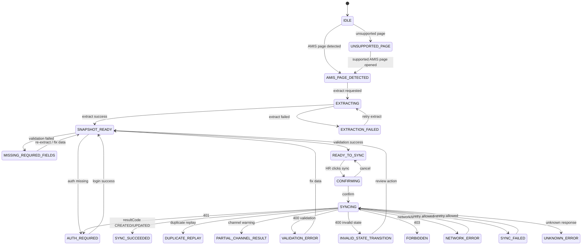

# 09. Extension State and Error Handling Specification

## 1. Mục tiêu tài liệu

Tài liệu này định nghĩa state machine, error handling, retry behavior và user-facing behavior cho Browser Extension khi HR sync/publish tin tuyển dụng từ AMIS sang BE CV / Recruitment Core.

Mục tiêu là làm rõ:

- Extension có những state nào.
- State nào được chuyển sang state nào.
- Khi nào được gọi BE.
- Khi nào phải block sync.
- Khi nào được retry.
- Khi nào yêu cầu HR đăng nhập lại.
- Cách xử lý BE `resultCode`: `CREATED`, `UPDATED`, `DUPLICATE_OR_IDEMPOTENT_REPLAY`.
- Cách xử lý channel status thật: `PUBLISHED`, `UPDATED`, `CLOSED`, `NOT_CONFIGURED`.
- Cách xử lý lỗi AMIS capture, validation, auth, network và BE internal error.

File này không implement code, không tạo source extension, không sửa backend, không tự bịa AMIS URL/API/selector/field mapping, không chốt auth/token/UI mode khi chưa confirm và không sửa legacy modules.

## 2. State handling principles

- Extension không gọi BE nếu HR chưa confirm.
- Extension không gọi BE nếu thiếu required fields.
- Extension không gọi BE nếu chưa authenticated.
- Extension không gọi BE nếu role hiện tại không phải `ADMIN` hoặc `HR`.
- BE là nơi validate chính.
- Extension validation chỉ là precheck để giảm lỗi cho HR.
- Duplicate replay không phải lỗi nghiêm trọng.
- Channel `NOT_CONFIGURED` không làm fail toàn bộ request.
- Network retry phải an toàn nhờ required `Idempotency-Key`.
- `Idempotency-Key` là idempotency key chính; snapshot hash chỉ dùng cho change detection/versioning.
- Không retry vô hạn.
- Không log full snapshot, token, cookie, raw HTML hoặc PII không cần thiết.
- Các state phụ thuộc AMIS detection/capture phải giữ `CẦN KHẢO SÁT AMIS` nếu chưa có khảo sát thật.

## 3. State list

State names đồng bộ với `07_extension_ui_specification.md`. Nếu implementation sau này dùng tên khác, cần có mapping rõ ràng.

| State | Meaning | User-facing message | Allowed actions |
| --- | --- | --- | --- |
| `IDLE` | Chưa phát hiện màn AMIS phù hợp hoặc extension mới mở | Chưa phát hiện màn tuyển dụng AMIS | Không sync |
| `UNSUPPORTED_PAGE` | Trang hiện tại không hỗ trợ | Trang AMIS này chưa được hỗ trợ | Không sync |
| `AMIS_PAGE_DETECTED` | Phát hiện màn AMIS recruitment | Đã phát hiện tin tuyển dụng trên AMIS | Extract snapshot |
| `EXTRACTING` | Đang lấy dữ liệu | Đang trích xuất dữ liệu | Disable sync |
| `EXTRACTION_FAILED` | Không lấy được dữ liệu | Không thể trích xuất dữ liệu | Retry extract / report |
| `SNAPSHOT_READY` | Snapshot đã sẵn sàng để preview | Kiểm tra thông tin trước khi đồng bộ | Preview / select channel |
| `MISSING_REQUIRED_FIELDS` | Thiếu field bắt buộc hoặc sai format required field | Thiếu thông tin bắt buộc | Không sync |
| `AUTH_REQUIRED` | Chưa đăng nhập BE hoặc token invalid/expired | Vui lòng đăng nhập | Login |
| `FORBIDDEN` | Role không hợp lệ | Không đủ quyền | Không sync |
| `READY_TO_SYNC` | Đủ điều kiện sync | Sẵn sàng đồng bộ | Confirm |
| `CONFIRMING` | HR đang xác nhận | Xác nhận đồng bộ và đăng bài | Confirm / cancel |
| `SYNCING` | Đang gọi BE | Đang đồng bộ | Disable buttons |
| `SYNC_SUCCEEDED` | BE trả thành công với `resultCode=CREATED` hoặc `UPDATED` | Đồng bộ thành công | View result |
| `DUPLICATE_REPLAY` | BE trả duplicate replay | Tin này đã được đồng bộ trước đó | View result |
| `SYNC_FAILED` | Sync thất bại do lỗi không recover tự động | Đồng bộ thất bại | Retry nếu phù hợp |
| `PARTIAL_CHANNEL_RESULT` | Request success nhưng một số channel cần xử lý thêm | Một số kênh cần xử lý thêm | View channel result |
| `NETWORK_ERROR` | Lỗi mạng, timeout, offline hoặc BE unreachable | Không kết nối được backend | Retry |
| `VALIDATION_ERROR` | Extension hoặc BE trả lỗi validation | Dữ liệu chưa hợp lệ | Back to preview |
| `INVALID_STATE_TRANSITION` | BE báo trạng thái không hợp lệ | Trạng thái tin không hợp lệ | Review / report |
| `UNKNOWN_ERROR` | Lỗi không xác định hoặc response không map được | Có lỗi không xác định | Retry / report |

State notes:

- `PARTIAL_CHANNEL_RESULT` không nhất thiết là top-level fatal state; đây là result sub-state khi request thành công nhưng có channel `NOT_CONFIGURED` hoặc channel-level warning. `MANUAL_REQUIRED` là later/not used in MVP.
- `DUPLICATE_REPLAY` là success-like state, không phải error/failure.
- `FORBIDDEN` chỉ dùng cho role không hợp lệ, ví dụ `INTERVIEWER`.

## 4. State transition table

| From state | Event | Condition | To state |
| --- | --- | --- | --- |
| `IDLE` | AMIS page detected | URL/marker match - `CẦN KHẢO SÁT AMIS` | `AMIS_PAGE_DETECTED` |
| `IDLE` | Unsupported page | Không match AMIS recruitment | `UNSUPPORTED_PAGE` |
| `UNSUPPORTED_PAGE` | AMIS page detected | HR chuyển sang màn được hỗ trợ | `AMIS_PAGE_DETECTED` |
| `AMIS_PAGE_DETECTED` | Extract requested | HR/action trigger | `EXTRACTING` |
| `EXTRACTING` | Extract success | Snapshot draft created | `SNAPSHOT_READY` |
| `EXTRACTING` | Extract failed | Missing AMIS source / selector / API / page not ready | `EXTRACTION_FAILED` |
| `EXTRACTION_FAILED` | Retry extract | HR retry hoặc page đã load lại | `EXTRACTING` |
| `SNAPSHOT_READY` | Validate failed | Missing required fields or invalid required format | `MISSING_REQUIRED_FIELDS` |
| `SNAPSHOT_READY` | Validate success | Required fields present and authenticated state can be checked | `READY_TO_SYNC` |
| `SNAPSHOT_READY` | Auth missing | Token missing/expired known before submit | `AUTH_REQUIRED` |
| `MISSING_REQUIRED_FIELDS` | Required fields fixed | HR re-extracts or manual edit is confirmed | `READY_TO_SYNC` |
| `AUTH_REQUIRED` | Login success | Auth flow completed - `CẦN CONFIRM AUTH FLOW` | `SNAPSHOT_READY` |
| `READY_TO_SYNC` | HR clicks sync | Required fields valid + `channels` selected + authenticated + idempotency key available | `CONFIRMING` |
| `CONFIRMING` | HR cancels | User cancels | `READY_TO_SYNC` |
| `CONFIRMING` | HR confirms | User confirms | `SYNCING` |
| `SYNCING` | BE created | `data.resultCode=CREATED` | `SYNC_SUCCEEDED` |
| `SYNCING` | BE updated | `data.resultCode=UPDATED` | `SYNC_SUCCEEDED` |
| `SYNCING` | BE duplicate | `data.resultCode=DUPLICATE_OR_IDEMPOTENT_REPLAY` | `DUPLICATE_REPLAY` |
| `SYNCING` | BE success with channel warning | At least one channel `NOT_CONFIGURED` | `PARTIAL_CHANNEL_RESULT` |
| `SYNCING` | BE validation error | HTTP 400, code `VALIDATION_ERROR` | `VALIDATION_ERROR` |
| `SYNCING` | Invalid state | HTTP 400, code `INVALID_STATE_TRANSITION` | `INVALID_STATE_TRANSITION` |
| `SYNCING` | Unauthorized | HTTP 401 | `AUTH_REQUIRED` |
| `SYNCING` | Forbidden | HTTP 403 | `FORBIDDEN` |
| `SYNCING` | Network error | Timeout/offline/CORS/BE unreachable | `NETWORK_ERROR` |
| `SYNCING` | Server error | HTTP 500 or code `INTERNAL_ERROR` | `SYNC_FAILED` |
| `SYNCING` | Unknown response | Response envelope not recognized | `UNKNOWN_ERROR` |
| `NETWORK_ERROR` | Retry sync | Retry allowed and HR triggers retry | `SYNCING` |
| `SYNC_FAILED` | Retry sync | Retry allowed and HR triggers retry | `SYNCING` |
| `VALIDATION_ERROR` | Back to preview | HR needs to fix data | `SNAPSHOT_READY` |
| `INVALID_STATE_TRANSITION` | Back to preview | HR reviews action/status | `SNAPSHOT_READY` |

Không tự chốt AMIS detection condition nếu chưa khảo sát.

## 5. Mermaid state diagram

Required constraints:

- HR confirmation happens before `SYNCING`.
- Missing required fields block sync.
- Duplicate replay does not go to fatal error.
- Channel `NOT_CONFIGURED` is a channel-level warning/result, not a whole-request failure when BE returns success.

## 6. Required field validation state

Required fields theo BE contract thật:

- `Idempotency-Key` header
- `amisRecruitmentId`
- `action`
- `snapshot.title`
- `snapshot.description`
- `snapshot.requirements` dạng JSON object
- `snapshot.requirements.rawText` non-empty string
- `channels` không rỗng

Behavior:

- Nếu thiếu `Idempotency-Key`: không sync.
- Nếu thiếu `amisRecruitmentId`: không sync.
- Nếu thiếu `action`: không sync.
- Nếu thiếu `snapshot.title`: không sync.
- Nếu thiếu `snapshot.description`: không sync.
- Nếu thiếu `snapshot.requirements`: không sync.
- Nếu `snapshot.requirements` không phải JSON object theo BE yêu cầu: không sync.
- Nếu thiếu hoặc empty `snapshot.requirements.rawText`: không sync.
- Nếu `channels` rỗng hoặc chứa enum không hợp lệ: không sync.
- Extension hiển thị field nào thiếu hoặc sai format.
- Extension validation chỉ là sơ bộ; BE vẫn validate chính.

Optional/warning behavior:

- `snapshot.benefits` optional, nhưng nếu gửi thì theo BE hiện tại phải là JSON object.
- `location`, `deadline`, `salaryRange`, `contactInfo` và các field chưa chốt không block sync trừ khi BE rule thay đổi.
- Nếu optional field transform lỗi, UI chỉ warning nếu rule cho phép. `CẦN CONFIRM`.
- Nếu thiếu required field, việc cho HR nhập tay trong extension hay bắt quay lại AMIS chỉnh là `CẦN CONFIRM`.

## 7. BE resultCode handling

| `resultCode` | Meaning | UI state | User-facing behavior |
| --- | --- | --- | --- |
| `CREATED` | AMIS job mới, BE tạo JD/JD Version/JobPosting mới | `SYNC_SUCCEEDED` hoặc `PARTIAL_CHANNEL_RESULT` nếu có channel warning | Hiển thị đồng bộ thành công cho tin mới và channel results |
| `UPDATED` | AMIS job đã tồn tại, snapshot thay đổi, BE update JD và tạo JD Version mới | `SYNC_SUCCEEDED` hoặc `PARTIAL_CHANNEL_RESULT` nếu có channel warning | Hiển thị đã cập nhật nội dung tuyển dụng và channel results |
| `DUPLICATE_OR_IDEMPOTENT_REPLAY` | Replay cùng `Idempotency-Key` hoặc request đã xử lý, không tạo duplicate | `DUPLICATE_REPLAY` | Hiển thị đã xử lý/đồng bộ trước đó, không coi là lỗi |
| Unknown resultCode | BE trả code chưa biết | `UNKNOWN_ERROR` hoặc warning | Hiển thị lỗi/không rõ, cần kiểm tra |

Rules:

- Không dùng `OK` làm resultCode chính nữa, trừ khi adapter cần backward compatibility với response cũ.
- Không tự thêm resultCode ngoài `CREATED`, `UPDATED`, `DUPLICATE_OR_IDEMPOTENT_REPLAY` trong MVP.

## 8. Channel status handling

| Channel status | Meaning | Extension behavior |
| --- | --- | --- |
| `PUBLISHED` | Đã publish thành công | Hiển thị success + public URL nếu có |
| `UPDATED` | Channel posting đã update | Hiển thị đã cập nhật |
| `CLOSED` | Channel đã đóng | Hiển thị đã đóng |
| `NOT_CONFIGURED` | Channel chưa cấu hình/verify | Hiển thị warning, không fail toàn bộ request |
| `MANUAL_REQUIRED` | Later / not used in MVP | Không dùng trong MVP response chính; fallback như manual/later state nếu BE cũ trả |
| `PUBLISH_FAILED` | Channel publish failed | Hiển thị channel-level error, retry nếu policy/BE hỗ trợ |
| `PUBLISHING` | Channel đang publish | Hiển thị pending nếu BE trả |
| `DRAFT` | Channel draft | Hiển thị pending/draft; không coi là success cuối nếu xuất hiện |
| Unknown status | Status chưa biết | Hiển thị warning và raw status an toàn |

Confirmed behavior:

- `VCS_PORTAL` có thể trả `PUBLISHED` hoặc `UPDATED` và `publishedUrl`.
- Non-`VCS_PORTAL` MVP trả `NOT_CONFIGURED` khi chưa configured/API chưa verified.
- External channels chưa verify như `FACEBOOK`, `TOPCV`, `ITVIEC`, `VIETNAMWORKS`, `LINKEDIN` trả `NOT_CONFIGURED`.
- `NOT_CONFIGURED` không được làm request thành failure nếu BE response là success.

## 9. Error taxonomy

| Error group | Example | Source | User-facing message | Retry? |
| --- | --- | --- | --- | --- |
| AMIS detection error | Không detect được page | Content Script | Trang này chưa được hỗ trợ | No / survey needed |
| AMIS extraction error | Không lấy được field | Content Script | Không thể trích xuất dữ liệu | Yes, nếu page chưa load hoặc source tạm lỗi |
| Data transform error | Requirements không thành JSON object | Extension mapping layer | Dữ liệu chưa đúng định dạng | No, cần sửa/transform lại |
| Validation error | Thiếu title/requirements | Extension/BE | Thiếu thông tin bắt buộc | No, cần sửa data |
| Idempotency key missing | Thiếu `Idempotency-Key` | Extension/BE | Thiếu khóa xử lý an toàn | No, client phải sinh/gửi key |
| Auth error | 401 | BE | Vui lòng đăng nhập lại | After login |
| Permission error | 403 | BE | Không đủ quyền HR/Admin | No |
| Invalid state | Close job chưa sync / update job đã closed | BE | Trạng thái tin không hợp lệ | No / review action |
| Network error | Timeout/offline/CORS | Browser/API client | Không kết nối được backend | Yes |
| Server error | 500 / `INTERNAL_ERROR` | BE | Lỗi hệ thống backend | Limited retry |
| Duplicate replay | `DUPLICATE_OR_IDEMPOTENT_REPLAY` | BE | Đã đồng bộ trước đó | No need retry |
| Channel not configured | `NOT_CONFIGURED` | BE | Kênh chưa cấu hình | No |
| Unknown error | Unrecognized response | Extension API client | Có lỗi không xác định | Limited retry/report |

UI must avoid:

- Showing stack trace.
- Showing full raw response if it contains sensitive data.
- Treating duplicate replay as fatal.
- Treating channel `NOT_CONFIGURED` as whole-request failure.

## 10. Retry policy

Cho retry khi:

- Network timeout.
- Temporary 5xx / `INTERNAL_ERROR`.
- Extraction failed because AMIS page may not have loaded completely.
- CORS/BE unreachable sau khi HR hoặc support đã kiểm tra config. `CẦN CONFIRM BE API DOMAIN/CORS`.

Không retry khi:

- `400 VALIDATION_ERROR`.
- Missing `Idempotency-Key`.
- `400 INVALID_STATE_TRANSITION`.
- `401` nếu chưa login lại.
- `403 FORBIDDEN`.
- Missing required fields.
- `DUPLICATE_OR_IDEMPOTENT_REPLAY`.
- Channel `NOT_CONFIGURED`.
- Contact/PII policy chưa confirm nhưng snapshot chứa contact field cần kiểm soát.

Retry rules:

- Retry phải giới hạn số lần.
- Không auto retry liên tục.
- Nếu retry sync, giữ nguyên snapshot/request intent.
- Nếu retry sync, phải reuse cùng `Idempotency-Key` cho cùng attempt group.
- BE dùng `Idempotency-Key` làm key chính; snapshot hash chỉ giúp detect content changed/versioning.

Retry limit:

- Retry limit = 2 manual retries per sync attempt.
- Auto retry không dùng cho sync; auto retry ngắn chỉ có thể áp dụng cho extraction/page-load nếu được confirm riêng.

## 11. Button enable/disable rules

| UI button/action | Enabled when | Disabled when |
| --- | --- | --- |
| Extract | AMIS page detected | Unsupported page / extracting |
| Sync and publish | Required fields valid + authenticated + role allowed + `channels` selected + `Idempotency-Key` available | Missing fields / syncing / unauthenticated / forbidden |
| Retry extract | Extraction failed | Extracting |
| Retry sync | Network/5xx error and retry policy allows | Validation/403/duplicate/not configured |
| Login | Auth required | Already authenticated |
| Cancel | Preview/confirming | Syncing nếu không hỗ trợ cancel |
| Open public URL | Channel has `publishedUrl` | No URL returned |
| Copy support info | Error/result has safe support metadata | No safe metadata available |

Không tự chốt button layout/UI mode final nếu UI mode chưa confirm.

## 12. Auth-related state handling

Behavior:

- Nếu chưa có token: `AUTH_REQUIRED`.
- Nếu token hết hạn hoặc BE trả `401`: chuyển `AUTH_REQUIRED`.
- Nếu BE trả `403`: chuyển `FORBIDDEN`.
- Nếu role không phải `ADMIN` hoặc `HR`: không cho sync.
- Không retry sync khi `401`/`403` trước khi auth/permission được xử lý.
- Auth flow cụ thể vẫn `CẦN CONFIRM AUTH FLOW`.
- Token storage vẫn `CẦN CONFIRM TOKEN STORAGE`.

Source facts:

- BE endpoint yêu cầu JWT bearer token.
- Allowed roles: `ADMIN`, `HR`.
- `INTERVIEWER` không được gọi extension sync API.
- JWT expiry theo BE env, source default là `15m`; extension không nên hardcode expiry nếu chưa có auth flow.

UI behavior:

- `AUTH_REQUIRED`: show login required.
- `FORBIDDEN`: show no permission, no retry.
- After login success: return to `SNAPSHOT_READY` or `READY_TO_SYNC` after revalidate.

## 13. AMIS capture error handling

AMIS capture error examples:

- AMIS URL không match.
- AMIS page chưa load xong.
- Rich text editor chưa render.
- Tab/section chưa mở nên field chưa có.
- Không tìm thấy `amisRecruitmentId`.
- AMIS internal API không có hoặc không được phép dùng.
- DOM selector thay đổi.
- Page state không chứa đủ dữ liệu.

Behavior:

- Không sync nếu không có `amisRecruitmentId`.
- Không sync nếu required snapshot fields không capture được.
- Hiển thị cần khảo sát AMIS nếu lỗi do screen chưa support.
- Cho retry extract nếu page chưa load hoặc field lazy-load.
- Không log raw DOM/full HTML.
- Không tự giả lập missing value.
- Không tự gọi AMIS internal API nếu chưa được confirm. `CẦN CONFIRM`.

## 14. Data transform error handling

Transform error examples:

- Description rich text transform lỗi.
- Requirements không tạo được JSON object.
- Benefits không tạo được JSON object nếu được gửi.
- Date format lỗi.
- Salary parse lỗi.
- Location normalize lỗi.
- Contact info masking chưa có rule.

Behavior:

- Required transform lỗi: block sync.
- `snapshot.requirements` không phải JSON object: block sync.
- `snapshot.description` empty after transform: block sync.
- Optional transform lỗi: warning, cho HR xác nhận tiếp tục chỉ nếu rule được confirm.
- Rich text safe HTML/plain text vẫn `CẦN CONFIRM`.
- Không đưa raw HTML không kiểm soát vào log.

## 15. Persistence of state

Persistence principles:

- Không lưu full snapshot lâu dài.
- Không lưu full JD content lâu dài.
- Không lưu raw DOM/raw HTML.
- Có thể lưu last sync result tối thiểu nếu được confirm.
- Có thể lưu channel preference nếu được confirm.
- Token storage theo file 08 vẫn `CẦN CONFIRM TOKEN STORAGE`.
- Nếu chưa có API get sync status, last sync result trong extension chỉ hỗ trợ UX, không phải source of truth.
- BE vẫn là source of truth.

State persistence candidates:

| Data | Persist? | Note |
| --- | ---: | --- |
| `requestId` | Optional | Useful for support |
| last `amisRecruitmentId` | Optional | Useful for reconnecting UI context |
| last `resultCode` | Optional | Safe if no sensitive content |
| last channel statuses | Optional | Useful for UI, not source of truth |
| channel preference | `CẦN CONFIRM` | UX convenience; không lưu full snapshot |
| full snapshot | No by default | Avoid sensitive persistence |
| token | `CẦN CONFIRM` | See file 08 |

## 16. User-facing copy for errors

Draft copy tiếng Việt, có thể chỉnh ở UI spec:

| Context | Draft copy |
| --- | --- |
| Unsupported page | "Chưa phát hiện màn tuyển dụng AMIS được hỗ trợ." |
| Extraction failed | "Không thể trích xuất dữ liệu từ AMIS. Vui lòng thử lại hoặc kiểm tra màn hình." |
| Missing fields | "Thiếu thông tin bắt buộc: {fields}." |
| Invalid requirements | "Yêu cầu ứng viên chưa đúng định dạng để đồng bộ." |
| Missing idempotency key | "Thiếu khóa xử lý an toàn. Vui lòng thử lại." |
| Auth required | "Vui lòng đăng nhập để đồng bộ." |
| Forbidden | "Bạn không có quyền thực hiện thao tác này." |
| Duplicate replay | "Tin này đã được đồng bộ trước đó, không tạo bản ghi mới." |
| Channel not configured | "Kênh {channel} chưa được cấu hình." |
| Network error | "Không thể kết nối backend. Vui lòng thử lại." |
| Server error | "Có lỗi hệ thống. Vui lòng thử lại sau." |
| Invalid state | "Trạng thái tin tuyển dụng không hợp lệ cho thao tác này." |
| Unknown error | "Có lỗi không xác định. Vui lòng thử lại hoặc liên hệ hỗ trợ." |

Copy final là `CẦN CONFIRM UI COPY`.

## 17. Observability and support data

Khi lỗi hoặc cần support, extension chỉ nên giữ/hiển thị metadata an toàn:

- `requestId`
- timestamp
- `extensionVersion`
- current state
- action
- `amisRecruitmentId` nếu có
- `resultCode`
- channel statuses
- error code
- field presence/length nếu cần debug
- BE response `meta.requestId` nếu có

Không ghi:

- Full snapshot.
- Full JD content.
- JWT/token.
- Cookie/session.
- Raw HTML.
- Contact full PII.
- Channel secret.

Support detail UI:

- Có thể hiển thị request id để HR gửi cho support. `CẦN CONFIRM`.
- Không hiển thị raw JSON response cho HR ở mode thường.
- Debug mode nếu có phải tuân thủ logging policy ở file 08.

## 18. Out of scope

File này không chốt:

- UI mode final.
- AMIS selector/API.
- AMIS URL/domain.
- Auth flow final.
- Token storage final.
- Field mapping final.
- Backend code changes.
- Extension implementation code.
- CV processing/mapping/form/AI/HR review.
- Interview/evaluation legacy flow.

## 19. Open Questions / Cần confirm

1. Có lưu last sync result trong extension không? `CẦN CONFIRM`
2. Có cần API get sync status theo `amisRecruitmentId` không? `CẦN CONFIRM`
3. Nếu thiếu optional field, có cho HR xác nhận tiếp tục không? `CẦN CONFIRM`
4. Nếu thiếu required field, có cho HR nhập tay trong extension không, hay bắt sửa trên AMIS? `CẦN CONFIRM`
5. Rich text preview/transform dùng safe HTML hay plain text? `CẦN CONFIRM`
6. Auth flow final là gì? `CẦN CONFIRM AUTH FLOW`
7. Token storage final là gì? `CẦN CONFIRM TOKEN STORAGE`
8. AMIS domain/URL/selector/API/source thật là gì? `CẦN KHẢO SÁT AMIS`
9. Có cần badge/status trên AMIS list/detail không? `CẦN CONFIRM`
10. Có cần show support detail/request id cho HR không? `CẦN CONFIRM`
11. Có cần state riêng cho `PUBLISH_FAILED` channel không? `CẦN CONFIRM`
