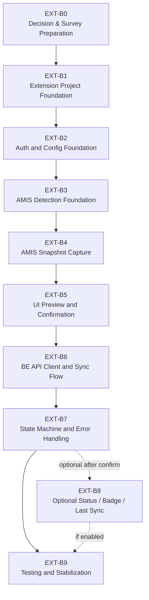

# 10. Extension Implementation Task Breakdown

## 1. Mục tiêu tài liệu

Tài liệu này chia nhỏ kế hoạch implementation Browser Extension dựa trên bộ specification `01-09` đã có.

Mục tiêu là tạo task breakdown theo batch để sau này có thể triển khai từng bước an toàn: foundation -> auth/config -> AMIS detection -> capture -> UI preview -> BE API client -> state/error handling -> testing.

File này không yêu cầu dev extension ngay, không implement code, không tạo source extension, không sửa backend, không sửa legacy modules và không tự chốt các quyết định còn mở. Các phần chưa đủ dữ liệu được đánh dấu `CẦN CONFIRM` hoặc `CẦN KHẢO SÁT AMIS`.

## 2. Implementation principles

- Dev theo từng batch nhỏ, có acceptance rõ ràng.
- Không làm capture AMIS thật nếu chưa khảo sát AMIS.
- Không gọi BE nếu chưa chốt auth flow.
- Không chốt UI final nếu chưa confirm UI mode.
- Không lưu token nếu chưa chốt token storage.
- Không tự động publish nếu HR chưa confirm.
- Không gọi external channel API từ extension.
- Không gọi DB, MinIO hoặc object storage trực tiếp từ extension.
- Không sửa backend nếu task chỉ thuộc extension.
- Không ảnh hưởng legacy interview/evaluation modules.
- BE CV / Recruitment Core vẫn là source of truth cho validation, idempotency, publish và audit.
- Extension chỉ capture, preview, confirm và trigger.
- Mọi task liên quan AMIS domain, URL, DOM selector, internal API hoặc field mapping phải chờ khảo sát/confirm.

## 3. Current blockers before real implementation

| Blocker | Impact | Required confirmation |
| --- | --- | --- |
| UI mode chưa chốt | Không thể finalize layout và entry point | Popup / Side Panel / Injected Panel / Hybrid |
| Auth flow chưa chốt | Không thể implement login/token lifecycle | JWT login hiện tại / SSO / reuse token / flow riêng |
| Token storage chưa chốt | Không thể implement auth persistence | `chrome.storage.local` / `chrome.storage.session` / in-memory |
| BE API domain chưa chốt | Không thể cấu hình endpoint extension | Local/dev/staging/prod URL |
| BE CORS/extension origin chưa chốt | Extension có thể không gọi được BE trực tiếp | Allowed origin/host permission/deployment policy |
| AMIS domain chưa chốt | Không thể khai báo host permission | AMIS domain allowlist |
| AMIS URL pattern chưa khảo sát | Không thể detect screen chính xác | URL pattern list/detail/create/edit/publish |
| `amisRecruitmentId` chưa biết nguồn | Không thể sync an toàn/idempotent | URL/API/page state/DOM |
| AMIS field mapping chưa khảo sát | Không thể capture snapshot thật | Field source/selector/API |
| Rich text strategy chưa chốt | Không thể transform description/requirements ổn định | Safe HTML / plain text / JSON object schema |
| Default channel chưa chốt | Không thể default selected channels | `VCS_PORTAL` only hay nhiều channel |
| UPDATE/CLOSE scope chưa chốt | Không thể implement update/close UI | MVP publish only hay có update/close |
| Retry policy chưa chốt | Không thể finalize auto/manual retry | Retry limit, auto retry hay manual retry |
| Contact info policy chưa chốt | Không thể capture/display/mask contact info | Capture hay không, masking rule |

## 4. Proposed batch plan

### EXT-B0. Decision & Survey Preparation

Mục tiêu:

- Chốt các quyết định tối thiểu trước khi dev.
- Chuẩn bị khảo sát AMIS theo file 04.
- Tạo decision log để tránh dev dựa trên giả định.

| Task | Mục tiêu | Input | Output | Acceptance | Status |
| --- | --- | --- | --- | --- | --- |
| EXT-B0-01 | Confirm UI mode | Spec 02, 07 | Decision: Popup / Side Panel / Injected Panel / Hybrid | UI mode được ghi rõ trong decision log | `CẦN CONFIRM` |
| EXT-B0-02 | Confirm auth flow | Spec 06, 08 | Decision auth flow | Flow đăng nhập/lấy token được chốt | `CẦN CONFIRM` |
| EXT-B0-03 | Confirm token storage policy | Spec 08 | Token storage decision | Storage/lifecycle/logout được chốt | `CẦN CONFIRM` |
| EXT-B0-04 | Confirm BE API base URL/env config | Spec 06, 08 | BE env config | Có URL local/dev/staging/prod hoặc config source | `CẦN CONFIRM` |
| EXT-B0-05 | Confirm BE CORS/extension origin | Spec 08 | CORS/allow origin decision | Extension có đường gọi BE hợp lệ | `CẦN CONFIRM` |
| EXT-B0-06 | Confirm AMIS domain allowlist | Spec 04, 08 | AMIS host allowlist | Có domain/pattern cho manifest host permissions | `CẦN KHẢO SÁT AMIS` |
| EXT-B0-07 | Confirm default selected channels | Spec 07 | Channel default decision | Default không gây hiểu nhầm với `NOT_CONFIGURED` | `CẦN CONFIRM` |
| EXT-B0-08 | Confirm MVP action scope | Spec 03, 06, 09 | Publish only hay include `UPDATE`/`CLOSE` | UI/API action scope được chốt | `CẦN CONFIRM` |
| EXT-B0-09 | Prepare AMIS screen survey checklist | Spec 04 | Survey checklist | Checklist đủ URL/API/DOM/page state/field source | Can start |
| EXT-B0-10 | Confirm rich text strategy | Spec 05, 06 | Transform decision | `description` và `requirements` strategy được chốt | `CẦN CONFIRM` |

Batch acceptance:

- Có decision log rõ ràng.
- Có AMIS survey checklist.
- Không còn blocker nền trước khi tạo project extension thật.
- Các decision chưa chốt vẫn được ghi `CẦN CONFIRM`, không bị ngầm coi là final.

### EXT-B1. Extension Project Foundation

Mục tiêu:

- Tạo project extension foundation sau khi stack/UI mode tối thiểu được confirm.

| Task | Mục tiêu | Input | Output | Acceptance | Status |
| --- | --- | --- | --- | --- | --- |
| EXT-B1-01 | Tạo project structure cho extension | Confirm stack/location | Extension folder structure | Có cấu trúc project rõ ràng, không đụng backend legacy | Blocked by B0 |
| EXT-B1-02 | Setup TypeScript/React/Vite/Manifest V3 nếu stack được confirm | Stack decision | Build/dev scripts cho extension | Extension build được | `CẦN CONFIRM STACK` |
| EXT-B1-03 | Tạo manifest với permission tối thiểu | AMIS domain, UI mode | `manifest.json` | Không cấp wildcard/external channel permission không cần | Blocked by AMIS domain/UI mode |
| EXT-B1-04 | Tạo background service worker skeleton | Architecture spec | Background skeleton | Message/API orchestration placeholder, chưa gọi BE thật | Blocked by B1-01 |
| EXT-B1-05 | Tạo content script skeleton | AMIS host decision | Content script skeleton | Chạy đúng host allowlist, chưa capture thật nếu chưa khảo sát | Blocked by AMIS domain |
| EXT-B1-06 | Tạo UI entry skeleton | UI mode decision | Popup/Side Panel/Hybrid skeleton | UI load được, chưa sync thật | Blocked by UI mode |
| EXT-B1-07 | Tạo domain types skeleton | Spec 05, 06, 09 | Types cho snapshot/request/result/state | Types bám BE contract thật | Blocked by B1-01 |
| EXT-B1-08 | Tạo logger/error utility an toàn | Spec 08, 09 | Safe logger/error helper | Không log full snapshot/token/cookie | Blocked by B1-01 |

Batch acceptance:

- Extension build được.
- Load được unpacked extension trong browser.
- Không gọi BE thật.
- Không capture AMIS thật nếu chưa khảo sát.
- Không log dữ liệu nhạy cảm.

### EXT-B2. Auth and Config Foundation

Mục tiêu:

- Extension có cấu hình BE endpoint và auth state theo flow đã confirm.

| Task | Mục tiêu | Input | Output | Acceptance | Status |
| --- | --- | --- | --- | --- | --- |
| EXT-B2-01 | Implement config storage | Config/token decisions | Config storage layer | Không lưu secret không cần thiết | Blocked by token/config decision |
| EXT-B2-02 | Implement BE API base URL config | BE domain/env decision | API base URL resolver | Local/dev/staging/prod rõ ràng | `CẦN CONFIRM BE API DOMAIN` |
| EXT-B2-03 | Implement auth flow theo decision | Auth flow decision | Login/auth adapter | Có authenticated/unauthenticated state | `CẦN CONFIRM AUTH FLOW` |
| EXT-B2-04 | Implement token storage theo policy | Token storage decision | Token persistence/cleanup | Token không vào DOM/log, logout clear đúng | `CẦN CONFIRM TOKEN STORAGE` |
| EXT-B2-05 | Implement logout/clear token | Auth/token policy | Logout behavior | Token/auth state được clear theo policy | Blocked by B2-03 |
| EXT-B2-06 | Implement 401/403 handling | Spec 06, 08, 09 | Auth error handling | 401 -> login required, 403 -> forbidden | Blocked by B2-03 |
| EXT-B2-07 | Implement no-token logging rule | Spec 08 | Safe auth logging | Không log token/JWT | Can start after logger |
| EXT-B2-08 | Validate role state | BE role contract | Role handling for `ADMIN`/`HR`/`INTERVIEWER` | `INTERVIEWER` không gọi sync | Blocked by auth flow |

Batch acceptance:

- Extension biết trạng thái authenticated/unauthenticated.
- 401/403 hiển thị đúng.
- Token không bị log.
- `INTERVIEWER` không được gọi sync UI/API.
- Chưa gọi sync production nếu AMIS/capture chưa ready.

### EXT-B3. AMIS Detection Foundation

Mục tiêu:

- Extension phát hiện HR đang ở AMIS recruitment page được hỗ trợ.

| Task | Mục tiêu | Input | Output | Acceptance | Status |
| --- | --- | --- | --- | --- | --- |
| EXT-B3-01 | Implement host permission theo AMIS domain | AMIS domain allowlist | Manifest host permissions | Extension chỉ chạy trên domain được chốt | `CẦN KHẢO SÁT AMIS DOMAIN` |
| EXT-B3-02 | Implement URL pattern detection | AMIS URL pattern | URL detector | AMIS recruitment page -> detected | `CẦN KHẢO SÁT AMIS URL` |
| EXT-B3-03 | Implement DOM marker detection nếu có | AMIS survey result | DOM marker detector | Không dùng selector chưa khảo sát | `CẦN KHẢO SÁT AMIS DOM` |
| EXT-B3-04 | Implement state `IDLE` / `UNSUPPORTED_PAGE` / `AMIS_PAGE_DETECTED` | Spec 09 | Detection state machine | State chuyển đúng theo context | Blocked by B3-02 |
| EXT-B3-05 | Display detection state in UI | UI mode decision | Detection UI | HR biết page có hỗ trợ hay không | Blocked by UI mode |
| EXT-B3-06 | Log safe detection metadata | Logger spec | Safe logs | Không log full URL nếu chứa query nhạy cảm | Blocked by logger |

Batch acceptance:

- Mở AMIS recruitment page -> extension detect được.
- Mở trang khác -> extension không chạy nhầm.
- Không capture JD ở batch này nếu chưa chốt mapping.
- Không log raw page content.

### EXT-B4. AMIS Snapshot Capture

Mục tiêu:

- Capture được AMIS Job Snapshot từ nguồn đã khảo sát và transform đúng BE contract.

| Task | Mục tiêu | Input | Output | Acceptance | Status |
| --- | --- | --- | --- | --- | --- |
| EXT-B4-01 | Implement capture adapter interface | Spec 04, 05 | Adapter interface | Có thể thay nguồn API/page state/DOM | Can start after B1 |
| EXT-B4-02 | Implement capture source đã confirm | AMIS survey result | API/page state/DOM adapter | Không dùng nguồn chưa được phép | `CẦN KHẢO SÁT AMIS` |
| EXT-B4-03 | Extract `amisRecruitmentId` | AMIS ID source | `amisRecruitmentId` | Không có ID -> block sync | `CẦN KHẢO SÁT AMIS` |
| EXT-B4-04 | Extract required fields | AMIS field mapping | title/description/requirements | Đủ field tối thiểu cho BE | `CẦN KHẢO SÁT AMIS FIELD` |
| EXT-B4-05 | Extract optional fields nếu mapping có | AMIS mapping | benefits/location/deadline/etc. | Optional lỗi không block nếu rule cho phép | `CẦN CONFIRM FIELD MAPPING` |
| EXT-B4-06 | Transform requirements thành JSON object | Rich text/schema decision | `snapshot.requirements` object | Không gửi plain string | `CẦN CONFIRM TRANSFORM` |
| EXT-B4-07 | Transform description/rich text | Rich text decision | `snapshot.description` string/safe content | Không log raw HTML nhạy cảm | `CẦN CONFIRM RICH TEXT` |
| EXT-B4-08 | Implement missing field detection | Spec 06, 09 | Validation result | Missing required -> `MISSING_REQUIRED_FIELDS` | Blocked by B4-03/B4-04 |
| EXT-B4-09 | Implement no-full-snapshot logging | Spec 08 | Safe capture logging | Field presence/length only | Can start after logger |
| EXT-B4-10 | Capture warnings | Spec 04, 05 | Warning model | Low confidence field hiển thị cho HR | Blocked by survey |

Batch acceptance:

- Capture được snapshot tối thiểu đủ BE validation.
- Thiếu required field -> state `MISSING_REQUIRED_FIELDS`.
- Không có `amisRecruitmentId` -> block sync.
- `requirements` là JSON object.
- Snapshot preview hiển thị đúng dữ liệu đã capture.
- Không log full snapshot.

### EXT-B5. UI Preview and Confirmation

Mục tiêu:

- HR xem preview, chọn channel và xác nhận trước sync.

| Task | Mục tiêu | Input | Output | Acceptance | Status |
| --- | --- | --- | --- | --- | --- |
| EXT-B5-01 | Implement preview UI | UI mode, captured snapshot | Preview screen | HR thấy title/description/requirements/channel | Blocked by UI mode/B4 |
| EXT-B5-02 | Implement missing fields UI | Validation result | Missing field list | Field thiếu hiển thị rõ | Blocked by B4-08 |
| EXT-B5-03 | Implement channel selection UI | Spec 07 | Channel selection | Không cho selectedChannels rỗng | Blocked by UI mode |
| EXT-B5-04 | Implement default channel | Default channel decision | Default selection | Không gây hiểu nhầm external channels | `CẦN CONFIRM DEFAULT CHANNELS` |
| EXT-B5-05 | Implement confirm step | Spec 07, 09 | Confirm dialog/state | HR confirm trước BE call | Blocked by UI mode |
| EXT-B5-06 | Implement cancel/back flow | Spec 09 | Cancel behavior | Cancel -> không gọi BE | Blocked by B5-05 |
| EXT-B5-07 | Implement external channel warning | Spec 06, 07 | `NOT_CONFIGURED` warning | HR hiểu external channel chưa cấu hình | Can start after B5-03 |
| EXT-B5-08 | Mask/hide sensitive fields | Spec 08 | Safe preview | Contact info policy được tuân thủ | `CẦN CONFIRM CONTACT POLICY` |

Batch acceptance:

- HR luôn thấy preview trước khi gọi BE.
- Sync disabled nếu missing required fields.
- HR cancel thì không gọi BE.
- Channel selection không rỗng.
- External channel warning rõ ràng.

### EXT-B6. BE API Client and Sync Flow

Mục tiêu:

- Extension gọi BE endpoint thật theo contract đã xác định.

| Task | Mục tiêu | Input | Output | Acceptance | Status |
| --- | --- | --- | --- | --- | --- |
| EXT-B6-01 | Implement BE API client | BE domain/auth config | API client | Base URL/header/error parsing rõ ràng | Blocked by B2 |
| EXT-B6-02 | Implement request headers | Spec 06, 08 | Authorization + metadata headers | Có `Authorization`, optional trace headers | Blocked by auth flow |
| EXT-B6-03 | Implement sync-and-publish call | Spec 06 | API method | Gọi đúng `POST /api/extension/amis/job-postings/sync-and-publish` | Blocked by B6-01 |
| EXT-B6-04 | Handle response envelope | Spec 06 | Response parser | Parse `{ success, data, meta }` | Blocked by B6-03 |
| EXT-B6-05 | Handle `resultCode=OK` | Spec 06, 09 | Success result | UI success + channel results | Blocked by B6-04 |
| EXT-B6-06 | Handle duplicate replay | Spec 06, 09 | Duplicate result | Không coi là fatal error | Blocked by B6-04 |
| EXT-B6-07 | Handle channel statuses | Spec 06, 07, 09 | Channel result UI | `PUBLISHED/UPDATED/CLOSED/NOT_CONFIGURED` đúng | Blocked by B6-04 |
| EXT-B6-08 | Handle error status | Spec 06, 09 | 400/401/403/500/network handler | UI đúng từng nhóm lỗi | Blocked by B6-04 |
| EXT-B6-09 | Implement safe retry | Spec 09 | Retry mechanism | Không retry vô hạn, same intent | `CẦN CONFIRM RETRY POLICY` |

Batch acceptance:

- Gửi request hợp lệ đến BE.
- BE trả `OK` -> UI hiển thị thành công.
- BE trả `DUPLICATE_OR_IDEMPOTENT_REPLAY` -> UI hiển thị đã sync trước đó, không coi là lỗi.
- `NOT_CONFIGURED` channel không làm fail toàn bộ UI.
- 401/403/400/500/network hiển thị đúng.
- Không log request payload đầy đủ/token.

### EXT-B7. State Machine and Error Handling

Mục tiêu:

- Implement state machine theo file 09.

| Task | Mục tiêu | Input | Output | Acceptance | Status |
| --- | --- | --- | --- | --- | --- |
| EXT-B7-01 | Implement state constants | Spec 09 | State enum/constants | State names rõ ràng | Blocked by B1 |
| EXT-B7-02 | Implement transition rules | Spec 09 | Transition reducer/machine | Không chuyển state sai | Blocked by B7-01 |
| EXT-B7-03 | Implement button enable/disable | Spec 09 | Button state rules | Không sync khi missing/auth/syncing | Blocked by UI |
| EXT-B7-04 | Implement retry rules | Spec 09 | Retry guard | Không retry vô hạn | `CẦN CONFIRM RETRY LIMIT` |
| EXT-B7-05 | Implement extraction error handling | Spec 09 | Capture error states | Retry extract khi phù hợp | Blocked by B4 |
| EXT-B7-06 | Implement transform error handling | Spec 09 | Transform error states | Required transform lỗi -> block sync | Blocked by B4 |
| EXT-B7-07 | Implement network error handling | Spec 09 | Network states | Network/5xx retry đúng policy | Blocked by B6 |
| EXT-B7-08 | Implement support metadata safe logging | Spec 08, 09 | Support data model | Không có full snapshot/token/cookie | Can start after logger |

Batch acceptance:

- Không thể gọi BE ở state sai.
- Không thể sync khi missing required fields.
- Không retry vô hạn.
- Error copy tiếng Việt hiển thị rõ ràng.
- Support metadata không chứa full snapshot/token/cookie.

### EXT-B8. Optional Status / Badge / Last Sync

Mục tiêu:

- Chỉ làm nếu được confirm sau MVP path chính.

| Task | Mục tiêu | Input | Output | Acceptance | Status |
| --- | --- | --- | --- | --- | --- |
| EXT-B8-01 | Implement last sync result storage tối thiểu | Decision + storage policy | Last result cache | Không lưu full snapshot | `CẦN CONFIRM` |
| EXT-B8-02 | Implement AMIS badge/status | UI/AMIS decision | Badge/status UI | Không ảnh hưởng AMIS UI | `CẦN CONFIRM` / `CẦN KHẢO SÁT AMIS` |
| EXT-B8-03 | Implement get sync status API client | BE API exists/decision | Status API client | Không bịa endpoint nếu BE chưa có | `CẦN CONFIRM / BE GAP` |
| EXT-B8-04 | Display previous public URL | Last result/status source | Public URL display | URL nguồn rõ ràng | `CẦN CONFIRM` |
| EXT-B8-05 | Keep BE as source of truth | Spec 06, 09 | State source rule | Extension cache không quyết định truth | Can start as design rule |

Batch acceptance:

- Chỉ làm nếu được confirm.
- Không lưu full snapshot lâu dài.
- BE vẫn là source of truth.
- Badge/status không phá AMIS UI.

### EXT-B9. Testing and Stabilization

Mục tiêu:

- Kiểm thử extension end-to-end trên môi trường AMIS/BE được confirm.

| Task | Mục tiêu | Input | Output | Acceptance | Status |
| --- | --- | --- | --- | --- | --- |
| EXT-B9-01 | Test unsupported page | Extension build | Test result | Unsupported page không sync | Blocked by implementation |
| EXT-B9-02 | Test AMIS page detected | AMIS test page | Test result | Supported page detected đúng | Blocked by AMIS env |
| EXT-B9-03 | Test extraction success | AMIS mapping | Test result | Snapshot required fields đủ | Blocked by B4 |
| EXT-B9-04 | Test missing required fields | Test fixture | Test result | Block sync + show fields | Blocked by B4/B5 |
| EXT-B9-05 | Test auth required | No/expired token | Test result | Show login required | Blocked by B2 |
| EXT-B9-06 | Test forbidden role `INTERVIEWER` | Test account | Test result | No sync + forbidden message | Blocked by test account |
| EXT-B9-07 | Test sync `OK` | Valid snapshot/JWT | Test result | Success UI + channel results | Blocked by B6 |
| EXT-B9-08 | Test duplicate replay | Same snapshot twice | Test result | Duplicate UI, no fatal error | Blocked by B6 |
| EXT-B9-09 | Test `NOT_CONFIGURED` channels | External channel selected | Test result | Warning not whole failure | Blocked by B6 |
| EXT-B9-10 | Test network error/retry | Network failure setup | Test result | Retry behavior per policy | Blocked by B7 |
| EXT-B9-11 | Test no sensitive logs | Log inspection | Test result | No full snapshot/token/cookie | Blocked by implementation |
| EXT-B9-12 | Test browser reload/service worker lifecycle | Browser reload | Test result | Auth/state behavior matches policy | Blocked by B2/B7 |

Batch acceptance:

- MVP flow chạy ổn trên AMIS test environment.
- Không duplicate dữ liệu.
- Không log thông tin nhạy cảm.
- HR hiểu lỗi và trạng thái.
- Không ảnh hưởng backend legacy modules.

## 5. Task dependency map

Dependency notes:

- EXT-B0 is mandatory before real implementation.
- EXT-B8 is optional and must not block MVP unless product confirms it as required.
- AMIS survey outputs are prerequisites for EXT-B3 and EXT-B4.
- Auth/token decisions are prerequisites for EXT-B2 and BE call in EXT-B6.

## 6. Minimum viable implementation path

Đường đi ngắn nhất cho MVP:

1. Chốt UI mode, auth flow, token storage, BE domain, BE CORS/extension origin và AMIS domain.
2. Tạo extension foundation.
3. Implement auth/config.
4. Detect AMIS recruitment page.
5. Capture tối thiểu: `amisRecruitmentId`, `snapshot.title`, `snapshot.description`, `snapshot.requirements`.
6. Transform `snapshot.requirements` thành JSON object theo BE contract.
7. Preview + missing fields + channel selection.
8. HR confirm.
9. Call BE `sync-and-publish`.
10. Show result `OK`, duplicate replay, `PUBLISHED/UPDATED/CLOSED/NOT_CONFIGURED`.
11. Test unsupported page, missing fields, auth errors, network errors, duplicate replay and no sensitive logs.

Không làm trong minimum path nếu chưa confirm:

- `UPDATE`/`CLOSE` UI.
- Badge/status trên AMIS list/detail.
- Get sync status API.
- External channel auto publish từ extension.
- HR nhập tay required fields trong extension.
- Contact info capture/display.

## 7. Acceptance criteria tổng thể cho MVP

MVP hoàn thành khi:

- Extension chỉ chạy trên AMIS domain allowlist.
- HR/Admin authenticated mới gọi được BE.
- `INTERVIEWER` không gọi được BE extension API.
- Extension detect được màn AMIS recruitment được hỗ trợ.
- Extension capture được snapshot tối thiểu.
- Extension block sync nếu thiếu required fields.
- `snapshot.requirements` gửi BE là JSON object.
- HR thấy preview và confirm trước khi gọi BE.
- Extension gọi đúng endpoint BE.
- `OK` hiển thị thành công.
- `DUPLICATE_OR_IDEMPOTENT_REPLAY` hiển thị đã sync, không lỗi.
- `NOT_CONFIGURED` channel hiển thị warning, không fail toàn bộ request.
- Không gọi DB/MinIO/channel API trực tiếp.
- Không log full snapshot/token/cookie/raw HTML.
- Không ảnh hưởng backend legacy modules.

## 8. Non-goals for implementation MVP

Không làm trong MVP nếu chưa confirm:

- Auto publish external channels từ extension.
- Scrape nhiều màn AMIS chưa khảo sát.
- `UPDATE`/`CLOSE` flow.
- Badge/status trên AMIS list.
- API get sync status.
- HR nhập tay field thiếu trong extension.
- Deep AMIS automation ngoài màn HR đang thao tác.
- Lưu full snapshot lâu dài.
- Channel credential management trong extension.
- CV processing.
- CV-JD mapping.
- Form/AI Screening/HR Review.
- Interview/evaluation legacy flow.

## 9. Risks and mitigations

| Risk | Impact | Mitigation |
| --- | --- | --- |
| AMIS UI đổi | Capture fail | Survey + adapter versioning + clear unsupported state |
| Auth flow chưa chốt | Không dev được BE call | Chốt trước EXT-B2 |
| Token storage sai | Security risk | Security review + no token logging + logout cleanup |
| BE CORS/domain chưa chốt | Extension không gọi được BE | Chốt BE API domain/allow origin trước EXT-B2/B6 |
| DOM capture sai | Sai JD | Preview/confirm + validation + field warnings |
| Rich text transform lỗi | BE validation fail hoặc mất nội dung | Transform tests + schema confirm |
| HR bấm nhiều lần | Duplicate/replay | BE idempotency + disable while syncing |
| External channel `NOT_CONFIGURED` | HR hiểu nhầm | UI warning rõ |
| Logging nhạy cảm | Data leak | Safe logger + log inspection tests |
| AMIS internal API không được phép | Policy/security risk | Chờ confirm, fallback DOM/page state/manual confirmation |
| `amisRecruitmentId` không ổn định | Duplicate hoặc sai external ref | Khảo sát nguồn ID trước B4 |
| Optional status cache bị hiểu là source of truth | Sai trạng thái | BE remains source of truth; cache chỉ UX |

## 10. Open Questions / Cần confirm trước khi dev

1. UI mode final là Side Panel, Popup, Injected Panel hay Hybrid? `CẦN CONFIRM UI MODE`
2. Stack TypeScript + React + Vite + Manifest V3 đã chốt chưa? `CẦN CONFIRM STACK`
3. Auth flow final là gì? `CẦN CONFIRM AUTH FLOW`
4. Token storage final là gì? `CẦN CONFIRM TOKEN STORAGE`
5. BE API domain/env config là gì? `CẦN CONFIRM BE API DOMAIN`
6. CORS/allow origin cho extension cần cấu hình thế nào? `CẦN CONFIRM`
7. AMIS domain allowlist chính xác là gì? `CẦN KHẢO SÁT AMIS DOMAIN`
8. AMIS recruitment URL pattern là gì? `CẦN KHẢO SÁT AMIS`
9. Trigger chính là nút extension, nút AMIS "Đăng tin", hay cả hai? `CẦN CONFIRM TRIGGER`
10. Có được phụ thuộc AMIS internal API không? `CẦN CONFIRM`
11. `amisRecruitmentId` lấy từ đâu? `CẦN KHẢO SÁT AMIS`
12. Field mapping AMIS thật là gì? `CẦN KHẢO SÁT AMIS`
13. Rich text dùng safe HTML hay plain text? `CẦN CONFIRM`
14. `snapshot.requirements` JSON object schema là gì? `CẦN CONFIRM`
15. Default selected channels là gì? `CẦN CONFIRM DEFAULT CHANNELS`
16. Có cho HR chọn external channels dù BE trả `NOT_CONFIGURED` không? `CẦN CONFIRM`
17. Có cho HR nhập tay field thiếu không? `CẦN CONFIRM`
18. MVP có support `UPDATE`/`CLOSE` không? `CẦN CONFIRM`
19. Có cần badge/status/list integration không? `CẦN CONFIRM`
20. Có cần API get sync status không? `CẦN CONFIRM`
21. Retry limit là bao nhiêu? `CẦN CONFIRM RETRY LIMIT`
22. Có cần security review riêng trước khi triển khai extension thật không? `CẦN CONFIRM`
