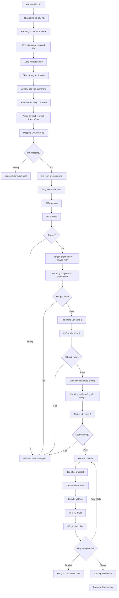

# Flow auto nghiệp vụ tuyển dụng VCS hiện tại

## 1. Mục tiêu tài liệu

Tài liệu này mô tả flow auto nghiệp vụ tuyển dụng VCS hiện tại đã chốt ở mức tổng quan nghiệp vụ.

Phạm vi flow bắt đầu từ lúc HR tạo/chỉnh JD, đăng tin tuyển dụng, ứng viên apply và upload CV, hệ thống tự động xử lý CV, đánh giá sơ bộ, gửi form pre-screening, HR review, hội đồng chuyên môn chấm hồ sơ, phỏng vấn, offer và bàn giao onboarding.

Flow này tập trung vào nghiệp vụ chính, không đi quá sâu vào chi tiết kỹ thuật nội bộ như hash file, normalized text, retry job, queue, storage path hoặc implementation cụ thể của từng module.

---

## 2. Nguyên tắc flow đã chốt

| STT | Nguyên tắc | Mô tả |
|---:|---|---|
| 1 | Application là trung tâm | Mỗi hồ sơ ứng tuyển được quản lý theo `application_id`. Các dữ liệu như CV, mapping result, form answer, AI screening, HR review, phỏng vấn và offer đều gắn với application. |
| 2 | Core là nơi điều phối chính | Recruitment Core chịu trách nhiệm validate, điều phối trạng thái và kích hoạt các bước tự động trong flow. |
| 3 | CV gốc không dùng trực tiếp cho nghiệp vụ sau | CV gốc được lưu vào quarantine; các bước parse, mapping, AI, HR review sử dụng CV sạch. |
| 4 | Mapping CV-JD là module nội bộ | Mapping CV-JD được xử lý trong hệ thống Core, không coi là external tool. |
| 5 | Có các điểm chặn tự động | Hệ thống tự động loại/chặn ở các bước: hồ sơ không hợp lệ, mapping không đạt, HR không duyệt, hội đồng fail, phỏng vấn fail, offer bị từ chối. |
| 6 | HR vẫn giữ vai trò quyết định nghiệp vụ | AI và automation hỗ trợ sàng lọc, nhưng HR/Hội đồng/BGĐ vẫn là các điểm quyết định quan trọng. |

---

## 3. Flow tổng quan dạng rút gọn

```text
HR tạo/chỉnh JD
→ HR cấu hình bộ câu hỏi
→ HR đăng tin lên VCS Portal
→ Ứng viên apply + upload CV
→ Core validate hồ sơ
→ Check trùng application
→ Lưu CV gốc vào quarantine
→ Scan mã độc + tạo CV sạch
→ Parse CV sạch + check trùng hồ sơ
→ Mapping CV-JD nội bộ
→ Nếu đạt mapping: gửi form pre-screening
→ Ứng viên trả lời form
→ AI Screening
→ HR Review
→ Nếu HR duyệt: tạo task chấm hồ sơ chuyên môn
→ Hội đồng chuyên môn chấm hồ sơ
→ Nếu pass: tạo phỏng vấn vòng 1
→ Phỏng vấn vòng 1
→ Nếu pass: điền phiếu đánh giá 8 trang
→ Xác định tuyến phỏng vấn vòng 2
→ Phỏng vấn vòng 2
→ Nếu pass: HR trao đổi offer
→ Tạo offer proposal
→ Generate offer letter
→ Trình ký VOffice
→ BGĐ ký duyệt
→ HR gửi mail offer
→ Ứng viên phản hồi offer
→ Nếu đồng ý: chốt ngày onboard
→ Bàn giao Onboarding
```

---

## 4. Flow nghiệp vụ chi tiết theo từng giai đoạn

## 4.1. Giai đoạn 1 — Tạo JD, cấu hình câu hỏi và đăng tin

| Bước | Tên bước | Tác nhân chính | Mô tả | Output |
|---:|---|---|---|---|
| 1 | HR tạo/chỉnh JD | HR | HR tạo mới hoặc chỉnh sửa JD cho vị trí cần tuyển. | JD sẵn sàng sử dụng |
| 2 | HR cấu hình bộ câu hỏi | HR | HR cấu hình bộ câu hỏi theo JD, vị trí, level hoặc nhóm năng lực cần đánh giá. | Bộ câu hỏi gắn với JD/vị trí |
| 3 | HR đăng tin lên VCS Portal | HR | HR đăng tin tuyển dụng để ứng viên có thể xem và apply. | Tin tuyển dụng được public |

Kết quả của giai đoạn này là hệ thống có JD, bộ câu hỏi và tin tuyển dụng để tiếp nhận ứng viên.

---

## 4.2. Giai đoạn 2 — Ứng viên apply và hệ thống tiếp nhận hồ sơ

| Bước | Tên bước | Tác nhân chính | Mô tả | Output |
|---:|---|---|---|---|
| 4 | Ứng viên apply + upload CV | Ứng viên | Ứng viên nhập thông tin apply và upload CV trên VCS Portal. | Hồ sơ apply ban đầu |
| 5 | Core validate hồ sơ | Recruitment Core | Hệ thống kiểm tra thông tin apply, định dạng file, dữ liệu bắt buộc, email/SĐT/JD. | Hồ sơ hợp lệ hoặc bị reject |
| 6 | Check trùng application | Recruitment Core | Hệ thống kiểm tra ứng viên đã apply cùng JD trước đó chưa. | Application mới hoặc re-upload CV |

Nếu hồ sơ không hợp lệ, hệ thống yêu cầu ứng viên bổ sung/upload lại hoặc dừng flow.

---

## 4.3. Giai đoạn 3 — Xử lý CV gốc và tạo CV sạch

| Bước | Tên bước | Tác nhân chính | Mô tả | Output |
|---:|---|---|---|---|
| 7 | Lưu CV gốc vào quarantine | Recruitment Core | CV gốc được lưu vào vùng cách ly để tránh sử dụng trực tiếp trong các bước nghiệp vụ. | CV gốc lưu quarantine |
| 8 | Scan mã độc + tạo CV sạch | Recruitment Core / CV Sanitization | Hệ thống scan CV gốc, xử lý nội dung an toàn và tạo CV sạch theo format chuẩn của hệ thống. | CV sạch |
| 9 | Parse CV sạch + check trùng hồ sơ | Recruitment Core | Hệ thống đọc CV sạch, trích xuất thông tin ứng viên và kiểm tra trùng hồ sơ theo dữ liệu đã parse. | Parsed profile + duplicate result |

Sau giai đoạn này, các bước sau chỉ sử dụng CV sạch và dữ liệu đã parse, không sử dụng CV gốc trực tiếp.

---

## 4.4. Giai đoạn 4 — Mapping CV-JD và gửi form pre-screening

| Bước | Tên bước | Tác nhân chính | Mô tả | Output |
|---:|---|---|---|---|
| 10 | Mapping CV-JD nội bộ | Mapping Module | Hệ thống so khớp CV sạch với JD để tính điểm phù hợp. | Mapping result |
| 11 | Quyết định đạt mapping | Recruitment Core | Hệ thống kiểm tra kết quả mapping có đạt ngưỡng gửi form hay không. | Đạt/không đạt mapping |
| 12 | Gửi form pre-screening | Notification / Form Session | Nếu đạt mapping, hệ thống tạo form session và gửi link form cho ứng viên. | Form pre-screening được gửi |

Nếu không đạt mapping, hồ sơ có thể bị loại sơ bộ hoặc đưa vào talent pool.

---

## 4.5. Giai đoạn 5 — Ứng viên trả lời form, AI Screening và HR Review

| Bước | Tên bước | Tác nhân chính | Mô tả | Output |
|---:|---|---|---|---|
| 13 | Ứng viên trả lời form | Ứng viên | Ứng viên mở link form và trả lời bộ câu hỏi pre-screening. | Form answer |
| 14 | AI Screening | AI Screening Module | Hệ thống đánh giá tổng hợp dựa trên JD, CV sạch, mapping result và câu trả lời form. | AI screening result |
| 15 | HR Review | HR | HR xem hồ sơ, CV sạch, mapping result, form answer và AI screening result để ra quyết định. | HR decision |

Nếu HR không duyệt, hệ thống gửi mail fail hoặc đưa hồ sơ vào talent pool.

---

## 4.6. Giai đoạn 6 — Chấm hồ sơ chuyên môn và phỏng vấn vòng 1

| Bước | Tên bước | Tác nhân chính | Mô tả | Output |
|---:|---|---|---|---|
| 16 | Tạo task chấm hồ sơ chuyên môn | Recruitment Core / HR | Nếu HR duyệt, hệ thống tạo task để hội đồng chuyên môn chấm hồ sơ. | Task chấm hồ sơ |
| 17 | Hội đồng chuyên môn chấm hồ sơ | Hội đồng chuyên môn | Hội đồng đánh giá hồ sơ ứng viên trước khi quyết định phỏng vấn. | Kết quả chấm chuyên môn |
| 18 | Tạo phỏng vấn vòng 1 | Recruitment Core / HR | Nếu hội đồng pass, hệ thống tạo lịch hoặc phiên phỏng vấn vòng 1. | Interview round 1 |
| 19 | Phỏng vấn vòng 1 | Hội đồng / Interviewer | Ứng viên tham gia phỏng vấn vòng 1. | Kết quả vòng 1 |

Nếu hội đồng chuyên môn fail hoặc phỏng vấn vòng 1 fail, hệ thống gửi mail fail hoặc đưa hồ sơ vào talent pool.

---

## 4.7. Giai đoạn 7 — Phiếu đánh giá 8 trang và phỏng vấn vòng 2

| Bước | Tên bước | Tác nhân chính | Mô tả | Output |
|---:|---|---|---|---|
| 20 | Điền phiếu đánh giá 8 trang | Hội đồng / Interviewer | Sau khi pass vòng 1, người đánh giá điền phiếu đánh giá chi tiết. | Evaluation form |
| 21 | Xác định tuyến phỏng vấn vòng 2 | HR / Recruitment Core | Hệ thống hoặc HR xác định tuyến phỏng vấn vòng 2 phù hợp. | Interview route round 2 |
| 22 | Phỏng vấn vòng 2 | BGĐ / HR / Hội đồng liên quan | Ứng viên tham gia phỏng vấn vòng 2. | Kết quả vòng 2 |

Nếu ứng viên fail vòng 2, hệ thống gửi mail fail hoặc đưa hồ sơ vào talent pool.

---

## 4.8. Giai đoạn 8 — Offer, ký duyệt và onboarding

| Bước | Tên bước | Tác nhân chính | Mô tả | Output |
|---:|---|---|---|---|
| 23 | HR trao đổi offer | HR / Ứng viên | HR trao đổi với ứng viên về offer, mức lương, thời gian onboard và điều kiện liên quan. | Thông tin offer thống nhất sơ bộ |
| 24 | Tạo offer proposal | HR | HR tạo đề xuất offer trên hệ thống. | Offer proposal |
| 25 | Generate offer letter | Recruitment Core | Hệ thống generate offer letter theo template. | Offer letter |
| 26 | Trình ký VOffice | Recruitment Core / VOffice | Offer letter được trình ký qua VOffice. | Hồ sơ trình ký |
| 27 | BGĐ ký duyệt | BGĐ | BGĐ xem và ký duyệt offer letter. | Offer letter được duyệt |
| 28 | HR gửi mail offer | HR / Notification | HR gửi offer cho ứng viên qua email. | Email offer |
| 29 | Ứng viên phản hồi | Ứng viên | Ứng viên đồng ý, từ chối hoặc trao đổi lại offer. | Offer response |
| 30 | Chốt ngày onboard | HR / Ứng viên | Nếu ứng viên đồng ý, HR chốt ngày onboard. | Ngày onboard |
| 31 | Bàn giao Onboarding | HR | HR bàn giao hồ sơ sang quy trình onboarding. | Handoff onboarding |

---

## 5. Các điểm quyết định chính trong flow

| STT | Điểm quyết định | Điều kiện pass | Nếu fail |
|---:|---|---|---|
| 1 | Hồ sơ hợp lệ? | Thông tin apply và file upload hợp lệ | Reject / yêu cầu upload lại |
| 2 | Trùng application? | Không trùng hoặc còn lượt upload lại | Reject nếu vượt giới hạn |
| 3 | CV an toàn? | Không phát hiện mã độc / file nguy hiểm | Reject CV |
| 4 | Đạt mapping? | Mapping score đạt ngưỡng | Loại sơ bộ / Talent pool |
| 5 | HR duyệt? | HR đồng ý cho đi tiếp | Gửi mail fail / Talent pool |
| 6 | Hội đồng chuyên môn pass? | Hồ sơ đạt yêu cầu chuyên môn | Gửi mail fail / Talent pool |
| 7 | Pass phỏng vấn vòng 1? | Hội đồng/interviewer đánh giá pass | Gửi mail fail / Talent pool |
| 8 | Pass phỏng vấn vòng 2? | BGĐ/HR/Hội đồng đánh giá pass | Gửi mail fail / Talent pool |
| 9 | Ứng viên phản hồi offer? | Ứng viên đồng ý offer | Nếu từ chối: đóng hồ sơ / Talent pool; nếu trao đổi lại: quay về HR trao đổi offer |

---

## 6. Mermaid diagram flow hiện tại



---

## 7. Trạng thái nghiệp vụ đề xuất

| Nhóm | Trạng thái đề xuất |
|---|---|
| Tiếp nhận | `APPLICATION_CREATED`, `APPLICATION_VALIDATING`, `APPLICATION_DUPLICATE_CHECKED` |
| CV | `CV_UPLOADED`, `CV_STORED_QUARANTINE`, `CV_SANITIZED`, `CV_PARSED` |
| Mapping | `MAPPING_REQUESTED`, `MAPPING_DONE`, `MAPPING_REJECTED`, `ELIGIBLE_FOR_FORM` |
| Form | `FORM_SENT`, `FORM_SUBMITTED`, `FORM_EXPIRED` |
| AI/HR | `AI_SCREENING_DONE`, `WAITING_HR_REVIEW`, `HR_APPROVED`, `HR_REJECTED` |
| Chuyên môn | `TECHNICAL_SCREENING_CREATED`, `TECHNICAL_SCREENING_PASSED`, `TECHNICAL_SCREENING_FAILED` |
| Phỏng vấn | `INTERVIEW_ROUND_1_CREATED`, `INTERVIEW_ROUND_1_PASSED`, `INTERVIEW_ROUND_1_FAILED`, `INTERVIEW_ROUND_2_CREATED`, `INTERVIEW_ROUND_2_PASSED`, `INTERVIEW_ROUND_2_FAILED` |
| Offer | `OFFER_DISCUSSING`, `OFFER_PROPOSAL_CREATED`, `OFFER_LETTER_GENERATED`, `OFFER_PENDING_SIGNATURE`, `OFFER_SIGNED`, `OFFER_SENT`, `OFFER_ACCEPTED`, `OFFER_DECLINED` |
| Onboarding | `ONBOARD_DATE_CONFIRMED`, `ONBOARDING_HANDOFF_DONE` |

---

## 8. Kết luận

Flow auto nghiệp vụ hiện tại giúp tự động hóa phần lớn các bước lặp lại trong tuyển dụng:

```text
- Tiếp nhận hồ sơ
- Validate và check trùng
- Xử lý CV an toàn
- Mapping CV-JD
- Gửi form pre-screening
- AI Screening
- Điều phối HR review, chấm chuyên môn và phỏng vấn
- Tạo offer letter, trình ký VOffice và bàn giao onboarding
```

Các điểm cần con người quyết định vẫn được giữ lại ở các mốc quan trọng:

```text
- HR Review
- Hội đồng chuyên môn chấm hồ sơ
- Phỏng vấn vòng 1
- Phỏng vấn vòng 2
- BGĐ ký duyệt offer
- Ứng viên phản hồi offer
```

Đây là flow nghiệp vụ phù hợp để làm cơ sở thiết kế module, database, API và workflow state cho hệ thống Recruitment Core Backend.
