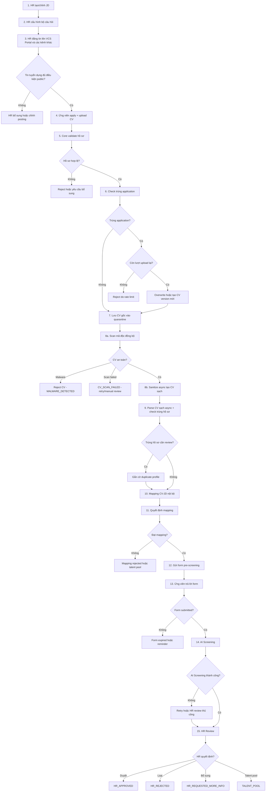

# 01. Phase 1 Context Summary

## 1. Mục tiêu tài liệu

Tài liệu này tóm tắt ngữ cảnh đã chốt cho Phase 1 của Recruitment Core Backend, dựa trên bốn nguồn:

| Nguồn | Vai trò trong tài liệu này |
| --- | --- |
| `vcs_recruitment_phase1_architecture_specification.md` | Nguồn ưu tiên cao nhất cho ranh giới kiến trúc, nguyên tắc module và phạm vi Phase 1. |
| `vcs_recruitment_phase1_business_flow.md` | Nguồn chính cho business flow, actor, decision point và trạng thái nghiệp vụ. |
| `00_source_baseline_analysis.md` | Nguồn đối chiếu với codebase hiện tại, các phần có thể tái sử dụng và rủi ro khi mở rộng. |
| `backend-specification.md` | Nguồn nền về backend hiện tại và các capability sẵn có. |

Mục tiêu là tạo một bản summary ngắn gọn để các task Phase 1 tiếp theo có cùng bối cảnh, không thay thế các tài liệu nguồn và không thêm quyết định mới ngoài phạm vi đã nêu.

## 2. Mục tiêu Phase 1

Phase 1 xây dựng Recruitment Core Backend trên nền NestJS hiện tại, với trọng tâm là luồng tuyển dụng từ lúc HR tạo/chỉnh JD đến khi hồ sơ được đưa vào `HR Review`.

Mục tiêu nghiệp vụ chính:

| Nhóm mục tiêu | Nội dung |
| --- | --- |
| Vận hành tuyển dụng | Cho phép HR tạo hoặc chỉnh JD, cấu hình câu hỏi, đăng tin và theo dõi hồ sơ ứng tuyển. |
| Tiếp nhận ứng viên | Hỗ trợ ứng viên apply, upload CV, validate hồ sơ và xử lý duplicate application. |
| An toàn tài liệu | Lưu CV gốc vào quarantine, scan mã độc, tạo CV sạch trước khi parse hoặc dùng cho các bước AI. |
| Sàng lọc ban đầu | Parse CV sạch, check trùng hồ sơ, mapping CV-JD nội bộ, gửi pre-screening form nếu đạt mapping. |
| Review của HR | Tổng hợp kết quả mapping, form và AI Screening để HR quyết định trong phạm vi Phase 1. |

## 3. Scope trong Phase 1

Phase 1 bao gồm 15 bước chính sau:

| # | Bước | Kết quả kỳ vọng |
| --- | --- | --- |
| 1 | HR tạo/chỉnh JD | JD có dữ liệu đủ để cấu hình và đăng tin. |
| 2 | HR cấu hình bộ câu hỏi theo JD/vị trí/level | Bộ câu hỏi pre-screening gắn với JD hoặc vị trí tuyển dụng. |
| 3 | HR đăng tin lên VCS Portal và các kênh khác | Job posting được public qua portal và channel adapter phù hợp. |
| 4 | Ứng viên apply + upload CV | Tạo application đầu vào và nhận file CV. |
| 5 | Core validate hồ sơ | Hồ sơ được kiểm tra định dạng, dữ liệu bắt buộc và rule cơ bản. |
| 6 | Check trùng application | Phát hiện ứng viên apply trùng vào cùng JD hoặc cùng posting. |
| 7 | Lưu CV gốc vào quarantine | CV gốc được lưu riêng, không dùng trực tiếp cho xử lý nghiệp vụ tiếp theo. |
| 8 | Scan mã độc đồng bộ + sanitize async | Upload API scan malware đồng bộ; nếu scan pass thì sanitize/parse chạy async. Chỉ CV an toàn và đã sanitize mới được đi tiếp. |
| 9 | Parse CV sạch + check trùng hồ sơ | Trích xuất profile từ CV sạch và phát hiện hồ sơ trùng ở mức candidate profile. |
| 10 | Mapping CV-JD nội bộ | Module NestJS nội bộ đánh giá mức phù hợp giữa CV và JD. |
| 11 | Quyết định đạt/không đạt mapping | Hồ sơ bị loại, đưa talent pool hoặc đủ điều kiện nhận form. |
| 12 | Nếu đạt mapping: gửi form pre-screening | Tạo form session riêng cho application. |
| 13 | Ứng viên trả lời form | Lưu câu trả lời của ứng viên. |
| 14 | AI Screening | AI đánh giá dữ liệu đã chuẩn hóa từ CV sạch và form. |
| 15 | HR Review | HR xem kết quả tổng hợp và đưa ra quyết định trong phạm vi Phase 1. |

Các module backend dự kiến cần tạo mới hoặc mở rộng trong phạm vi này gồm `applications`, `job-descriptions`, `job-postings`, `cv-documents`, `cv-sanitization`, `mapping`, `mapping-results`, `form-sessions`, `form-answers`, `ai-screening`, `hr-review`, `workflow-state`, `audit-logs`, `channel-publishing`, `channel-ingestion`, `bot-conversations` và `bot-knowledge`.

## 4. Out of scope

Các hạng mục sau không thuộc phạm vi Phase 1 nếu Phase 1 dừng tại `HR Review`:

| Nhóm | Hạng mục ngoài phạm vi |
| --- | --- |
| Đánh giá chuyên sâu | Technical profile scoring task, professional panel scoring, interview round 1, interview round 2. |
| Quy trình phỏng vấn hiện tại | Tạo mới hoặc thay đổi sâu luồng `interview_sessions`, `session_questions`, `evaluations`, `export`, `submissions`. |
| Biểu mẫu đánh giá sau phỏng vấn | 8-page evaluation, BM04 hoặc các form đánh giá hội đồng sau vòng phỏng vấn. |
| Offer | Offer proposal, generate offer letter, HR gửi offer email. |
| Phê duyệt và ký số | VOffice signing, BGĐ approval. |
| Onboarding | Xác nhận onboard date, bàn giao onboarding. |
| AMIS | Đồng bộ AMIS không triển khai sâu trong Phase 1 nếu luồng dừng tại `HR Review`; chỉ xem là extension point cho phase sau. |
| Orchestration ngoài NestJS | Không dùng `n8n` làm workflow engine cho Phase 1. |

## 5. Nguyên tắc chốt

| Nguyên tắc | Nội dung chốt |
| --- | --- |
| `Application` là trung tâm workflow | Mỗi hồ sơ ứng tuyển theo JD/posting được điều phối qua `Application`. |
| `Candidate` là hồ sơ dùng chung | `Candidate` chỉ là shared profile, không là workflow center của Phase 1. |
| Recruitment Core Backend là source of truth | Trạng thái application, CV, mapping, form, AI Screening và HR Review nằm trong backend. |
| Modular monolith | Phase 1 mở rộng NestJS hiện tại theo module nội bộ, chưa tách microservice. |
| Không dùng `n8n` | Workflow được điều phối trong backend, không qua automation engine ngoài. |
| Mapping CV-JD là module nội bộ | `mapping` chạy trong NestJS, không là service ngoài ở Phase 1. |
| CV gốc phải quarantine | CV gốc chỉ lưu an toàn để audit hoặc truy vết, không dùng trực tiếp cho parse, mapping, AI Screening hay HR Review. |
| CV sạch là input nghiệp vụ | Parse, duplicate profile check, mapping, AI Screening và HR Review phải dựa trên CV đã scan/sanitize. |
| Public endpoint có cơ chế bảo vệ riêng | Apply, form và channel webhook cần rate limit, idempotency, validation và signature nếu là webhook. |
| Không tái sử dụng `interview_sessions.accessToken` | Token hiện tại phục vụ public interview access, không dùng cho public apply hoặc pre-screening form. |
| Bảo toàn interview flow hiện tại | Các module interview/session/evaluation hiện có chỉ được tham chiếu hoặc tái sử dụng pattern khi phù hợp, không chỉnh sâu cho Phase 1. |

## 6. Actors tham gia

| Actor | Vai trò |
| --- | --- |
| HR | Tạo/chỉnh JD, cấu hình câu hỏi, đăng tin, theo dõi application, xử lý duplicate hoặc ngoại lệ và thực hiện `HR Review`. |
| Admin | Quản trị user, role, cấu hình hệ thống, kênh, bot, threshold hoặc policy nếu cần. |
| Candidate | Apply vào job, upload CV, nhận và trả lời pre-screening form. |
| Bot | Hỗ trợ candidate care theo JD, job posting hoặc FAQ; chuyển HR khi câu hỏi vượt phạm vi. |
| Channel Adapter | Publish hoặc ingest dữ liệu từ `VCS Portal`, `Facebook`, `LinkedIn`, `TopCV`, `VietnamWorks` theo khả năng tích hợp. |
| Recruitment Core | Điều phối workflow, validate, lưu trạng thái, xử lý CV, mapping, form, AI Screening, HR Review và audit. |
| Mapping Module | Tính toán kết quả CV-JD matching nội bộ. |
| AI Screening Module | Đánh giá dữ liệu ứng viên sau khi có CV sạch và câu trả lời form. |
| Notification Module | Gửi thông báo, form link hoặc reminder theo sự kiện tuyển dụng. |

## 7. Flow rút gọn Phase 1

## 8. Decision points chính

| # | Decision point | Quyết định có thể xảy ra |
| --- | --- | --- |
| 1 | Tin tuyển dụng đủ điều kiện public? | Public hoặc trả về HR để bổ sung/chỉnh sửa. |
| 2 | Hồ sơ hợp lệ? | Cho đi tiếp hoặc reject/yêu cầu bổ sung. |
| 3 | Trùng application? | Tạo application mới, overwrite/version mới hoặc reject theo rule. |
| 4 | Còn lượt upload lại? | Cho upload lại hoặc reject do rate limit. |
| 5 | CV an toàn? | Tạo CV sạch hoặc reject CV có rủi ro. |
| 6 | Trùng hồ sơ sau parse? | Gắn cờ cần review hoặc tiếp tục mapping. |
| 7 | Đạt mapping? | Đủ điều kiện nhận form hoặc bị loại/đưa talent pool/theo ngoại lệ HR. |
| 8 | Form submitted? | Chạy AI Screening hoặc hết hạn/reminder. |
| 9 | AI Screening thành công? | Đưa vào HR Review hoặc retry/HR review thủ công. |
| 10 | HR duyệt? | `HR_APPROVED`, `HR_REJECTED`, `HR_REQUESTED_MORE_INFO` hoặc `TALENT_POOL`. |

## 9. Trạng thái chính của Phase 1

| Nhóm | Trạng thái |
| --- | --- |
| Application | `APPLICATION_CREATED`, `APPLICATION_VALIDATING`, `APPLICATION_REJECTED_INVALID`, `APPLICATION_DUPLICATE_CHECKING`, `APPLICATION_DUPLICATE_FOUND`, `APPLICATION_OVERWRITTEN`, `APPLICATION_REJECTED_RATE_LIMIT` |
| CV | `CV_UPLOADED`, `CV_STORED_QUARANTINE`, `CV_SCAN_REQUESTED`, `CV_SCAN_PASSED`, `CV_SCAN_FAILED`, `CV_REJECTED_MALWARE`, `CV_SANITIZING`, `CV_SANITIZED`, `CV_SANITIZE_FAILED`, `CV_PARSED`, `CV_PARSE_FAILED` |
| Duplicate/Profile | `PROFILE_DUPLICATE_CHECKED`, `PROFILE_DUPLICATE_NEEDS_REVIEW` |
| Mapping | `MAPPING_REQUESTED`, `MAPPING_DONE`, `MAPPING_FAILED`, `MAPPING_REJECTED`, `ELIGIBLE_FOR_FORM` |
| Form | `FORM_SESSION_CREATED`, `FORM_SENT`, `FORM_OPENED`, `FORM_SUBMITTED`, `FORM_EXPIRED` |
| AI/HR | `AI_SCREENING_REQUESTED`, `AI_SCREENING_DONE`, `AI_SCREENING_FAILED`, `WAITING_HR_REVIEW`, `HR_APPROVED`, `HR_REJECTED`, `HR_REQUESTED_MORE_INFO`, `TALENT_POOL` |

## 10. Liên hệ với source baseline hiện tại

### Capability có thể tái sử dụng

| Capability hiện có | Cách liên hệ với Phase 1 |
| --- | --- |
| `Auth`, `User`, `Role` | Là nền cho phân quyền HR/Admin và bảo vệ API nội bộ. |
| `Candidates` | Có thể dùng làm shared profile, nhưng không làm workflow center. |
| File Parser PDF/DOCX/XLSX | Có thể tái sử dụng cho parse CV sạch sau scan/sanitize. |
| AI Prompt / Model Override | Có thể tham khảo cho `ai-screening`, cần bổ sung schema validation cho output. |
| Question Bank | Có thể tái sử dụng khi cấu hình bộ câu hỏi theo JD/vị trí/level. |
| Positions / Levels | Có thể dùng cho JD, job posting, question set và mapping context. |
| WebSocket progress event pattern | Có thể tham khảo cho progress/event của các bước xử lý dài. |
| Notification hiện có | Có thể tham khảo pattern, nhưng cần mở rộng cho recruitment notification thay vì chỉ interview reminder. |

### Module cần tạo mới hoặc tách rõ

| Module | Lý do |
| --- | --- |
| `applications` | Trung tâm workflow Phase 1 theo JD/posting/candidate. |
| `job-descriptions`, `job-postings` | Quản lý JD, thông tin public và publish channel. |
| `cv-documents`, `cv-sanitization` | Tách CV gốc quarantine, scan, sanitize và CV sạch. |
| `mapping`, `mapping-results` | Thực hiện và lưu kết quả mapping CV-JD nội bộ. |
| `form-sessions`, `form-answers` | Quản lý pre-screening form riêng, không dùng `interview_sessions.accessToken`. |
| `ai-screening` | Đánh giá hồ sơ sau mapping và form. |
| `hr-review` | Tổng hợp kết quả để HR quyết định. |
| `workflow-state`, `audit-logs` | Lưu trạng thái và truy vết các bước quan trọng. |
| `channel-publishing`, `channel-ingestion` | Tích hợp publish/ingest từ portal và job channels. |
| `bot-conversations`, `bot-knowledge` | Phục vụ candidate care theo JD/posting/FAQ. |

### Rủi ro baseline cần lưu ý

| Rủi ro | Ghi chú triển khai |
| --- | --- |
| Runtime `synchronize=true` | Cần xử lý cẩn trọng khi thêm entity và migration cho Phase 1. |
| Migration path/config chưa nhất quán | Cần chuẩn hóa đường dẫn migration trước khi triển khai schema lớn. |
| Upload chấp nhận `.xls` nhưng parser không hỗ trợ `.xls` | Cần đồng bộ validate file type với parser thực tế. |
| Chưa có quarantine/safe CV storage | Phải bổ sung trước khi dùng CV cho parse, mapping hoặc AI. |
| Chưa có `Application` workflow center | Không mở rộng workflow bằng cách nhồi thêm trạng thái vào `Candidate`. |
| File download chưa gắn quyền theo application/candidate | Cần ownership/authorization rõ khi expose file. |
| AI JSON output chưa có schema validator | `ai-screening` cần validate output để tránh dữ liệu sai cấu trúc. |
| Public endpoints cần bảo vệ riêng | Apply, form và webhook cần rate limit, idempotency, validation và signature nếu phù hợp. |

## 11. Conflict / Assumption

| Chủ đề | Conflict hoặc assumption | Cách chốt trong summary |
| --- | --- | --- |
| AMIS | Một số bối cảnh có nhắc khả năng đồng bộ sau các bước tuyển dụng, nhưng kiến trúc Phase 1 chốt dừng tại `HR Review`. | Xem AMIS là extension point hoặc phase sau, không triển khai sâu trong Phase 1. |
| `Candidate` và `Application` | Baseline hiện tại đang đặt nhiều dữ liệu upload/profile trên `Candidate`. | Phase 1 lấy `Application` làm workflow center; `Candidate` chỉ là shared profile. |
| Public token | Backend hiện có `interview_sessions.accessToken` cho public interview access. | Không tái sử dụng token này cho apply hoặc pre-screening form; dùng `form-sessions` hoặc cơ chế token riêng. |
| Pre-screening form và interview survey | Baseline đã có các khái niệm survey/submission gắn với interview flow. | Chỉ tham khảo pattern nếu phù hợp, không làm Phase 1 phụ thuộc hoặc chỉnh sâu interview flow. |
| Channel integration | Mức độ API thực tế của từng kênh có thể khác nhau. | `Channel Adapter` được mô tả ở mức publish/ingest theo khả năng tích hợp, chi tiết triển khai cần tách task sau. |

## 12. Kết luận

Phase 1 nên mở rộng codebase NestJS hiện tại theo hướng modular monolith, đặt `Application` làm trung tâm workflow tuyển dụng và giữ `Candidate` là shared profile. Luồng nghiệp vụ cần đi từ HR tạo/chỉnh JD, đăng tin, nhận application, xử lý CV an toàn, mapping CV-JD, pre-screening form, AI Screening đến `HR Review`.

Các phần interview/session/evaluation hiện tại cần được bảo toàn, chỉ tái sử dụng capability hoặc pattern khi không làm lệch ranh giới Phase 1. AMIS, offer, phỏng vấn chuyên sâu, phê duyệt và onboarding là phần sau `HR Review`, vì vậy không thuộc phạm vi triển khai sâu của Phase 1.
