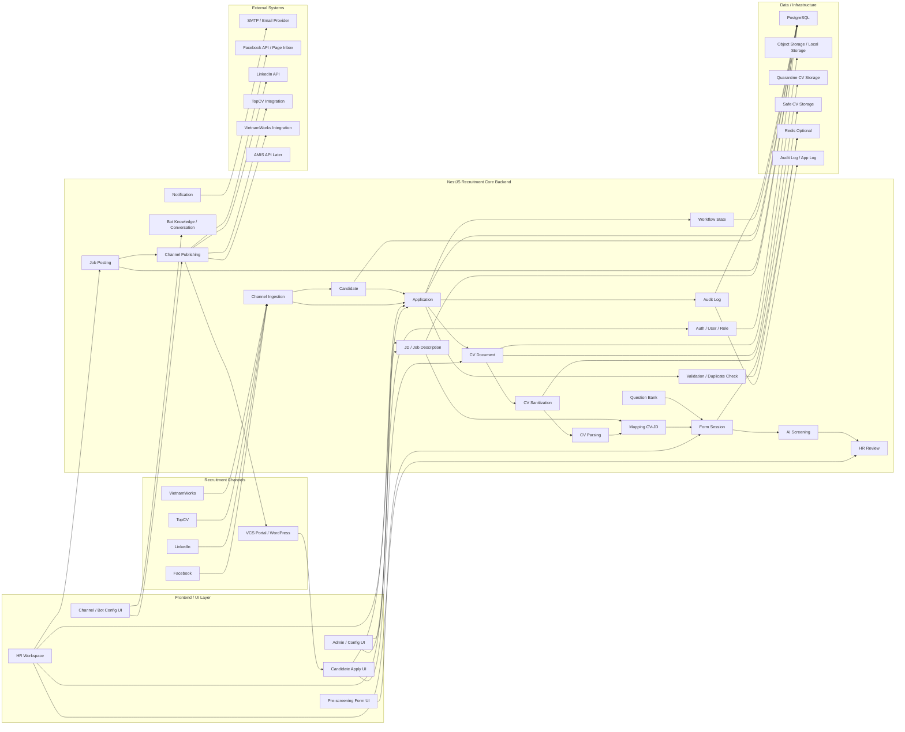
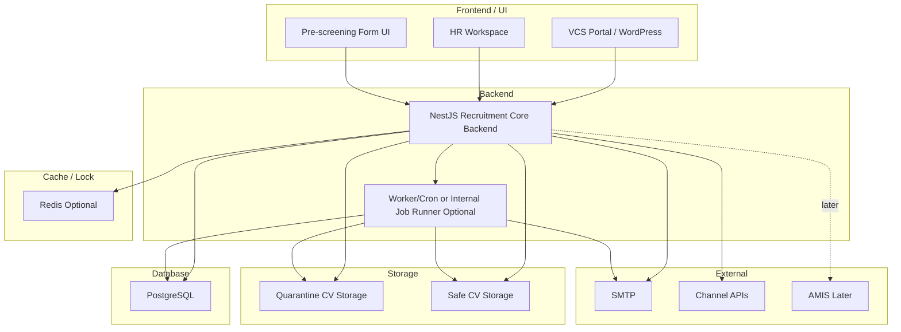

# 02. Target Architecture Phase 1

## 1. Mục tiêu tài liệu

Tài liệu này mô tả kiến trúc đích của Recruitment Phase 1 cho dự án Interview Assistant / Recruitment Core Backend.

Tài liệu dùng làm nền cho các specification tiếp theo như domain model, API contract, migration plan, CV processing, mapping, pre-screening form, AI screening và HR review.

Đây là tài liệu specification kiến trúc, không phải tài liệu implement code. Các chi tiết implementation, schema cuối cùng, migration hoặc thay đổi source sẽ được tách sang tài liệu/task riêng.

## 2. Architecture decision

| STT | Decision | Nội dung chốt | Lý do |
| --- | --- | --- | --- |
| 1 | Backend chính | Backend chính là `NestJS Recruitment Core Backend`. | Source hiện tại đã là NestJS và có nhiều capability nền có thể reuse. |
| 2 | Hướng mở rộng | Extend trực tiếp từ source NestJS Interview Assistant hiện tại. | Tránh viết lại từ đầu, tận dụng `auth`, `users`, `candidates`, `file-parser`, `ai`, `questions`, `positions`, `levels`. |
| 3 | Mô hình kiến trúc | Dùng `modular monolith` cho Phase 1. | Phase 1 cần thống nhất workflow và dữ liệu, chưa cần tách microservice sớm. |
| 4 | Workflow orchestration | Không dùng `n8n` trong Phase 1. | Core tự điều phối bằng module/service nội bộ theo kiến trúc đã chốt. |
| 5 | Entity trung tâm | `Application` là trung tâm workflow. | Mỗi hồ sơ ứng tuyển theo JD/posting/channel cần trạng thái riêng, không gắn toàn bộ flow vào `Candidate`. |
| 6 | Mapping CV-JD | `Mapping CV-JD` là internal module, không phải external service. | Mapping phụ thuộc dữ liệu Core như JD version, clean CV, parsed profile và application state. |
| 7 | CV gốc | CV gốc lưu quarantine, không dùng trực tiếp cho parse/mapping/AI/HR Review. | Giảm rủi ro bảo mật từ file public upload. |
| 8 | CV sạch | CV sạch là input chính cho parse/mapping/AI Screening/HR Review. | Đảm bảo dữ liệu đi tiếp đã qua scan/sanitize. |
| 9 | Database chính | `PostgreSQL` là database chính. | Phù hợp source hiện tại và dùng làm source of truth cho workflow Phase 1. |
| 10 | Cache/lock | `Redis` là optional. | Có thể dùng cho rate limit, token cache, lock chống submit trùng hoặc queue nhẹ, nhưng không bắt buộc để chốt architecture Phase 1. |
| 11 | AMIS | `AMIS API` là later / extension point nếu Phase 1 dừng tại `HR Review`. | Phase 1 hiện tại chốt dừng ở HR Review, chưa đưa AMIS sync vào luồng bắt buộc. |

## 3. Architecture overview

Kiến trúc tổng thể Phase 1:

```text
Recruitment Channels / UI
    -> NestJS Recruitment Core Backend
        -> PostgreSQL
        -> Object Storage / Local Storage
        -> Redis optional
        -> Audit Log
        -> SMTP / Channel APIs / External integrations nếu có
```

`NestJS Recruitment Core Backend` là nơi điều phối workflow và là source of truth cho dữ liệu tuyển dụng Phase 1. Core quản lý JD, job posting, application, CV document, CV sanitization, mapping, form session, AI Screening và HR Review.

Các kênh ngoài như `VCS Portal / WordPress`, `Facebook`, `LinkedIn`, `TopCV`, `VietnamWorks` không sở hữu dữ liệu tuyển dụng chính. Dữ liệu apply/CV từ mọi kênh phải được chuẩn hóa về `Candidate` và `Application` trong Core.

## 4. Component diagram



## 5. Frontend / UI Layer

| UI | Actor | Vai trò | Ghi chú |
| --- | --- | --- | --- |
| `VCS Portal / WordPress` | Candidate, HR/Content team | Hiển thị tin tuyển dụng chính, nhận apply/upload CV qua UI public. | Là kênh chính cho job posting Phase 1; dữ liệu vẫn phải đi qua Core API. |
| `HR Workspace` | HR | Quản lý JD, job posting, application, mapping result, AI result và `HR Review`. | Có thể extend từ UI/admin hiện tại hoặc tạo view mới tùy task sau. |
| `Candidate Apply UI` | Candidate | Nhập thông tin apply và upload CV. | Public endpoint cần rate limit, validation và idempotency. |
| `Pre-screening Form UI` | Candidate | Candidate trả lời form sau khi application đạt mapping. | Dùng token/link riêng theo `form_session`, không dùng `interview_sessions.accessToken`. |
| `Admin / Config UI` | Admin | Quản lý user/role, cấu hình channel, email template, threshold, policy nếu có. | Phần config chi tiết có thể tách task sau. |
| `Channel / Bot Config UI` | Admin, HR | Cấu hình bot knowledge, FAQ, channel rule và thông tin ứng tuyển theo kênh. | Áp dụng nếu triển khai bot/channel config trong Phase 1. |

## 6. Recruitment Channels và Channel Adapter

| Channel | Vai trò | Cách tích hợp Phase 1 | Ghi chú |
| --- | --- | --- | --- |
| `VCS Portal / WordPress` | Kênh chính để public tin và nhận apply/CV. | Core publish job posting hoặc cung cấp API/feed để portal hiển thị; portal gọi Core API khi candidate apply. | Không để WordPress ghi trực tiếp DB tuyển dụng. |
| `Facebook` | Kênh quảng bá và candidate care. | Có thể publish post, ingest inbox/comment/webhook nếu API cho phép; nếu chưa có API thì dùng `MANUAL_REQUIRED`. | Bot/Page Inbox chỉ là input/output qua Core. |
| `LinkedIn` | Kênh đăng tin và thu lead/apply. | Tích hợp API nếu có quyền; nếu chưa có API thì manual export/import hoặc tracking link. | Hồ sơ phải chuẩn hóa về `Application`. |
| `TopCV` | Kênh job board/CV source. | Tích hợp webhook/API/export/email parsing tùy khả năng thực tế. | Nếu chưa có tích hợp tự động, dùng `MANUAL_REQUIRED`. |
| `VietnamWorks` | Kênh job board/CV source. | Tích hợp webhook/API/export/email parsing tùy khả năng thực tế. | Nếu chưa có tích hợp tự động, dùng `MANUAL_REQUIRED`. |

Ghi chú triển khai: channel adapter chỉ chuẩn hóa dữ liệu vào Core. Mọi trạng thái chính vẫn nằm ở `Application`, không nằm ở channel platform.

## 7. NestJS Recruitment Core Backend

`NestJS Recruitment Core Backend` là backend chính của Phase 1 và được extend từ source NestJS hiện tại, không phải viết lại toàn bộ từ đầu.

Core chịu trách nhiệm:

| Nhóm trách nhiệm | Nội dung |
| --- | --- |
| Workflow | Điều phối luồng từ JD, posting, apply, CV processing, mapping, form, AI Screening đến `HR Review`. |
| Source of truth | Sở hữu trạng thái chính của `Application`, CV, mapping, form, AI và HR decision. |
| Validation | Validate application, file upload, duplicate application, duplicate profile và rule public endpoint. |
| CV lifecycle | Quản lý CV gốc ở quarantine, CV sạch ở safe storage và metadata/version trong DB. |
| Mapping | Chạy `Mapping CV-JD` trong module nội bộ dựa trên JD version, clean CV và parsed profile. |
| Form | Tạo `form_session`, gửi link/token riêng và lưu `form_answers`. |
| AI Screening | Gọi AI module/prompt infra hiện có, bổ sung prompt/schema cho screening. |
| HR Review | Cung cấp view/data tổng hợp để HR duyệt, reject, yêu cầu bổ sung hoặc đưa talent pool. |
| Audit | Ghi workflow state và audit log cho các bước quan trọng. |

## 8. Backend modules

| Module | Loại | Trách nhiệm | Reuse/Create |
| --- | --- | --- | --- |
| `auth` | Foundation | Xác thực nội bộ, JWT, guard. | Reuse / Extend |
| `users` | Foundation | Quản lý user nội bộ, HR/Admin. | Reuse / Extend |
| `candidates` | Domain profile | Hồ sơ ứng viên dùng chung, dedupe theo thông tin profile nếu cần. | Reuse / Extend, không làm workflow center |
| `file-parser` | Utility/domain support | Parse PDF/DOCX/XLSX từ CV sạch. | Reuse / Extend |
| `ai` | AI infrastructure | Prompt/model override infra, gọi AI provider. | Reuse / Extend |
| `questions` | Question bank | Câu hỏi dùng cho pre-screening và phase sau. | Reuse / Extend |
| `categories` | Master data | Phân loại câu hỏi/kỹ năng. | Reuse / Extend |
| `positions` | Master data | Vị trí tuyển dụng, context cho JD/question/mapping. | Reuse / Extend |
| `levels` | Master data | Level ứng viên/vị trí. | Reuse / Extend |
| `notification` / `notifications` | Communication | Gửi thông báo, reminder, form link. | Reuse / Extend |
| `job-descriptions` | Recruitment domain | Quản lý JD hiện hành. | Create |
| `job-description-versions` | Recruitment domain | Lưu version JD để mapping/audit ổn định. | Create |
| `job-postings` | Recruitment domain | Quản lý thông tin public và trạng thái đăng tin. | Create |
| `channel-publishing` | Integration adapter | Publish job posting sang portal/kênh ngoài nếu có tích hợp. | Create |
| `channel-ingestion` | Integration adapter | Nhận apply/CV từ kênh ngoài và chuẩn hóa vào Core. | Create |
| `bot-conversations` | Candidate care | Lưu hội thoại bot/candidate theo channel. | Create |
| `bot-knowledge` | Candidate care | Quản lý JD/FAQ/knowledge cho bot. | Create |
| `applications` | Workflow domain | Entity trung tâm cho hồ sơ ứng tuyển theo JD/posting/channel. | Create |
| `validation-rate-limit` | Security/workflow support | Validate hồ sơ, chống duplicate submit, rate limit public flow. | Create |
| `cv-documents` | CV lifecycle | Versioned CV, metadata file, liên kết application/candidate. | Create |
| `cv-sanitization` | CV lifecycle | Scan mã độc, sanitize, tạo safe CV. | Create |
| `cv-parsing` | CV lifecycle | Wrapper orchestration quanh `file-parser` cho clean CV. | Create nếu cần tách |
| `mapping` | Screening domain | Orchestrate mapping CV-JD nội bộ. | Create |
| `mapping-results` | Screening domain | Lưu score, evidence, gaps, recommendation theo application/JD version. | Create |
| `question-sets` | Form config | Gắn bộ câu hỏi với JD/vị trí/level. | Create |
| `form-sessions` | Pre-screening | Tạo form session, token/link riêng, expiry. | Create |
| `form-answers` | Pre-screening | Lưu câu trả lời candidate. | Create |
| `ai-screening` | Screening domain | Chạy AI Screening sau khi có clean CV, mapping và form answers. | Create |
| `hr-review` | Review domain | Tổng hợp kết quả và lưu quyết định HR trong phạm vi Phase 1. | Create |
| `workflow-state` | Workflow support | Lưu current state/history cho `Application`. | Create |
| `audit-logs` | Audit support | Ghi audit các bước quan trọng và tác nhân. | Create |

Các module `sessions`, `session_questions`, `evaluations`, `export`, `submissions` giữ ổn định cho interview flow và phase sau. Phase 1 không dùng `interview_sessions.accessToken` cho pre-screening form token.

## 9. Data / Infrastructure

| Thành phần | Bắt buộc Phase 1? | Vai trò | Ghi chú |
| --- | --- | --- | --- |
| `PostgreSQL` | Có | Database chính cho Core. | Lưu `Application`, JD, posting, candidate profile, CV metadata, mapping result, form, AI Screening, HR Review, workflow state và audit. |
| `Object Storage / Local Storage` | Có | Lưu file CV và file liên quan. | Có thể là local trong môi trường đầu, hoặc object storage nếu triển khai cloud/managed. |
| `Quarantine CV Storage` | Có | Lưu CV gốc sau upload. | Không dùng trực tiếp cho parse/mapping/AI/HR Review. |
| `Safe CV Storage` | Có | Lưu CV sạch sau scan/sanitize. | Đây là nguồn file cho parse, mapping, AI Screening và HR Review. |
| `Redis` | Optional | Rate limit, token cache, lock chống submit trùng, queue nhẹ. | Không bắt buộc để Phase 1 chạy nếu chưa cần scale/concurrency cao. |
| `Audit Log / App Log` | Có | Ghi workflow/audit event và log vận hành. | Có thể bắt đầu bằng PostgreSQL + app log; sau này tách log store nếu cần. |

Ghi chú triển khai: việc thêm entity/schema lớn nên đi kèm migration/deployment spec riêng, đặc biệt vì baseline hiện tại còn rủi ro runtime `synchronize=true`.

## 10. External systems

| External system | Vai trò | Phase 1 status |
| --- | --- | --- |
| `SMTP / Email Provider` | Gửi form link, reminder và thông báo tuyển dụng. | `REQUIRED` nếu Phase 1 gửi email tự động. |
| `Facebook API / Page Inbox` | Publish hoặc ingest từ Facebook, candidate care qua page/inbox. | `DEPENDENT_ON_API_CAPABILITY`; có thể `MANUAL_REQUIRED`. |
| `LinkedIn API / Integration` | Publish hoặc ingest từ LinkedIn. | `DEPENDENT_ON_API_CAPABILITY`; có thể `MANUAL_REQUIRED`. |
| `TopCV Integration` | Nhận hồ sơ từ TopCV qua API/webhook/export/email parsing. | `DEPENDENT_ON_API_CAPABILITY`; có thể `MANUAL_REQUIRED`. |
| `VietnamWorks Integration` | Nhận hồ sơ từ VietnamWorks qua API/webhook/export/email parsing. | `DEPENDENT_ON_API_CAPABILITY`; có thể `MANUAL_REQUIRED`. |
| `AMIS API` | Đồng bộ HRM/recruitment sau khi có quyết định phù hợp. | `LATER / EXTENSION_POINT` nếu Phase 1 dừng tại `HR Review`. |
| `Object Storage Provider` | Lưu CV nếu dùng cloud/managed storage. | `OPTIONAL`; chỉ là external nếu không dùng local storage. |

External systems chỉ là provider hoặc kênh input/output. Không external system nào là source of truth cho `Application` trong Phase 1.

## 11. Dependency direction

Dependency direction chính:

```text
Recruitment Channel / UI
    -> NestJS Recruitment Core Backend
        -> PostgreSQL / Storage / Redis
        -> External Provider
```

| Dependency | Hướng phụ thuộc | Nguyên tắc |
| --- | --- | --- |
| Channel/UI và database | `Channel/UI -> Core -> PostgreSQL` | Channel/UI không ghi trực tiếp DB. |
| Channel/UI và backend | `Channel/UI -> Core API` | Mọi apply, form submit, HR action và config action đi qua Core API. |
| Source of truth | `Core owns workflow data` | Core là source of truth cho tuyển dụng Phase 1. |
| Workflow state | `Core -> workflow-state/audit-logs` | Core quản lý trạng thái workflow và lịch sử thay đổi. |
| Mapping internal | `Mapping -> Application/JD Version/Clean CV/Parsed Profile` | `Mapping CV-JD` chỉ phụ thuộc Core domain data, không gọi như external service. |
| AI Screening | `AI Screening -> Core data -> AI infra/provider` | AI Screening nhận dữ liệu qua Core, không sở hữu `Application`. |
| External providers | `Core -> External Provider` | External systems không sở hữu dữ liệu chính. |
| WordPress/kênh ngoài | `WordPress/Channel -> Core` | Không để WordPress hoặc kênh ngoài là source of truth. |

## 12. Rule quan trọng

| Rule | Nội dung |
| --- | --- |
| `Mapping CV-JD` nội bộ | `Mapping CV-JD` là internal module trong NestJS. |
| Không dùng `n8n` | Phase 1 không dùng `n8n` làm workflow engine. |
| `Application` là trung tâm | Mọi trạng thái workflow chính phải bám theo `Application`. |
| `Candidate` không là workflow center | `Candidate` là shared profile, không chứa toàn bộ trạng thái tuyển dụng theo JD/posting. |
| CV gốc không đi tiếp | CV gốc không dùng trực tiếp cho parse/mapping/AI/HR Review. |
| Chỉ dùng CV sạch | Chỉ CV sạch được hiển thị/đưa vào xử lý nghiệp vụ sau. |
| Public endpoint | Public apply/form endpoint phải có rate limit, validation và idempotency. |
| Channel webhook | Channel webhook phải có signature verification/replay protection nếu có webhook. |
| Workflow/audit | Workflow state và audit log phải ghi lại các bước quan trọng. |
| Interview flow | Không sửa mạnh flow interview hiện có gồm `sessions`, `session_questions`, `evaluations`, `export`, `submissions`. |
| Form token | Không dùng `interview_sessions.accessToken` cho pre-screening form. |
| AMIS | `AMIS API` không nằm trong luồng bắt buộc nếu Phase 1 dừng tại `HR Review`. |

## 13. Deployment view



Phase 1 có thể chạy trong một NestJS app. `Worker/Cron` là optional, có thể là module nội bộ hoặc background job trong Core để xử lý scan, parse, mapping, reminder hoặc retry. Chưa tách microservice sớm.

Ghi chú triển khai: nếu workflow sau này phức tạp hơn, có thể mở rộng bằng event/outbox hoặc orchestration ngoài như `n8n`, nhưng điều đó không thuộc Phase 1.

## 14. Liên hệ với source baseline hiện tại

| Source hiện tại | Định hướng trong architecture Phase 1 |
| --- | --- |
| `auth` | Reuse cho authentication/authorization nội bộ của HR/Admin. |
| `users` | Reuse cho HR/Admin user, ownership, audit actor. |
| `candidates` | Reuse làm shared profile; không làm workflow center. |
| `file-parser` | Reuse cho CV sạch sau khi qua scan/sanitize. |
| `ai` | Reuse prompt/model override infra, bổ sung prompt mới cho mapping/screening nếu cần. |
| `questions` | Reuse/extend cho pre-screening question bank. |
| `categories` | Reuse/extend để phân loại câu hỏi/kỹ năng. |
| `positions` | Reuse/extend cho JD, posting, question set và mapping context. |
| `levels` | Reuse/extend cho JD, question set và candidate level. |
| `notification` / `notifications` | Reuse pattern, mở rộng cho recruitment notification, form link và reminder. |
| `sessions` | Giữ ổn định cho interview flow/phase sau; Phase 1 không phụ thuộc trực tiếp. |
| `session_questions` | Giữ ổn định cho interview flow; không dùng làm pre-screening form chính. |
| `evaluations` | Giữ ổn định cho phase sau; không dùng làm AI Screening result của `Application`. |
| `export` | Giữ ổn định cho interview/evaluation export sau HR Review. |
| `submissions` | Giữ ổn định cho coding/interview submission sau này. |
| Runtime `synchronize=true` | Là rủi ro cần xử lý trong migration/deployment spec trước production. |
| Upload hiện tại | Chưa có quarantine/safe CV split, cần module `cv-documents` và `cv-sanitization`. |
| Public session token hiện tại | `interview_sessions.accessToken` chỉ phục vụ interview session, không dùng cho pre-screening form. |

## 15. Conflict / Assumption

| Vấn đề | File liên quan | Cách xử lý |
| --- | --- | --- |
| AMIS thuộc Phase 1 hay later? | `vcs_recruitment_phase1_architecture_specification.md`, `vcs_recruitment_phase1_business_flow.md`, `01_phase1_context_summary.md` | Phase 1 chốt dừng tại `HR Review`; `AMIS API` chỉ là `LATER / EXTENSION_POINT`. |
| Mapping là external hay internal? | `vcs_recruitment_phase1_architecture_specification.md`, `vcs_recruitment_phase1_business_flow.md` | Chốt `Mapping CV-JD` là internal module trong NestJS Core, không vẽ là external system. |
| Có dùng `n8n` hay không? | `vcs_recruitment_phase1_architecture_specification.md`, `01_phase1_context_summary.md` | Không dùng `n8n` trong Phase 1; Core tự điều phối workflow. |
| Channel publishing/ingestion có bắt buộc tích hợp API thật ngay? | `vcs_recruitment_phase1_architecture_specification.md`, `vcs_recruitment_phase1_business_flow.md` | Assumption: tùy khả năng API/webhook/export của từng kênh; nếu chưa có tích hợp thì dùng `MANUAL_REQUIRED` hoặc manual import/export. |
| `Candidate` hay `Application` là trung tâm? | `00_source_baseline_analysis.md`, `01_phase1_context_summary.md` | `Application` là trung tâm workflow; `Candidate` là shared profile được link vào application. |
| Token public cho form | `backend-specification.md`, `00_source_baseline_analysis.md`, `01_phase1_context_summary.md` | Không dùng `interview_sessions.accessToken`; tạo token/link riêng theo `form_session`. |

## 16. Kết luận

Architecture Phase 1 được chốt theo hướng extend source NestJS hiện tại thành Recruitment Core Backend theo modular monolith. Core là source of truth, `Application` là trục workflow, `Mapping CV-JD` là module nội bộ, còn các kênh tuyển dụng và external provider chỉ đóng vai trò input/output qua Core.

Phase 1 dừng tại `HR Review`. Các phần AMIS sync, offer, phỏng vấn chuyên sâu, phê duyệt, ký số và onboarding là extension point hoặc phase sau, không làm thay đổi kiến trúc bắt buộc của Phase 1.
