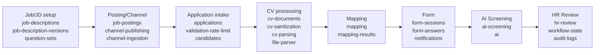

# 03. Module Extension Plan

## 1. Mục tiêu tài liệu

Tài liệu này mô tả kế hoạch mở rộng module từ source Interview Assistant hiện tại thành Recruitment Core Backend Phase 1.

Tài liệu giúp các specification tiếp theo bám đúng module boundary khi viết domain model, API contract, migration plan, CV processing, mapping, form, AI screening và HR review.

Tài liệu này không tạo code, không tạo migration, không sửa source và không thay thế các specification nguồn.

## 2. Nguyên tắc mở rộng module

| STT | Nguyên tắc | Nội dung |
| --- | --- | --- |
| 1 | Extend source hiện tại | Mở rộng source NestJS Interview Assistant hiện tại, không viết lại toàn bộ backend. |
| 2 | Modular monolith | Phase 1 dùng `modular monolith`, các module nằm trong cùng NestJS app và giao tiếp qua service/domain boundary rõ ràng. |
| 3 | `Application` là trung tâm | Workflow tuyển dụng theo JD/posting/channel phải bám vào `Application`. |
| 4 | `Candidate` là shared profile | `Candidate` dùng làm hồ sơ ứng viên dùng chung, không chứa toàn bộ trạng thái workflow tuyển dụng. |
| 5 | `Mapping CV-JD` là internal module | Mapping chạy trong NestJS Core, không mô tả như external service. |
| 6 | CV lifecycle tách riêng | CV gốc và CV sạch phải được quản lý bởi `cv-documents` và `cv-sanitization`. |
| 7 | Form session riêng | Pre-screening form dùng `form-sessions` riêng, không dùng lại `interview_sessions.accessToken`. |
| 8 | Interview modules giữ ổn định | Các module `sessions`, `evaluations`, `export`, `submissions` không bị sửa mạnh trong Phase 1. |
| 9 | Public endpoint có security riêng | Apply/form/webhook mới cần rate limit, idempotency, validation và security riêng. |
| 10 | Ưu tiên thêm module mới | Khi có khác biệt boundary, ưu tiên thêm module recruitment mới thay vì sửa sâu module hiện có. |

## 3. Existing modules to reuse

| Existing module | Path hiện tại | Reuse level | Cách reuse cho Phase 1 | Ghi chú |
| --- | --- | --- | --- | --- |
| `auth` | `apps/backend/src/auth` | Reuse / Extend | Reuse JWT, role guard, auth strategy, Google OAuth nếu cần. | Có thể bổ sung policy ở layer mới, tránh làm phức tạp auth flow hiện tại. |
| `users` | `apps/backend/src/auth/entities/user.entity.ts` | Reuse / Extend | Dùng user nội bộ làm HR/Admin/actor trong audit. | Repo hiện không có thư mục `users` riêng; user entity nằm trong `auth`. |
| `candidates` | `apps/backend/src/candidates` | Reuse / Extend nhẹ | Reuse candidate profile, assignee/ownership scope và dedupe profile. | Không biến `Candidate` thành workflow center; `Application` link sang candidate. |
| `questions` | `apps/backend/src/questions` | Reuse / Extend | Reuse question bank cho pre-screening. | Có thể cần metadata/usage type cho `question-sets`. |
| `categories` | `apps/backend/src/categories` | Reuse / Extend | Reuse taxonomy/categorization cho question bank và skill grouping. | Giữ vai trò master data. |
| `positions` | `apps/backend/src/positions` | Reuse / Extend | Reuse catalog vị trí cho JD, posting, question set và mapping context. | `positions` không thay thế `job-descriptions`. |
| `levels` | `apps/backend/src/levels` | Reuse / Extend | Reuse level catalog cho JD, question set, candidate level và mapping context. | Giữ là master data. |
| `ai` | `apps/backend/src/ai` | Reuse / Extend | Reuse AI service, prompt key và model override infra. | Thêm prompt/schema mới cho mapping/screening, không hardcode prompt trong module mới. |
| `uploads` | `apps/backend/src/uploads` | Reuse hạn chế / Refactor-aware | Có thể tham khảo upload handling, nhưng public CV intake phải đi qua CV document/quarantine/safe layer. | Không dùng trực tiếp storage hiện tại làm nguồn CV nghiệp vụ. |
| `file-parser` | `apps/backend/src/file-parser` | Reuse / Wrap | Reuse parser PDF/DOCX/XLSX cho CV sạch. | Không parse trực tiếp CV gốc ở quarantine. |
| `notification` | `apps/backend/src/notification` | Reuse pattern / Extend | Reuse một phần sending pattern. | Cần mở rộng email/template/delivery log; hiện chủ yếu phục vụ Telegram interview reminder. |
| `websocket` | `apps/backend/src/websocket` | Pattern only | Tham khảo progress/event pattern nếu Phase 1 cần realtime. | Không reuse room `session:{sessionId}` cho application khi chưa có thiết kế riêng. |

## 4. New modules for Recruitment Phase 1

| New module | Mục đích | Bắt buộc Phase 1? | Ghi chú |
| --- | --- | --- | --- |
| `applications` | Entity/workflow trung tâm cho hồ sơ ứng tuyển. | Có | Link candidate, JD/posting, source channel, workflow state và current CV. |
| `job-descriptions` | Quản lý JD gốc. | Có | Không thay thế bằng `positions`. |
| `job-description-versions` | Snapshot/version JD cho posting/application/mapping. | Có | Giúp mapping và audit ổn định theo version. |
| `job-postings` | Quản lý tin tuyển dụng public và trạng thái. | Có | Dùng cho VCS Portal và channel publishing. |
| `channel-publishing` | Publish posting sang portal/kênh ngoài hoặc đánh dấu manual. | Có | Tích hợp thật phụ thuộc API từng kênh. |
| `channel-ingestion` | Nhận apply/CV từ kênh ngoài. | Có | Có thể qua API, webhook, export hoặc email parsing. |
| `bot-conversations` | Lưu hội thoại ứng viên theo kênh. | Có nếu triển khai bot/channel care | Không thay thế application workflow. |
| `bot-knowledge` | Quản lý knowledge từ JD/posting/FAQ cho bot. | Có nếu triển khai bot/channel care | Có thể triển khai sau core intake. |
| `validation-rate-limit` | Validate hồ sơ, duplicate và public rate limit. | Có | Có thể dùng Redis nếu cần lock/cache. |
| `cv-documents` | Quản lý original/clean CV, version, hash, metadata, storage path. | Có | Là boundary chính cho CV lifecycle. |
| `cv-sanitization` | Scan mã độc, sanitize và tạo CV sạch. | Có | CV sạch là input cho các bước sau. |
| `cv-parsing` | Wrapper parse CV sạch quanh `file-parser`. | Có nếu cần tách orchestration | Assumption: nên tách để giữ `file-parser` là utility thuần. |
| `mapping` | Chạy mapping CV-JD theo `application_id`. | Có | Internal NestJS module. |
| `mapping-results` | Lưu score/evidence/recommendation/gaps. | Có | Không dùng `evaluations` cho kết quả này. |
| `question-sets` | Cấu hình bộ câu hỏi theo JD/vị trí/level. | Có | Dựa trên `questions`, `categories`, `positions`, `levels`. |
| `form-sessions` | Tạo token/link public có expiry theo application. | Có | Không dùng `interview_sessions.accessToken`. |
| `form-answers` | Lưu câu trả lời pre-screening. | Có | Link về `form-sessions` và `applications`. |
| `ai-screening` | Đánh giá tổng hợp JD + CV sạch + mapping + form answer. | Có | Reuse `ai` infra. |
| `hr-review` | HR duyệt/loại/yêu cầu bổ sung/talent pool. | Có | Điểm dừng của Phase 1. |
| `workflow-state` | Quản lý trạng thái application và transition history. | Có | Không nhồi state vào `Candidate`. |
| `audit-logs` | Ghi audit nghiệp vụ/kỹ thuật. | Có | Module phụ trợ, không phụ thuộc ngược domain module. |
| `notifications` extension | Gửi form/reminder/thông báo HR/candidate. | Có | Có thể extend `notification` hiện tại hoặc tạo abstraction mới quanh provider/template. |
| `amis-integration` | Đồng bộ AMIS. | Không trong core Phase 1 | Later / extension point nếu luồng dừng tại `HR Review`. |

## 5. Module responsibility

| Module | Responsibility | Input chính | Output chính | Ghi chú boundary |
| --- | --- | --- | --- | --- |
| `applications` | Quản lý hồ sơ ứng tuyển theo candidate + JD/job posting/source channel; entity trung tâm. | Candidate/profile data, JD/posting, source channel, CV reference. | `Application`, current status, links tới CV/mapping/form/screening/review. | Không đẩy workflow state vào `Candidate`. |
| `job-descriptions` | Quản lý JD gốc. | JD content, position, level, requirement. | JD record. | Không dùng `positions` làm JD. |
| `job-description-versions` | Snapshot/version JD dùng cho posting/application/mapping. | JD hiện hành, người tạo/chỉnh sửa. | JD version immutable hoặc versioned snapshot. | Mapping nên bám version để audit. |
| `job-postings` | Quản lý tin tuyển dụng public, trạng thái draft/published/closed. | JD version, channel config, publish metadata. | Job posting và trạng thái publish. | Không để portal/kênh ngoài sở hữu posting chính. |
| `channel-publishing` | Publish posting sang VCS Portal/Facebook/LinkedIn/TopCV/VietnamWorks hoặc mark manual. | Job posting, channel config. | Publish result, external ref, `MANUAL_REQUIRED` nếu cần. | Adapter biên, không chứa business workflow chính. |
| `channel-ingestion` | Nhận apply/CV từ kênh ngoài qua API/webhook/export/email parsing nếu có. | Channel payload, webhook, export file, email payload. | Normalized candidate/application/CV intake request. | Mọi hồ sơ phải chuẩn hóa về `Application`. |
| `bot-conversations` | Lưu hội thoại ứng viên theo kênh. | Message event, candidate/channel identity. | Conversation history, handoff flag. | Không thay thế audit/workflow state. |
| `bot-knowledge` | Quản lý tri thức bot từ JD/posting/FAQ/quy trình. | JD, posting, FAQ, config. | Knowledge entries cho bot trả lời. | Không tự quyết định tuyển dụng. |
| `validation-rate-limit` | Validate hồ sơ, check trùng email/SĐT theo JD, rate limit upload lại. | Apply payload, candidate identifiers, JD/posting, request metadata. | Validation result, duplicate flag, rate-limit decision. | Không lưu workflow chính thay `applications`. |
| `cv-documents` | Quản lý CV original/clean, version, hash, metadata, storage path. | Uploaded file, application, candidate. | CV document/version metadata. | Không parse hoặc scan trực tiếp trong module này nếu đã tách service riêng. |
| `cv-sanitization` | Scan mã độc, extract nội dung an toàn, tạo CV sạch. | Quarantine CV document, storage path. | Safe CV document, scan/sanitize status. | CV gốc không dùng trực tiếp cho parse/mapping/AI/HR Review. |
| `cv-parsing` | Parse CV sạch, normalize result, gọi hoặc wrap `file-parser`. | Safe CV document. | Parsed profile/structured CV data. | Wrapper domain-specific quanh `file-parser`. |
| `mapping` | Chạy mapping CV-JD theo `application_id`. | Application, JD version, safe CV, parsed profile. | Mapping command/result handoff. | Internal module, không external service. |
| `mapping-results` | Lưu score, strengths, gaps, recommendation, evidence. | Mapping output, application, JD version. | Persisted mapping result. | Không dùng `evaluations` cho mapping result. |
| `question-sets` | Cấu hình bộ câu hỏi theo JD/vị trí/level. | JD version, position, level, question bank. | Question set/form schema. | Reuse `questions/categories`, không sửa semantics interview question. |
| `form-sessions` | Tạo token/link public có expiry theo application. | Application, question set, expiry policy. | Form session, public token/link, status. | Không dùng `interview_sessions.accessToken`. |
| `form-answers` | Lưu câu trả lời pre-screening. | Form session, candidate answers. | Normalized form answers. | Không ghi vào `session_survey_questions`. |
| `ai-screening` | Đánh giá tổng hợp JD + CV sạch + mapping + form answer. | JD version, parsed profile, mapping result, form answers, AI prompt config. | AI screening result, recommendation, risk/gap summary. | Reuse `ai` infra; cần output schema rõ ở spec sau. |
| `hr-review` | HR duyệt/loại/yêu cầu bổ sung/talent pool. | Application, CV, mapping, form answers, AI result. | HR decision, note, next status. | Phase 1 dừng tại đây. |
| `workflow-state` | Quản lý trạng thái application và transitions. | Domain events/commands từ các module. | Current state, state history, transition result. | Không chứa business logic quá sâu của từng module. |
| `audit-logs` | Ghi audit nghiệp vụ/kỹ thuật. | Actor, action, resource, before/after summary, metadata. | Audit entry. | Không phụ thuộc ngược domain modules. |
| `notifications` | Gửi form/reminder/thông báo HR/candidate. | Notification request, template, recipient, channel. | Delivery status/log. | Nên tách abstraction provider thay vì nhồi vào Telegram reminder scheduler. |

## 6. Folder proposal

Repo hiện tại đặt module trực tiếp dưới `apps/backend/src/<module>` và không có `apps/backend/src/modules`. Vì vậy folder proposal ưu tiên convention hiện tại.

| Module | Folder proposal | Theo convention nào | Ghi chú |
| --- | --- | --- | --- |
| `applications` | `apps/backend/src/applications` | `apps/backend/src/<module>` | Module trung tâm workflow. |
| `job-descriptions` | `apps/backend/src/job-descriptions` | `apps/backend/src/<module>` | Quản lý JD gốc. |
| `job-description-versions` | `apps/backend/src/job-description-versions` | `apps/backend/src/<module>` | Có thể cân nhắc subfolder trong `job-descriptions` ở spec chi tiết, nhưng proposal mặc định là module riêng. |
| `job-postings` | `apps/backend/src/job-postings` | `apps/backend/src/<module>` | Tin tuyển dụng public. |
| `channel-publishing` | `apps/backend/src/channel-publishing` | `apps/backend/src/<module>` | Adapter publish. |
| `channel-ingestion` | `apps/backend/src/channel-ingestion` | `apps/backend/src/<module>` | Adapter ingest. |
| `bot-conversations` | `apps/backend/src/bot-conversations` | `apps/backend/src/<module>` | Candidate care conversation. |
| `bot-knowledge` | `apps/backend/src/bot-knowledge` | `apps/backend/src/<module>` | Bot knowledge/FAQ. |
| `validation-rate-limit` | `apps/backend/src/validation-rate-limit` | `apps/backend/src/<module>` | Validation + rate limit policy. |
| `cv-documents` | `apps/backend/src/cv-documents` | `apps/backend/src/<module>` | CV metadata/version. |
| `cv-sanitization` | `apps/backend/src/cv-sanitization` | `apps/backend/src/<module>` | Scan/sanitize. |
| `cv-parsing` | `apps/backend/src/cv-parsing` | `apps/backend/src/<module>` | Wrapper quanh `file-parser`. |
| `mapping` | `apps/backend/src/mapping` | `apps/backend/src/<module>` | Orchestrate mapping. |
| `mapping-results` | `apps/backend/src/mapping-results` | `apps/backend/src/<module>` | Persist mapping output. |
| `question-sets` | `apps/backend/src/question-sets` | `apps/backend/src/<module>` | Form/question set config. |
| `form-sessions` | `apps/backend/src/form-sessions` | `apps/backend/src/<module>` | Public form session. |
| `form-answers` | `apps/backend/src/form-answers` | `apps/backend/src/<module>` | Candidate pre-screening answers. |
| `ai-screening` | `apps/backend/src/ai-screening` | `apps/backend/src/<module>` | AI screening domain result. |
| `hr-review` | `apps/backend/src/hr-review` | `apps/backend/src/<module>` | HR decision. |
| `workflow-state` | `apps/backend/src/workflow-state` | `apps/backend/src/<module>` | State transition/history. |
| `audit-logs` | `apps/backend/src/audit-logs` | `apps/backend/src/<module>` | Audit trail. |
| `notifications` extension | `apps/backend/src/notification` hoặc `apps/backend/src/notifications` | Existing module + possible abstraction | Source hiện tại là `notification`; chỉ dùng `notifications` nếu spec sau quyết định tách abstraction rõ. |
| `amis-integration` | `apps/backend/src/amis-integration` | Later extension | Không thuộc trọng tâm nếu Phase 1 dừng tại `HR Review`. |

Ghi chú triển khai: `apps/backend/src/modules/...` chỉ nên dùng nếu repository đổi convention trong một refactor riêng; baseline hiện tại không ép dùng `src/modules`.

## 7. Dependency matrix

Dependency direction chuẩn:

```text
Controller -> Service -> Domain Module -> Repository/DB/Storage/External Adapter
```

| Module | Depends on | Called by | Không được phụ thuộc vào |
| --- | --- | --- | --- |
| `applications` | `candidates`, `job-postings`, `job-description-versions`, `workflow-state`, `audit-logs` | `channel-ingestion`, `Candidate Apply UI`, HR workflow modules | Không phụ thuộc `sessions/evaluations/export/submissions` ở giai đoạn đầu; không để `Candidate` điều phối ngược workflow. |
| `job-descriptions` | `positions`, `levels`, `auth/users`, `audit-logs` | HR Workspace, `job-description-versions` | Không phụ thuộc channel adapters hoặc application runtime. |
| `job-description-versions` | `job-descriptions`, `positions`, `levels`, `audit-logs` | `job-postings`, `applications`, `mapping` | Không mutate theo mapping result. |
| `job-postings` | `job-descriptions`, `job-description-versions` | `channel-publishing`, HR Workspace, apply flow | Không sở hữu CV/application workflow. |
| `channel-publishing` | `job-postings`, `audit-logs`, external channel APIs | HR Workspace, scheduled/internal job | Không phụ thuộc `mapping`, `form-sessions`, `hr-review`. |
| `channel-ingestion` | `applications`, `candidates`, `cv-documents`, `audit-logs` | External channels, webhooks, manual import | Không ghi trực tiếp vào `Candidate` như workflow center; không bypass `applications`. |
| `bot-conversations` | `bot-knowledge`, channel identity, `audit-logs` | Channel adapter/bot UI | Không quyết định trạng thái tuyển dụng. |
| `bot-knowledge` | `job-descriptions`, `job-postings`, FAQ/config | Bot conversations, config UI | Không phụ thuộc `applications` như source of truth workflow. |
| `validation-rate-limit` | `applications`, `candidates`, `job-postings`, optional `Redis`, `audit-logs` | Apply flow, upload flow, webhook flow | Không lưu state chính thay `workflow-state`. |
| `cv-documents` | `applications`, storage, `audit-logs` | Apply/upload flow, `cv-sanitization`, `hr-review` | Không parse CV gốc trực tiếp; không phụ thuộc `mapping-results`. |
| `cv-sanitization` | `cv-documents`, storage, `workflow-state`, `audit-logs` | Apply/CV processing worker | Không gọi `mapping` khi CV chưa sạch. |
| `cv-parsing` | `cv-documents`, `file-parser`, `candidates`, `applications` | CV processing workflow, `mapping` | Không đọc quarantine CV trực tiếp; không phụ thuộc external parser service. |
| `mapping` | `applications`, `job-description-versions`, `cv-documents`, `cv-parsing`, `mapping-results`, `workflow-state` | Screening workflow | Không phụ thuộc external mapping service; không phụ thuộc `evaluations`. |
| `mapping-results` | `applications`, `job-description-versions`, `audit-logs` | `mapping`, `ai-screening`, `hr-review` | Không gọi ngược `mapping` để chạy workflow. |
| `question-sets` | `questions`, `categories`, `positions`, `levels`, `job-description-versions` | HR Workspace, `form-sessions` | Không phụ thuộc interview `session_questions`. |
| `form-sessions` | `applications`, `question-sets`, `notifications`, `workflow-state` | Mapping success workflow, Candidate Form UI | Không dùng `interview_sessions.accessToken`; không phụ thuộc `sessions`. |
| `form-answers` | `form-sessions`, `applications`, `audit-logs` | Candidate Form UI, `ai-screening`, `hr-review` | Không ghi answer vào `session_survey_questions`. |
| `ai-screening` | `applications`, `mapping-results`, `form-answers`, `ai`, `workflow-state`, `audit-logs` | Screening workflow, HR Workspace | Không sở hữu `Application`; không thay thế HR decision. |
| `hr-review` | `applications`, `mapping-results`, `form-answers`, `ai-screening`, `cv-documents`, `workflow-state`, `audit-logs` | HR Workspace | Không tự động tạo interview session trong Phase 1 nếu chưa có spec sau. |
| `notifications` | `applications`, `form-sessions`, SMTP/email provider, optional templates | `form-sessions`, `hr-review`, reminders | Không phụ thuộc ngược domain modules để điều phối workflow. |
| `workflow-state` | State definition, transition policy, `audit-logs` | Nhiều domain modules | Không chứa business logic quá sâu của từng module. |
| `audit-logs` | Actor/context provider, DB/log sink | Nhiều domain modules | Không phụ thuộc ngược vào domain modules. |

Không để:

| Không được để | Lý do |
| --- | --- |
| `Candidate` gọi ngược `Application` theo cách làm `Candidate` thành flow center | Trái nguyên tắc Phase 1. |
| `Mapping` phụ thuộc external mapping service | `Mapping CV-JD` đã chốt là internal module. |
| `Form Session` dùng `interview_sessions.accessToken` | Token hiện tại thuộc public interview flow. |
| `Audit Logs` phụ thuộc ngược vào domain module | Dễ tạo dependency cycle và làm audit mất vai trò phụ trợ. |
| Module Phase 1 phụ thuộc trực tiếp `sessions/evaluations/export/submissions` ở giai đoạn đầu | Dễ phá interview flow đang hoạt động. |

## 8. Implementation priority

| Priority | Module / Nhóm module | Lý do làm ở giai đoạn này | Output mong muốn |
| --- | --- | --- | --- |
| P0 - Foundation / Safety | Chuẩn hóa migration approach, lưu ý tắt `synchronize=true` cho production spec sau; `audit-logs`, `workflow-state`, `applications`, `job-descriptions`, `job-description-versions`, `job-postings` | Cần nền dữ liệu và workflow trước khi nhận CV thật. | Module boundary, entity/API spec sau có trục `Application`, JD version và audit/state rõ. |
| P1 - Apply & CV intake | `validation-rate-limit`, `cv-documents`, `cv-sanitization`, `cv-parsing`, extension `candidates` | Public apply và CV là luồng rủi ro cao nhất về security/dedupe/file safety. | Apply intake an toàn, original CV quarantine, safe CV, parsed profile từ CV sạch. |
| P2 - Screening automation | `mapping`, `mapping-results`, `question-sets`, `form-sessions`, `form-answers`, `notifications` | Sau khi có CV sạch và application, cần tự động hóa mapping và form. | Mapping result, form link riêng, câu trả lời pre-screening và notification flow. |
| P3 - AI & HR Review | `ai-screening`, `hr-review`, AI prompt/model extension | Hoàn thiện điểm dừng Phase 1 tại HR Review. | AI Screening result và HR decision flow. |
| P4 - Channel/Bot integration | `channel-publishing`, `channel-ingestion`, `bot-conversations`, `bot-knowledge`, channel adapter/bot config | Tích hợp thật nên làm sau khi core apply/CV/mapping/form ổn định. | Publish/ingest theo từng channel, bot care theo JD/FAQ, fallback `MANUAL_REQUIRED` khi chưa có API. |

Ghi chú triển khai: AMIS nếu có thì là later / extension point sau `HR Review`, không nằm trong priority core Phase 1.

## 9. Avoid breaking current source

| Existing module | Không nên sửa mạnh phần nào | Lý do | Cách tiếp cận an toàn |
| --- | --- | --- | --- |
| `sessions` | Interview session lifecycle, public token behavior, candidate access APIs. | Đang phục vụ interview flow hiện tại. | Chỉ link từ `Application` ở phase sau nếu có spec rõ; không dùng token session cho form. |
| `session_questions` | Semantics active/inactive, answer, note, rating, submissions. | Gắn với interview session và realtime interview. | Tạo `question-sets`/`form-answers` riêng cho pre-screening. |
| `evaluations` | BM04 evaluation, AI summary/suggestion, evaluation result. | Khác bản chất với AI Screening trước HR Review. | Tạo `ai-screening` và `hr-review` riêng; chỉ reuse sau interview phase nếu cần. |
| `export` | Excel BM04 export. | Phục vụ evaluation/export hiện tại. | Không mở rộng export cho recruitment Phase 1 nếu chưa có spec export riêng. |
| `submissions` | Code runner/sandbox và code submission flow. | Thuộc interview/coding round, ngoài scope Phase 1. | Không phụ thuộc trực tiếp trong recruitment intake. |
| `websocket` | Room `session:{sessionId}`, candidate/interviewer socket behavior. | Thiết kế theo interview session. | Nếu cần progress event cho application, tạo namespace/room riêng ở spec sau. |
| `notification` | Telegram interview reminder scheduler và state memory. | Chưa phải recruitment notification platform. | Tạo abstraction/provider/template/delivery log hoặc extension có boundary rõ. |
| `uploads` | Shared upload storage/download hiện tại. | Chưa có quarantine/safe split và file ownership theo application. | Public CV đi qua `cv-documents` + `cv-sanitization`; chỉ reuse helper/pattern nếu an toàn. |
| `candidates` | Candidate profile, ownership, upload/enrich hiện tại. | Candidate đang là profile, không phải application workflow. | Extend nhẹ để link/dedupe; không nhồi trạng thái Phase 1 vào Candidate. |
| `ai` | Prompt/model infra và provider call. | Dùng chung cho nhiều flow. | Thêm prompt key/schema mới; không hardcode prompt trong `mapping` hoặc `ai-screening`. |

## 10. Module grouping theo phase implement



| Flow group | Module liên quan | Ghi chú |
| --- | --- | --- |
| Job/JD setup | `job-descriptions`, `job-description-versions`, `question-sets`, `positions`, `levels`, `questions`, `categories` | Chuẩn bị JD/version và câu hỏi trước khi public. |
| Posting/Channel | `job-postings`, `channel-publishing`, `channel-ingestion`, `bot-knowledge`, `bot-conversations` | Tích hợp thật có thể làm sau core intake. |
| Application intake | `applications`, `validation-rate-limit`, `candidates`, `audit-logs`, `workflow-state` | `Application` là trục workflow. |
| CV processing | `cv-documents`, `cv-sanitization`, `cv-parsing`, `file-parser` | CV gốc quarantine, CV sạch mới được parse. |
| Mapping | `mapping`, `mapping-results`, `job-description-versions`, `cv-parsing` | Internal module trong NestJS. |
| Form | `question-sets`, `form-sessions`, `form-answers`, `notifications` | Token/link riêng theo `form_session`. |
| AI Screening | `ai-screening`, `ai`, `mapping-results`, `form-answers` | AI hỗ trợ sàng lọc, không thay HR. |
| HR Review | `hr-review`, `workflow-state`, `audit-logs`, `applications` | Điểm dừng của Phase 1. |

## 11. Conflict / Assumption

| Vấn đề | File liên quan | Cách xử lý |
| --- | --- | --- |
| Folder convention: `apps/backend/src/modules/...` hay `apps/backend/src/<module>` | `00_source_baseline_analysis.md`, source tree hiện tại | Source hiện tại dùng `apps/backend/src/<module>` và không có `src/modules`; folder proposal theo convention hiện tại. |
| AMIS thuộc Phase 1 hay later | `vcs_recruitment_phase1_architecture_specification.md`, `vcs_recruitment_phase1_business_flow.md`, `02_target_architecture_phase1.md` | Phase 1 dừng tại `HR Review`; `amis-integration` chỉ là later / extension point. |
| Channel modules triển khai ngay hay chỉ spec trước | `vcs_recruitment_phase1_architecture_specification.md`, `02_target_architecture_phase1.md` | Assumption: cần module boundary trong Phase 1, còn tích hợp API thật có thể làm theo priority P4 hoặc mark `MANUAL_REQUIRED`. |
| Notification extend module hiện tại hay tạo abstraction mới | `00_source_baseline_analysis.md`, `02_target_architecture_phase1.md` | Source hiện có `notification` cho reminder; plan ghi `notifications` extension/abstraction để tránh nhồi recruitment email vào scheduler hiện tại. |
| `cv-parsing` là module riêng hay wrapper reuse `file-parser` | `00_source_baseline_analysis.md`, `02_target_architecture_phase1.md` | Assumption: nên có `cv-parsing` làm wrapper domain-specific để đảm bảo chỉ parse CV sạch và không làm `file-parser` ôm workflow. |
| `Candidate` và `Application` boundary | `vcs_recruitment_phase1_architecture_specification.md`, `00_source_baseline_analysis.md`, `01_phase1_context_summary.md` | `Application` là workflow center; `Candidate` là shared profile. |
| Mapping internal hay external | `vcs_recruitment_phase1_architecture_specification.md`, `02_target_architecture_phase1.md` | `Mapping CV-JD` là internal NestJS module, không external service. |
| Có dùng `n8n` không | `vcs_recruitment_phase1_architecture_specification.md`, `02_target_architecture_phase1.md` | Không dùng `n8n` trong Phase 1. |

## 12. Kết luận

Module extension plan cho Phase 1 nên ưu tiên thêm các module recruitment intake mới quanh `Application`, đồng thời reuse có chọn lọc các capability hiện có như `auth`, `candidates`, `file-parser`, AI prompt infrastructure và question bank. Các module interview hiện tại cần được giữ ổn định để tránh phá flow đang hoạt động.

Trục implement nên đi từ foundation và safety, sang apply/CV intake, mapping/form, AI Screening/HR Review, rồi mới đến channel/bot integration. AMIS là extension point sau `HR Review`, không phải trọng tâm của module plan Phase 1.
