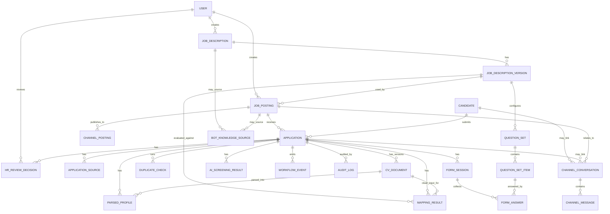
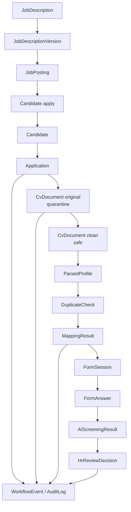

# 04. Domain Model and Relationships

## 1. Mục tiêu tài liệu

Tài liệu này mô tả domain model và quan hệ entity cho Recruitment Phase 1.

Tài liệu làm nền cho migration plan, API contract và implementation sau này. Nội dung ở đây là specification/planning, không tạo migration, không tạo code và không sửa source hiện tại.

## 2. Domain overview

Nguyên tắc domain Phase 1:

| Nguyên tắc | Nội dung |
| --- | --- |
| `Application` là trung tâm | Mỗi hồ sơ ứng tuyển theo JD/posting/source channel được quản lý qua `Application`. |
| `Candidate` là shared profile | `Candidate` lưu hồ sơ ứng viên dùng chung, không phải trung tâm workflow. |
| Một candidate có nhiều application | Một `Candidate` có thể ứng tuyển nhiều `JobPosting` khác nhau. |
| Một posting có nhiều application | Một `JobPosting` có thể nhận nhiều `Application`. |
| Application gom toàn bộ kết quả xử lý | `Application` gắn với candidate, JD/JD version, source channel, CV, mapping, form, AI Screening và HR Review. |
| CV có version | Khi ứng viên upload lại CV, tạo version mới, không ghi mất dữ liệu cũ. |
| `CvDocument` quản lý CV | `CvDocument` quản lý cả CV gốc và CV sạch ở mức domain, dù migration sau chọn một record hay hai record. |
| Kết quả xử lý gắn theo application | `MappingResult`, `FormAnswer`, `AiScreeningResult`, `HrReviewDecision` phải gắn theo `application_id`. |
| Channel chỉ là nguồn | Channel chỉ phát sinh lead/application và external ID; không sở hữu dữ liệu tuyển dụng chính. |
| Core là owner dữ liệu | Recruitment Core là source of truth cho Phase 1. |

Text tree domain bắt buộc:

```text
Candidate
  └── Application
        ├── JobDescription / JobDescriptionVersion
        ├── JobPosting
        ├── Source Channel
        ├── CvDocument versions
        │     ├── Original CV - quarantine
        │     └── Clean CV - safe
        ├── MappingResult
        ├── FormSession
        ├── FormAnswer
        ├── AiScreeningResult
        ├── HrReviewDecision
        ├── WorkflowEvent
        └── AuditLog
```

## 3. Entity list

| Entity | Vai trò | Tạo mới hay reuse | Ghi chú |
| --- | --- | --- | --- |
| `User` | Actor HR/Admin/reviewer. | Reuse | Hiện là `UserEntity` trong `auth`. |
| `JobDescription` | JD gốc do HR tạo/chỉnh. | Tạo mới | Không thay thế bằng `Position`. |
| `JobDescriptionVersion` | Snapshot/version JD dùng cho posting/application/mapping. | Tạo mới | Giữ mapping/audit ổn định theo version. |
| `JobPosting` | Tin tuyển dụng public. | Tạo mới | Có thể public trên VCS Portal và các kênh khác. |
| `ChannelPosting` | Trạng thái publish theo từng kênh. | Tạo mới | Lưu external posting ID, URL, payload và lỗi. |
| `Candidate` | Hồ sơ ứng viên dùng chung. | Reuse / Extend nhẹ | Có thể cần relation đến `Application`, nhưng không là workflow center. |
| `Application` | Hồ sơ ứng tuyển trung tâm. | Tạo mới | Link candidate, JD version, posting, source, CV và các result. |
| `ApplicationSource` | Nguồn phát sinh application. | Tạo mới | Lưu channel, external ID và raw payload. |
| `CvDocument` | Quản lý CV gốc/CV sạch, version, hash, storage metadata. | Tạo mới | Tách rõ original/quarantine và clean/safe. |
| `ParsedProfile` | Kết quả parse CV sạch. | Tạo mới | Có thể là entity riêng hoặc JSONB ở spec migration sau; domain nên tách rõ. |
| `DuplicateCheck` | Kết quả check trùng application/file/profile. | Tạo mới | Hỗ trợ decision point duplicate. |
| `MappingResult` | Kết quả mapping CV-JD. | Tạo mới | Mapping là internal module trong NestJS Core. |
| `QuestionSet` | Bộ câu hỏi pre-screening theo JD/vị trí/level. | Tạo mới | Reuse `QuestionEntity` qua item. |
| `QuestionSetItem` | Item trong bộ câu hỏi. | Tạo mới | Snapshot text/type để giữ lịch sử. |
| `FormSession` | Phiên public form cho candidate. | Tạo mới | Có token riêng, không dùng `interview_sessions.accessToken`. |
| `FormAnswer` | Câu trả lời pre-screening. | Tạo mới | Gắn `formSessionId` và `applicationId`. |
| `AiScreeningResult` | Kết quả AI Screening. | Tạo mới | Reuse AI prompt/model infra hiện có. |
| `HrReviewDecision` | Quyết định của HR. | Tạo mới | Điểm dừng của Phase 1. |
| `WorkflowEvent` | Lịch sử chuyển trạng thái application. | Tạo mới | Theo dõi workflow chính. |
| `AuditLog` | Audit nghiệp vụ/kỹ thuật. | Tạo mới | Ghi actor/action/object/metadata. |
| `ChannelConversation` | Hội thoại candidate theo kênh. | Tạo mới | Có thể link candidate/application/posting. |
| `ChannelMessage` | Tin nhắn trong hội thoại channel. | Tạo mới | Lưu direction, sender, content, raw payload. |
| `BotKnowledgeSource` | Nguồn tri thức bot từ JD/posting/FAQ. | Tạo mới | Hỗ trợ candidate care theo kênh. |

Các catalog/taxonomy hiện có như `questions`, `positions`, `levels`, `categories` có thể reuse/extend. Các phần `sessions`, `evaluations`, `submissions`, `export` không phải domain trung tâm của Phase 1 intake và cần giữ ổn định cho interview flow.

## 4. Relationship diagram



Relationship notes:

| Relationship | Ghi chú |
| --- | --- |
| `ChannelConversation` -> `Candidate` / `Application` | Có thể nullable ở giai đoạn đầu khi chưa match được candidate/application. |
| `BotKnowledgeSource` -> `JobDescription` / `JobPosting` | Có thể link một trong hai hoặc cả hai tùy nguồn tri thức. |
| `CvDocument` -> `MappingResult` | Mapping phải dùng clean CV, không dùng original CV ở quarantine. |
| `QuestionSetItem` -> `QuestionEntity` | Quan hệ này không vẽ trong ERD để giữ diagram gọn; field proposal vẫn có `questionId`. |

## 5. Entity field proposal

### 5.1. `JobDescription`

| Field | Type đề xuất | Bắt buộc? | Mô tả |
| --- | --- | --- | --- |
| `id` | `uuid` | Có | Khóa chính. |
| `title` | `varchar` | Có | Tên JD. |
| `positionId` | `uuid` | Có | Link `PositionEntity`. |
| `levelId` | `uuid` | Có | Link `LevelEntity`. |
| `description` | `text` | Có | Mô tả công việc. |
| `requirements` | `jsonb` hoặc `text` | Có | Yêu cầu/skill/kinh nghiệm. |
| `benefits` | `jsonb` hoặc `text` | Không | Phúc lợi. |
| `status` | `enum` | Có | Draft/active/archived tùy spec sau. |
| `createdById` | `uuid` | Có | User tạo JD. |
| `createdAt` | `timestamp` | Có | Thời điểm tạo. |
| `updatedAt` | `timestamp` | Có | Thời điểm cập nhật. |

### 5.2. `JobDescriptionVersion`

| Field | Type đề xuất | Bắt buộc? | Mô tả |
| --- | --- | --- | --- |
| `id` | `uuid` | Có | Khóa chính. |
| `jobDescriptionId` | `uuid` | Có | JD gốc. |
| `versionNo` | `integer` | Có | Số version trong một JD. |
| `snapshot` | `jsonb` | Có | Snapshot nội dung JD/version. |
| `status` | `enum` | Có | Draft/active/superseded tùy spec sau. |
| `createdById` | `uuid` | Có | User tạo version. |
| `createdAt` | `timestamp` | Có | Thời điểm tạo version. |

### 5.3. `JobPosting`

| Field | Type đề xuất | Bắt buộc? | Mô tả |
| --- | --- | --- | --- |
| `id` | `uuid` | Có | Khóa chính. |
| `jobDescriptionId` | `uuid` | Có | JD gốc. |
| `jobDescriptionVersionId` | `uuid` | Có | Version public/mapping. |
| `title` | `varchar` | Có | Tiêu đề tin tuyển dụng. |
| `publicSlug` | `varchar` | Có | Slug public. |
| `status` | `JobPostingStatus` | Có | Trạng thái posting. |
| `openAt` | `timestamp` | Không | Thời điểm mở nhận hồ sơ. |
| `closeAt` | `timestamp` | Không | Thời điểm đóng nhận hồ sơ. |
| `createdById` | `uuid` | Có | User tạo posting. |
| `createdAt` | `timestamp` | Có | Thời điểm tạo. |
| `updatedAt` | `timestamp` | Có | Thời điểm cập nhật. |

### 5.4. `ChannelPosting`

| Field | Type đề xuất | Bắt buộc? | Mô tả |
| --- | --- | --- | --- |
| `id` | `uuid` | Có | Khóa chính. |
| `jobPostingId` | `uuid` | Có | Posting nội bộ. |
| `channel` | `enum` hoặc `varchar` | Có | `VCS_PORTAL`, `FACEBOOK`, `LINKEDIN`, `TOPCV`, `VIETNAMWORKS`. |
| `externalPostingId` | `varchar` | Không | ID từ kênh ngoài nếu có. |
| `status` | `JobPostingStatus` | Có | Trạng thái publish theo kênh. |
| `publishPayload` | `jsonb` | Không | Payload gửi sang channel. |
| `publishedUrl` | `varchar` | Không | URL public trên channel. |
| `lastSyncAt` | `timestamp` | Không | Lần sync gần nhất. |
| `errorMessage` | `text` | Không | Lỗi publish/sync. |
| `createdAt` | `timestamp` | Có | Thời điểm tạo. |
| `updatedAt` | `timestamp` | Có | Thời điểm cập nhật. |

### 5.5. `Candidate`

Reuse existing `CandidateEntity`. Field chính hiện tại:

| Field | Type đề xuất | Bắt buộc? | Mô tả |
| --- | --- | --- | --- |
| `id` | `uuid` | Có | Khóa chính. |
| `name` | `varchar` | Có | Tên ứng viên. |
| `slug` | `varchar` | Không | Unique nullable trong source hiện tại. |
| `email` | `varchar` | Không | Email, hiện chưa unique trong entity. |
| `phone` | `varchar` | Không | Số điện thoại. |
| `birthYear` | `number` | Không | Năm sinh. |
| `position` | `varchar` | Có | Position text hiện tại. |
| `level` | `CandidateLevel` | Có | Level hiện tại. |
| `resumeUrl` | `varchar` | Không | URL CV hiện tại; Phase 1 không dùng làm source chính cho CV workflow mới. |
| `profileXlsxUrl` | `varchar` | Không | File profile XLSX hiện tại. |
| `parsedProfile` | `jsonb` | Không | Parsed profile hiện tại. |
| `createdById` | `varchar` | Không | User tạo candidate. |
| `createdAt` | `timestamp` | Có | Thời điểm tạo. |
| `updatedAt` | `timestamp` | Có | Thời điểm cập nhật. |

Ghi chú triển khai: Phase 1 có thể thêm relation `applications`, nhưng không biến `Candidate` thành workflow center.

### 5.6. `Application`

| Field | Type đề xuất | Bắt buộc? | Mô tả |
| --- | --- | --- | --- |
| `id` | `uuid` | Có | Khóa chính. |
| `candidateId` | `uuid` | Có | Candidate ứng tuyển. |
| `jobPostingId` | `uuid` | Có | Tin tuyển dụng nhận application. |
| `jobDescriptionVersionId` | `uuid` | Có | JD version dùng cho application/mapping. |
| `source` | `varchar` | Có | Nguồn tổng quát, ví dụ `DIRECT`, `CHANNEL`. |
| `sourceChannel` | `varchar` | Có | Kênh cụ thể. |
| `externalApplicationId` | `varchar` | Không | ID ngoài nếu có. |
| `status` | `ApplicationStatus` | Có | Workflow status chính. |
| `currentCvDocumentId` | `uuid` | Không | CV version hiện hành. |
| `mappingStatus` | `varchar` | Không | Status phụ hoặc projection từ workflow. |
| `formStatus` | `varchar` | Không | Status form. |
| `aiScreeningStatus` | `varchar` | Không | Status AI Screening. |
| `hrReviewStatus` | `varchar` | Không | Status HR Review. |
| `createdAt` | `timestamp` | Có | Thời điểm tạo. |
| `updatedAt` | `timestamp` | Có | Thời điểm cập nhật. |

Ghi chú: `Application.status` là workflow status chính. Các status phụ có thể tách hoặc chỉ dùng `WorkflowEvent` tùy implementation sau.

### 5.7. `ApplicationSource`

| Field | Type đề xuất | Bắt buộc? | Mô tả |
| --- | --- | --- | --- |
| `id` | `uuid` | Có | Khóa chính. |
| `applicationId` | `uuid` | Có | Application liên quan. |
| `sourceType` | `varchar` | Có | `PORTAL`, `CHANNEL`, `MANUAL_IMPORT`, `WEBHOOK`, `EMAIL_PARSE`. |
| `channel` | `varchar` | Có | Kênh phát sinh. |
| `externalLeadId` | `varchar` | Không | Lead ID từ channel nếu có. |
| `externalApplicationId` | `varchar` | Không | Application ID từ channel nếu có. |
| `rawPayload` | `jsonb` | Không | Payload gốc từ channel. |
| `receivedAt` | `timestamp` | Có | Thời điểm nhận. |

### 5.8. `CvDocument`

| Field | Type đề xuất | Bắt buộc? | Mô tả |
| --- | --- | --- | --- |
| `id` | `uuid` | Có | Khóa chính. |
| `applicationId` | `uuid` | Có | Application sở hữu CV. |
| `candidateId` | `uuid` | Có | Candidate liên quan. |
| `documentType` | `enum` | Có | `ORIGINAL` hoặc `CLEAN`. |
| `versionNo` | `integer` | Có | Version CV trong application. |
| `originalFileName` | `varchar` | Có | Tên file upload. |
| `mimeType` | `varchar` | Có | MIME type. |
| `fileSize` | `integer` | Có | Kích thước file. |
| `originalFileHash` | `varchar` | Không | Hash file gốc. |
| `cleanFileHash` | `varchar` | Không | Hash file sạch. |
| `storageZone` | `varchar` | Có | `QUARANTINE` hoặc `SAFE`. |
| `storagePath` | `varchar` | Có | Path/key lưu file. |
| `scanStatus` | `CvScanStatus` | Có | Trạng thái scan. |
| `sanitizeStatus` | `varchar` | Có | Trạng thái sanitize. |
| `parseStatus` | `varchar` | Có | Trạng thái parse. |
| `isCurrent` | `boolean` | Có | Có phải CV hiện hành của application không. |
| `createdAt` | `timestamp` | Có | Thời điểm tạo. |

`documentType` có thể là `ORIGINAL` hoặc `CLEAN`. Migration plan sau có thể chọn cùng một record lưu cả original/clean path hoặc tách record, nhưng domain phải tách rõ original/quarantine và clean/safe.

### 5.9. `ParsedProfile`

| Field | Type đề xuất | Bắt buộc? | Mô tả |
| --- | --- | --- | --- |
| `id` | `uuid` | Có | Khóa chính. |
| `applicationId` | `uuid` | Có | Application liên quan. |
| `cvDocumentId` | `uuid` | Có | Clean CV được parse. |
| `candidateId` | `uuid` | Có | Candidate liên quan. |
| `parsedData` | `jsonb` | Có | Dữ liệu đã parse/normalize. |
| `normalizedTextHash` | `varchar` | Không | Hash text normalize để check trùng. |
| `parserVersion` | `varchar` | Không | Version parser/prompt. |
| `createdAt` | `timestamp` | Có | Thời điểm parse. |

### 5.10. `DuplicateCheck`

| Field | Type đề xuất | Bắt buộc? | Mô tả |
| --- | --- | --- | --- |
| `id` | `uuid` | Có | Khóa chính. |
| `applicationId` | `uuid` | Có | Application được check. |
| `checkType` | `enum` | Có | `APPLICATION_EMAIL_PHONE_JD`, `CV_FILE_HASH`, `PARSED_PROFILE`. |
| `status` | `varchar` | Có | Passed/duplicate/needs_review tùy spec sau. |
| `matchedEntityType` | `varchar` | Không | Entity bị match. |
| `matchedEntityId` | `uuid` | Không | ID entity bị match. |
| `score` | `number` | Không | Điểm trùng/độ giống. |
| `details` | `jsonb` | Không | Chi tiết rule/evidence. |
| `createdAt` | `timestamp` | Có | Thời điểm check. |

### 5.11. `MappingResult`

| Field | Type đề xuất | Bắt buộc? | Mô tả |
| --- | --- | --- | --- |
| `id` | `uuid` | Có | Khóa chính. |
| `applicationId` | `uuid` | Có | Application được mapping. |
| `jobDescriptionVersionId` | `uuid` | Có | JD version dùng để mapping. |
| `cleanCvDocumentId` | `uuid` | Có | Clean CV input. |
| `parsedProfileId` | `uuid` | Có | Parsed profile input. |
| `score` | `number` | Có | Điểm mapping. |
| `strengths` | `jsonb` | Không | Điểm mạnh. |
| `gaps` | `jsonb` | Không | Khoảng thiếu. |
| `recommendation` | `varchar` | Có | Kết luận/recommendation. |
| `status` | `varchar` | Có | Trạng thái mapping. |
| `modelVersion` | `varchar` | Không | Version rule/model/prompt. |
| `evidence` | `jsonb` | Không | Bằng chứng mapping. |
| `createdAt` | `timestamp` | Có | Thời điểm tạo result. |

### 5.12. `QuestionSet`

| Field | Type đề xuất | Bắt buộc? | Mô tả |
| --- | --- | --- | --- |
| `id` | `uuid` | Có | Khóa chính. |
| `jobDescriptionId` | `uuid` | Có | JD gốc. |
| `jobDescriptionVersionId` | `uuid` | Có | JD version. |
| `name` | `varchar` | Có | Tên bộ câu hỏi. |
| `positionId` | `uuid` | Không | Vị trí liên quan. |
| `levelId` | `uuid` | Không | Level liên quan. |
| `status` | `varchar` | Có | Draft/active/archived tùy spec sau. |
| `createdById` | `uuid` | Có | User tạo. |
| `createdAt` | `timestamp` | Có | Thời điểm tạo. |
| `updatedAt` | `timestamp` | Có | Thời điểm cập nhật. |

### 5.13. `QuestionSetItem`

| Field | Type đề xuất | Bắt buộc? | Mô tả |
| --- | --- | --- | --- |
| `id` | `uuid` | Có | Khóa chính. |
| `questionSetId` | `uuid` | Có | Bộ câu hỏi. |
| `questionId` | `uuid` | Không | Link `QuestionEntity` nếu reuse question bank. |
| `questionTextSnapshot` | `text` | Có | Snapshot câu hỏi tại thời điểm tạo set. |
| `questionType` | `varchar` | Có | Loại câu hỏi. |
| `orderIndex` | `integer` | Có | Thứ tự hiển thị. |
| `required` | `boolean` | Có | Có bắt buộc trả lời không. |
| `metadata` | `jsonb` | Không | Option/rule/validation bổ sung. |

### 5.14. `FormSession`

| Field | Type đề xuất | Bắt buộc? | Mô tả |
| --- | --- | --- | --- |
| `id` | `uuid` | Có | Khóa chính. |
| `applicationId` | `uuid` | Có | Application nhận form. |
| `questionSetId` | `uuid` | Có | Bộ câu hỏi được dùng. |
| `tokenHash` | `varchar` | Có | Hash của public token. |
| `status` | `FormSessionStatus` | Có | Trạng thái form session. |
| `expiresAt` | `timestamp` | Có | Hạn token/form. |
| `sentAt` | `timestamp` | Không | Thời điểm gửi. |
| `openedAt` | `timestamp` | Không | Thời điểm mở. |
| `submittedAt` | `timestamp` | Không | Thời điểm submit. |
| `createdAt` | `timestamp` | Có | Thời điểm tạo. |

Không lưu raw token plain text nếu sau này implement.

### 5.15. `FormAnswer`

| Field | Type đề xuất | Bắt buộc? | Mô tả |
| --- | --- | --- | --- |
| `id` | `uuid` | Có | Khóa chính. |
| `formSessionId` | `uuid` | Có | Form session. |
| `applicationId` | `uuid` | Có | Application liên quan. |
| `questionSetItemId` | `uuid` | Có | Câu hỏi được trả lời. |
| `answer` | `jsonb` hoặc `text` | Có | Câu trả lời. |
| `answeredAt` | `timestamp` | Có | Thời điểm trả lời. |

### 5.16. `AiScreeningResult`

| Field | Type đề xuất | Bắt buộc? | Mô tả |
| --- | --- | --- | --- |
| `id` | `uuid` | Có | Khóa chính. |
| `applicationId` | `uuid` | Có | Application được screening. |
| `mappingResultId` | `uuid` | Có | Mapping result input. |
| `formSessionId` | `uuid` | Không | Form session input. |
| `finalScore` | `number` | Không | Điểm tổng hợp. |
| `recommendation` | `varchar` | Có | Recommendation AI. |
| `summary` | `text` | Không | Tóm tắt. |
| `strengths` | `jsonb` | Không | Điểm mạnh. |
| `gaps` | `jsonb` | Không | Khoảng thiếu. |
| `risks` | `jsonb` | Không | Rủi ro/điểm cần HR lưu ý. |
| `status` | `varchar` | Có | Trạng thái AI Screening. |
| `model` | `varchar` | Không | Model được dùng. |
| `promptVersion` | `varchar` | Không | Prompt/version. |
| `rawResult` | `jsonb` | Không | Raw AI output để audit/debug. |
| `createdAt` | `timestamp` | Có | Thời điểm tạo. |

### 5.17. `HrReviewDecision`

| Field | Type đề xuất | Bắt buộc? | Mô tả |
| --- | --- | --- | --- |
| `id` | `uuid` | Có | Khóa chính. |
| `applicationId` | `uuid` | Có | Application được review. |
| `reviewerId` | `uuid` | Có | User HR/reviewer. |
| `decision` | `HrReviewDecisionType` | Có | `APPROVE`, `REJECT`, `REQUEST_MORE_INFO`, `TALENT_POOL`. |
| `comment` | `text` | Không | Ghi chú HR. |
| `reasonCodes` | `jsonb` | Không | Mã lý do. |
| `createdAt` | `timestamp` | Có | Thời điểm quyết định. |

### 5.18. `WorkflowEvent`

| Field | Type đề xuất | Bắt buộc? | Mô tả |
| --- | --- | --- | --- |
| `id` | `uuid` | Có | Khóa chính. |
| `applicationId` | `uuid` | Có | Application liên quan. |
| `fromStatus` | `ApplicationStatus` | Không | Trạng thái trước. |
| `toStatus` | `ApplicationStatus` | Có | Trạng thái sau. |
| `eventType` | `varchar` | Có | Loại event/transition. |
| `actorType` | `varchar` | Có | `USER`, `CANDIDATE`, `SYSTEM`, `CHANNEL`, `AI`. |
| `actorId` | `uuid` hoặc `varchar` | Không | Actor nếu có. |
| `metadata` | `jsonb` | Không | Context event. |
| `createdAt` | `timestamp` | Có | Thời điểm event. |

### 5.19. `AuditLog`

| Field | Type đề xuất | Bắt buộc? | Mô tả |
| --- | --- | --- | --- |
| `id` | `uuid` | Có | Khóa chính. |
| `actorType` | `varchar` | Có | Loại actor. |
| `actorId` | `uuid` hoặc `varchar` | Không | Actor ID. |
| `action` | `varchar` | Có | Hành động. |
| `objectType` | `varchar` | Có | Loại object. |
| `objectId` | `uuid` hoặc `varchar` | Không | Object ID. |
| `applicationId` | `uuid` | Không | Application liên quan nếu có. |
| `metadata` | `jsonb` | Không | Context audit. |
| `ipAddress` | `varchar` | Không | IP request. |
| `userAgent` | `varchar` | Không | User agent. |
| `createdAt` | `timestamp` | Có | Thời điểm audit. |

### 5.20. `ChannelConversation`

| Field | Type đề xuất | Bắt buộc? | Mô tả |
| --- | --- | --- | --- |
| `id` | `uuid` | Có | Khóa chính. |
| `channel` | `varchar` | Có | Kênh hội thoại. |
| `externalConversationId` | `varchar` | Có | ID hội thoại từ channel. |
| `candidateId` | `uuid` | Không | Candidate nếu đã match. |
| `applicationId` | `uuid` | Không | Application nếu đã match. |
| `jobPostingId` | `uuid` | Không | Posting liên quan nếu có. |
| `status` | `varchar` | Có | Open/closed/handoff tùy spec sau. |
| `lastMessageAt` | `timestamp` | Không | Tin nhắn cuối. |
| `createdAt` | `timestamp` | Có | Thời điểm tạo. |
| `updatedAt` | `timestamp` | Có | Thời điểm cập nhật. |

### 5.21. `ChannelMessage`

| Field | Type đề xuất | Bắt buộc? | Mô tả |
| --- | --- | --- | --- |
| `id` | `uuid` | Có | Khóa chính. |
| `conversationId` | `uuid` | Có | Channel conversation. |
| `direction` | `varchar` | Có | `INBOUND` hoặc `OUTBOUND`. |
| `senderType` | `varchar` | Có | Candidate/bot/HR/system/channel. |
| `messageType` | `varchar` | Có | Text/file/link/event tùy channel. |
| `content` | `text` | Không | Nội dung text. |
| `rawPayload` | `jsonb` | Không | Payload gốc. |
| `createdAt` | `timestamp` | Có | Thời điểm tin nhắn. |

### 5.22. `BotKnowledgeSource`

| Field | Type đề xuất | Bắt buộc? | Mô tả |
| --- | --- | --- | --- |
| `id` | `uuid` | Có | Khóa chính. |
| `sourceType` | `varchar` | Có | `JOB_DESCRIPTION`, `JOB_POSTING`, `FAQ`, `POLICY`. |
| `jobDescriptionId` | `uuid` | Không | JD liên quan nếu có. |
| `jobPostingId` | `uuid` | Không | Posting liên quan nếu có. |
| `title` | `varchar` | Có | Tiêu đề knowledge. |
| `content` | `text` | Có | Nội dung knowledge. |
| `status` | `varchar` | Có | Active/inactive/draft tùy spec sau. |
| `createdAt` | `timestamp` | Có | Thời điểm tạo. |
| `updatedAt` | `timestamp` | Có | Thời điểm cập nhật. |

## 6. Status field và Application enum

`Application.status` là trạng thái workflow chính. Các module có thể có status riêng như `CvDocument.scanStatus`, `FormSession.status`, `MappingResult.status`, `AiScreeningResult.status`, nhưng trạng thái tổng thể phải phản ánh qua `Application.status` và `WorkflowEvent`.

| Nhóm | Enum đề xuất |
| --- | --- |
| `ApplicationStatus` | `APPLICATION_CREATED`, `APPLICATION_VALIDATING`, `APPLICATION_REJECTED_INVALID`, `APPLICATION_DUPLICATE_CHECKING`, `APPLICATION_DUPLICATE_FOUND`, `APPLICATION_OVERWRITTEN`, `APPLICATION_REJECTED_RATE_LIMIT`, `CV_UPLOADED`, `CV_STORED_QUARANTINE`, `CV_SCAN_REQUESTED`, `CV_SCAN_PASSED`, `CV_REJECTED_MALWARE`, `CV_SANITIZING`, `CV_SANITIZED`, `CV_SANITIZE_FAILED`, `CV_PARSED`, `PROFILE_DUPLICATE_CHECKED`, `PROFILE_DUPLICATE_NEEDS_REVIEW`, `MAPPING_REQUESTED`, `MAPPING_DONE`, `MAPPING_FAILED`, `MAPPING_REJECTED`, `ELIGIBLE_FOR_FORM`, `FORM_SESSION_CREATED`, `FORM_SENT`, `FORM_OPENED`, `FORM_SUBMITTED`, `FORM_EXPIRED`, `AI_SCREENING_REQUESTED`, `AI_SCREENING_DONE`, `AI_SCREENING_FAILED`, `WAITING_HR_REVIEW`, `HR_APPROVED`, `HR_REJECTED`, `HR_REQUESTED_MORE_INFO`, `TALENT_POOL` |
| `JobPostingStatus` | `DRAFT`, `PUBLISHING`, `PUBLISHED`, `PUBLISH_FAILED`, `MANUAL_REQUIRED`, `CLOSED` |
| `CvScanStatus` | `PENDING`, `SCANNING`, `PASSED`, `FAILED`, `REJECTED_MALWARE` |
| `FormSessionStatus` | `CREATED`, `SENT`, `OPENED`, `SUBMITTED`, `EXPIRED` |
| `HrReviewDecisionType` | `APPROVE`, `REJECT`, `REQUEST_MORE_INFO`, `TALENT_POOL` |

## 7. Reuse existing entities

| Existing entity | Hiện trạng | Định hướng Phase 1 |
| --- | --- | --- |
| `UserEntity` | Entity `users`, có `email` unique, `role`, timestamps. | Giữ nguyên, dùng làm actor HR/Admin/reviewer/createdBy. |
| `CandidateEntity` | Entity `candidates`, có profile, slug unique nullable, email/phone nullable, parsedProfile, sessions relation. | Reuse, có thể thêm one-to-many `applications`; không làm workflow center. |
| `QuestionEntity` | Entity `questions`, có question text, type, options, scoring guide, code unique nullable. | Reuse cho question bank, link qua `QuestionSetItem`. |
| `CategoryEntity` | Entity `categories`, có name unique, displayName, positions. | Reuse taxonomy cho question/JD context. |
| `SubCategoryEntity` | Entity `sub_categories`, có `categoryId`, name, competencyType. | Reuse/extend taxonomy nếu cần. |
| `PositionEntity` | Entity `positions`, có name unique, active/customized. | Reuse catalog cho JD/posting/question/mapping context. |
| `LevelEntity` | Entity `levels`, có name unique, displayName, orderIndex. | Reuse catalog level. |
| `AiPromptEntity` | Entity `ai_prompts`, có `key` unique, prompt và model. | Reuse cho prompt mapping/screening bằng prompt key mới. |
| `AiModelOverrideEntity` | Entity `ai_model_overrides`, có `promptKey` unique, model. | Reuse model override cho mapping/screening. |
| `SessionEntity` | Entity `interview_sessions`, có `accessToken` unique và lifecycle interview. | Giữ ổn định, không dùng làm trung tâm Phase 1 intake và không dùng token cho form. |
| `EvaluationEntity` | Entity `evaluations`, gắn `sessionId` unique, BM04/evaluation data. | Giữ ổn định cho interview/evaluation sau HR Review; không dùng thay `AiScreeningResult`. |
| `CodeSubmissionEntity` | Entity `code_submissions`, gắn `sessionQuestionId`, code runner result. | Giữ ổn định, ngoài scope recruitment intake Phase 1. |

## 8. Data ownership

| Dữ liệu | Owner | Ghi chú |
| --- | --- | --- |
| `Candidate` | Recruitment Core | Shared profile nội bộ, không do channel sở hữu. |
| `Application` | Recruitment Core | Workflow center và source of truth cho hồ sơ ứng tuyển. |
| `JobDescription` | Recruitment Core | HR tạo/chỉnh trong Core. |
| `JobPosting` | Recruitment Core | Core sở hữu trạng thái posting, channel chỉ nhận bản publish. |
| `CvDocument` | Recruitment Core | Metadata trong DB; file nằm ở storage. |
| `MappingResult` | Recruitment Core / internal mapping module | Mapping module chỉ ghi result, không sở hữu riêng candidate/application. |
| `FormAnswer` | Recruitment Core | Candidate submit qua Core API/form endpoint. |
| `AiScreeningResult` | Recruitment Core / AI Screening module | AI module ghi result, không sở hữu application. |
| `HrReviewDecision` | Recruitment Core | HR decision là điểm dừng Phase 1. |
| Channel payload/external ID | Channel là source input | Lưu trong `ApplicationSource`, `ChannelPosting`, `ChannelConversation`; không là dữ liệu chính. |
| WordPress/VCS Portal | Không là owner DB | Portal không ghi trực tiếp DB, chỉ gọi Core API hoặc nhận publish/feed. |
| Facebook/LinkedIn/TopCV/VietnamWorks | Không sở hữu application | Chỉ cung cấp nguồn hồ sơ/external ID/integration payload. |
| Storage | File store | Storage chỉ lưu file; metadata, ownership và status nằm trong DB. |
| `AMIS` | Later external system | Nếu có later, chỉ nhận dữ liệu sau HR Review, không là source of truth Phase 1. |

## 9. Index / Unique rule proposal

| Rule | Entity/Table | Field/Index đề xuất | Mục đích |
| --- | --- | --- | --- |
| Unique `users.email` | `users` | `UNIQUE(email)` | Đã có trong `UserEntity`; đảm bảo login/identity user. |
| Candidate email uniqueness | `candidates` | Assumption: cân nhắc `UNIQUE(email)` hoặc index thường theo migration spec | Source hiện tại `CandidateEntity.email` nullable không unique; cần chốt theo rule dedupe trước khi migrate. |
| Unique candidate slug | `candidates` | `UNIQUE(slug)` nullable | Đã có trong source hiện tại. |
| Application duplicate rule | `applications` | `UNIQUE(candidateId, jobPostingId)` hoặc partial unique theo email/SĐT + JD/posting | Tránh trùng application cho cùng job. |
| Index application status | `applications` | `INDEX(status)` | Lọc dashboard/work queue. |
| Index application posting | `applications` | `INDEX(jobPostingId)` | Lọc hồ sơ theo tin tuyển dụng. |
| Index application candidate | `applications` | `INDEX(candidateId)` | Truy vấn lịch sử ứng tuyển của candidate. |
| Unique public slug | `job_postings` | `UNIQUE(publicSlug)` | Public URL ổn định. |
| Unique JD version | `job_description_versions` | `UNIQUE(jobDescriptionId, versionNo)` | Đảm bảo version không trùng trong một JD. |
| Unique channel posting external ID | `channel_postings` | `UNIQUE(channel, externalPostingId)` khi có external ID | Tránh duplicate publish record. |
| Unique application source external ID | `application_sources` | `UNIQUE(channel, externalApplicationId)` khi có external ID | Idempotency khi ingest từ channel. |
| Index CV by application | `cv_documents` | `INDEX(applicationId)` | Truy vấn CV version theo application. |
| Index original hash | `cv_documents` | `INDEX(originalFileHash)` | Phát hiện file CV gốc trùng. |
| Index clean hash | `cv_documents` | `INDEX(cleanFileHash)` | Phát hiện clean CV trùng. |
| Index parsed profile hash | `parsed_profiles` | `INDEX(normalizedTextHash)` | Check trùng hồ sơ sau parse. |
| Unique form token | `form_sessions` | `UNIQUE(tokenHash)` | Token lookup, không lưu plain token. |
| Index form by application | `form_sessions` | `INDEX(applicationId)` | Truy vấn form theo application. |
| Index mapping result | `mapping_results` | `INDEX(applicationId)` | Truy vấn mapping theo application. |
| Index AI screening result | `ai_screening_results` | `INDEX(applicationId)` | Truy vấn AI result theo application. |
| Index workflow timeline | `workflow_events` | `INDEX(applicationId, createdAt)` | Xem timeline trạng thái. |
| Index audit timeline | `audit_logs` | `INDEX(applicationId, createdAt)` | Audit theo application. |
| Unique channel conversation | `channel_conversations` | `UNIQUE(channel, externalConversationId)` | Idempotency hội thoại channel. |

Ghi chú:

| Chủ đề | Ghi chú |
| --- | --- |
| Rule trùng application | Nên dựa vào email/SĐT + JD/job posting và/hoặc `candidateId + jobPostingId` tùy dedupe policy được chốt. |
| Hash CV | Hash dùng để phát hiện file CV trùng, không thay thế business duplicate rule. |
| Token form | Token phải lưu dạng hash, không lưu plain token. |
| External ID | Chỉ unique khi channel cung cấp ID đáng tin cậy. |

## 10. Data lifecycle theo Application

Vòng đời dữ liệu Phase 1:

```text
JobDescription
-> JobDescriptionVersion
-> JobPosting
-> Candidate apply
-> Candidate
-> Application
-> CvDocument original
-> CvDocument clean
-> ParsedProfile
-> DuplicateCheck
-> MappingResult
-> FormSession
-> FormAnswer
-> AiScreeningResult
-> HrReviewDecision
-> WorkflowEvent / AuditLog
```



Lifecycle notes:

| Giai đoạn | Data rule |
| --- | --- |
| Apply | Candidate/application có thể được tạo hoặc match theo rule duplicate. |
| CV upload | Luôn tạo `CvDocument` version mới; không overwrite mất version cũ. |
| Quarantine | Original CV chỉ lưu quarantine và dùng cho scan/audit, không dùng cho parse/mapping/AI/HR Review. |
| Safe CV | Clean CV là input cho `ParsedProfile`, `MappingResult`, `AiScreeningResult` và HR Review. |
| Review | `HrReviewDecision` kết thúc Phase 1; phần interview/offer/onboarding là phase sau. |

## 11. Conflict / Assumption

| Vấn đề | File liên quan | Cách xử lý |
| --- | --- | --- |
| `Candidate.email` hiện tại unique hay không | Source `CandidateEntity`, `backend-specification.md`, `00_source_baseline_analysis.md` | Source hiện tại `email` nullable không unique. Domain spec chỉ đề xuất kiểm tra/chốt rule unique hoặc index ở migration spec; duplicate application vẫn dựa vào email/SĐT + JD/posting. |
| `Candidate` có nên thêm relation `applications` hay để unidirectional từ `Application` | `03_module_extension_plan.md`, source `CandidateEntity` | Assumption: có thể thêm one-to-many `applications` nếu cần query thuận tiện, nhưng domain center vẫn là `Application`; unidirectional từ `Application` cũng chấp nhận được ở migration/API spec. |
| `CvDocument` lưu original/clean cùng entity hay tách record | `02_target_architecture_phase1.md`, `03_module_extension_plan.md` | Domain bắt buộc tách rõ original/quarantine và clean/safe. Migration plan sau quyết định một record hai path hay hai record theo `documentType`. |
| `ParsedProfile` là entity riêng hay JSONB trong `Application/Candidate` | `00_source_baseline_analysis.md`, source `CandidateEntity` | Source hiện có `Candidate.parsedProfile`; Phase 1 domain đề xuất `ParsedProfile` riêng để gắn application/CV version. Migration spec có thể chọn JSONB nếu muốn tối giản, nhưng không được làm mất boundary theo application. |
| `Application.status` là enum lớn hay tách status theo module | `01_phase1_context_summary.md`, `02_target_architecture_phase1.md` | Spec này giữ `Application.status` là workflow status chính và cho phép status phụ ở module. Implementation sau có thể dùng projection + `WorkflowEvent` để giảm enum phình to. |
| AMIS có cần entity sync trong Phase 1 hay later | `vcs_recruitment_phase1_architecture_specification.md`, `02_target_architecture_phase1.md` | Phase 1 dừng tại `HR Review`; AMIS sync/entity là later / extension point, không đưa vào domain model core Phase 1. |
| `Mapping CV-JD` internal hay external | `vcs_recruitment_phase1_architecture_specification.md`, `03_module_extension_plan.md` | Chốt là internal module, chỉ ghi `MappingResult` trong Core. |
| Form token dùng gì | `backend-specification.md`, `00_source_baseline_analysis.md`, `03_module_extension_plan.md` | Không dùng `interview_sessions.accessToken`; `FormSession` dùng token riêng và chỉ lưu `tokenHash`. |

Không phát hiện conflict ảnh hưởng trực tiếp đến domain model ở mức specification. Các điểm còn mở được ghi nhận là assumption để xử lý ở migration/API spec.

## 12. Kết luận

Domain model Phase 1 phải xoay quanh `Application`. `Candidate` tiếp tục là hồ sơ ứng viên dùng chung, còn toàn bộ trạng thái tuyển dụng, CV version, mapping result, form answer, AI Screening và HR Review phải gắn với `application_id`. Recruitment Core là owner dữ liệu chính, channel và external system chỉ đóng vai trò nguồn vào hoặc tích hợp đầu ra.
