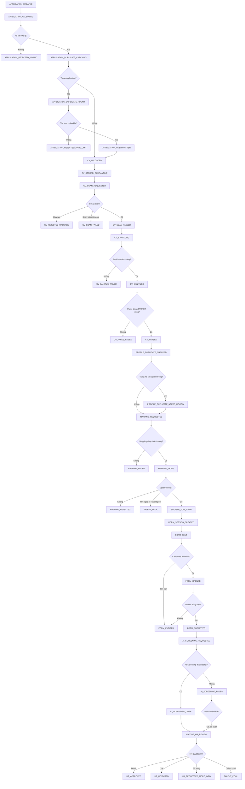

# 05. Workflow State Machine

## 1. Mục tiêu tài liệu

Tài liệu này mô tả state machine của `Application` trong Recruitment Phase 1.

Tài liệu làm nền cho API contract, `workflow-state` module, `audit-logs` module và implementation sau này. Đây không phải tài liệu implement code, không tạo migration và không sửa source hiện tại.

## 2. Nguyên tắc state machine

| STT | Nguyên tắc | Nội dung |
| --- | --- | --- |
| 1 | `Application.status` là workflow status chính | Các trạng thái tổng thể của Phase 1 phải được phản ánh qua `Application.status`. |
| 2 | `Application` là trung tâm workflow | Workflow xoay quanh `Application`, không phải `Candidate`. |
| 3 | Ghi `WorkflowEvent` | Mỗi transition quan trọng phải ghi `WorkflowEvent` để có timeline trạng thái. |
| 4 | Ghi `AuditLog` | Các hành động nghiệp vụ hoặc kỹ thuật quan trọng phải ghi `AuditLog`. |
| 5 | Không nhảy state tùy ý | Chỉ cho phép transition khi điều kiện đầu vào đã thỏa. |
| 6 | CV gốc phải qua quarantine | CV gốc phải được lưu quarantine và scan/sanitize trước khi parse, mapping, AI Screening hoặc HR Review. |
| 7 | Mapping chỉ dùng dữ liệu an toàn | Mapping chỉ chạy trên CV sạch và parsed profile. |
| 8 | Form gửi sau mapping đạt | Form chỉ gửi khi mapping đạt threshold hoặc có quyết định HR review ngoại lệ được audit. |
| 9 | AI Screening sau form | AI Screening chỉ chạy sau khi form đã submitted. |
| 10 | HR Review sau AI hoặc fallback | HR Review chỉ thực hiện sau khi AI Screening thành công hoặc được chuyển thủ công khi AI lỗi. |
| 11 | Retry phải idempotent | Retry không được tạo trùng mapping result, form session hoặc AI result. |
| 12 | Public endpoint có bảo vệ | Public apply/form endpoint cần rate limit, validation và idempotency riêng. |

## 3. State groups

| Nhóm state | Mục đích | State chính |
| --- | --- | --- |
| `Application` | Tiếp nhận application, validate và duplicate application. | `APPLICATION_CREATED`, `APPLICATION_VALIDATING`, `APPLICATION_REJECTED_INVALID`, `APPLICATION_DUPLICATE_CHECKING`, `APPLICATION_DUPLICATE_FOUND`, `APPLICATION_OVERWRITTEN`, `APPLICATION_REJECTED_RATE_LIMIT` |
| `CV` | Upload, quarantine, scan, sanitize và parse CV. | `CV_UPLOADED`, `CV_STORED_QUARANTINE`, `CV_SCAN_REQUESTED`, `CV_SCAN_PASSED`, `CV_SCAN_FAILED`, `CV_REJECTED_MALWARE`, `CV_SANITIZING`, `CV_SANITIZED`, `CV_SANITIZE_FAILED`, `CV_PARSED`, `CV_PARSE_FAILED` |
| `Duplicate / Profile` | Check trùng hồ sơ sau parse. | `PROFILE_DUPLICATE_CHECKED`, `PROFILE_DUPLICATE_NEEDS_REVIEW` |
| `Mapping` | Mapping CV-JD nội bộ và quyết định đủ điều kiện form. | `MAPPING_REQUESTED`, `MAPPING_DONE`, `MAPPING_FAILED`, `MAPPING_REJECTED`, `ELIGIBLE_FOR_FORM` |
| `Form` | Tạo/gửi/mở/submit/expire pre-screening form. | `FORM_SESSION_CREATED`, `FORM_SENT`, `FORM_OPENED`, `FORM_SUBMITTED`, `FORM_EXPIRED` |
| `AI Screening` | Chạy AI Screening và chuyển sang HR Review. | `AI_SCREENING_REQUESTED`, `AI_SCREENING_DONE`, `AI_SCREENING_FAILED`, `WAITING_HR_REVIEW` |
| `HR Review` | HR ra quyết định cuối Phase 1 hoặc yêu cầu bổ sung. | `HR_APPROVED`, `HR_REJECTED`, `HR_REQUESTED_MORE_INFO`, `TALENT_POOL` |
| `Terminal / Outcome` | Các trạng thái kết thúc hoặc kết quả nghiệp vụ. | `APPLICATION_REJECTED_INVALID`, `APPLICATION_REJECTED_RATE_LIMIT`, `CV_REJECTED_MALWARE`, `MAPPING_REJECTED`, `HR_APPROVED`, `HR_REJECTED`, `TALENT_POOL` |

## 4. State list

| State | Nhóm | Ý nghĩa | Terminal? |
| --- | --- | --- | --- |
| `APPLICATION_CREATED` | `Application` | Application được tạo sau khi candidate apply hoặc được ingest từ channel. | Không |
| `APPLICATION_VALIDATING` | `Application` | Core đang validate payload, required fields, source, file và rule public endpoint. | Không |
| `APPLICATION_REJECTED_INVALID` | `Application` | Hồ sơ không hợp lệ. | Có |
| `APPLICATION_DUPLICATE_CHECKING` | `Application` | Đang check trùng theo candidate/email/SĐT + JD/job posting. | Không |
| `APPLICATION_DUPLICATE_FOUND` | `Application` | Phát hiện application trùng. | Không |
| `APPLICATION_OVERWRITTEN` | `Application` | Cho phép overwrite hoặc tạo version mới sau duplicate/upload lại. | Không |
| `APPLICATION_REJECTED_RATE_LIMIT` | `Application` | Vượt giới hạn upload/submit hoặc bị chặn bởi rate limit. | Có |
| `CV_UPLOADED` | `CV` | CV được upload/ingest vào Core. | Không |
| `CV_STORED_QUARANTINE` | `CV` | CV gốc đã lưu vào quarantine. | Không |
| `CV_SCAN_REQUESTED` | `CV` | Đã yêu cầu scan malware. | Không |
| `CV_SCAN_PASSED` | `CV` | CV gốc qua scan an toàn. | Không |
| `CV_SCAN_FAILED` | `CV` | Scan malware lỗi/timeout kỹ thuật, chưa xác nhận CV an toàn. | Không |
| `CV_REJECTED_MALWARE` | `CV` | CV bị từ chối vì phát hiện malware. | Có |
| `CV_SANITIZING` | `CV` | Đang sanitize/tạo CV sạch. | Không |
| `CV_SANITIZED` | `CV` | CV sạch đã được tạo và lưu ở safe storage. | Không |
| `CV_SANITIZE_FAILED` | `CV` | Sanitize thất bại. | Không |
| `CV_PARSED` | `CV` | CV sạch đã parse thành parsed profile. | Không |
| `CV_PARSE_FAILED` | `CV` | Parse clean CV thất bại hoặc text rỗng sau khi đã sanitize. | Không |
| `PROFILE_DUPLICATE_CHECKED` | `Duplicate / Profile` | Đã check trùng hồ sơ sau parse. | Không |
| `PROFILE_DUPLICATE_NEEDS_REVIEW` | `Duplicate / Profile` | Trùng hồ sơ nghiêm trọng hoặc cần HR xử lý duplicate. | Không |
| `MAPPING_REQUESTED` | `Mapping` | Đã yêu cầu mapping CV-JD. | Không |
| `MAPPING_DONE` | `Mapping` | Mapping chạy thành công và có kết quả. | Không |
| `MAPPING_FAILED` | `Mapping` | Mapping lỗi kỹ thuật hoặc provider/rule failure. | Không |
| `MAPPING_REJECTED` | `Mapping` | Mapping dưới threshold hoặc bị loại theo rule nghiệp vụ. | Có |
| `ELIGIBLE_FOR_FORM` | `Mapping` | Application đủ điều kiện gửi pre-screening form. | Không |
| `FORM_SESSION_CREATED` | `Form` | Form session/token riêng đã tạo. | Không |
| `FORM_SENT` | `Form` | Link form đã gửi cho candidate. | Không |
| `FORM_OPENED` | `Form` | Candidate đã mở form. | Không |
| `FORM_SUBMITTED` | `Form` | Candidate đã submit form đúng hạn. | Không |
| `FORM_EXPIRED` | `Form` | Form session hết hạn. | Không |
| `AI_SCREENING_REQUESTED` | `AI Screening` | Đã yêu cầu AI Screening. | Không |
| `AI_SCREENING_DONE` | `AI Screening` | AI Screening thành công. | Không |
| `AI_SCREENING_FAILED` | `AI Screening` | AI Screening lỗi. | Không |
| `WAITING_HR_REVIEW` | `AI Screening` | Đang chờ HR Review. | Không |
| `HR_APPROVED` | `HR Review` | HR duyệt hồ sơ trong phạm vi Phase 1. | Có |
| `HR_REJECTED` | `HR Review` | HR loại hồ sơ. | Có |
| `HR_REQUESTED_MORE_INFO` | `HR Review` | HR yêu cầu bổ sung thông tin. | Không |
| `TALENT_POOL` | `HR Review` | Đưa vào talent pool. | Có |

Ghi chú triển khai: `HR_REQUESTED_MORE_INFO` có thể không terminal nếu sau đó ứng viên bổ sung lại và workflow được reopen bằng transition/audit rõ ràng.

## 5. Workflow diagram

## 6. Transition table

| From state | Event | To state | Actor/System | Điều kiện | Ghi chú |
| --- | --- | --- | --- | --- | --- |
| `null` | `APPLICATION_SUBMITTED` | `APPLICATION_CREATED` | Candidate / Channel / System | Apply payload được nhận từ portal/channel/manual import. | Tạo `Application` hoặc route vào duplicate handling. |
| `APPLICATION_CREATED` | `VALIDATION_STARTED` | `APPLICATION_VALIDATING` | System | Có payload/application ID. | Ghi `WorkflowEvent`. |
| `APPLICATION_VALIDATING` | `VALIDATION_FAILED` | `APPLICATION_REJECTED_INVALID` | System | Thiếu field, file type sai, source không hợp lệ. | Terminal lỗi hồ sơ. |
| `APPLICATION_VALIDATING` | `VALIDATION_PASSED` | `APPLICATION_DUPLICATE_CHECKING` | System | Payload hợp lệ. | Bắt đầu duplicate check. |
| `APPLICATION_VALIDATING` | `DUPLICATE_CHECK_STARTED` | `APPLICATION_DUPLICATE_CHECKING` | System | Validation đã pass và duplicate process bắt đầu. | Event kỹ thuật có thể ghi cùng lúc với `VALIDATION_PASSED`. |
| `APPLICATION_DUPLICATE_CHECKING` | `DUPLICATE_FOUND` | `APPLICATION_DUPLICATE_FOUND` | System | Trùng theo candidate/email/SĐT + JD/posting. | Cần quyết định overwrite/reject/rate limit. |
| `APPLICATION_DUPLICATE_FOUND` | `UPLOAD_LIMIT_EXCEEDED` | `APPLICATION_REJECTED_RATE_LIMIT` | System | Vượt giới hạn upload lại/submit lại. | Terminal do policy. |
| `APPLICATION_DUPLICATE_FOUND` | `CV_VERSION_CREATED` | `APPLICATION_OVERWRITTEN` | System / Candidate | Cho phép overwrite hoặc tạo CV version mới. | Không xóa version cũ. |
| `APPLICATION_DUPLICATE_CHECKING` | `DUPLICATE_NOT_FOUND` | `CV_UPLOADED` | System | Không trùng hoặc duplicate chấp nhận được. | Nếu CV đã có trong payload. |
| `APPLICATION_OVERWRITTEN` | `CV_VERSION_CREATED` | `CV_UPLOADED` | System | CV version mới được tạo. | Tiếp tục CV processing. |
| `CV_UPLOADED` | `CV_STORED_TO_QUARANTINE` | `CV_STORED_QUARANTINE` | System | File gốc đã lưu quarantine. | Không dùng CV gốc cho parse/mapping. |
| `CV_STORED_QUARANTINE` | `CV_SCAN_REQUESTED` | `CV_SCAN_REQUESTED` | System / Scanner | Có quarantine path và metadata. | Với upload API, scan chạy đồng bộ trong request; worker/internal retry vẫn phải idempotent. |
| `CV_SCAN_REQUESTED` | `CV_MALWARE_DETECTED` | `CV_REJECTED_MALWARE` | System / Scanner | Scanner phát hiện malware. | Terminal cho CV version hiện tại. |
| `CV_SCAN_REQUESTED` | `CV_SCAN_FAILED` | `CV_SCAN_FAILED` | System / Scanner | Lỗi kỹ thuật/timeout, chưa xác nhận an toàn. | Có thể retry scan hoặc manual review; không sanitize/parse. |
| `CV_SCAN_REQUESTED` | `CV_SCAN_PASSED` | `CV_SCAN_PASSED` | System / Scanner | Scanner xác nhận an toàn. | Cho phép sanitize. |
| `CV_SCAN_PASSED` | `CV_SANITIZE_STARTED` | `CV_SANITIZING` | System / Worker | Có CV gốc đã scan passed. | Tạo clean CV. |
| `CV_SANITIZING` | `CV_SANITIZE_FAILED` | `CV_SANITIZE_FAILED` | System / Worker | Lỗi sanitize. | Retry nếu lỗi kỹ thuật. |
| `CV_SANITIZING` | `CV_SANITIZE_DONE` | `CV_SANITIZED` | System / Worker | Clean CV đã tạo. | Lưu safe storage. |
| `CV_SANITIZED` | `CV_PARSE_DONE` | `CV_PARSED` | System / Worker | Parse clean CV thành parsed profile. | Chỉ parse CV sạch. |
| `CV_SANITIZED` | `CV_PARSE_FAILED` | `CV_PARSE_FAILED` | System / Worker | Parse clean CV lỗi hoặc text rỗng. | Retry/manual review/email upload lại theo nguyên nhân. |
| `CV_PARSED` | `PROFILE_DUPLICATE_CHECK_DONE` | `PROFILE_DUPLICATE_CHECKED` | System | Check parsed profile hoàn tất. | Nếu không nghiêm trọng thì đi mapping. |
| `PROFILE_DUPLICATE_CHECKED` | `PROFILE_DUPLICATE_REQUIRES_REVIEW` | `PROFILE_DUPLICATE_NEEDS_REVIEW` | System / HR | Trùng hồ sơ cần HR xử lý. | Có thể block hoặc cho đi song song tùy policy. |
| `PROFILE_DUPLICATE_CHECKED` | `MAPPING_REQUESTED` | `MAPPING_REQUESTED` | System | Không trùng nghiêm trọng hoặc duplicate chấp nhận được. | Mapping internal. |
| `PROFILE_DUPLICATE_NEEDS_REVIEW` | `MAPPING_REQUESTED` | `MAPPING_REQUESTED` | HR / System | HR cho phép tiếp tục hoặc policy cho phép song song. | Phải ghi audit. |
| `MAPPING_REQUESTED` | `MAPPING_FAILED` | `MAPPING_FAILED` | System | Lỗi kỹ thuật mapping. | Retry được. |
| `MAPPING_REQUESTED` | `MAPPING_SUCCEEDED` | `MAPPING_DONE` | System | Mapping có result. | Ghi `MappingResult`. |
| `MAPPING_DONE` | `MAPPING_BELOW_THRESHOLD` | `MAPPING_REJECTED` | System | Score dưới threshold và không có ngoại lệ HR. | Terminal nghiệp vụ, có thể chuyển talent pool nếu HR quyết định. |
| `MAPPING_DONE` | `MAPPING_ABOVE_THRESHOLD` | `ELIGIBLE_FOR_FORM` | System | Score đạt threshold. | Cho phép tạo form. |
| `MAPPING_FAILED` | `MAPPING_REQUESTED` | `MAPPING_REQUESTED` | System / HR | Retry mapping lỗi kỹ thuật. | Idempotent theo key mapping. |
| `ELIGIBLE_FOR_FORM` | `FORM_SESSION_CREATED` | `FORM_SESSION_CREATED` | System | Có question set hợp lệ. | Token riêng, lưu hash. |
| `FORM_SESSION_CREATED` | `FORM_SENT` | `FORM_SENT` | System / Notification | Gửi link form thành công hoặc queued. | Có thể resend cùng session. |
| `FORM_SENT` | `FORM_OPENED` | `FORM_OPENED` | Candidate | Token hợp lệ, chưa expire. | Public form endpoint. |
| `FORM_SENT` | `FORM_EXPIRED` | `FORM_EXPIRED` | System | Quá hạn form. | Có thể tạo session mới nếu policy cho phép. |
| `FORM_OPENED` | `FORM_SUBMITTED` | `FORM_SUBMITTED` | Candidate | Submit đúng hạn, validation pass. | Lưu `FormAnswer`. |
| `FORM_OPENED` | `FORM_EXPIRED` | `FORM_EXPIRED` | System | Quá hạn trước khi submit. | Không nhận submit sau expiry. |
| `FORM_SUBMITTED` | `AI_SCREENING_REQUESTED` | `AI_SCREENING_REQUESTED` | System | Có form answers và mapping result. | AI chạy qua Core. |
| `AI_SCREENING_REQUESTED` | `AI_SCREENING_FAILED` | `AI_SCREENING_FAILED` | System | AI/provider/schema lỗi. | Retry hoặc manual fallback. |
| `AI_SCREENING_REQUESTED` | `AI_SCREENING_SUCCEEDED` | `AI_SCREENING_DONE` | System | Có `AiScreeningResult` hợp lệ. | Ghi result. |
| `AI_SCREENING_DONE` | `HR_REVIEW_STARTED` | `WAITING_HR_REVIEW` | System | AI result sẵn sàng. | HR queue. |
| `AI_SCREENING_FAILED` | `AI_SCREENING_REQUESTED` | `AI_SCREENING_REQUESTED` | System / HR | Retry AI lỗi kỹ thuật. | Idempotent theo key AI. |
| `AI_SCREENING_FAILED` | `HR_REVIEW_STARTED` | `WAITING_HR_REVIEW` | HR | Manual fallback khi AI lỗi. | Bắt buộc audit reason. |
| `WAITING_HR_REVIEW` | `HR_APPROVED` | `HR_APPROVED` | HR | HR duyệt. | Terminal Phase 1. |
| `WAITING_HR_REVIEW` | `HR_REJECTED` | `HR_REJECTED` | HR | HR loại. | Terminal Phase 1. |
| `WAITING_HR_REVIEW` | `HR_REQUESTED_MORE_INFO` | `HR_REQUESTED_MORE_INFO` | HR | HR cần bổ sung thông tin. | Không terminal nếu có reopen flow. |
| `WAITING_HR_REVIEW` | `HR_SENT_TO_TALENT_POOL` | `TALENT_POOL` | HR | HR đưa talent pool. | Terminal Phase 1. |
| `MAPPING_REJECTED` | `HR_SENT_TO_TALENT_POOL` | `TALENT_POOL` | HR | HR quyết định lưu hồ sơ dù mapping thấp. | Ghi audit ngoại lệ. |
| `HR_REQUESTED_MORE_INFO` | `CV_VERSION_CREATED` | `APPLICATION_OVERWRITTEN` | Candidate / HR | Candidate bổ sung CV hoặc thông tin. | Assumption: cần reopen policy ở API spec. |

## 7. Decision states

| Decision | Input cần kiểm tra | Pass -> State | Fail -> State | Owner |
| --- | --- | --- | --- | --- |
| Hồ sơ hợp lệ? | Required fields, file type, source, policy public endpoint. | `APPLICATION_DUPLICATE_CHECKING` | `APPLICATION_REJECTED_INVALID` | `applications` / `validation-rate-limit` |
| Trùng application? | Candidate/email/SĐT + JD/job posting, external application ID nếu có. | `APPLICATION_DUPLICATE_FOUND` | `CV_UPLOADED` | `applications` / `validation-rate-limit` |
| Còn lượt upload lại? | Rate limit, retry count, duplicate handling policy. | `APPLICATION_OVERWRITTEN` | `APPLICATION_REJECTED_RATE_LIMIT` | `validation-rate-limit` |
| CV an toàn? | Scan result, file hash, scanner status. | `CV_SCAN_PASSED` | `CV_REJECTED_MALWARE` | `cv-sanitization` |
| Sanitize thành công? | Safe file created, clean hash, storage path. | `CV_SANITIZED` | `CV_SANITIZE_FAILED` | `cv-sanitization` |
| Trùng hồ sơ sau parse? | Parsed profile, normalized text hash, email/SĐT, similarity score. | `PROFILE_DUPLICATE_CHECKED` | `PROFILE_DUPLICATE_NEEDS_REVIEW` | `cv-parsing` / `applications` |
| Đạt mapping threshold? | Mapping score, threshold theo JD/vị trí/level, HR exception nếu có. | `ELIGIBLE_FOR_FORM` | `MAPPING_REJECTED` | `mapping` |
| Form submitted đúng hạn? | Form status, token hash, expiry, answer validation. | `FORM_SUBMITTED` | `FORM_EXPIRED` | `form-sessions` |
| AI Screening thành công? | AI output, schema validation, provider status. | `AI_SCREENING_DONE` | `AI_SCREENING_FAILED` | `ai-screening` |
| HR quyết định? | Mapping result, form answers, AI result/fallback, HR note. | `HR_APPROVED` / `HR_REJECTED` / `HR_REQUESTED_MORE_INFO` / `TALENT_POOL` | N/A | `hr-review` |

## 8. Invalid transitions

| Invalid transition | Lý do không hợp lệ | Cách xử lý |
| --- | --- | --- |
| `APPLICATION_CREATED` -> `MAPPING_REQUESTED` | Chưa validate, duplicate check, CV processing và parse. | Reject transition, ghi audit nếu request bất thường. |
| Sanitize khi chưa có `CV_SCAN_PASSED` | Scan chưa pass hoặc đang `CV_SCAN_FAILED`/`CV_REJECTED_MALWARE`. | Không enqueue sanitize, retry scan/manual review theo policy. |
| Parse CV khi chưa có `CV_SANITIZED` | Chưa có CV sạch. | Trả lỗi workflow precondition. |
| Mapping khi chưa có CV sạch/parsed profile | Mapping cần clean CV và parsed profile. | Không enqueue mapping, giữ state trước đó. |
| Tạo form khi mapping chưa đạt threshold | Form chỉ gửi sau `ELIGIBLE_FOR_FORM` hoặc ngoại lệ HR có audit. | Trả lỗi precondition hoặc yêu cầu HR override. |
| Submit form khi `FormSession` expired | Token/form hết hạn. | Reject submit, giữ `FORM_EXPIRED`, ghi audit. |
| Chạy AI Screening khi form chưa submitted | Thiếu form answers. | Không enqueue AI job. |
| HR Review khi chưa có AI result | HR thiếu dữ liệu screening. | Chỉ cho phép manual fallback từ `AI_SCREENING_FAILED` khi có audit reason. |
| Chạy lại mapping nếu đã có result thành công cho cùng `applicationId + cleanCvDocumentId + jobDescriptionVersionId` | Dễ tạo trùng kết quả. | Trả result hiện có, hoặc force rerun có quyền và audit. |
| Gửi nhiều active form session song song cho cùng application/question set | Candidate có thể submit nhầm session. | Reuse/resend active session hoặc expire/cancel session cũ trước. |
| Terminal state như `HR_REJECTED` -> `FORM_SENT` | Reopen không rõ ràng, phá audit. | Chỉ cho phép nếu có reopen workflow spec riêng. |
| Dùng CV gốc cho HR Review | CV gốc ở quarantine không phải input nghiệp vụ sau. | Chặn truy cập nghiệp vụ, chỉ cho audit/security role nếu cần. |
| Dùng `interview_sessions.accessToken` cho pre-screening form | Token này thuộc public interview flow. | Dùng `FormSession.tokenHash` và form token riêng. |

## 9. Retry / Idempotency rule

| Process | Idempotency key đề xuất | Retry được không? | Rule |
| --- | --- | --- | --- |
| Apply/Application | `jobPostingId + email/phone + requestId` nếu có | Có kiểm soát | Trùng application theo candidate/email/SĐT + JD/job posting; không tạo application trùng nếu request lặp. |
| CV upload | `applicationId + originalFileHash` | Có | Upload lại tạo CV version mới, không ghi mất version cũ; nếu cùng hash đã scan passed trước đó, chỉ reuse scan khi rule an toàn được chốt. |
| CV sanitization | `cvDocumentId + originalFileHash` | Có | Không tạo nhiều clean CV cho cùng original version nếu đã thành công; retry `CV_SANITIZE_FAILED` phải ghi attempt. |
| Mapping | `applicationId + cleanCvDocumentId + jobDescriptionVersionId` | Có nếu lỗi | Không chạy trùng nếu đã có `MAPPING_DONE`, trừ force rerun có quyền và audit. |
| Form sending | `applicationId + questionSetId + activeFormSession` | Có | Không gửi nhiều active form session song song; có thể resend link nếu cùng token/session còn hiệu lực. |
| AI Screening | `applicationId + mappingResultId + formSessionId` | Có nếu lỗi | Không chạy trùng nếu đã có `AI_SCREENING_DONE`, trừ force rerun có quyền và audit. |
| HR Review | `applicationId + reviewerId + decision requestId` nếu có | Có kiểm soát | Một quyết định HR chính có thể là latest decision; nếu đổi quyết định, tạo `HrReviewDecision` mới hoặc ghi audit rõ. |

## 10. Audit event mapping

| Transition / Event | WorkflowEvent cần ghi | AuditLog cần ghi | Metadata cần có |
| --- | --- | --- | --- |
| Application submitted | `APPLICATION_SUBMITTED`, to `APPLICATION_CREATED` | Có | `applicationId`, `candidateId`, `jobPostingId`, `sourceChannel`, `requestId`, `ipAddress`, `userAgent` |
| Validation failed | `VALIDATION_FAILED`, to `APPLICATION_REJECTED_INVALID` | Có | `applicationId`, `candidateId`, `jobPostingId`, `errorCode`, `errorMessage`, `requestId` |
| Duplicate found | `DUPLICATE_FOUND`, to `APPLICATION_DUPLICATE_FOUND` | Có | `applicationId`, `candidateId`, `jobPostingId`, matched application/profile IDs |
| Upload limit exceeded | `UPLOAD_LIMIT_EXCEEDED`, to `APPLICATION_REJECTED_RATE_LIMIT` | Có | `applicationId`, `candidateId`, `requestId`, rate limit metadata |
| CV stored quarantine | `CV_STORED_TO_QUARANTINE`, to `CV_STORED_QUARANTINE` | Có | `applicationId`, `candidateId`, `cvDocumentId`, storage zone/path, hash |
| CV scan requested | `CV_SCAN_REQUESTED`, to `CV_SCAN_REQUESTED` | Có | `applicationId`, `candidateId`, `cvDocumentId`, scanner, requestId |
| CV scan passed | `CV_SCAN_PASSED`, to `CV_SCAN_PASSED` | Có | `applicationId`, `candidateId`, `cvDocumentId`, scanner, duration |
| CV malware detected | `CV_MALWARE_DETECTED`, to `CV_REJECTED_MALWARE` | Có | `applicationId`, `candidateId`, `cvDocumentId`, scanner, `errorCode`, `errorMessage` |
| CV scan failed | `CV_SCAN_FAILED`, to `CV_SCAN_FAILED` | Có | `applicationId`, `candidateId`, `cvDocumentId`, scanner, attempt, `errorCode`, redacted `errorMessage` |
| CV sanitized | `CV_SANITIZE_DONE`, to `CV_SANITIZED` | Có | `applicationId`, `candidateId`, `cvDocumentId`, clean CV ID/path/hash |
| CV sanitize failed | `CV_SANITIZE_FAILED`, to `CV_SANITIZE_FAILED` | Có | `applicationId`, `candidateId`, `cvDocumentId`, attempt, `errorCode`, `errorMessage` |
| CV parsed | `CV_PARSE_DONE`, to `CV_PARSED` | Có | `applicationId`, `candidateId`, `cvDocumentId`, parsedProfileId, parserVersion |
| CV parse failed | `CV_PARSE_FAILED`, to `CV_PARSE_FAILED` | Có | `applicationId`, `candidateId`, `cvDocumentId`, attempt, parserVersion, `errorCode`, redacted `errorMessage` |
| Profile duplicate found | `PROFILE_DUPLICATE_REQUIRES_REVIEW`, to `PROFILE_DUPLICATE_NEEDS_REVIEW` | Có | `applicationId`, `candidateId`, matched entity, score, details |
| Mapping requested | `MAPPING_REQUESTED`, to `MAPPING_REQUESTED` | Có | `applicationId`, `jobDescriptionVersionId`, `cvDocumentId`, requestId |
| Mapping done | `MAPPING_SUCCEEDED`, to `MAPPING_DONE` | Có | `applicationId`, `mappingResultId`, score, recommendation |
| Mapping failed | `MAPPING_FAILED`, to `MAPPING_FAILED` | Có | `applicationId`, `jobDescriptionVersionId`, `cvDocumentId`, `errorCode`, `errorMessage` |
| Mapping rejected | `MAPPING_BELOW_THRESHOLD`, to `MAPPING_REJECTED` | Có | `applicationId`, `mappingResultId`, score, threshold, reason |
| Form session created | `FORM_SESSION_CREATED`, to `FORM_SESSION_CREATED` | Có | `applicationId`, `formSessionId`, questionSetId, expiresAt |
| Form sent | `FORM_SENT`, to `FORM_SENT` | Có | `applicationId`, `formSessionId`, delivery channel, recipient |
| Form opened | `FORM_OPENED`, to `FORM_OPENED` | Có | `applicationId`, `formSessionId`, `ipAddress`, `userAgent` |
| Form submitted | `FORM_SUBMITTED`, to `FORM_SUBMITTED` | Có | `applicationId`, `formSessionId`, answer count, submittedAt |
| Form expired | `FORM_EXPIRED`, to `FORM_EXPIRED` | Có | `applicationId`, `formSessionId`, expiresAt |
| AI Screening requested | `AI_SCREENING_REQUESTED`, to `AI_SCREENING_REQUESTED` | Có | `applicationId`, `mappingResultId`, `formSessionId`, promptVersion, requestId |
| AI Screening done | `AI_SCREENING_SUCCEEDED`, to `AI_SCREENING_DONE` | Có | `applicationId`, aiScreeningResultId, finalScore, model |
| AI Screening failed | `AI_SCREENING_FAILED`, to `AI_SCREENING_FAILED` | Có | `applicationId`, `mappingResultId`, `formSessionId`, `errorCode`, `errorMessage` |
| HR approved | `HR_APPROVED`, to `HR_APPROVED` | Có | `applicationId`, reviewerId, decisionId, comment, reasonCodes |
| HR rejected | `HR_REJECTED`, to `HR_REJECTED` | Có | `applicationId`, reviewerId, decisionId, comment, reasonCodes |
| HR requested more info | `HR_REQUESTED_MORE_INFO`, to `HR_REQUESTED_MORE_INFO` | Có | `applicationId`, reviewerId, decisionId, requested fields, comment |
| Talent pool | `HR_SENT_TO_TALENT_POOL`, to `TALENT_POOL` | Có | `applicationId`, reviewerId, decisionId, reasonCodes |

Metadata chung nên có khi phù hợp: `applicationId`, `candidateId`, `jobPostingId`, `jobDescriptionVersionId`, `cvDocumentId`, `mappingResultId`, `formSessionId`, `actorType`, `actorId`, `sourceChannel`, `requestId`, `ipAddress`, `userAgent`, `errorCode`, `errorMessage`.

## 11. Error states

| Error state | Nguyên nhân | Retry? | Owner module | Cách xử lý |
| --- | --- | --- | --- | --- |
| `APPLICATION_REJECTED_INVALID` | Payload thiếu/sai, file type không hợp lệ, source không hợp lệ. | Không, trừ submit mới | `applications` / `validation-rate-limit` | Trả lỗi rõ, ghi audit, candidate có thể apply lại bằng request hợp lệ. |
| `APPLICATION_REJECTED_RATE_LIMIT` | Vượt giới hạn upload/submit hoặc duplicate abuse. | Không ngay | `validation-rate-limit` | Chặn request, có thể mở lại theo policy/time window. |
| `CV_REJECTED_MALWARE` | Scanner phát hiện malware. | Không cho CV version hiện tại | `cv-sanitization` | Terminal cho CV version; candidate có thể upload file khác nếu policy cho phép. |
| `CV_SCAN_FAILED` | Scanner lỗi/timeout kỹ thuật, chưa xác nhận an toàn. | Có | `cv-sanitization` | Retry scan/manual review/internal alert; không sanitize/parse cho đến khi scan pass. |
| `CV_SANITIZE_FAILED` | Lỗi sanitize kỹ thuật hoặc storage clean artifact lỗi. | Có | `cv-sanitization` | Retry có attempt limit; nếu vẫn lỗi thì email upload lại hoặc HR/system xử lý thủ công tùy nguyên nhân. |
| `CV_PARSE_FAILED` | Clean CV parse lỗi, text rỗng hoặc structure không hỗ trợ. | Có điều kiện | `cv-parsing` | Retry nếu lỗi kỹ thuật; nếu do file thì email ứng viên upload lại hoặc manual review; không mapping tự động. |
| `MAPPING_FAILED` | Lỗi kỹ thuật khi mapping, timeout, dữ liệu input lỗi. | Có | `mapping` / `mapping-results` | Retry idempotent; không tạo duplicate result. |
| `MAPPING_REJECTED` | Kết quả nghiệp vụ dưới threshold. | Không theo retry kỹ thuật | `mapping` | Terminal nghiệp vụ; HR có thể đưa `TALENT_POOL` hoặc ngoại lệ nếu spec sau cho phép. |
| `FORM_EXPIRED` | Candidate không submit đúng hạn. | Có thể tạo session mới | `form-sessions` | Tạo form session mới hoặc HR xử lý, phải audit. |
| `AI_SCREENING_FAILED` | AI provider lỗi, output sai schema, timeout. | Có | `ai-screening` / `ai` | Retry hoặc chuyển `WAITING_HR_REVIEW` thủ công nếu có audit fallback. |

## 12. State ownership theo module

| State group | Owner module | Module liên quan |
| --- | --- | --- |
| Application | `applications`, `validation-rate-limit` | `candidates`, `job-postings`, `workflow-state`, `audit-logs` |
| CV | `cv-documents`, `cv-sanitization`, `cv-parsing` | storage, `file-parser`, `workflow-state`, `audit-logs` |
| Duplicate/Profile | `validation-rate-limit`, `cv-parsing` | `applications`, `candidates`, `duplicate-checks`, `audit-logs` |
| Mapping | `mapping`, `mapping-results` | `applications`, `job-description-versions`, `cv-documents`, `cv-parsing`, `workflow-state` |
| Form | `form-sessions`, `form-answers`, `notifications` | `question-sets`, `applications`, `workflow-state`, `audit-logs` |
| AI | `ai-screening`, `ai` | `mapping-results`, `form-answers`, `workflow-state`, `audit-logs` |
| HR Review | `hr-review` | `applications`, `mapping-results`, `form-answers`, `ai-screening`, `cv-documents`, `workflow-state` |
| Workflow/Audit | `workflow-state`, `audit-logs` | All Phase 1 domain modules |

## 13. Conflict / Assumption

| Vấn đề | File liên quan | Cách xử lý |
| --- | --- | --- |
| `Application.status` là enum lớn hay tách status theo module | `04_domain_model_and_relationships.md`, `01_phase1_context_summary.md` | Spec này giữ `Application.status` là workflow status chính theo enum lớn, đồng thời cho phép status phụ ở từng module và ghi timeline bằng `WorkflowEvent`. |
| `MAPPING_REJECTED` terminal hay có thể chuyển `TALENT_POOL`/HR review ngoại lệ | `vcs_recruitment_phase1_architecture_specification.md`, `01_phase1_context_summary.md` | Mặc định `MAPPING_REJECTED` là terminal nghiệp vụ. Assumption: HR có thể đưa `TALENT_POOL` hoặc ngoại lệ nếu có quyền và audit rõ. |
| `PROFILE_DUPLICATE_NEEDS_REVIEW` block flow hay xử lý song song | `vcs_recruitment_phase1_architecture_specification.md`, `03_module_extension_plan.md` | Assumption: duplicate nghiêm trọng cần HR review; workflow có thể block hoặc tiếp tục mapping khi HR/policy cho phép và ghi audit. |
| `FORM_EXPIRED` có cho tạo form session mới không | `03_module_extension_plan.md`, `04_domain_model_and_relationships.md` | Assumption: có thể tạo session mới nếu HR/policy cho phép; không dùng lại expired token. |
| `AI_SCREENING_FAILED` có được đưa vào HR Review thủ công không | `01_phase1_context_summary.md`, `02_target_architecture_phase1.md` | Có thể chuyển `WAITING_HR_REVIEW` thủ công khi AI lỗi, nhưng bắt buộc ghi audit reason và metadata lỗi. |
| HR decision có cho đổi sau khi đã quyết định không | `04_domain_model_and_relationships.md` | Assumption: quyết định mới phải tạo `HrReviewDecision` mới hoặc ghi audit rõ; không mutate im lặng decision cũ. |
| Token pre-screening form | `backend-specification.md`, `00_source_baseline_analysis.md`, `04_domain_model_and_relationships.md` | Không dùng `interview_sessions.accessToken`; `FormSession` dùng token riêng và chỉ lưu hash. |
| AMIS trong workflow Phase 1 | `vcs_recruitment_phase1_architecture_specification.md`, `02_target_architecture_phase1.md` | AMIS là later / extension point sau `HR Review`, không nằm trong state machine bắt buộc của Phase 1. |

Không phát hiện conflict ảnh hưởng trực tiếp đến workflow state machine ở mức specification. Các điểm còn mở được ghi nhận là assumption để xử lý ở API/implementation spec.

## 14. Kết luận

Workflow Phase 1 cần được quản lý bằng state machine xoay quanh `Application.status`. Mỗi bước tự động hoặc thủ công phải có transition hợp lệ, idempotency rule và audit event tương ứng. Các error state như `CV_SCAN_FAILED`, `CV_SANITIZE_FAILED`, `CV_PARSE_FAILED`, `MAPPING_FAILED`, `AI_SCREENING_FAILED` cần phân biệt rõ lỗi kỹ thuật có thể retry, malware detected terminal cho CV version và kết quả nghiệp vụ không đạt.
