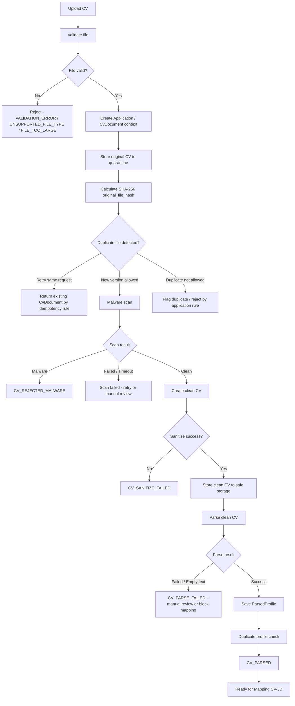

# 08. CV Processing Specification

## 1. Mục tiêu tài liệu

Tài liệu này mô tả quy trình xử lý CV cho Recruitment Phase 1 của hệ thống Interview Assistant / Recruitment Core Backend.

Tài liệu làm nền cho implementation sau này của các nhóm module:

- `cv-documents`
- `cv-sanitization`
- `cv-parsing`
- Public apply API
- Manual CV upload API theo `Application`
- Mapping API
- HR Review API

Tài liệu này không tạo code, không tạo controller/service/module/entity thật và không tạo migration.

Mục tiêu chính là đảm bảo mọi CV đến từ public apply, manual HR upload hoặc channel ingestion đều được xử lý an toàn trước khi đi vào các bước nghiệp vụ. CV gốc không được dùng trực tiếp cho parse, mapping, AI Screening hoặc HR Review. Mọi kết quả xử lý CV phải gắn với `application_id`, có versioning, idempotency và audit log.

## 2. Nguyên tắc xử lý CV

| STT | Nguyên tắc | Nội dung |
| --- | ---------- | -------- |
| 1 | Gắn với `application_id` | CV processing luôn gắn với `application_id`. `Application` là workflow center, không dùng `Candidate` làm trung tâm xử lý CV. |
| 2 | Quarantine original CV | CV gốc phải lưu vào quarantine storage sau validation cơ bản. |
| 3 | Không dùng original CV trực tiếp | CV gốc không được dùng trực tiếp cho parse, mapping, AI Screening hoặc HR Review. |
| 4 | Bắt buộc tạo CV sạch | Hệ thống phải tạo CV sạch trước khi xử lý nghiệp vụ sau. |
| 5 | Clean CV là input nghiệp vụ | CV sạch là input cho parse, mapping, AI Screening và HR Review. |
| 6 | Upload lại tạo version | Upload lại CV phải tạo version mới, không ghi mất bản cũ. |
| 7 | Mỗi version có hash | Mỗi CV version phải có hash để phát hiện file trùng, hỗ trợ idempotency và audit. |
| 8 | Malware scan bắt buộc | Malware scan là bước bắt buộc trong flow. MVP có thể dùng stub/mock scanner nhưng state machine vẫn phải đủ trạng thái scan. |
| 9 | Parser chỉ chạy trên clean CV | Parser hiện tại chỉ được chạy trên CV sạch, không đọc file ở quarantine như input nghiệp vụ. |
| 10 | Không expose raw CV | Raw/original CV không được expose qua public API hoặc UI HR thông thường. |
| 11 | Clean CV có phân quyền | Chỉ HR/Admin có quyền theo `applicationId`/`candidateId` mới được xem hoặc download clean CV. |
| 12 | Audit bắt buộc | Mọi action upload, sanitize, parse, retry, download và failure quan trọng phải ghi `WorkflowEvent` và/hoặc `AuditLog`. |

## 3. CV flow tổng thể

Flow bắt buộc:

```text
Upload CV
→ Validate file
→ Create Application/CvDocument context
→ Store original CV to quarantine
→ Calculate SHA-256 hash
→ Malware scan
→ If safe: create clean CV
→ Store clean CV to safe storage
→ Parse clean CV
→ Save parsed profile
→ Duplicate profile check
→ Ready for Mapping CV-JD
```

Mermaid flow:



Các nhánh lỗi bắt buộc:

| Nhánh | Kết quả |
| --- | --- |
| File invalid | Reject, không tạo CV version nghiệp vụ hoàn chỉnh. |
| Duplicate file detected | Xử lý theo idempotency/version rule. |
| Malware detected | Chuyển `CV_REJECTED_MALWARE`, không parse. |
| Scan failed | Retry hoặc manual review, không parse khi chưa pass. |
| Sanitize failed | Chuyển `CV_SANITIZE_FAILED`, có thể retry nếu lỗi kỹ thuật. |
| Parse failed | Ghi parse error/manual review; không cho mapping nếu thiếu parsed profile bắt buộc. |
| Parse success | Chuyển `CV_PARSED`, sẵn sàng duplicate profile check và mapping. |

## 4. File validation

| Rule | Nội dung | Error code đề xuất |
| ---- | -------- | ------------------ |
| Required `cvFile` | Public apply phải có `cvFile`. | `VALIDATION_ERROR` |
| Required `applicationId` | Upload CV theo application hiện có phải có `applicationId`. | `VALIDATION_ERROR` |
| Required candidate context | Public apply phải có `candidateId` hoặc đủ thông tin để tạo/link candidate, tối thiểu theo rule apply hiện hành như `fullName`, `email` và/hoặc `phone`. | `VALIDATION_ERROR` |
| MIME type PDF | Cho phép `application/pdf`. | N/A |
| MIME type DOCX | Cho phép `application/vnd.openxmlformats-officedocument.wordprocessingml.document`. | N/A |
| MIME type XLSX | Cho phép `application/vnd.openxmlformats-officedocument.spreadsheetml.sheet`. | N/A |
| MIME type XLS | Baseline hiện tại accept `application/vnd.ms-excel` nhưng parser chưa support `.xls`. Phase 1 đánh dấu `.xls` là `unsupported until parser/conversion added`, trừ khi có decision riêng. | `UNSUPPORTED_FILE_TYPE` |
| Extension allowlist | Chỉ cho phép `.pdf`, `.docx`, `.xlsx`. | `UNSUPPORTED_FILE_TYPE` |
| Extension denylist | Không cho phép `.exe`, `.js`, `.bat`, `.cmd`, `.html`, `.htm`, `.zip`, `.rar`, file không có extension rõ ràng. | `UNSUPPORTED_FILE_TYPE` |
| MIME/extension mismatch | Chặn file có extension và MIME không khớp, ví dụ file `.pdf` nhưng content/MIME khác. | `UNSUPPORTED_FILE_TYPE` |
| Size | Baseline hiện tại dùng 20MB/file. Phase 1 giữ max size `20MB/file`, trừ khi tài liệu sau chốt khác. | `FILE_TOO_LARGE` |
| Filename | Không tin tưởng filename từ client. Normalize filename để lưu metadata, storage filename phải generate bởi server. | `VALIDATION_ERROR` |
| Path traversal | Chặn `../`, absolute path, control character hoặc ký tự gây path traversal. | `VALIDATION_ERROR` |
| Empty file | File rỗng không được xử lý tiếp. | `VALIDATION_ERROR` |
| Empty extracted text | Nếu parse text rỗng sau khi clean, mark parse failed/manual review. | `CV_PARSE_FAILED` |
| Encrypted/password-protected | Reject hoặc mark manual review theo policy, không cho mapping khi chưa có parsed profile hợp lệ. | `CV_PARSE_FAILED` hoặc `UNSUPPORTED_FILE_TYPE` |
| Corrupt file | Reject hoặc mark parse failed tùy lỗi xảy ra ở validation hay parse. | `CV_PARSE_FAILED` |

Ghi chú triển khai:

- Validation không thay thế malware scan.
- MIME từ client chỉ là tín hiệu ban đầu. Implementation nên xác thực thêm bằng file signature hoặc thư viện nhận diện nội dung nếu có.
- `.xls` là conflict rõ với baseline: upload accept MIME nhưng parser chưa support. Spec này không đưa `.xls` vào allowlist Phase 1 cho đến khi có parser/conversion riêng.

## 5. Quarantine rule

Original CV được lưu vào quarantine storage ngay sau validation cơ bản và trước mọi bước scan/sanitize. Quarantine storage phải tách logic với safe storage.

Original CV chỉ dùng cho scanner/sanitizer. Original CV không dùng trực tiếp cho parser, mapping, AI Screening hoặc HR Review. Không expose original CV cho Candidate, HR Review hoặc public API.

Chỉ Admin hoặc security operator có quyền đặc biệt mới được truy cập raw CV trong trường hợp điều tra, và mọi truy cập phải ghi audit. Metadata của original CV lưu trong `cv_documents`.

| Hạng mục | Rule |
| -------- | ---- |
| Storage zone | `QUARANTINE` |
| Document type | `ORIGINAL` |
| Access | Internal only |
| Used by | Scanner/sanitizer only |
| Not used by | Parser, mapping, AI Screening, HR Review |
| Public API | Không expose |
| HR Review API | Không expose raw/original CV |
| Audit | Bắt buộc khi upload, scan, sanitize, raw access đặc biệt hoặc failure |
| Metadata | Lưu ở `cv_documents` với `application_id`, `candidate_id`, `version_no`, `original_file_hash`, `storage_zone`, `storage_path`, `scan_status` |

Assumption:

- Tên storage zone là logical boundary. Implementation có thể là folder, bucket prefix, bucket riêng hoặc storage service riêng, nhưng domain phải giữ tách biệt `QUARANTINE` và `SAFE`.

## 6. Hash rule

Hệ thống tính SHA-256 cho file gốc sau khi lưu quarantine và lưu vào `original_file_hash`. Nếu tạo clean CV thành công, hệ thống tính thêm `clean_file_hash`. Sau parse, nếu có normalized text, hệ thống tính `normalized_text_hash` để hỗ trợ duplicate profile check.

Hash dùng để detect duplicate file, idempotency và audit. Hash không thay thế malware scan.

| Hash | Input | Lưu ở field | Mục đích |
| ---- | ----- | ----------- | -------- |
| `original_file_hash` | Byte content của file gốc trong quarantine | `cv_documents.original_file_hash` | Detect duplicate file, idempotency upload, audit original file |
| `clean_file_hash` | Byte content của clean CV trong safe storage | `cv_documents.clean_file_hash` | Idempotency sanitize/parse, trace clean artifact |
| `normalized_text_hash` | Text đã normalize sau parse | `parsed_profiles.normalized_text_hash` | Duplicate profile check sau parse |

Duplicate detection rule:

| Rule | Cách xử lý |
| --- | --- |
| Cùng `applicationId + original_file_hash` | Không tạo trùng cùng version nếu request là retry. Trả lại `CvDocument` đã tạo theo idempotency rule. |
| Cùng `candidateId/jobPostingId + original_file_hash` | Có thể đánh dấu duplicate application/file hoặc xử lý upload lại theo rule application hiện hành. |
| Cùng `normalized_text_hash` | Hỗ trợ check trùng hồ sơ sau parse, không tự động merge nếu chưa có policy HR rõ. |

Ghi chú triển khai:

- Hash nên được tính trên file đã lưu ổn định để tránh mismatch khi stream upload bị lỗi.
- Nếu file hash giống nhau nhưng request không cùng idempotency key, workflow cần phân biệt retry, upload lại hợp lệ và duplicate đáng chặn.

## 7. Malware scan

Malware scan là bước bắt buộc trong workflow CV. Dù MVP dùng stub, state machine vẫn phải có scan status đầy đủ để implementation sau có thể thay scanner thật mà không đổi workflow.

Scanner mode đề xuất:

| Scanner mode | Mục đích | Khi dùng | Ghi chú |
| ------------ | -------- | -------- | ------- |
| `STUB` | Dev/MVP local | Khi chưa có scanner thật | Không dùng production |
| `CLAMAV` | MVP nghiêm túc hơn | Khi có container/service scan | Khuyến nghị cho môi trường có public upload |
| `EXTERNAL_SERVICE` | Later | Khi dùng provider scan file | Cần timeout/retry/audit |

Scan status bắt buộc:

- `PENDING`
- `SCANNING`
- `PASSED`
- `FAILED`
- `REJECTED_MALWARE`

Xử lý scan result:

| Scan result | State tiếp theo | Hành động |
| ----------- | --------------- | --------- |
| Clean | `CV_SCAN_PASSED` | Cho phép sanitize |
| Malware | `CV_REJECTED_MALWARE` | Reject CV/application version, không parse |
| Scan failed | Scan error state hoặc retry | Ghi audit, cho retry/manual |
| Timeout | Retry/manual | Không cho parse khi chưa pass |

Ghi chú triển khai:

- `STUB` chỉ phục vụ local/dev hoặc demo có kiểm soát. Khi bật public upload thật, ít nhất nên có `CLAMAV` hoặc scanner tương đương.
- Malware detected thường là terminal cho CV version hiện tại, không retry tự động bằng cùng file.
- Scan result phải lưu được trong `cv_documents.scan_status` và audit event.

## 8. Clean CV

Clean CV là bản an toàn được tạo từ original CV sau khi malware scan pass. Clean CV phải chứa đủ thông tin cần thiết cho parser, mapping, AI Screening và HR Review, nhưng không giữ các thành phần nguy hiểm như macro, embedded object, script hoặc content có rủi ro.

Clean CV lưu ở safe storage và là bản duy nhất được dùng cho parse, mapping, AI Screening và HR Review.

| File type | Clean strategy đề xuất | Ghi chú |
| --------- | ---------------------- | ------- |
| PDF | Re-render/normalize PDF hoặc extract text rồi generate safe PDF/text artifact | Tùy thư viện triển khai sau |
| DOCX | Extract text/content an toàn rồi generate safe DOCX/PDF/text artifact | Không giữ macro/embedded object |
| XLSX | Extract sheet content an toàn rồi generate safe XLSX/PDF/text artifact | Không giữ formula nguy hiểm nếu không cần |
| Unsupported | Reject hoặc manual review | Không parse |

Metadata clean CV bắt buộc:

| Metadata | Rule |
| --- | --- |
| `documentType` | `CLEAN` hoặc field clean path rõ ràng |
| `storageZone` | `SAFE` |
| `clean_file_hash` | SHA-256 của clean artifact |
| `sanitizeStatus` | `COMPLETED` hoặc enum tương đương như `SANITIZED` |
| `isCurrent` | `true` nếu là version hiện tại của application |
| Link source | Link về original version/application |
| Access | HR/Admin có quyền theo application/candidate mới được đọc/download |

Ghi chú triển khai:

- Có thể lưu original và clean trong cùng bảng `cv_documents` dưới 2 record, hoặc cùng record có original/clean fields. Dù chọn cách nào, domain phải tách rõ quarantine và safe.
- Migration plan sẽ chốt chi tiết bảng/field. Tài liệu này chỉ quy định rule nghiệp vụ và bảo mật.
- Clean CV có thể là file render lại hoặc text artifact an toàn, nhưng HR Review cần có cách xem nội dung đủ rõ để ra quyết định.

## 9. Parse CV

Parser chỉ chạy trên clean CV. Phase 1 có thể reuse `FileParserService` hiện tại cho PDF/DOCX/XLSX, nhưng nên gọi qua wrapper domain `cv-parsing` để đảm bảo không parse file quarantine và để lưu status/result theo `Application`.

Parser output cần lưu thành `ParsedProfile`. Parsed result nên có `parserVersion`, `parsedData`, `rawText`, `normalizedText`, `normalizedTextHash`, `parseConfidence` nếu có, cùng error/warning nếu thiếu dữ liệu.

| File type | Parser hiện tại | Phase 1 rule |
| --------- | --------------- | ------------ |
| PDF | `pdf-parse` | Chạy trên clean PDF/text |
| DOCX | `mammoth.extractRawText` | Chạy trên clean DOCX/text |
| XLSX | `exceljs` | Chạy trên clean XLSX |
| XLS | Chưa support rõ | Không accept hoặc cần conversion/parser riêng |

Parser output cần có:

| Output | Ghi chú |
| --- | --- |
| Name | Nếu parse được |
| Email | Nếu parse được |
| Phone | Nếu parse được |
| Skills/tech stack | Nếu parse được |
| Experience | Nếu parse được |
| Education | Nếu parse được |
| Raw/normalized text | Dùng cho duplicate/profile/mapping |
| Parse confidence | Nếu parser hoặc AI enrich có thể cung cấp |
| Error/warning | Ghi rõ khi thiếu dữ liệu, text rỗng, file corrupt hoặc unsupported structure |

Failure rule:

- Parse fail không được làm mất `CvDocument`.
- Parse fail cần ghi `parseStatus`.
- Không chạy mapping nếu thiếu clean CV hoặc parsed profile bắt buộc.
- Có thể cho HR manual review nếu workflow cho phép, nhưng mapping tự động vẫn phải chờ input hợp lệ.

Ghi chú triển khai:

- Nếu reuse `AiService.analyzeFileDirectly` như fallback khi parser không extract được text, phải security review path/permission và chỉ dùng artifact đã được kiểm soát an toàn. Không gửi CV gốc sang AI.
- Parser hiện tại có logic PDF > 20MB reject. Phase 1 giữ upload max 20MB/file nên rule này đồng bộ với validation.

## 10. CV versioning

| Scenario | Rule |
| -------- | ---- |
| Upload lần đầu | Tạo `versionNo = 1` cho `application_id`. |
| Upload lại | Tạo `versionNo = versionNo + 1`. |
| Không ghi đè | Không ghi đè file cũ hoặc metadata cũ. |
| Current version | Chỉ một CV version được đánh dấu `isCurrent = true` cho application. |
| Version cũ | Vẫn giữ metadata, hash, status, storage path và audit. |
| Mapping result | Phải gắn với `cleanCvDocumentId` cụ thể. |
| Upload sau mapping/form/AI | Cần workflow rule rõ: rerun mapping/form/AI hoặc tạo lại process tùy state. Không tự động dùng result cũ cho CV mới. |
| Retry cùng request/hash | Không tạo version trùng nếu đã tạo `CvDocument` cho cùng idempotency key/hash. |

Rule upload lại:

| Trường hợp | Cách xử lý |
| --- | --- |
| Ứng viên upload lại trong giới hạn cho phép | Tạo version mới, update `applications.current_cv_document_id`. |
| Vượt giới hạn upload | Chuyển `APPLICATION_REJECTED_RATE_LIMIT` hoặc trả `UPLOAD_RATE_LIMIT_EXCEEDED`. |
| Same file hash và same application do retry | Trả lại `CvDocument` đã tạo thay vì tạo version mới. |
| File mới khác hash | Tạo version mới nếu còn trong rule cho phép. |
| CV mới sau khi đã có `MAPPING_DONE` | Mark kết quả mapping/form/AI cũ là không còn current hoặc yêu cầu rerun theo workflow policy. |

Assumption:

- `applications.current_cv_document_id` trỏ tới clean/current CV version hoặc domain current CV document đại diện cho version hiện hành. Nếu implementation tách original/clean thành 2 record, cần chỉ rõ current record nào được dùng cho mapping.

## 11. Failure handling

| Failure | State/Error code | Retry? | Hành động |
| ------- | ---------------- | ------ | --------- |
| Missing CV file | `VALIDATION_ERROR` | No | Reject request, không tạo CV document nghiệp vụ. |
| Unsupported file type | `UNSUPPORTED_FILE_TYPE` | No | Reject trước quarantine. |
| File too large | `FILE_TOO_LARGE` | No | Reject trước quarantine. |
| MIME/extension mismatch | `UNSUPPORTED_FILE_TYPE` | No | Reject trước quarantine. |
| Quarantine store failed | `CV_STORE_FAILED` hoặc technical error | Yes | Retry cùng idempotency key; ghi audit nếu đã có application context. |
| Hash failed | Technical error | Yes | Retry sau khi đảm bảo file quarantine còn nguyên. |
| Malware detected | `CV_REJECTED_MALWARE` | No auto retry | Terminal cho CV version hiện tại; không parse. |
| Scan failed/timeout | Scan failed state | Yes | Retry/manual review; không cho sanitize/parse khi chưa pass. |
| Sanitize failed | `CV_SANITIZE_FAILED` | Yes | Retry nếu lỗi kỹ thuật; ghi attempt. |
| Clean CV store failed | Technical error | Yes | Retry store clean artifact; không parse nếu chưa lưu safe. |
| Parse failed | `CV_PARSE_FAILED` hoặc `parseStatus = FAILED` | Có điều kiện | Retry nếu lỗi kỹ thuật hoặc chuyển manual review. |
| Empty extracted text | `CV_PARSE_FAILED` | Có điều kiện | Manual review hoặc yêu cầu CV khác. |
| Duplicate file | Duplicate handling/idempotency | Có điều kiện | Retry trả existing document; duplicate thật thì flag/reject theo application rule. |
| Unauthorized clean CV access | `FORBIDDEN` | No | Không trả file; ghi audit nếu cần. |

Quy tắc chung:

- Malware detected thường là terminal cho CV version hiện tại.
- Sanitize failed có thể retry nếu lỗi kỹ thuật.
- Parse failed có thể retry hoặc manual review.
- Failure nào cũng cần ghi `WorkflowEvent` và/hoặc `AuditLog`.
- Không bước lỗi nào được phép làm mất file, metadata hoặc audit của version đã tạo.

## 12. Security rule

| Security rule | Nội dung |
| ------------- | -------- |
| Không expose raw CV | Raw/original CV không được expose qua public API, form token hoặc HR Review API thông thường. |
| Raw CV chỉ ở quarantine | Raw CV chỉ nằm trong `QUARANTINE` và chỉ dùng cho scanner/sanitizer. |
| Clean CV có phân quyền | Clean CV mới được xem/download bởi HR/Admin có quyền theo application/candidate. |
| Check ownership | File download phải check quyền theo `applicationId`/`candidateId`, không chỉ check role. |
| Chặn path traversal | Không dùng path từ client để đọc/ghi file. |
| Không tin MIME/filename | MIME và filename từ client chỉ là input chưa tin cậy. |
| Server-side filename | Storage key/filename phải generate bởi server. |
| Public token không truy cập file | Token form/apply không được cho truy cập file trực tiếp. |
| Log không chứa file content | Log/audit không ghi full file content. |
| PII trong raw payload | Raw payload/channel CV có thể chứa PII, cần kiểm soát log và retention. |
| Hạn chế PII response | Response chỉ trả dữ liệu cần thiết theo vai trò và use case. |
| AI direct file analysis | Nếu dùng, chỉ được đọc file trong vùng safe/kiểm soát quyền chặt. Không gửi CV gốc sang AI. |
| Không gửi original CV sang AI | AI Screening và AI fallback không dùng original CV. |
| Public endpoint protection | Public apply cần rate limit/captcha/idempotency. |
| Không trả storage path trực tiếp | Storage path không trả trực tiếp nếu không có signed/access controlled URL. |
| Audit raw access đặc biệt | Nếu Admin/security operator truy cập raw CV, phải có role riêng, reason và audit bắt buộc. |

## 13. Data model liên quan

| Entity/Table | Vai trò trong CV processing |
| ------------ | --------------------------- |
| `applications` | Trung tâm workflow, lưu trạng thái application và current CV. |
| `candidates` | Shared profile/identity của ứng viên, không là workflow center. |
| `cv_documents` | Quản lý CV gốc/CV sạch, version, hash, storage metadata, scan/sanitize/parse status. |
| `parsed_profiles` | Lưu kết quả parse từ clean CV. |
| `duplicate_checks` | Lưu kết quả check trùng application/file/profile. |
| `mapping_results` | Lưu mapping result gắn với clean CV cụ thể. |
| `workflow_events` | Lưu timeline chuyển trạng thái CV/Application. |
| `audit_logs` | Lưu audit nghiệp vụ, security action, retry và failure. |

Field quan trọng:

| Field | Vai trò |
| --- | --- |
| `applications.current_cv_document_id` | Trỏ tới CV version hiện hành của application. |
| `cv_documents.application_id` | Bắt buộc để gắn CV với workflow. |
| `cv_documents.candidate_id` | Link về shared candidate profile. |
| `cv_documents.document_type` | Phân biệt `ORIGINAL` và `CLEAN` nếu dùng cùng bảng. |
| `cv_documents.version_no` | Version CV theo application. |
| `cv_documents.original_file_hash` | SHA-256 file gốc. |
| `cv_documents.clean_file_hash` | SHA-256 clean artifact. |
| `cv_documents.storage_zone` | `QUARANTINE` hoặc `SAFE`. |
| `cv_documents.storage_path` | Storage key/path nội bộ, không expose trực tiếp. |
| `cv_documents.scan_status` | `PENDING`, `SCANNING`, `PASSED`, `FAILED`, `REJECTED_MALWARE`. |
| `cv_documents.sanitize_status` | Trạng thái sanitize, ví dụ `PENDING`, `SANITIZING`, `SANITIZED`, `FAILED`. |
| `cv_documents.parse_status` | Trạng thái parse, ví dụ `PENDING`, `PARSING`, `PARSED`, `FAILED`. |
| `cv_documents.is_current` | Đánh dấu version hiện hành. |
| `parsed_profiles.normalized_text_hash` | Hash text normalize để duplicate profile check. |

Ghi chú triển khai:

- Nếu implementation chọn một record có cả original/clean fields, vẫn phải thể hiện rõ metadata cho cả quarantine và safe artifact.
- Nếu implementation chọn hai record `ORIGINAL` và `CLEAN`, cần relationship rõ để clean record truy ngược original version.

## 14. API liên quan

| API | Vai trò |
| --- | ------- |
| `POST /api/public/job-postings/:jobPostingId/apply` | Public apply upload tạo application + CV document. |
| `POST /api/applications/:applicationId/cv` | HR/Admin manual upload CV theo application hiện có. |
| `GET /api/applications/:applicationId/cv` | Danh sách CV document/version của application. |
| `GET /api/applications/:applicationId/cv/:cvDocumentId` | Metadata CV document. |
| `POST /api/applications/:applicationId/cv/:cvDocumentId/sanitize` | Kích hoạt sanitize CV. |
| `POST /api/applications/:applicationId/cv/:cvDocumentId/parse` | Kích hoạt parse clean CV. |
| `GET /api/applications/:applicationId/parsed-profile` | Lấy parsed profile hiện tại của application. |
| `GET /api/applications/:applicationId/cv/:cvDocumentId/clean-file` | Download/view clean CV có kiểm soát quyền. |

Ghi chú:

- Public apply upload tạo `Application` và `CvDocument`.
- HR/Admin manual upload phải check quyền theo `applicationId`/`candidateId`.
- Clean file API chỉ trả clean CV.
- Không tạo API download raw CV thông thường.
- Nếu cần Admin/security raw access later, phải là API riêng, role riêng, reason bắt buộc và audit bắt buộc.
- Existing `/api/uploads/:filename` không nên dùng làm endpoint clean CV chính của Phase 1 vì chưa đủ application ownership check.

## 15. State transition liên quan

| From state | Event | To state | Owner module |
| ---------- | ----- | -------- | ------------ |
| `APPLICATION_CREATED` | Candidate/application created from apply or channel ingestion | `CV_UPLOADED` | `validation-rate-limit` |
| `CV_UPLOADED` | Original file accepted for storage | `CV_STORED_QUARANTINE` | `cv-documents` |
| `CV_STORED_QUARANTINE` | Scan requested | `CV_SCAN_REQUESTED` | `cv-sanitization` |
| `CV_SCAN_REQUESTED` | Scanner marks clean | `CV_SCAN_PASSED` | `cv-sanitization` |
| `CV_SCAN_REQUESTED` | Scanner detects malware | `CV_REJECTED_MALWARE` | `cv-sanitization` |
| `CV_SCAN_REQUESTED` | Scanner fails or timeout | `CV_SCAN_FAILED` | `cv-sanitization` |
| `CV_SCAN_PASSED` | Sanitizer starts | `CV_SANITIZING` | `cv-sanitization` |
| `CV_SANITIZING` | Clean CV created and stored | `CV_SANITIZED` | `cv-sanitization` |
| `CV_SANITIZING` | Sanitizer fails | `CV_SANITIZE_FAILED` | `cv-sanitization` |
| `CV_SANITIZED` | Parser starts and succeeds | `CV_PARSED` | `cv-parsing` |
| `CV_SANITIZED` | Parser fails | `CV_PARSE_FAILED` | `cv-parsing` |
| `CV_PARSED` | Duplicate profile check completed | `PROFILE_DUPLICATE_CHECKED` | `validation-rate-limit` |
| `PROFILE_DUPLICATE_CHECKED` | Application ready for matching | `MAPPING_REQUESTED` | `workflow-state` |

Owner modules liên quan:

- `cv-documents`
- `cv-sanitization`
- `cv-parsing`
- `validation-rate-limit`
- `workflow-state`
- `audit-logs`

Ghi chú:

- `CV_SCAN_FAILED` và `CV_PARSE_FAILED` là trạng thái đề xuất để biểu diễn lỗi rõ hơn. Nếu enum implementation sau gom lỗi vào status khác, vẫn phải giữ thông tin lỗi/audit tương đương.
- Mapping CV-JD chỉ chạy sau khi có `CV_SANITIZED`, `CV_PARSED` và parsed profile hợp lệ.

## 16. Idempotency / Retry rule

| Process | Idempotency key | Retry rule |
| ------- | --------------- | ---------- |
| Upload/apply | `jobPostingId + email/phone + Idempotency-Key` | Cùng key trả lại application/CV document đã tạo. |
| CV upload | `applicationId + originalFileHash` | Không tạo CV version trùng nếu là retry cùng file. |
| Quarantine store | `applicationId + versionNo + originalFileHash` | Retry store không tạo thêm version nếu metadata đã tồn tại. |
| Scan | `cvDocumentId + originalFileHash` | Scan failed có thể retry nếu không phải malware. |
| Sanitize | `cvDocumentId + originalFileHash` | Sanitize failed có thể retry và phải ghi attempt. |
| Parse | `cleanCvDocumentId + cleanFileHash` | Parse failed có thể retry nếu lỗi kỹ thuật. |
| Duplicate file detection | `candidateId/jobPostingId + originalFileHash` | Dùng để detect duplicate application/file. |
| Mapping later | `applicationId + cleanCvDocumentId + jobDescriptionVersionId` | Mapping chỉ chạy một lần cho cùng input, trừ rerun có reason/idempotency key riêng. |

Rule:

- Retry request không được tạo thêm version nếu đã tạo CV document cho cùng idempotency key.
- Sanitize failed có thể retry và phải ghi attempt.
- Scan failed có thể retry nếu không phải malware.
- Parse failed có thể retry nếu lỗi kỹ thuật.
- Malware detected không retry tự động bằng cùng file.
- Upload file mới khác hash tạo version mới nếu còn trong rule cho phép.
- Mọi retry cần giữ audit để HR/Admin phân biệt retry kỹ thuật và upload mới thật.

## 17. Compatibility với source hiện tại

| Source hiện tại | Compatibility / Action |
| --------------- | ---------------------- |
| `POST /api/candidates/upload` | Hiện upload xoay quanh `Candidate`, không phải `Application`. Phase 1 không biến flow này thành workflow center. |
| Candidate upload hiện tại | Có thể giữ cho legacy/interview assistant hoặc refactor dần sau. |
| Disk storage hiện tại | Upload hiện tại lưu thẳng disk storage, chưa có quarantine/safe split. Phase 1 cần application-centric storage boundary mới. |
| `FileParserService` | Parser hiện tại support PDF/DOCX/XLSX và có thể reuse cho clean CV. |
| `.xls` accept list | Upload hiện tại accept `.xls` MIME nhưng parser chưa support `.xls`. Phase 1 phải remove khỏi allowlist hoặc thêm conversion/parser riêng trước khi bật. |
| `/api/uploads/:filename` | Hiện role-gated nhưng chưa check ownership theo application/candidate. Không dùng làm clean CV endpoint chính. |
| `AiService.analyzeFileDirectly` | Nếu reuse cần security review path/permission, chỉ dùng file trong vùng safe/kiểm soát, không gửi CV gốc sang AI. |
| `candidates.resumeUrl` / `profileXlsxUrl` | Không dùng làm source chính cho CV workflow mới; CV Phase 1 đi qua `cv_documents`. |
| `candidates.parsedProfile` | Có thể tham khảo dữ liệu cũ, nhưng parsed profile Phase 1 nên gắn `application_id` và CV version. |
| `sessions`, `evaluations`, `export`, `submissions` | Giữ ổn định, không sửa mạnh để phục vụ CV processing Phase 1. |
| WebSocket progress pattern | Có thể reuse ý tưởng progress event, nhưng nếu dùng nên tạo application/CV event model riêng. |

Ghi chú triển khai:

- Phase 1 nên tạo application-centric CV APIs thay vì sửa sâu candidate upload ngay.
- Existing uploaded files không tự động được coi là clean CV.
- Nếu sau này backfill dữ liệu candidate cũ sang application/CV document, cần mapping candidate-job/application rõ ràng và audit.

## 18. Conflict / Assumption

| Vấn đề | File liên quan | Cách xử lý |
| ------ | -------------- | ---------- |
| Có support `.xls` trong Phase 1 hay không | `backend-specification.md`, `00_source_baseline_analysis.md` | Conflict rõ: upload hiện tại accept `.xls` MIME nhưng parser chưa support `.xls`. Spec này đánh dấu `.xls` là unsupported cho đến khi có parser/conversion riêng. |
| Malware scan MVP dùng stub, ClamAV hay external service | Architecture/business flow chỉ chốt phải scan, chưa chốt scanner cụ thể | Assumption: dev/local có thể dùng `STUB`; môi trường có public upload nên dùng `CLAMAV`; external service để later. |
| Clean CV format là PDF, text artifact hay giữ format gốc đã sanitize | Business flow chốt cần CV sạch, migration/API chưa chốt format | Assumption: domain chỉ yêu cầu clean artifact đủ an toàn và đủ nội dung. Format cụ thể chốt khi implement sanitizer. |
| `CvDocument` lưu original/clean cùng record hay tách record | `04_domain_model_and_relationships.md`, `06_database_migration_plan.md` | Cả hai cách đều hợp lệ nếu domain tách rõ `ORIGINAL/QUARANTINE` và `CLEAN/SAFE`. |
| Parse failed có block mapping hoàn toàn hay cho manual review | Business flow cho HR xử lý ngoại lệ, state machine yêu cầu input hợp lệ cho mapping | Rule: mapping tự động bị block nếu thiếu clean CV hoặc parsed profile bắt buộc. Manual review có thể là ngoại lệ có audit. |
| HR/Admin có được xem original CV trong trường hợp đặc biệt không | Security rule trong architecture/API chỉ cấm expose thông thường | Assumption: chỉ Admin/security operator với quyền đặc biệt, reason và audit mới được raw access. HR Review thông thường không xem original CV. |
| Existing `/api/uploads/:filename` có reuse cho clean CV không | `backend-specification.md`, `07_api_contract_specification.md` | Không dùng làm endpoint chính cho Phase 1 clean CV. Tạo API riêng theo application/CV document để check ownership. |
| AI direct file fallback có dùng được không | `backend-specification.md`, `00_source_baseline_analysis.md` | Chỉ reuse sau security review và chỉ với clean/safe artifact. Không gửi original CV sang AI. |

Không phát hiện conflict ảnh hưởng trực tiếp đến CV processing specification ở mức specification. Các điểm còn mở được ghi nhận là assumption để xử lý khi implement thực tế.

## 19. Kết luận

CV processing Phase 1 phải đi theo pipeline an toàn: upload, validate, quarantine, hash, malware scan, tạo CV sạch, parse CV sạch và lưu parsed profile. CV gốc không được dùng trực tiếp cho nghiệp vụ sau. Mọi kết quả xử lý CV phải gắn với `application_id`, có versioning, idempotency và audit log đầy đủ.
