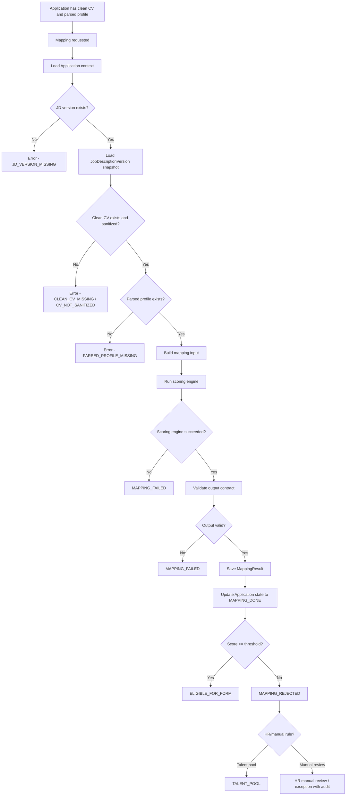

# 09. Mapping CV-JD Specification

## 1. Mục tiêu tài liệu

Tài liệu này mô tả specification cho module `mapping` và nhóm kết quả `mapping-results` / `mapping_results` trong Recruitment Phase 1.

Tài liệu làm nền cho các phần implementation sau này:

- Module `mapping`.
- Module/table `mapping-results` / `mapping_results`.
- API mapping run/get/rerun.
- Workflow-state khi chuyển `Application` qua các trạng thái mapping.
- Audit-log và workflow event liên quan đến mapping.

Tài liệu này không tạo code, không tạo controller/service/module/entity thật và không tạo migration.

Mapping CV-JD là bước đánh giá sơ bộ độ phù hợp giữa CV và JD trước khi gửi form pre-screening. Mapping chỉ hỗ trợ tự động hóa sàng lọc ban đầu, không thay thế HR Review và không phải quyết định cuối cùng của Phase 1.

## 2. Module scope

| Hạng mục | Nội dung |
| -------- | -------- |
| Module name đề xuất | `mapping` |
| Result module/table | `mapping-results` / `mapping_results` |
| Vị trí triển khai | Nằm trong `NestJS Recruitment Core Backend`. |
| Loại module | Internal module, không phải external service. |
| Workflow engine | Core backend tự điều phối, không dùng `n8n` cho flow mapping. |
| AI reuse | Có thể reuse `ai` module, `ai_prompts`, `ai_model_overrides` và prompt infrastructure hiện tại. |
| Input domain | Nhận dữ liệu từ `Application`, `JobDescriptionVersion`, `CvDocument`, `ParsedProfile`. |
| Output domain | Ghi kết quả vào `MappingResult`. |
| Ownership | Mapping không sở hữu `Application`; chỉ ghi kết quả và phát event/state transition. |
| CV source | Mapping không dùng CV gốc/original CV/quarantine file. |
| Decision boundary | Mapping không thay thế HR Review. HR vẫn là người quyết định cuối Phase 1. |

Ngoài scope:

| Ngoài scope | Lý do |
| ----------- | ----- |
| External Mapping API/service | Kiến trúc Phase 1 đã chốt mapping là module nội bộ. |
| Phỏng vấn kỹ thuật | Thuộc phase interview sau HR Review. |
| BM04/evaluation | Thuộc `evaluations` hiện tại và phase phỏng vấn, không thuộc mapping intake. |
| Offer/onboarding | Ngoài phạm vi Phase 1. |
| Sync AMIS | Nếu có, là integration sau HR Review, không nằm trong file này. |
| Sửa flow `sessions`, `evaluations`, `export`, `submissions` | Các module này phục vụ interview flow hiện tại và cần giữ ổn định. |

## 3. Nguyên tắc Mapping CV-JD

| STT | Nguyên tắc | Nội dung |
| --- | ---------- | -------- |
| 1 | Chạy theo `application_id` | Mapping luôn chạy theo `application_id`; không chạy trực tiếp theo `candidate_id` như workflow trung tâm. |
| 2 | Dùng JD version | Mapping phải dùng `job_description_version_id` và snapshot từ `JobDescriptionVersion`, không dùng JD draft hoặc JD mutable hiện tại. |
| 3 | Chỉ dùng dữ liệu CV an toàn | Mapping chỉ dùng clean CV hoặc parsed profile từ clean CV. Không đọc original CV/quarantine CV. |
| 4 | Có output có cấu trúc | Mapping phải lưu `score`, `strengths`, `gaps`, `recommendation`, `evidence`. |
| 5 | Idempotent theo input | Mapping phải idempotent theo `applicationId + cleanCvDocumentId + jobDescriptionVersionId`. |
| 6 | Có audit và workflow event | Mọi run/rerun/fail/reject/pass phải ghi workflow event và audit log phù hợp. |
| 7 | Trace được input | Mapping result phải trace được JD version, clean CV version và parsed profile đã dùng. |
| 8 | Không gửi form khi dưới threshold | Mapping dưới threshold không tự động gửi form pre-screening. |
| 9 | Phân biệt lỗi kỹ thuật và nghiệp vụ | `MAPPING_FAILED` là lỗi kỹ thuật; `MAPPING_REJECTED` là kết quả nghiệp vụ không đạt threshold. |
| 10 | HR là quyết định cuối | HR có thể xem mapping result, nhưng HR Review mới là quyết định cuối cùng của Phase 1. |
| 11 | Không nhồi logic vào `Candidate` | Candidate là shared profile. Mapping result phải gắn với `Application`. |
| 12 | Không phụ thuộc interview flow | Mapping không phụ thuộc `sessions`, `evaluations`, `export`, `submissions`. |

## 4. Mapping flow

Flow bắt buộc:

```text
Application có CV sạch và parsed profile
→ Mapping requested
→ Load JD version snapshot
→ Load clean CV / parsed profile
→ Build mapping input
→ Run scoring engine
→ Validate output contract
→ Save MappingResult
→ Update Application state
→ Nếu đạt threshold: ELIGIBLE_FOR_FORM
→ Nếu không đạt: MAPPING_REJECTED hoặc Talent Pool/manual review tùy rule
```

Mermaid flow:



Các nhánh lỗi:

| Nhánh | Kết quả |
| ----- | ------- |
| Missing JD version | Trả `JD_VERSION_MISSING`, không chạy scoring. |
| Missing clean CV | Trả `CLEAN_CV_MISSING`, không chạy scoring. |
| CV chưa sanitized | Trả `CV_NOT_SANITIZED`, không chạy scoring. |
| Missing parsed profile | Trả `PARSED_PROFILE_MISSING`, không chạy scoring. |
| Scoring engine failed | Chuyển `MAPPING_FAILED`, có thể retry. |
| Output invalid | Chuyển `MAPPING_FAILED`, ghi error schema/output. |
| `score >= threshold` | Chuyển `ELIGIBLE_FOR_FORM`. |
| `score < threshold` | Chuyển `MAPPING_REJECTED`, hoặc `TALENT_POOL`/manual review nếu HR/policy cho phép và có audit. |

## 5. Input contract

| Input | Type | Required | Source | Mô tả |
| ----- | ---- | -------- | ------ | ----- |
| `application_id` | `uuid` | Yes | `applications.id` | Input trung tâm để load toàn bộ context mapping. |
| `candidate_id` | `uuid` | Yes | `applications.candidate_id` | Candidate liên quan, dùng cho trace/audit và duplicate context. |
| `job_posting_id` | `uuid` | Yes | `applications.job_posting_id` | Job posting ứng viên đã apply. |
| `job_description_version_id` | `uuid` | Yes | `applications.job_description_version_id` | JD version snapshot dùng để mapping. |
| `job_description_snapshot` | `json` | Yes | `job_description_versions.snapshot` | Snapshot JD tại thời điểm version được chốt. |
| `clean_cv_document_id` | `uuid` | Yes | `cv_documents.id` | Clean CV input đã qua scan/sanitize. |
| `parsed_profile_id` | `uuid` | Yes | `parsed_profiles.id` | Parsed profile tạo từ clean CV. |
| `parsed_profile` | `json` | Yes | `parsed_profiles.parsed_data` | Dữ liệu profile có cấu trúc. |
| `normalized_text` | `text` | Yes | `parsed_profiles.normalized_text` | Text đã normalize dùng cho matching/evidence. |
| `source_channel` | `string` | No | `applications.source_channel` | Nguồn ứng tuyển như `VCS_PORTAL`, `TOPCV`, `LINKEDIN`. |
| `mapping_config` | `json` | No | Config theo JD/level/system | Cấu hình scoring/threshold/prompt. |
| `threshold` | `number` | Yes | Mapping config hoặc default | Ngưỡng pass mapping, mặc định assumption `70/100` nếu chưa có config khác. |

### `application_id`

`application_id` là input trung tâm. Mapping dùng `application_id` để load:

- `Application`.
- `Candidate`.
- `JobPosting`.
- `JobDescriptionVersion`.
- Current clean CV.
- Parsed profile hiện hành.
- Source channel và trạng thái workflow.

Mapping không chạy độc lập theo `Candidate` vì một candidate có thể apply nhiều job posting khác nhau.

### JD version

Mapping phải dùng snapshot từ `JobDescriptionVersion`.

Không dùng:

- JD draft.
- JD mutable hiện tại.
- Text JD sửa sau khi application đã tạo mà chưa có version mới.

Lý do: mapping result phải audit được theo đúng JD version đã dùng.

### Clean CV

Mapping chỉ dùng CV đã qua `CV_SANITIZED` và nằm trong safe storage.

Không dùng:

- Original CV.
- Quarantine file.
- Existing upload cũ chưa qua `cv_documents` + scan/sanitize.

### Parsed profile

Mapping dùng parsed data từ clean CV.

Nếu parsed profile thiếu dữ liệu quan trọng, mapping có thể:

- Trả warning trong `evidence`.
- Giảm `confidence`.
- Recommendation `NEEDS_HR_REVIEW` hoặc `MAPPING_UNCERTAIN` nếu dữ liệu không đủ để auto reject/pass.

### Mapping config

`mapping_config` có thể gồm:

| Config | Mô tả |
| ------ | ----- |
| `threshold` | Ngưỡng pass. |
| `scoringMode` | `RULE_BASED`, `AI_PROMPT`, `HYBRID`, hoặc `EMBEDDING` later. |
| `requiredSkillsWeight` | Trọng số kỹ năng bắt buộc. |
| `experienceWeight` | Trọng số năm kinh nghiệm. |
| `educationWeight` | Trọng số học vấn/chứng chỉ nếu JD yêu cầu. |
| `levelWeight` | Trọng số level/seniority. |
| `cultureFitWeight` | Chỉ dùng nếu có dữ liệu phù hợp. |
| `aiPromptKey` | Ví dụ `map_cv_to_jd`. |

Ghi chú triển khai:

- Các config cụ thể có thể triển khai sau.
- File này chỉ mô tả contract, không hardcode config.
- Nếu chưa có bảng config riêng, threshold có thể lấy từ app config/env theo migration plan.

## 6. Output contract

| Output | Type | Required | Mô tả |
| ------ | ---- | -------- | ----- |
| `mappingResultId` | `uuid` | Yes | ID kết quả mapping. |
| `applicationId` | `uuid` | Yes | Application được mapping. |
| `jobDescriptionVersionId` | `uuid` | Yes | JD version đã dùng. |
| `cleanCvDocumentId` | `uuid` | Yes | Clean CV đã dùng. |
| `parsedProfileId` | `uuid` | Yes | Parsed profile đã dùng. |
| `score` | `number` | Yes | Điểm mapping, scale đề xuất `0..100`. |
| `threshold` | `number` | Yes | Ngưỡng pass áp dụng cho run này. |
| `thresholdResult` | `enum` | Yes | `PASSED`, `FAILED`, `UNCERTAIN`. |
| `recommendation` | `enum` | Yes | Recommendation nghiệp vụ. |
| `strengths` | `array<string>` | Yes | Điểm mạnh phù hợp JD. |
| `gaps` | `array<string>` | Yes | Khoảng thiếu so với JD. |
| `missingRequirements` | `array<string>` | Yes | Requirement bắt buộc hoặc quan trọng chưa thấy rõ. |
| `evidence` | `array<object>` | Yes | Bằng chứng mapping theo requirement/text/score. |
| `confidence` | `number` | Yes | Độ tin cậy `0..1`. |
| `status` | `enum` | Yes | Trạng thái result hoặc workflow projection, ví dụ `MAPPING_DONE`. |
| `modelVersion` | `string` | No | Version rule/model/prompt. |
| `scoringMode` | `enum` | Yes | `RULE_BASED`, `AI_PROMPT`, `HYBRID`, `EMBEDDING`. |
| `createdAt` | `datetime` | Yes | Thời điểm tạo result. |

JSON example:

```json
{
  "mappingResultId": "uuid",
  "applicationId": "uuid",
  "jobDescriptionVersionId": "uuid",
  "cleanCvDocumentId": "uuid",
  "parsedProfileId": "uuid",
  "score": 82,
  "threshold": 70,
  "thresholdResult": "PASSED",
  "recommendation": "ELIGIBLE_FOR_FORM",
  "strengths": [
    "Có kinh nghiệm Spring Boot",
    "Có kinh nghiệm PostgreSQL",
    "Kinh nghiệm backend phù hợp JD"
  ],
  "gaps": [
    "Chưa thể hiện rõ kinh nghiệm Kafka nâng cao"
  ],
  "missingRequirements": [
    "Kinh nghiệm triển khai hệ thống high traffic chưa rõ"
  ],
  "evidence": [
    {
      "requirement": "Spring Boot",
      "matchedText": "3 năm phát triển backend với Spring Boot",
      "score": 90
    }
  ],
  "confidence": 0.86,
  "status": "MAPPING_DONE",
  "scoringMode": "AI_PROMPT",
  "modelVersion": "map_cv_to_jd_v1",
  "createdAt": "2026-06-18T10:00:00.000Z"
}
```

Recommendation enum đề xuất:

- `ELIGIBLE_FOR_FORM`
- `REJECT_BY_MAPPING`
- `NEEDS_HR_REVIEW`
- `TALENT_POOL`
- `MAPPING_UNCERTAIN`

Threshold result enum đề xuất:

- `PASSED`
- `FAILED`
- `UNCERTAIN`

Ghi chú triển khai:

- API có thể map `recommendation = ELIGIBLE_FOR_FORM` sang application state `ELIGIBLE_FOR_FORM`.
- Nếu database enum dùng `MappingRecommendation` kiểu `PASS`, `REJECT`, `TALENT_POOL`, `NEEDS_REVIEW`, layer API có thể expose enum giàu nghĩa hơn nhưng cần mapping rõ.

## 7. Scoring logic

Các scoring mode có thể dùng:

| Scoring mode | Mô tả | Ưu điểm | Hạn chế | Phase 1 recommendation |
| ------------ | ----- | ------- | ------- | ---------------------- |
| `RULE_BASED` | So khớp skills, years of experience, level, keywords. | Dễ kiểm soát, dễ audit, ít phụ thuộc AI. | Hạn chế về ngữ nghĩa, khó hiểu synonym hoặc context dự án. | Có thể dùng làm pre-score hoặc fallback. |
| `AI_PROMPT` | Dùng AI prompt qua `ai` module hiện tại, trả JSON theo output contract. | Phân tích ngữ nghĩa tốt hơn, tạo strengths/gaps/evidence dễ đọc cho HR. | Cần schema validation, retry, prompt/version tracking, kiểm soát PII. | Có thể dùng cho MVP nếu có guard schema/audit tốt. |
| `EMBEDDING` | So khớp semantic giữa JD và CV bằng vector/embedding. | Tốt cho semantic search/matching later. | Cần embedding store/vector DB/hạ tầng chưa có trong baseline. | Không bắt buộc trong MVP. Để later nếu có hạ tầng. |
| `HYBRID` | Kết hợp rule-based + AI prompt. | Vừa có kiểm soát, vừa có giải thích ngữ nghĩa. | Phức tạp hơn một mode đơn lẻ. | Hướng tốt cho Phase 1 nếu muốn rule-based pre-score + AI giải thích. |

Đề xuất MVP:

```text
Phase 1 có thể bắt đầu bằng AI_PROMPT hoặc HYBRID đơn giản: rule-based pre-score + AI prompt giải thích strengths/gaps/recommendation. Embedding có thể để later nếu chưa có hạ tầng vector.
```

Không yêu cầu triển khai embedding nếu architecture hiện tại chưa có hạ tầng vector.

Scoring dimension:

| Dimension | Mô tả | Weight đề xuất | Evidence |
| --------- | ----- | -------------- | -------- |
| Required skills match | Mức khớp kỹ năng bắt buộc trong JD. | `30%` | Matched skill, text trong parsed profile/CV. |
| Nice-to-have skills match | Mức khớp kỹ năng cộng điểm. | `10%` | Skill phụ, framework/tool liên quan. |
| Years of experience | Kinh nghiệm tổng và kinh nghiệm liên quan. | `20%` | Năm kinh nghiệm parse được, timeline dự án. |
| Level/seniority fit | Phù hợp level như junior/middle/senior/lead. | `15%` | Title, scope dự án, responsibility. |
| Domain/project experience | Dự án/domain tương đồng với JD. | `10%` | Domain, scale, architecture, tech context. |
| Education/certificate | Học vấn/chứng chỉ nếu JD yêu cầu. | `5%` | Degree/certificate parse được. |
| Language | Ngoại ngữ nếu JD yêu cầu. | `5%` | Language/certificate/text evidence. |
| Availability/location | Địa điểm, availability, working mode nếu có dữ liệu. | `3%` | Parsed profile/form/source data. |
| Risk/missing information | Thiếu dữ liệu, inconsistency, confidence thấp. | `- variable` | Missing fields, parse warning, unclear evidence. |

Weight thực tế nên có khả năng cấu hình theo JD/level ở spec cấu hình sau. Các weight trên là proposal, không hardcode.

## 8. Threshold rule

| Threshold | Giá trị đề xuất | Ý nghĩa |
| --------- | --------------- | ------- |
| Default threshold | `70/100` | Assumption khi tài liệu chưa chốt con số khác. |
| Pass | `score >= threshold` | Chuyển `ELIGIBLE_FOR_FORM`. |
| Fail | `score < threshold` | Chuyển `MAPPING_REJECTED` hoặc `TALENT_POOL`/manual review tùy rule HR. |
| Low confidence | Ví dụ `confidence < 0.6` | Có thể recommendation `NEEDS_HR_REVIEW` để tránh loại nhầm. |
| Uncertain band | Ví dụ score sát threshold hoặc thiếu dữ liệu | Có thể `MAPPING_UNCERTAIN`/`NEEDS_HR_REVIEW` nếu policy cho phép. |

Threshold có thể cấu hình theo:

- JD.
- JD version.
- Position.
- Level.
- Source channel.
- Campaign/job posting.

Quy tắc:

- Default threshold `70/100` là assumption nếu chưa có tài liệu chốt.
- Không hardcode threshold trong service nếu có config.
- Threshold dùng cho auto decision sơ bộ, không thay HR Review.
- Mapping dưới threshold không gửi form tự động.
- HR/Admin có thể có override/manual review theo quyền và audit.

## 9. Result entity: MappingResult

Field proposal:

| Field | Type đề xuất | Required | Mô tả |
| ----- | ------------ | -------- | ----- |
| `id` | `uuid` | Yes | Khóa chính. |
| `applicationId` | `uuid` | Yes | Application được mapping. |
| `jobDescriptionVersionId` | `uuid` | Yes | JD version dùng để mapping. |
| `cleanCvDocumentId` | `uuid` | Yes | Clean CV input. |
| `parsedProfileId` | `uuid` | Yes | Parsed profile input. |
| `score` | `number` | Yes | Điểm mapping `0..100`. |
| `threshold` | `number` | Yes | Threshold áp dụng tại thời điểm run. |
| `thresholdResult` | `varchar`/enum | Yes | `PASSED`, `FAILED`, `UNCERTAIN`. |
| `strengths` | `jsonb` | Yes | Danh sách điểm mạnh. |
| `gaps` | `jsonb` | Yes | Danh sách khoảng thiếu. |
| `missingRequirements` | `jsonb` | Yes | Requirement chưa đáp ứng hoặc chưa có evidence. |
| `recommendation` | `varchar`/enum | Yes | `ELIGIBLE_FOR_FORM`, `REJECT_BY_MAPPING`, `NEEDS_HR_REVIEW`, `TALENT_POOL`, `MAPPING_UNCERTAIN`. |
| `status` | `varchar`/enum | Yes | `REQUESTED`, `DONE`, `FAILED`, `REJECTED` hoặc API projection `MAPPING_DONE`, `MAPPING_FAILED`, `MAPPING_REJECTED`. |
| `confidence` | `number` | Yes | Độ tin cậy `0..1`. |
| `evidence` | `jsonb` | Yes | Evidence theo requirement/matched text/score. |
| `scoringMode` | `varchar` | Yes | `RULE_BASED`, `AI_PROMPT`, `HYBRID`, `EMBEDDING`. |
| `modelVersion` | `varchar` | No | Version model/rule/prompt. |
| `promptVersion` | `varchar` | No | Version prompt nếu dùng `AI_PROMPT`/`HYBRID`. |
| `rawResult` | `jsonb` | No | Raw output đã kiểm soát, phục vụ debug/audit. |
| `errorCode` | `varchar` | No | Error code nếu failed. |
| `errorMessage` | `text` | No | Error message rút gọn, không chứa full CV text. |
| `createdAt` | `timestamp` | Yes | Thời điểm tạo result. |

Rule:

- `MappingResult` phải trace được input dùng để mapping.
- Có thể có nhiều mapping result theo rerun, nhưng chỉ một result active/latest nếu cần hiển thị.
- Không update mất kết quả cũ nếu rerun. Nên tạo record mới hoặc version result tùy migration/API spec.
- `rawResult` có thể chứa output AI nhưng cần tránh lưu dữ liệu quá nhạy cảm không cần thiết.
- Nếu lưu raw prompt hoặc input AI, phải redact/giảm thiểu PII và không lưu full CV text nếu không cần.

## 10. API contract liên quan

| Method | Path | Auth/Role | Mục đích |
| ------ | ---- | --------- | -------- |
| `POST` | `/api/applications/:applicationId/mapping/run` | `HR`, `ADMIN`, `SYSTEM` | Chạy mapping cho application. |
| `GET` | `/api/applications/:applicationId/mapping-result` | `HR`, `ADMIN` | Lấy latest/active mapping result. |
| `POST` | `/api/applications/:applicationId/mapping/rerun` | `HR`, `ADMIN` hoặc `ADMIN`-only nếu policy chặt hơn | Chạy lại mapping có audit. |

### `POST /api/applications/:applicationId/mapping/run`

Auth: `HR`, `ADMIN`, `SYSTEM`.

Request:

```json
{
  "force": false,
  "reason": "Auto run after CV parsed"
}
```

Response:

```json
{
  "applicationId": "uuid",
  "mappingResultId": "uuid",
  "status": "MAPPING_DONE",
  "score": 82,
  "threshold": 70,
  "thresholdResult": "PASSED",
  "recommendation": "ELIGIBLE_FOR_FORM",
  "nextState": "ELIGIBLE_FOR_FORM"
}
```

Rule:

- Nếu input chưa sẵn sàng, trả error phù hợp và không chạy scoring.
- Nếu đã có `MAPPING_DONE` cùng input và `force = false`, trả result hiện có.
- `SYSTEM` dùng cho auto run sau `CV_PARSED`/`PROFILE_DUPLICATE_CHECKED`.

### `GET /api/applications/:applicationId/mapping-result`

Auth: `HR`, `ADMIN`.

Response phải trả latest/active mapping result.

```json
{
  "applicationId": "uuid",
  "mappingResultId": "uuid",
  "score": 82,
  "threshold": 70,
  "thresholdResult": "PASSED",
  "recommendation": "ELIGIBLE_FOR_FORM",
  "strengths": ["Có kinh nghiệm Spring Boot"],
  "gaps": ["Chưa thể hiện rõ kinh nghiệm Kafka nâng cao"],
  "confidence": 0.86,
  "status": "MAPPING_DONE",
  "createdAt": "2026-06-18T10:00:00.000Z"
}
```

### `POST /api/applications/:applicationId/mapping/rerun`

Auth: `HR`, `ADMIN`, hoặc `ADMIN`-only nếu muốn chặt hơn.

Request:

```json
{
  "force": true,
  "reason": "JD version updated or HR requested rerun"
}
```

Rule:

- Rerun phải ghi audit.
- Rerun không được ghi đè mất result cũ nếu cần audit.
- Nếu input chưa đổi và không `force`, API phải trả result hiện có.
- Nếu `force = true`, actor phải có quyền và request phải có `reason`.

## 11. State update

| From state | Event | To state | Điều kiện |
| ---------- | ----- | -------- | --------- |
| `PROFILE_DUPLICATE_CHECKED` | `MAPPING_REQUESTED` | `MAPPING_REQUESTED` | Có clean CV, parsed profile, JD version hợp lệ. |
| `MAPPING_REQUESTED` | `MAPPING_SUCCEEDED` | `MAPPING_DONE` | Scoring engine chạy thành công, output hợp lệ, `MappingResult` đã lưu. |
| `MAPPING_REQUESTED` | `MAPPING_FAILED` | `MAPPING_FAILED` | Lỗi kỹ thuật, missing input, provider failed, timeout hoặc output invalid. |
| `MAPPING_DONE` | `MAPPING_ABOVE_THRESHOLD` | `ELIGIBLE_FOR_FORM` | `score >= threshold` và confidence đủ hoặc policy cho phép. |
| `MAPPING_DONE` | `MAPPING_BELOW_THRESHOLD` | `MAPPING_REJECTED` | `score < threshold` và không có HR exception. |
| `MAPPING_FAILED` | `MAPPING_REQUESTED` | `MAPPING_REQUESTED` | Retry hợp lệ sau lỗi kỹ thuật. |
| `MAPPING_REJECTED` | `HR_SENT_TO_TALENT_POOL` | `TALENT_POOL` | HR/manual rule cho phép, có audit. |
| `MAPPING_REJECTED` | `HR_MANUAL_REVIEW_REQUESTED` | HR manual review | Workflow cho phép HR review ngoại lệ, có audit. |

Ghi rõ:

- `MAPPING_FAILED` là lỗi kỹ thuật.
- `MAPPING_REJECTED` là kết quả nghiệp vụ không đạt threshold.
- `ELIGIBLE_FOR_FORM` là điều kiện để tạo `FormSession`.
- Không được tạo form nếu chưa có mapping pass hoặc chưa có override hợp lệ.
- Mapping không cập nhật trực tiếp sang HR decision. HR Review là bước sau AI/form hoặc manual review theo workflow.

## 12. Idempotency / Rerun rule

| Rule | Nội dung |
| ---- | -------- |
| Idempotency key | `applicationId + cleanCvDocumentId + jobDescriptionVersionId`. |
| Result done cùng input | Nếu đã có `MAPPING_DONE` với cùng input, không chạy lại. |
| Timeout retry | Nếu request retry do timeout nhưng result đã được tạo, trả về result hiện có. |
| CV mới | Nếu `cleanCvDocumentId` thay đổi do upload CV mới, cho phép mapping mới. |
| JD version mới | Nếu `jobDescriptionVersionId` thay đổi, cho phép mapping mới. |
| Parsed profile thay đổi | Nếu parsed profile thay đổi, cho phép mapping mới hoặc rerun. |
| `force=true` | Chỉ HR/Admin có quyền được dùng, phải có `reason` và ghi audit. |
| Không ghi đè audit | Rerun nên tạo `MappingResult` mới hoặc version mới, không ghi đè mất audit cũ. |
| Latest/active result | Chỉ một result được đánh dấu latest/active nếu cần hiển thị. |

Process scenarios:

| Scenario | Có chạy mapping mới không? | Hành động |
| -------- | -------------------------- | --------- |
| Cùng input, result done | Không | Trả result hiện có. |
| Cùng input, result failed | Có thể retry | Tạo attempt mới hoặc update attempt, giữ audit. |
| CV mới | Có | Tạo result mới. |
| JD version mới | Có | Tạo result mới. |
| Force rerun | Có | Ghi audit, yêu cầu quyền và reason. |
| Mapping under threshold | Không retry tự động | HR/manual action nếu cần. |

Ghi chú triển khai:

- Unique/index ở migration plan có thể dùng `application_id + clean_cv_document_id + job_description_version_id` cho idempotency success.
- Nếu cần nhiều attempt cho failed result, cần tách attempt log hoặc cho phép nhiều failed records nhưng chỉ một successful/latest record.

## 13. Error handling

| Error case | Error code | State | Retry? | Hành động |
| ---------- | ---------- | ----- | ------ | --------- |
| Application not found | `APPLICATION_NOT_FOUND` | Không đổi hoặc `MAPPING_FAILED` nếu đã request | No | Trả lỗi, không chạy mapping. |
| JD version missing | `JD_VERSION_MISSING` | `MAPPING_FAILED` | No, đến khi dữ liệu được sửa | Ghi workflow/audit, yêu cầu fix application/JD version. |
| Clean CV missing | `CLEAN_CV_MISSING` | `MAPPING_FAILED` | No, đến khi CV sẵn sàng | Không chạy scoring. |
| Parsed profile missing | `PARSED_PROFILE_MISSING` | `MAPPING_FAILED` | No, đến khi parse xong | Không chạy scoring. |
| CV not sanitized | `CV_NOT_SANITIZED` | `MAPPING_FAILED` | No, đến khi sanitize xong | Không dùng original CV. |
| Invalid state transition | `INVALID_STATE_TRANSITION` | Không đổi | No | Reject action, ghi audit nếu request bất thường. |
| AI provider failed | `AI_PROVIDER_FAILED` | `MAPPING_FAILED` | Yes | Retry có kiểm soát cùng idempotency context. |
| AI output invalid/schema invalid | `AI_OUTPUT_INVALID` | `MAPPING_FAILED` | Yes | Retry hoặc fallback rule-based nếu có policy. |
| Mapping engine timeout | `MAPPING_TIMEOUT` | `MAPPING_FAILED` | Yes | Retry sau timeout, trả result hiện có nếu result đã được lưu. |
| Mapping failed | `MAPPING_FAILED` | `MAPPING_FAILED` | Yes nếu lỗi kỹ thuật | Ghi error code/message, không tạo form. |
| Mapping already done | `MAPPING_ALREADY_DONE` | `MAPPING_DONE` | No | Trả result hiện có nếu cùng input. |
| Mapping below threshold | `MAPPING_REJECTED` | `MAPPING_REJECTED` | No auto retry | Không phải lỗi kỹ thuật; HR/manual action nếu cần. |
| Permission denied | `FORBIDDEN` | Không đổi | No | Không chạy/get/rerun mapping. |

Ghi rõ:

- Missing input không nên retry tự động nếu dữ liệu chưa sẵn sàng.
- AI/provider/timeout có thể retry.
- Mapping below threshold không phải lỗi kỹ thuật.
- Mọi error phải ghi audit hoặc workflow event phù hợp.
- `MAPPING_FAILED` không được tự động chuyển `MAPPING_REJECTED`.

## 14. Audit / Workflow event

| Event | Khi nào ghi | Metadata cần có |
| ----- | ----------- | --------------- |
| `MAPPING_REQUESTED` | Khi mapping được enqueue/chạy. | `applicationId`, `candidateId`, `jobPostingId`, `jobDescriptionVersionId`, `cleanCvDocumentId`, `parsedProfileId`, `actorType`, `actorId`, `requestId` |
| `MAPPING_INPUT_BUILT` | Sau khi build input từ JD version + clean CV + parsed profile. | Input IDs, `sourceChannel`, `scoringMode`, `threshold` |
| `MAPPING_DONE` | Khi scoring thành công và result được lưu. | `mappingResultId`, `score`, `threshold`, `thresholdResult`, `recommendation`, `confidence` |
| `MAPPING_FAILED` | Khi lỗi kỹ thuật hoặc output invalid. | Input IDs, `errorCode`, `errorMessage`, `scoringMode`, `modelVersion`, `requestId` |
| `MAPPING_REJECTED` | Khi mapping thành công nhưng dưới threshold. | `mappingResultId`, `score`, `threshold`, `thresholdResult`, `reason` |
| `MAPPING_RERUN_REQUESTED` | Khi HR/Admin/System yêu cầu rerun. | `actorType`, `actorId`, `reason`, input IDs, previous `mappingResultId` |
| `MAPPING_RERUN_DONE` | Khi rerun thành công. | Previous/new `mappingResultId`, score diff, recommendation |
| `MAPPING_RERUN_FAILED` | Khi rerun lỗi. | Previous result, input IDs, `errorCode`, `errorMessage`, `reason` |
| `MAPPING_THRESHOLD_PASSED` | Khi score đạt threshold. | `score`, `threshold`, `thresholdResult`, next state `ELIGIBLE_FOR_FORM` |
| `MAPPING_THRESHOLD_FAILED` | Khi score dưới threshold. | `score`, `threshold`, `thresholdResult`, next state `MAPPING_REJECTED` |

Metadata bắt buộc khi phù hợp:

- `applicationId`
- `candidateId`
- `jobPostingId`
- `jobDescriptionVersionId`
- `cleanCvDocumentId`
- `parsedProfileId`
- `mappingResultId`
- `score`
- `threshold`
- `thresholdResult`
- `scoringMode`
- `modelVersion`
- `actorType`
- `actorId`
- `requestId`
- `errorCode`
- `errorMessage`

Ghi rõ:

- `WorkflowEvent` ghi transition state.
- `AuditLog` ghi hành động kỹ thuật/nghiệp vụ và actor.
- Rerun phải ghi lý do.
- Audit không nên lưu full CV text, raw prompt đầy đủ hoặc PII không cần thiết.

## 15. Security / Data access

| Rule | Nội dung |
| ---- | -------- |
| Không đọc original CV | Mapping không đọc original CV/quarantine CV. |
| Chỉ đọc clean CV/parsed profile | Mapping chỉ đọc clean CV và parsed profile được tạo từ clean CV. |
| Application-level authorization | HR/Admin chỉ xem mapping result theo quyền application, không chỉ check role. |
| Không expose raw prompt | API không trả raw prompt chứa PII không cần thiết. |
| Không log full CV text | Log/audit không ghi full CV text nếu không cần. |
| Kiểm soát `rawResult` | Nếu lưu `rawResult`, cần kiểm soát dữ liệu nhạy cảm và access. |
| Minimize AI input | AI prompt input chỉ chứa dữ liệu cần thiết cho mapping. |
| Không gửi original CV sang AI | Nếu dùng AI provider, không gửi original CV file. |
| Có audit trail | Mapping result phải có audit trail đầy đủ. |
| Rerun có quyền | Rerun phải có quyền, reason và audit. |
| Schema validation | Output từ AI phải validate schema trước khi lưu result thành công. |
| Prompt/version tracking | Prompt key/version/model phải lưu hoặc trace được. |

## 16. Compatibility với source hiện tại

| Source hiện tại | Compatibility / Action |
| --------------- | ---------------------- |
| `ai` module | Source hiện tại đã có AI service, có thể reuse cho `AI_PROMPT`/`HYBRID`. |
| `ai_prompts` | Có thể thêm prompt key mới như `map_cv_to_jd`. |
| `ai_model_overrides` | Có thể reuse để override model cho prompt mapping. |
| `file-parser` | Có parser PDF/DOCX/XLSX, nhưng mapping không gọi parser trực tiếp trên CV gốc. Mapping dùng `ParsedProfile`. |
| `candidates` | Có candidate profile/upload hiện tại, nhưng chưa phải flow mapping Phase 1. |
| `applications` | Chưa có trong source baseline, cần tạo mới ở phase implement để làm workflow center. |
| `cv_documents` | Chưa có trong source baseline, cần có clean CV version trước mapping. |
| `mapping_results` | Chưa có trong source baseline, cần tạo mới để lưu result. |
| Candidate upload hiện tại | Không phải flow mapping Phase 1. Không dùng CV upload cũ như clean CV. |
| `sessions` | Giữ cho interview phase, không dùng cho mapping intake. |
| `evaluations` | Giữ BM04/evaluation hiện tại, không dùng làm MappingResult. |
| `export` | Giữ export interview/evaluation hiện tại, không mở rộng trong spec mapping này. |
| `submissions` | Giữ code submission flow, không liên quan mapping intake. |
| AI JSON parsing hiện tại | Baseline chỉ parse JSON cơ bản sau strip fence; mapping cần schema validation để tránh lưu output sai shape. |

Ghi chú triển khai:

- Mapping nên được tạo thành module mới, không nhồi logic vào `candidates` hoặc `sessions`.
- Có thể reuse AI prompt/model infrastructure, nhưng prompt mapping phải có output schema rõ.
- Nếu dùng rule-based pre-score, có thể reuse catalog `positions`, `levels`, `categories`, `sub-categories` như signal phụ, nhưng không thay JD version snapshot.

## 17. Conflict / Assumption

| Vấn đề | File liên quan | Cách xử lý |
| ------ | -------------- | ---------- |
| Scoring mode mặc định là rule-based, AI prompt hay hybrid | `00_source_baseline_analysis.md`, `03_module_extension_plan.md`, `06_database_migration_plan.md` | Assumption: Phase 1 dùng `AI_PROMPT` hoặc `HYBRID` đơn giản. `RULE_BASED` có thể là pre-score/fallback. |
| Default threshold đã được chốt chưa | Business flow chỉ nói đạt threshold, migration plan nói seed/config threshold nếu cần | Assumption: dùng default `70/100` nếu chưa có config khác. |
| `MAPPING_REJECTED` terminal hay chuyển talent pool/manual review | `05_workflow_state_machine.md`, business flow | Mặc định là terminal nghiệp vụ. HR có thể chuyển `TALENT_POOL` hoặc manual review ngoại lệ nếu có quyền và audit. |
| Rerun tạo record mới hay update record cũ | `06_database_migration_plan.md`, `07_api_contract_specification.md` | Assumption: tạo record mới hoặc version mới để không mất audit. Có thể đánh dấu latest/active result. |
| Có cần embedding trong Phase 1 không | Architecture hiện tại chưa có vector DB/embedding store | Không bắt buộc trong MVP. Để later nếu có hạ tầng. |
| Có cần cấu hình threshold theo JD/level ngay trong Phase 1 không | Architecture có nhắc threshold mapping/config UI, migration plan nhắc default threshold | Assumption: nên thiết kế contract hỗ trợ config theo JD/version/position/level, nhưng MVP có thể dùng default/app config. |
| AI provider output có schema validator nào chưa | Baseline ghi AI JSON parse chưa có schema validator | Cần schema validation khi implement mapping. Spec này yêu cầu validate output contract trước khi lưu `MAPPING_DONE`. |
| Mapping status enum giữa API và DB | `06_database_migration_plan.md`, `07_api_contract_specification.md` | DB có thể dùng `DONE/FAILED/REJECTED`; workflow/API dùng `MAPPING_DONE/MAPPING_FAILED/MAPPING_REJECTED`. Implementation cần mapping rõ. |

Không phát hiện conflict ảnh hưởng trực tiếp đến Mapping CV-JD specification ở mức specification. Các điểm còn mở được ghi nhận là assumption để xử lý khi implement thực tế.

## 18. Kết luận

Mapping CV-JD Phase 1 phải là module nội bộ trong NestJS Recruitment Core, chạy theo `application_id` và chỉ sử dụng JD version, clean CV, parsed profile. Kết quả mapping phải được lưu vào `MappingResult`, có score, strengths, gaps, recommendation, threshold result, idempotency và audit đầy đủ. Mapping chỉ là bước tự động hóa sàng lọc sơ bộ, không thay thế HR Review.
