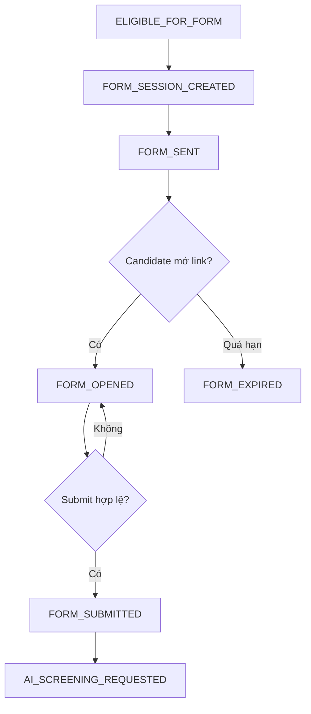

# 10. Form Pre-screening Specification

## 1. Mục tiêu tài liệu

Tài liệu này mô tả specification cho pre-screening form trong Recruitment Phase 1 của Interview Assistant / Recruitment Core Backend.

Tài liệu làm nền cho các phần implementation sau này:

- Module `question-sets`.
- Module `form-sessions`.
- Module `form-answers`.
- Module `notifications`.
- Public/private Form API.
- Workflow-state và audit event liên quan đến form.

Tài liệu này không tạo code, không tạo controller/service/module/entity thật và không tạo migration.

Pre-screening form được gửi sau khi Mapping CV-JD đạt điều kiện, tức application đã chuyển đến `ELIGIBLE_FOR_FORM`, hoặc có HR/Admin override hợp lệ và được audit rõ.

## 2. Module scope

| Hạng mục | Nội dung |
| -------- | -------- |
| Module liên quan | `question-sets`, `form-sessions`, `form-answers`, `notifications` |
| Workflow center | `Application` là trung tâm workflow; form session phải gắn với `application_id` |
| Question config | Question set được cấu hình theo JD/vị trí/level và có thể gắn với JD version cụ thể |
| Candidate access | Candidate truy cập form bằng public token riêng của `FormSession` |
| Form answer | Lưu theo `application_id`, `form_session_id`, `question_set_item_id` |
| Next step | Form submitted là input cho `ai-screening` |
| Boundary với interview | Form không phải interview session |
| Token boundary | Form không dùng `interview_sessions.accessToken` |
| HR Review boundary | Form không thay thế HR Review; form chỉ là dữ liệu đầu vào trước AI Screening và HR Review |
| Workflow engine | Core backend điều phối flow form; không đưa `n8n` vào flow form Phase 1 |

Ngoài scope:

| Ngoài scope | Lý do |
| ----------- | ----- |
| Phỏng vấn kỹ thuật | Thuộc phase interview sau HR Review |
| BM04/evaluation | Thuộc `evaluations` và interview flow hiện hữu |
| Quản lý vòng phỏng vấn | Không thuộc pre-screening intake Phase 1 |
| Offer/onboarding | Nằm sau HR Review và ngoài phạm vi Phase 1 |
| Sửa mạnh `sessions`, `evaluations`, `export`, `submissions` | Các flow hiện tại cần giữ ổn định |

## 3. Question config

HR cấu hình bộ câu hỏi theo JD/vị trí/level để dùng cho pre-screening form. Một question set có thể gắn với `JobDescription`, `JobDescriptionVersion`, `Position`, `Level`, hoặc tổ hợp các thực thể này tùy mức cấu hình.

Question set phải được snapshot vào form session để tránh việc HR chỉnh câu hỏi sau khi gửi làm lệch dữ liệu trả lời. Có thể reuse `questions`, `categories`, `positions`, `levels` hiện có làm question bank và taxonomy, nhưng câu hỏi gửi cho candidate cần có snapshot text/type/options tại thời điểm tạo form session.

| Thành phần | Mô tả | Ghi chú |
| ---------- | ----- | ------- |
| `QuestionSet` | Bộ câu hỏi pre-screening theo JD/vị trí/level | Có thể link `jobDescriptionId`, `jobDescriptionVersionId`, `positionId`, `levelId` |
| `QuestionSetItem` | Một câu hỏi trong bộ câu hỏi | Xác định thứ tự, bắt buộc hay không và metadata validate |
| `questionId` | Tham chiếu câu hỏi gốc trong question bank | Optional nếu câu hỏi được tạo riêng cho question set |
| `questionTextSnapshot` | Nội dung câu hỏi tại thời điểm snapshot | Bắt buộc để giữ ổn định dữ liệu |
| `questionType` | Loại câu hỏi | Dùng để validate answer |
| `orderIndex` | Thứ tự hiển thị | Dùng để render UI và lưu answer nhất quán |
| `required` | Câu hỏi bắt buộc hay không | Dùng khi submit |
| `metadata` | Cấu hình phụ như options, max length, min/max number, file rule | Nên lưu dạng `jsonb` khi implement |

Question type đề xuất:

| Question type | Mô tả | Answer format |
| ------------- | ----- | ------------- |
| `TEXT` | Câu trả lời ngắn | string |
| `TEXTAREA` | Câu trả lời dài | string |
| `SINGLE_CHOICE` | Chọn một đáp án | string/value |
| `MULTIPLE_CHOICE` | Chọn nhiều đáp án | array |
| `NUMBER` | Nhập số | number |
| `DATE` | Chọn ngày | ISO date |
| `YES_NO` | Có/Không | boolean |
| `FILE` | Upload bổ sung nếu cần | file metadata |

Ví dụ question set:

```json
{
  "questionSetId": "uuid",
  "jobDescriptionVersionId": "uuid",
  "name": "Backend Developer Pre-screening",
  "items": [
    {
      "questionSetItemId": "uuid",
      "questionTextSnapshot": "Bạn có thể bắt đầu đi làm từ khi nào?",
      "questionType": "TEXT",
      "required": true,
      "orderIndex": 1
    },
    {
      "questionSetItemId": "uuid",
      "questionTextSnapshot": "Bạn có kinh nghiệm Spring Boot bao nhiêu năm?",
      "questionType": "NUMBER",
      "required": true,
      "orderIndex": 2
    }
  ]
}
```

Ghi chú triển khai:

- `QuestionSetItem.metadata.options` nên được snapshot với `SINGLE_CHOICE` và `MULTIPLE_CHOICE`.
- Nếu reuse `questions`, không nên đọc mutable question text trực tiếp khi candidate submit; phải validate theo snapshot của form session.

## 4. Form session

`FormSession` là phiên form public được tạo cho một `Application`. Mỗi form session có token riêng chỉ dùng cho candidate access form. Token phải lưu dạng `tokenHash`, không lưu plain token trong database, log hoặc audit.

Form session có thời gian hết hạn. Không tạo nhiều active form session song song cho cùng `application_id + question_set_id`, trừ khi session cũ đã `EXPIRED`/`CANCELLED` hoặc có rule reopen/rotate token rõ.

| Field | Type đề xuất | Required | Mô tả |
| ----- | ------------ | -------- | ----- |
| `id` | `uuid` | Yes | ID của form session |
| `applicationId` | `uuid` | Yes | FK đến `applications.id` |
| `questionSetId` | `uuid` | Yes | FK đến `question_sets.id` |
| `tokenHash` | `string` | Yes | Hash của public token |
| `status` | `enum` | Yes | Trạng thái session: `CREATED`, `SENT`, `OPENED`, `SUBMITTED`, `EXPIRED`, `CANCELLED` |
| `expiresAt` | `timestamp` | Yes | Hạn cuối candidate được mở/submit form |
| `sentAt` | `timestamp` | No | Thời điểm gửi link thành công hoặc queued |
| `openedAt` | `timestamp` | No | Thời điểm mở form hợp lệ lần đầu |
| `submittedAt` | `timestamp` | No | Thời điểm submit thành công |
| `createdAt` | `timestamp` | Yes | Thời điểm tạo form session |

Status session:

| Status | Ý nghĩa |
| ------ | ------- |
| `CREATED` | Đã tạo session và token hash, chưa gửi link |
| `SENT` | Đã gửi hoặc queue notification link form |
| `OPENED` | Candidate đã mở link hợp lệ |
| `SUBMITTED` | Candidate đã submit form thành công |
| `EXPIRED` | Session quá hạn trước khi submit |
| `CANCELLED` | Session bị hủy/revoked nếu cần |

Ghi rõ:

- Public link chứa raw token, DB chỉ lưu `tokenHash`.
- Raw token chỉ nên xuất hiện trong response tạo session hoặc payload gửi notification, không ghi vào log/audit.
- `expiresAt` phải được check ở mọi public access/submit API.
- Sau `SUBMITTED`, không cho submit lại nếu không có reopen rule.
- Workflow state dùng `FORM_SESSION_CREATED`, `FORM_SENT`, `FORM_OPENED`, `FORM_SUBMITTED`, `FORM_EXPIRED`; DB session status có thể dùng enum ngắn hơn như bảng trên.

## 5. Candidate access

Candidate nhận link qua email hoặc kênh notification phù hợp, sau đó truy cập form qua public token. Candidate không cần JWT và không có candidate account trong scope này.

Token phải đủ random, khó đoán, có expiry và bị rate limit khi access. Candidate chỉ thấy thông tin cần thiết: tên vị trí, tên ứng viên nếu có, câu hỏi, hạn trả lời và lời dẫn ngắn. Form token không được expose mapping score chi tiết, AI result, clean CV hoặc raw CV.

| Trường hợp | Behavior |
| ---------- | -------- |
| Token hợp lệ | Hiển thị form, nếu chưa mở thì ghi nhận `FORM_OPENED`/`openedAt` |
| Token sai | Báo link không hợp lệ, không leak application tồn tại hay không |
| Token hết hạn | Báo form đã hết hạn, không cho submit |
| Đã submit | Báo form đã được gửi, không cho sửa nếu chưa có reopen rule |
| Application bị reject/closed | Báo form không còn hiệu lực |

Ghi chú triển khai:

- Public response nên tránh trả các ID nội bộ không cần thiết ngoài các ID cần cho client submit.
- Candidate UI có thể hiển thị `jobTitle`, `candidateName`, `expiresAt`, `questions`.
- Không dùng `interview_sessions.accessToken` trong bất kỳ URL form nào.

## 6. Form answer

Câu trả lời lưu theo `form_session_id`, `application_id`, `question_set_item_id`. Mỗi required question phải có answer hợp lệ trước khi submit.

MVP có thể chỉ hỗ trợ submit một lần. Nếu hỗ trợ save draft, draft phải được cập nhật có kiểm soát, không chuyển state sang `FORM_SUBMITTED`, và không làm mất audit khi cần truy vết.

Answer nên lưu dạng `jsonb` hoặc text tùy question type. Với `FILE`, answer chỉ nên lưu metadata/file reference an toàn, không nhúng binary.

| Field | Type đề xuất | Required | Mô tả |
| ----- | ------------ | -------- | ----- |
| `id` | `uuid` | Yes | ID câu trả lời |
| `formSessionId` | `uuid` | Yes | FK đến `form_sessions.id` |
| `applicationId` | `uuid` | Yes | FK đến `applications.id`, giúp query theo application |
| `questionSetItemId` | `uuid` | Yes | FK đến item snapshot của question set |
| `answer` | `jsonb` hoặc `text` | Yes với required question | Giá trị answer theo type |
| `answeredAt` | `timestamp` | Yes khi answer được lưu | Thời điểm answer được ghi nhận |
| `createdAt` | `timestamp` | Yes | Thời điểm tạo record |
| `updatedAt` | `timestamp` | No | Cần nếu hỗ trợ draft/upsert answer |

Answer format theo type:

| Question type | Expected answer |
| ------------- | --------------- |
| `TEXT` | string |
| `TEXTAREA` | string |
| `SINGLE_CHOICE` | string/value |
| `MULTIPLE_CHOICE` | array |
| `NUMBER` | number |
| `DATE` | ISO date |
| `YES_NO` | boolean |
| `FILE` | file metadata |

Ghi chú triển khai:

- Nên có unique constraint logic theo `formSessionId + questionSetItemId` cho draft/upsert.
- Khi submit, hệ thống validate toàn bộ answers theo snapshot question set.
- Không tái sử dụng trực tiếp `session_survey_questions` làm form answer Phase 1.

## 7. Form states

| State | Ý nghĩa | Trigger |
| ----- | ------- | ------- |
| `FORM_SESSION_CREATED` | Hệ thống tạo form session/token riêng | `Application` ở `ELIGIBLE_FOR_FORM` hoặc có override hợp lệ |
| `FORM_SENT` | Đã gửi link form cho candidate | Notification send/queue thành công |
| `FORM_OPENED` | Candidate mở link hợp lệ lần đầu | Public access/opened API với token hợp lệ và chưa expire |
| `FORM_SUBMITTED` | Candidate submit form thành công | Submit hợp lệ, pass validation required/type |
| `FORM_EXPIRED` | Quá hạn trước khi submit | Scheduler hoặc public access/submit phát hiện `expiresAt` đã qua |



Ghi chú triển khai:

- `FORM_SESSION_CREATED` không đồng nghĩa đã gửi link; notification có thể fail/queued.
- `FORM_EXPIRED` có thể được set bởi cron/job hoặc lazy check khi candidate mở/submit.
- Sau `FORM_SUBMITTED`, Core enqueue hoặc request `AI_SCREENING_REQUESTED`.

## 8. Validation rule

| Rule | Nội dung | Error code |
| ---- | -------- | ---------- |
| Token phải hợp lệ | Raw token được hash và match `form_sessions.token_hash` | `FORM_TOKEN_INVALID` |
| Token chưa hết hạn | `expiresAt` chưa qua tại thời điểm access/submit | `FORM_TOKEN_EXPIRED` |
| Form chưa submitted | Không cho submit lại session đã `SUBMITTED` | `FORM_ALREADY_SUBMITTED` |
| Application còn cho phép submit | Application chưa reject/closed và đang ở state form hợp lệ | `FORM_INVALID_STATE` |
| Required question phải có answer | Tất cả item `required=true` có answer không rỗng | `FORM_REQUIRED_ANSWER_MISSING` |
| Answer type phải đúng `questionType` | Validate theo snapshot type | `FORM_ANSWER_TYPE_INVALID` |
| Single choice phải nằm trong options | Answer phải thuộc `metadata.options` snapshot | `FORM_ANSWER_TYPE_INVALID` |
| Multiple choice phải là array hợp lệ | Answer là array và mọi option thuộc snapshot options | `FORM_ANSWER_TYPE_INVALID` |
| Number phải là số hợp lệ | Không nhận text không parse được thành number | `FORM_ANSWER_TYPE_INVALID` |
| Date phải là ISO date hợp lệ | Không nhận date sai format hoặc ngoài rule metadata | `FORM_ANSWER_TYPE_INVALID` |
| Text không vượt max length | Validate `metadata.maxLength` nếu có | `FORM_ANSWER_TYPE_INVALID` |
| Submit một lần | Duplicate submit không tạo answer hoặc workflow event trùng | `FORM_SUBMIT_DUPLICATE` |
| Không submit khi expired | Session `EXPIRED` hoặc `expiresAt` đã qua | `FORM_TOKEN_EXPIRED` |
| Không submit khi cancelled/revoked | Session `CANCELLED` không còn hiệu lực | `FORM_INVALID_STATE` |
| Question phải thuộc form | Không nhận answer cho `questionSetItemId` ngoài question set của session | `FORM_QUESTION_NOT_FOUND` |
| Không sửa answer sau submit | Candidate không được update answer sau `SUBMITTED` nếu không có reopen rule | `FORM_ALREADY_SUBMITTED` |

Ghi rõ:

- Không tạo form nếu application chưa đạt `ELIGIBLE_FOR_FORM`, trừ khi HR/Admin override hợp lệ và có audit.
- Validation phía client chỉ hỗ trợ trải nghiệm; server validation là nguồn quyết định.
- Public error response không nên leak thông tin nội bộ như mapping result, AI result hoặc CV state chi tiết.

## 9. Notification

Notification gửi link form cho candidate sau khi tạo form session. Kênh MVP chính là email/SMTP. Có thể mở rộng sang channel message/bot nếu candidate đến từ Facebook, LinkedIn, TopCV, VietnamWorks, nhưng phải kiểm soát rủi ro chia sẻ link public.

Notification phải ghi delivery status nếu có. Resend link phải idempotent, không tạo form session mới nếu session còn hiệu lực.

| Notification | Trigger | Recipient | Channel | Nội dung |
| ------------ | ------- | --------- | ------- | -------- |
| Send form link | Sau `FORM_SESSION_CREATED` hoặc HR/System bấm gửi | Candidate | Email/SMTP MVP | Link form, hạn trả lời, job title |
| Resend form link | HR/System resend khi session còn hiệu lực | Candidate | Email/SMTP hoặc channel phù hợp | Gửi lại cùng link/token nếu chưa rotate |
| Reminder trước expiry | Gần `expiresAt` và chưa submit | Candidate | Email/SMTP hoặc channel phù hợp | Nhắc hoàn thành form trước hạn |
| Notify HR khi submitted | Candidate submit thành công | HR owner/recruiter | Email/in-app nếu có | Thông báo form đã submitted |
| Notify HR khi expired | Session hết hạn nếu cần | HR owner/recruiter | Email/in-app nếu có | Thông báo candidate chưa submit đúng hạn |

Email content cần có:

- Tên ứng viên nếu có.
- Tên vị trí ứng tuyển.
- Link form.
- Thời hạn trả lời.
- Lưu ý bảo mật link, ví dụ không chuyển tiếp link cho người khác.

Ghi rõ:

- Không đưa raw token vào log/audit; chỉ ghi trạng thái gửi, recipient, template, delivery status.
- Nếu notification send failed, form session vẫn có thể ở `CREATED` hoặc trạng thái delivery failure riêng; không nên tạo session mới tự động.
- Delivery retry dùng cùng `formSessionId + recipient + template`.

## 10. UI behavior

| UI state | Điều kiện | Behavior |
| -------- | --------- | -------- |
| Form hợp lệ chưa mở | Token hợp lệ, chưa `openedAt`, chưa expire | Hiển thị form và ghi nhận mở form |
| Form đang nhập | Candidate nhập câu trả lời | Validate nhẹ phía client, giữ trạng thái input |
| Required question chưa trả lời | Submit thiếu answer bắt buộc | Highlight câu hỏi, hiển thị lỗi gần field |
| Answer sai type | Number/date/options sai format | Hiển thị lỗi type và không submit |
| Form submit thành công | Server trả `FORM_SUBMITTED` | Hiển thị trang cảm ơn, không cho sửa |
| Form hết hạn | Token hết hạn hoặc session `EXPIRED` | Hiển thị thông báo hết hạn, hướng dẫn liên hệ HR nếu có |
| Form đã submit | Session `SUBMITTED` | Hiển thị thông báo form đã được gửi |
| Token không hợp lệ | Không match token hash | Hiển thị thông báo link không hợp lệ |
| Application không còn nhận form | Application rejected/closed hoặc state không hợp lệ | Hiển thị thông báo form không còn hiệu lực |
| Loading/error khi submit | Đang gọi API hoặc gặp lỗi mạng/server | Disable submit khi loading, cho retry an toàn nếu chưa submitted |
| Mobile responsive | Candidate mở bằng mobile | Layout một cột, field dễ bấm, button không tràn màn hình |

UI tối thiểu:

- Hiển thị tiêu đề vị trí.
- Hiển thị mô tả ngắn/lời dẫn.
- Hiển thị danh sách câu hỏi theo `orderIndex`.
- Mark required question.
- Validate tại client trước khi submit.
- Submit xong hiển thị trang cảm ơn.
- Không hiển thị mapping result/AI result cho candidate.

## 11. API contract

| Method | Path | Auth/Role | Mục đích |
| ------ | ---- | --------- | -------- |
| `POST` | `/api/applications/:applicationId/form-sessions` | `HR`, `ADMIN`, `SYSTEM` | Tạo form session cho application |
| `POST` | `/api/applications/:applicationId/form-sessions/:formSessionId/resend` | `HR`, `ADMIN`, `SYSTEM` | Gửi lại link form |
| `GET` | `/api/forms/access/:token` | Public token | Candidate mở form bằng token |
| `POST` | `/api/forms/access/:token/opened` | Public token | Ghi nhận mở form |
| `PUT` | `/api/forms/access/:token/answers` | Public token | Save draft/upsert answers nếu MVP hỗ trợ |
| `POST` | `/api/forms/access/:token/submit` | Public token | Submit form |
| `GET` | `/api/applications/:applicationId/form-sessions` | `HR`, `ADMIN`, `SYSTEM` | List form sessions của application |
| `GET` | `/api/applications/:applicationId/form-sessions/:formSessionId` | `HR`, `ADMIN`, `SYSTEM` | Xem chi tiết form session |

Auth:

- Create/resend/list/detail: `HR`, `ADMIN`, `SYSTEM`.
- Access/opened/answers/submit: Public token.
- Không dùng JWT candidate.
- Public token không phải `interview_sessions.accessToken`.

### Create form session

Request:

```json
{
  "questionSetId": "uuid",
  "expiresAt": "2026-06-25T23:59:59.000Z",
  "sendNotification": true
}
```

Response:

```json
{
  "formSessionId": "uuid",
  "applicationId": "uuid",
  "status": "FORM_SESSION_CREATED",
  "expiresAt": "2026-06-25T23:59:59.000Z",
  "formUrl": "https://portal.example.com/forms/access/token"
}
```

Rule:

- Chỉ tạo nếu application ở `ELIGIBLE_FOR_FORM` hoặc có HR/Admin override hợp lệ.
- Nếu đã có active session cho `applicationId + questionSetId`, trả session hiện có hoặc lỗi idempotency thay vì tạo session mới.

### Access form by token

Response:

```json
{
  "formSessionId": "uuid",
  "applicationId": "uuid",
  "jobTitle": "Backend Developer",
  "candidateName": "Nguyen Van A",
  "status": "FORM_OPENED",
  "expiresAt": "2026-06-25T23:59:59.000Z",
  "questions": [
    {
      "questionSetItemId": "uuid",
      "text": "Bạn có thể bắt đầu đi làm từ khi nào?",
      "type": "TEXT",
      "required": true,
      "orderIndex": 1
    }
  ]
}
```

Rule:

- Nếu access hợp lệ lần đầu, set `openedAt` và chuyển workflow `FORM_OPENED`.
- Nếu đã opened, API vẫn trả form nếu chưa submitted/expired.

### Save draft nếu cần

MVP có thể bỏ save draft. Nếu hỗ trợ, dùng `PUT /api/forms/access/:token/answers`. Save draft không chuyển state sang `FORM_SUBMITTED`.

Request:

```json
{
  "answers": [
    {
      "questionSetItemId": "uuid",
      "answer": "Tôi có thể đi làm sau 30 ngày."
    }
  ]
}
```

Response:

```json
{
  "formSessionId": "uuid",
  "status": "FORM_OPENED",
  "savedAt": "2026-06-18T10:00:00.000Z"
}
```

### Submit form

Request:

```json
{
  "answers": [
    {
      "questionSetItemId": "uuid",
      "answer": "Tôi có thể đi làm sau 30 ngày."
    }
  ]
}
```

Response:

```json
{
  "formSessionId": "uuid",
  "applicationId": "uuid",
  "status": "FORM_SUBMITTED",
  "submittedAt": "2026-06-18T10:00:00.000Z",
  "nextState": "AI_SCREENING_REQUESTED"
}
```

Error cases bắt buộc:

| Case | Error code |
| ---- | ---------- |
| Token invalid | `FORM_TOKEN_INVALID` |
| Token expired | `FORM_TOKEN_EXPIRED` |
| Form already submitted | `FORM_ALREADY_SUBMITTED` |
| Missing required answer | `FORM_REQUIRED_ANSWER_MISSING` |
| Answer type invalid | `FORM_ANSWER_TYPE_INVALID` |
| Invalid state transition | `FORM_INVALID_STATE` |
| Application not found | `APPLICATION_NOT_FOUND` |
| Question set not found | `QUESTION_SET_NOT_FOUND` |
| Notification send failed | `NOTIFICATION_SEND_FAILED` |

Ghi chú triển khai:

- Các API public phải có rate limit và request trace.
- Với retry submit do network, nếu submit đã thành công thì trả response hiện có, không tạo answer/workflow event trùng.
- Nếu cần tương thích với API contract cũ từng dùng `POST /answers`, có thể hỗ trợ alias, nhưng contract chính của draft/upsert trong tài liệu này là `PUT /api/forms/access/:token/answers`.

## 12. Data model liên quan

| Entity/Table | Vai trò |
| ------------ | ------- |
| `applications` | Trung tâm workflow, chứa application ứng tuyển vào job posting cụ thể |
| `question_sets` | Cấu hình bộ câu hỏi theo JD/vị trí/level |
| `question_set_items` | Item câu hỏi, snapshot type/text/options/order |
| `form_sessions` | Phiên form public theo application và question set |
| `form_answers` | Câu trả lời của candidate theo form session/application/question item |
| `workflow_events` | Ghi event chuyển state form và AI Screening |
| `audit_logs` | Audit create/resend/open/submit/expire/cancel/reopen nếu có |
| `notifications` hoặc delivery log | Ghi trạng thái gửi email/link/reminder |
| `ai_screening_results` | Bước sau form submitted, dùng form answers làm input |

Field chính cần có:

| Field | Ghi chú |
| ----- | ------- |
| `form_sessions.application_id` | Link form session với `Application` |
| `form_sessions.question_set_id` | Link question set được gửi |
| `form_sessions.token_hash` | Hash của public token |
| `form_sessions.status` | `CREATED`, `SENT`, `OPENED`, `SUBMITTED`, `EXPIRED`, `CANCELLED` |
| `form_sessions.expires_at` | Hạn dùng token/form |
| `form_sessions.sent_at` | Thời điểm gửi link |
| `form_sessions.opened_at` | Thời điểm mở form đầu tiên |
| `form_sessions.submitted_at` | Thời điểm submit |
| `form_answers.form_session_id` | Link answer với form session |
| `form_answers.application_id` | Link answer với application |
| `form_answers.question_set_item_id` | Link answer với item snapshot |
| `form_answers.answer` | Nội dung trả lời theo type |

## 13. State transition liên quan

| From state | Event | To state | Owner module |
| ---------- | ----- | -------- | ------------ |
| `ELIGIBLE_FOR_FORM` | `FORM_SESSION_CREATE_REQUESTED` | `FORM_SESSION_CREATED` | `form-sessions`, `workflow-state`, `audit-logs` |
| `FORM_SESSION_CREATED` | `FORM_LINK_SENT` | `FORM_SENT` | `notifications`, `form-sessions`, `workflow-state`, `audit-logs` |
| `FORM_SENT` | `FORM_OPENED_BY_CANDIDATE` | `FORM_OPENED` | `form-sessions`, `workflow-state`, `audit-logs` |
| `FORM_SENT` | `FORM_EXPIRED_BY_TIME` | `FORM_EXPIRED` | `form-sessions`, `workflow-state`, `audit-logs` |
| `FORM_OPENED` | `FORM_SUBMITTED_BY_CANDIDATE` | `FORM_SUBMITTED` | `form-answers`, `form-sessions`, `workflow-state`, `audit-logs` |
| `FORM_OPENED` | `FORM_EXPIRED_BY_TIME` | `FORM_EXPIRED` | `form-sessions`, `workflow-state`, `audit-logs` |
| `FORM_SUBMITTED` | `AI_SCREENING_REQUESTED` | `AI_SCREENING_REQUESTED` | `ai-screening`, `workflow-state`, `audit-logs` |

Ghi chú triển khai:

- `notifications` sở hữu việc gửi link, resend và reminder; `workflow-state` sở hữu state chính của application.
- `form-answers` sở hữu validate/lưu câu trả lời, nhưng không tự quyết định HR Review.
- `ai-screening` chỉ được request khi form đã `FORM_SUBMITTED` và input mapping/form hợp lệ.

## 14. Idempotency / Retry rule

| Process | Idempotency key | Rule |
| ------- | --------------- | ---- |
| Create form session | `applicationId + questionSetId + active session` | Không tạo nhiều active session cùng lúc; trả session hiện có hoặc yêu cầu cancel/expire session cũ |
| Send form link | `formSessionId + recipient + template` | Retry gửi cùng session, không tạo token mới |
| Resend link | `formSessionId + recipient + template` | Không tạo token mới nếu session còn hiệu lực, trừ khi có rule rotate token |
| Open form | `formSessionId + firstOpenedAt` | Chỉ set `openedAt` lần đầu; các lần sau chỉ đọc form |
| Save answer draft | `formSessionId + questionSetItemId` | Upsert answer draft mới nhất nếu hỗ trợ draft |
| Submit form | `formSessionId + token + status` | Submit một lần; lock theo session để tránh race condition |
| Submit retry do network | `formSessionId + token + status` hoặc `Idempotency-Key` | Nếu đã submit thành công, trả response hiện có, không tạo answer trùng |
| Expire form | `formSessionId + status` | Job/cron expire idempotent; chỉ chuyển session chưa submitted sang `EXPIRED` |

Ghi rõ:

- Không tạo nhiều active form session song song cho cùng application/question set.
- Không cho submit hai lần.
- Nếu muốn cho ứng viên bổ sung sau `HR_REQUESTED_MORE_INFO`, cần tạo form session mới hoặc có reopen rule riêng.
- Nếu resend link thất bại rồi retry, vẫn dùng cùng `formSessionId`.

## 15. Security / Access control

| Rule | Nội dung |
| ---- | -------- |
| Public token random | Token phải random, đủ dài, khó đoán |
| Chỉ lưu hash | DB chỉ lưu `tokenHash`, không lưu raw token |
| Token expiry | Token phải có `expiresAt` và bị reject sau expiry |
| Rate limit public API | `/api/forms/access/:token` và submit phải rate limit |
| Không expose mapping/AI/CV | Form token không được xem mapping result, AI result, clean CV hoặc raw CV |
| Candidate thấy dữ liệu tối thiểu | Chỉ trả job title, candidate name nếu có, questions, deadline |
| HR/Admin xem answer theo quyền | HR/Admin mới xem được form answers theo application scope |
| Audit create/resend/cancel | Các hành động quản trị form phải ghi audit |
| Audit submit | Submit form phải ghi workflow event/audit |
| Hạn chế log answer nhạy cảm | Không log answer full text nếu không cần |
| Chống duplicate submit | Lock/idempotency khi submit |
| Chống brute-force token | Rate limit, generic error, token entropy cao |
| Channel bot link risk | Nếu gửi link qua bot/channel, không gửi vào nơi không xác thực ứng viên nếu rủi ro cao |

Ghi chú triển khai:

- Public token không thay thế authentication nội bộ.
- HR/Admin API phải dùng JWT/role guard hiện có hoặc guard Phase 1 tương đương.
- File upload trong question type `FILE` cần policy riêng về file size, malware scan và storage an toàn nếu được bật.

## 16. Compatibility với source hiện tại

| Source hiện tại | Compatibility / Action |
| --------------- | ---------------------- |
| `sessions` | Giữ cho interview session flow hiện tại; không dùng làm pre-screening form |
| `session_survey_questions` | Là survey/question của interview session, không dùng trực tiếp làm form answer Phase 1 |
| Public candidate session token hiện có | Không reuse; Phase 1 form cần token riêng của `FormSession` |
| `interview_sessions.accessToken` | Không dùng cho pre-screening form |
| `questions` | Có thể reuse làm question bank nếu phù hợp |
| `categories` | Có thể reuse taxonomy/phân loại câu hỏi |
| `positions` | Có thể reuse cho cấu hình theo vị trí |
| `levels` | Có thể reuse cho cấu hình theo level |
| Notification Telegram reminder hiện có | Có thể tham khảo/extend có kiểm soát, nhưng pre-screening form cần email/notification abstraction riêng |
| `ai` module | Có thể reuse infrastructure; form answers là input cho `ai-screening` sau `FORM_SUBMITTED` |
| `sessions/evaluations/export/submissions` | Không sửa mạnh và không làm dependency bắt buộc của pre-screening form |

Ghi chú triển khai:

- Source hiện tại có nhiều thành phần phục vụ interview flow. Pre-screening form Phase 1 là intake flow trước HR Review, nên cần module riêng để tránh phá behavior cũ.
- Nếu reuse question bank hiện có, cần thêm lớp `QuestionSet`/snapshot thay vì đọc mutable question trực tiếp.

## 17. Conflict / Assumption

| Vấn đề | File liên quan | Cách xử lý |
| ------ | -------------- | ---------- |
| MVP có cần save draft hay chỉ submit một lần | `07_api_contract_specification.md`, business flow | Assumption: MVP có thể không cần save draft; nếu có, dùng `PUT /api/forms/access/:token/answers` và không chuyển state |
| Có cho resend link không | `05_workflow_state_machine.md`, `07_api_contract_specification.md` | Cho phép resend cùng session còn hiệu lực, idempotent |
| Có rotate token khi resend không | `06_database_migration_plan.md`, `07_api_contract_specification.md` | Assumption: không rotate mặc định; rotate chỉ khi có rule security rõ và audit |
| Form expiry mặc định bao lâu | Business flow, migration/API plan | Assumption: default expiry có thể là `3 ngày` hoặc configurable theo question set/JD |
| Có cho ứng viên sửa answer sau submit không | `05_workflow_state_machine.md` | Submit once là rule mặc định; sửa sau submit cần reopen rule riêng |
| Tạo form tự động hay HR bấm gửi | `09_mapping_cv_jd_specification.md`, `05_workflow_state_machine.md` | Form session nên tạo tự động khi `ELIGIBLE_FOR_FORM`; gửi notification có thể do system hoặc HR trigger tùy API |
| Notification MVP dùng SMTP/email hay channel message | Business flow, source baseline | MVP dùng SMTP/email; channel message/bot là extension có kiểm soát |
| Dùng lại question bank hiện tại trực tiếp hay snapshot | Source baseline, database plan | Có thể reuse question bank, nhưng form phải snapshot `questionTextSnapshot`, `questionType`, options/metadata |
| Endpoint save draft dùng `POST` hay `PUT` | `07_api_contract_specification.md` | File này chuẩn hóa draft/upsert bằng `PUT`; có thể hỗ trợ alias `POST` nếu cần compatibility |
| HR request more info tạo form mới hay reopen | `05_workflow_state_machine.md`, business flow | Assumption: tạo form session mới hoặc reopen rule riêng, không tự sửa submitted session cũ |

Không phát hiện conflict ảnh hưởng trực tiếp đến Pre-screening Form specification ở mức tài liệu. Các điểm còn mở được ghi nhận là assumption để xử lý khi implement thực tế.

## 18. Kết luận

Pre-screening Form Phase 1 phải là module riêng xoay quanh `Application` và `FormSession`, dùng token public riêng, có expiry, validate required answers và chỉ cho submit một lần. Form answers là input cho AI Screening. Không được dùng lại interview session token hoặc session survey flow hiện có để tránh phá Interview Assistant.
