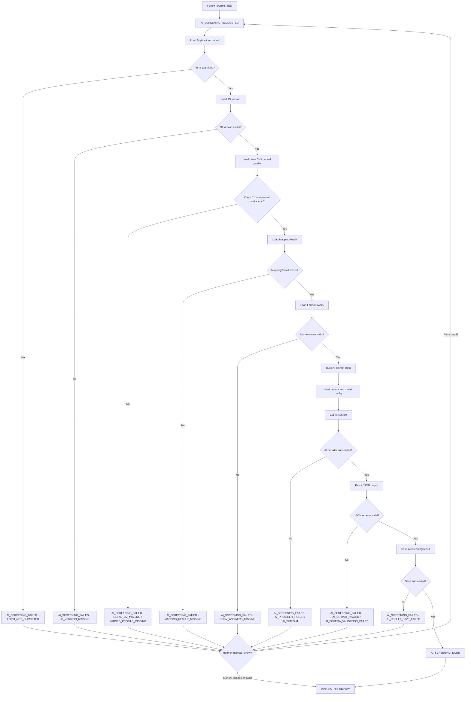

# 11. AI Screening Specification

## 1. Mục tiêu tài liệu

Tài liệu này mô tả specification cho module `ai-screening` trong Recruitment Phase 1 của Interview Assistant / Recruitment Core Backend.

Tài liệu làm nền cho các phần implementation sau này:

- AI Screening API.
- AI prompt config cho screening.
- Entity/table `AiScreeningResult` / `ai_screening_results`.
- Workflow-state liên quan đến `AI_SCREENING_REQUESTED`, `AI_SCREENING_DONE`, `AI_SCREENING_FAILED`, `WAITING_HR_REVIEW`.
- Audit-log và workflow event khi chạy, retry hoặc fail AI Screening.

Tài liệu này không tạo code, không tạo controller/service/module/entity thật và không tạo migration.

AI Screening là bước đánh giá tổng hợp sau khi ứng viên đã submit pre-screening form. AI Screening hỗ trợ HR Review bằng cách tổng hợp JD version, clean CV/parsed profile, mapping result và form answers. AI Screening không thay thế quyết định HR.

Runtime prompt flow hien tai:

```text
enrich_job_description (external YAML)
-> enrich_profile
-> detect_profile_anomalies (optional)
-> generate_survey_questions / form answers (optional)
-> ai_screening
-> final_screening_recommendation
-> HR review
```

`enrich_job_description` duoc maintain o YAML rieng. JSON output cua prompt nay bind vao `enrich_profile` theo mapping:

| Binding | Source field |
| ------- | ------------ |
| `JD_TARGET_ROLE` | `jobInfo.title` |
| `JD_MIN_YEARS` | `generalCriteria.minYearsExperience` |
| `JD_MUST_HAVE_SKILLS` | `roleSpecificCriteria.coreMustHaveSkills` |
| `JD_ADVANCED_SKILLS` | `roleSpecificCriteria.advancedNiceToHaveSkills` |
| `JD_TECH_CHALLENGES` | `roleSpecificCriteria.expectedTechnicalChallenges` |

Interview flow chi bat dau sau HR approval:

```text
suggest_questions or suggest_questions_from_survey
-> suggest_next_question
-> evaluate_session
-> evaluation_summary
```

## 2. Module scope

| Hạng mục | Nội dung |
| -------- | -------- |
| Module name đề xuất | `ai-screening` |
| Result entity/table | `AiScreeningResult` / `ai_screening_results` |
| Vị trí triển khai | Nằm trong `NestJS Recruitment Core Backend` |
| Loại module | Internal module trong Core, không phải external workflow service |
| AI infrastructure | Reuse `ai` module, `AiService`, `ai_prompts`, `ai_model_overrides` hiện tại |
| Input domain | Nhận dữ liệu từ `Application`, `JobDescriptionVersion`, `CvDocument`, `ParsedProfile`, `MappingResult`, `FormSession`, `FormAnswer` |
| Output domain | Ghi kết quả vào `AiScreeningResult` |
| Ownership | AI Screening chỉ ghi result và phát workflow event; không sở hữu `Application` |
| CV source | Chỉ dùng clean CV/parsed profile, không dùng CV gốc/original CV/quarantine file |
| Decision boundary | AI Screening không quyết định cuối cùng thay HR |
| HR Review input | Output AI Screening là input chính cho HR Review cùng mapping result, form answers và clean CV |
| Workflow engine | Core backend điều phối flow; không dùng `n8n` |

Ngoài scope:

| Ngoài scope | Lý do |
| ----------- | ----- |
| External AI workflow service | Phase 1 chốt modular monolith trong NestJS Core |
| `n8n` hoặc automation engine ngoài | Không thuộc workflow orchestration Phase 1 |
| Interview evaluation/BM04 | Thuộc `evaluations` và phase phỏng vấn hiện hữu |
| Offer/onboarding | Nằm sau HR Review và ngoài phạm vi Phase 1 |
| Sync AMIS | Phase 1 dừng tại HR Review; AMIS là extension point/phase sau |
| Sửa `sessions`, `evaluations`, `export`, `submissions` | Các module này phục vụ interview flow hiện tại và cần giữ ổn định |

## 3. Trigger

AI Screening được kích hoạt sau khi `FormSession` chuyển sang `FORM_SUBMITTED`.

| Trigger | Điều kiện | Actor/System | Ghi chú |
| ------- | --------- | ------------ | ------- |
| Auto trigger sau `FORM_SUBMITTED` | Form session submitted đúng hạn, form answers hợp lệ, có mapping result và clean CV/parsed profile | `SYSTEM` / Core workflow | Trigger mặc định của Phase 1 |
| Manual trigger | Auto trigger fail hoặc cần chạy thủ công theo quyền | `HR`, `ADMIN`, `SYSTEM` | Phải kiểm tra precondition và ghi audit |
| Rerun trigger | Mapping result hoặc form answer thay đổi hợp lệ, hoặc HR/Admin force rerun có reason | `HR`, `ADMIN`, `SYSTEM` | Không chạy trùng nếu input không đổi và result đã done |
| Không trigger khi form expired/chưa submit | `FormSession.status` không phải `SUBMITTED` hoặc workflow chưa `FORM_SUBMITTED` | N/A | Trả lỗi `FORM_NOT_SUBMITTED` hoặc `INVALID_STATE_TRANSITION` |
| Không trigger khi thiếu mapping result | Chưa có latest/active `MappingResult` hợp lệ | N/A | Trả lỗi `MAPPING_RESULT_MISSING` |
| Không trigger khi thiếu clean CV/parsed profile | Chưa có clean CV hoặc parsed profile từ clean CV | N/A | Trả lỗi `CLEAN_CV_MISSING` hoặc `PARSED_PROFILE_MISSING` |

State trigger chính:

| From state | Event | To state | Owner module |
| ---------- | ----- | -------- | ------------ |
| `FORM_SUBMITTED` | `AI_SCREENING_REQUESTED` | `AI_SCREENING_REQUESTED` | `ai-screening`, `workflow-state`, `audit-logs` |

Ghi chú triển khai:

- Default là auto run ngay sau `FORM_SUBMITTED`.
- Manual trigger không được bỏ qua precondition, trừ manual override được định nghĩa rõ và audit đầy đủ.
- AI Screening không chạy sau `FORM_EXPIRED`.

## 4. Input contract

| Input | Type | Required | Source | Mô tả |
| ----- | ---- | -------- | ------ | ----- |
| `application_id` | `uuid` | Yes | `applications.id` | Application được screening |
| `candidate_id` | `uuid` | Yes | `applications.candidate_id` | Candidate liên quan, dùng cho trace/audit |
| `job_posting_id` | `uuid` | Yes | `applications.job_posting_id` | Job posting ứng viên apply |
| `job_description_version_id` | `uuid` | Yes | `applications.job_description_version_id` | JD version dùng làm snapshot tuyển dụng |
| `job_description_snapshot` | `json` | Yes | `job_description_versions.snapshot` | Snapshot JD tại thời điểm version được chốt |
| `clean_cv_document_id` | `uuid` | Yes | `cv_documents.id` | Clean CV đã scan/sanitize |
| `parsed_profile_id` | `uuid` | Yes | `parsed_profiles.id` | Parsed profile tạo từ clean CV |
| `parsed_profile` | `json` | Yes | `parsed_profiles.parsed_data` | Kỹ năng, kinh nghiệm, học vấn, normalized text an toàn |
| `mapping_result_id` | `uuid` | Yes | `mapping_results.id` | Latest/active mapping result hợp lệ |
| `mapping_score` | `number` | Yes | `mapping_results.score` | Điểm mapping CV-JD |
| `mapping_recommendation` | `string` | Yes | `mapping_results.recommendation` | Recommendation từ mapping |
| `mapping_strengths` | `array` | No | `mapping_results.strengths` | Điểm mạnh theo mapping |
| `mapping_gaps` | `array` | No | `mapping_results.gaps` | Khoảng thiếu theo mapping |
| `form_session_id` | `uuid` | Yes | `form_sessions.id` | Form session đã submitted |
| `form_answers` | `array` | Yes | `form_answers` | Câu trả lời pre-screening thuộc application hiện tại |
| `source_channel` | `string` | No | `applications.source_channel` | Nguồn ứng tuyển như `VCS_PORTAL`, `TOPCV`, `LINKEDIN` |
| `screening_config` | `json` | No | Config theo JD/system | Cấu hình model, threshold, risk policy, output language |
| `prompt_key` | `string` | Yes | `ai_prompts.key` | Prompt key dùng cho AI Screening |

### JD input

AI Screening dùng snapshot từ `JobDescriptionVersion`. Không dùng JD draft mutable nếu không có version rõ ràng.

JD input có thể gồm:

- Title.
- Requirements.
- Responsibilities.
- Benefits nếu cần cho fit/expectation.
- Position.
- Level.
- Required skills.
- Nice-to-have skills.
- Experience years.
- Work location, working mode hoặc salary range nếu đã được phép dùng trong screening.

### CV input

AI Screening chỉ dùng clean CV hoặc parsed profile từ clean CV. Không dùng original CV/quarantine file.

Ưu tiên dùng:

- `parsed_profile`.
- Normalized text đã sanitize.
- Clean CV text artifact nếu cần bổ sung bằng chứng.
- Metadata như `clean_cv_document_id`, `clean_file_hash`, `parsed_profile_id`.

Ghi rõ:

- Không gửi raw/original CV file sang AI provider.
- Không dùng upload storage cũ như input trực tiếp nếu chưa qua clean CV boundary.

### Mapping input

AI Screening dùng latest/active `MappingResult`.

Mapping input nên gồm:

- Score.
- Threshold result.
- Recommendation.
- Strengths.
- Gaps.
- Missing requirements.
- Evidence.
- Prompt/model metadata nếu mapping dùng AI và cần trace.

### Form input

AI Screening dùng answers từ `FormSession` đã `FORM_SUBMITTED`.

Form input rule:

- Chỉ lấy câu trả lời thuộc `application_id` hiện tại.
- Chỉ lấy answers thuộc `form_session_id` được dùng làm input.
- Include question snapshot text/type nếu có để AI hiểu ngữ cảnh.
- Không đọc trực tiếp `session_survey_questions`.

### Screening config

`screening_config` có thể gồm:

| Config | Mô tả |
| ------ | ----- |
| `promptKey` | Prompt key, ví dụ `ai_screening` |
| `model` | Model dùng nếu override |
| `temperature` | Nhiệt độ sinh output |
| `threshold` | Threshold hỗ trợ phân loại nội bộ nếu cần |
| `riskPolicy` | Policy đánh dấu rủi ro |
| `outputLanguage` | Ngôn ngữ output, mặc định tiếng Việt |
| `schemaVersion` | Version schema output |

Ghi chú triển khai: config cụ thể có thể chốt trong implementation sau. File này chỉ mô tả contract.

## 5. Output contract

| Output | Type | Required | Mô tả |
| ------ | ---- | -------- | ----- |
| `aiScreeningResultId` | `uuid` | Yes | ID result |
| `applicationId` | `uuid` | Yes | Application được screening |
| `mappingResultId` | `uuid` | Yes | Mapping result input |
| `formSessionId` | `uuid` | Yes | Form session input |
| `finalScore` | `number` | Yes | Điểm tổng hợp 0-100 |
| `recommendation` | `enum` | Yes | Recommendation cho HR Review |
| `reasons` | `array<string>` | Yes | Lý do chính |
| `summary` | `string` | Yes | Tóm tắt ngắn |
| `strengths` | `array<string>` | Yes | Điểm mạnh |
| `gaps` | `array<string>` | Yes | Khoảng thiếu |
| `risks` | `array<object>` | Yes | Rủi ro cần HR lưu ý |
| `missingInfo` | `array<string>` | Yes | Thông tin còn thiếu |
| `redFlags` | `array<object|string>` | Yes | Dấu hiệu cảnh báo |
| `suggestedHrActions` | `array<string>` | Yes | Gợi ý bước HR nên làm |
| `confidence` | `number` | Yes | Độ tin cậy 0-1 |
| `status` | `enum` | Yes | `AI_SCREENING_DONE` hoặc trạng thái result tương ứng |
| `model` | `string` | No | Model được dùng |
| `promptVersion` | `string` | Yes | Version/key prompt |
| `schemaVersion` | `string` | Yes | Version output schema |
| `createdAt` | `timestamp` | Yes | Thời điểm tạo result |

Ví dụ output:

```json
{
  "aiScreeningResultId": "uuid",
  "applicationId": "uuid",
  "mappingResultId": "uuid",
  "formSessionId": "uuid",
  "finalScore": 78,
  "recommendation": "WAITING_HR_REVIEW",
  "summary": "Ứng viên phù hợp mức khá với JD Backend Developer.",
  "reasons": [
    "CV thể hiện kinh nghiệm backend phù hợp với JD.",
    "Câu trả lời form xác nhận có thể bắt đầu sau 30 ngày.",
    "Mapping score đạt ngưỡng sơ bộ."
  ],
  "strengths": [
    "Có kinh nghiệm Spring Boot",
    "Có kinh nghiệm PostgreSQL",
    "Câu trả lời form rõ ràng"
  ],
  "gaps": [
    "Chưa rõ kinh nghiệm Kafka nâng cao",
    "Chưa đủ bằng chứng về hệ thống high traffic"
  ],
  "risks": [
    {
      "type": "MISSING_EVIDENCE",
      "severity": "MEDIUM",
      "description": "Thiếu bằng chứng chi tiết về kinh nghiệm triển khai production lớn."
    }
  ],
  "missingInfo": [
    "Mức lương kỳ vọng",
    "Thông tin về quy mô dự án gần nhất"
  ],
  "redFlags": [],
  "suggestedHrActions": [
    "Xác minh kinh nghiệm Kafka ở bước phỏng vấn",
    "Hỏi thêm về quy mô hệ thống đã triển khai"
  ],
  "confidence": 0.84,
  "status": "AI_SCREENING_DONE",
  "model": "claude-sonnet-x",
  "promptVersion": "ai_screening_v1",
  "schemaVersion": "1.0",
  "createdAt": "2026-06-18T10:00:00.000Z"
}
```

Recommendation enum đề xuất:

| Recommendation | Ý nghĩa |
| -------------- | ------- |
| `WAITING_HR_REVIEW` | Đủ dữ liệu để HR review, dùng làm next workflow state |
| `STRONG_MATCH` | Rất phù hợp |
| `MATCH` | Phù hợp |
| `NEEDS_HR_REVIEW` | Cần HR xem kỹ thêm |
| `WEAK_MATCH` | Phù hợp yếu |
| `REJECT_RECOMMENDED` | AI đề xuất cân nhắc loại, HR vẫn quyết định |
| `TALENT_POOL_RECOMMENDED` | AI đề xuất cân nhắc talent pool, HR vẫn quyết định |

Ghi rõ:

- Recommendation của AI chỉ là đề xuất, không phải final HR decision.
- `WAITING_HR_REVIEW` là workflow next state sau khi AI done.
- HR Review mới là nơi ra quyết định cuối Phase 1.

## 6. Prompt contract

AI prompt phải yêu cầu output JSON và output JSON phải match schema. Không chấp nhận output dạng text tự do làm result hợp lệ.

Nếu AI trả JSON sai schema, thiếu field bắt buộc, score ngoài range hoặc recommendation ngoài enum, hệ thống phải chuyển `AI_SCREENING_FAILED` hoặc retry tùy rule. Prompt phải ghi rõ AI không được tự đưa ra quyết định tuyển dụng cuối cùng. Prompt phải yêu cầu evidence/reason rõ ràng, tránh chỉ trả score.

### Prompt key đề xuất

Prompt key chính đề xuất:

```text
ai_screening
```

Prompt key thay thế nếu muốn rõ hơn:

```text
final_screening_recommendation
```

Nếu source hiện tại có convention prompt key cụ thể, implementation nên dùng convention đó. Không hardcode prompt trong module `ai-screening`.

Implementation dung `ai_screening` truoc, sau do dung `final_screening_recommendation` de tao decision hint cho HR review. Khong hardcode prompt trong module `ai-screening`.

### Input prompt payload proposal

```json
{
  "application": {
    "id": "uuid",
    "sourceChannel": "VCS_PORTAL"
  },
  "jobDescription": {
    "versionId": "uuid",
    "title": "Backend Developer",
    "requirements": {
      "skills": ["Java", "Spring Boot", "PostgreSQL"],
      "experienceYears": 3
    }
  },
  "parsedProfile": {
    "skills": ["Java", "Spring Boot", "PostgreSQL"],
    "experienceYears": 4,
    "education": "Bachelor"
  },
  "mappingResult": {
    "score": 82,
    "thresholdResult": "PASSED",
    "strengths": ["Spring Boot", "PostgreSQL"],
    "gaps": ["Kafka chưa rõ"]
  },
  "formAnswers": [
    {
      "question": "Bạn có thể bắt đầu đi làm từ khi nào?",
      "answer": "Sau 30 ngày"
    }
  ],
  "outputSchemaVersion": "1.0"
}
```

### Output JSON schema proposal

| Field | Type | Required | Rule |
| ----- | ---- | -------- | ---- |
| `finalScore` | `number` | Yes | Từ 0 đến 100 |
| `recommendation` | `enum` | Yes | Thuộc enum recommendation đã định nghĩa |
| `summary` | `string` | Yes | Không rỗng, tóm tắt ngắn |
| `reasons` | `array<string>` | Yes | Ít nhất một lý do |
| `strengths` | `array<string>` | Yes | Có thể rỗng nếu không có bằng chứng |
| `gaps` | `array<string>` | Yes | Có thể rỗng nếu không có gap |
| `risks` | `array<object>` | Yes | Mỗi risk nên có `type`, `severity`, `description` |
| `missingInfo` | `array<string>` | Yes | Thông tin cần HR hỏi thêm |
| `redFlags` | `array<object|string>` | Yes | Dấu hiệu cảnh báo nếu có |
| `suggestedHrActions` | `array<string>` | Yes | Gợi ý hành động cho HR |
| `confidence` | `number` | Yes | Từ 0 đến 1 |
| `schemaVersion` | `string` | Yes | Match schema version request |

Validation rule:

- Cần validate schema trước khi lưu.
- Nếu thiếu required field, output invalid.
- Nếu `finalScore` ngoài 0-100, output invalid.
- Nếu `confidence` ngoài 0-1, output invalid.
- Nếu `recommendation` không thuộc enum, output invalid.
- Nếu output là prose/text tự do, output invalid.

## 7. Result entity: AiScreeningResult

| Field | Type đề xuất | Required | Mô tả |
| ----- | ------------ | -------- | ----- |
| `id` | `uuid` | Yes | Khóa chính |
| `applicationId` | `uuid` | Yes | Application được screening |
| `mappingResultId` | `uuid` | Yes | Mapping result input |
| `formSessionId` | `uuid` | Yes | Form session input |
| `finalScore` | `number` | No khi failed | Điểm tổng hợp 0-100 |
| `recommendation` | `varchar` | No khi failed | Recommendation AI |
| `summary` | `text` | No | Tóm tắt |
| `reasons` | `jsonb` | No | Lý do AI |
| `strengths` | `jsonb` | No | Điểm mạnh |
| `gaps` | `jsonb` | No | Khoảng thiếu |
| `risks` | `jsonb` | No | Rủi ro |
| `missingInfo` | `jsonb` | No | Thông tin còn thiếu |
| `redFlags` | `jsonb` | No | Cảnh báo |
| `suggestedHrActions` | `jsonb` | No | Gợi ý HR action |
| `confidence` | `number` | No | Độ tin cậy 0-1 |
| `status` | `varchar` | Yes | `DONE`, `FAILED`, `PENDING` hoặc workflow equivalent |
| `model` | `varchar` | No | Model được dùng |
| `promptKey` | `varchar` | Yes | Prompt key, ví dụ `ai_screening` |
| `promptVersion` | `varchar` | No | Version prompt |
| `schemaVersion` | `varchar` | Yes | Version schema output |
| `rawResult` | `jsonb` | No | Raw AI output để audit/debug có kiểm soát |
| `errorCode` | `varchar` | No | Error code nếu failed |
| `errorMessage` | `text` | No | Error message nếu failed |
| `createdAt` | `timestamp` | Yes | Thời điểm tạo |

Ghi rõ:

- `AiScreeningResult` phải trace được input: `applicationId`, `mappingResultId`, `formSessionId`.
- Có thể có nhiều result nếu rerun, nhưng cần xác định latest/active result.
- Không nên ghi đè mất result cũ nếu cần audit.
- `rawResult` cần kiểm soát dữ liệu nhạy cảm và không expose cho candidate.

## 8. AI Screening flow

Flow tổng quát:

```text
FORM_SUBMITTED
→ AI_SCREENING_REQUESTED
→ Load Application context
→ Load JD version
→ Load clean CV / parsed profile
→ Load MappingResult
→ Load FormAnswers
→ Build AI prompt input
→ Call AI service
→ Validate JSON output
→ Save AiScreeningResult
→ Update state AI_SCREENING_DONE
→ Update state WAITING_HR_REVIEW
```

Mermaid flow:



Ghi chú triển khai:

- Missing input không nên retry tự động nếu dữ liệu chưa sẵn sàng.
- Provider failure, timeout hoặc schema invalid có thể retry có kiểm soát.
- Manual review fallback chỉ hợp lệ nếu workflow chốt và có audit reason.

## 9. State update

| From state | Event | To state | Điều kiện |
| ---------- | ----- | -------- | --------- |
| `FORM_SUBMITTED` | `AI_SCREENING_REQUESTED` | `AI_SCREENING_REQUESTED` | Có form answers, mapping result, clean CV/parsed profile |
| `AI_SCREENING_REQUESTED` | `AI_SCREENING_SUCCEEDED` | `AI_SCREENING_DONE` | AI trả JSON hợp lệ, schema valid, save `AiScreeningResult` thành công |
| `AI_SCREENING_REQUESTED` | `AI_SCREENING_FAILED` | `AI_SCREENING_FAILED` | Lỗi provider, timeout, missing input, output invalid hoặc save result failed |
| `AI_SCREENING_DONE` | `HR_REVIEW_STARTED` | `WAITING_HR_REVIEW` | AI result sẵn sàng cho HR |
| `AI_SCREENING_FAILED` | `AI_SCREENING_RETRY_REQUESTED` | `AI_SCREENING_REQUESTED` | Retry hợp lệ, có idempotency/reason nếu cần |
| `AI_SCREENING_FAILED` | `HR_REVIEW_MANUAL_FALLBACK` | `WAITING_HR_REVIEW` | Manual HR review fallback được chốt và có audit reason |

Ghi rõ:

- `AI_SCREENING_FAILED` là lỗi kỹ thuật, missing input hoặc output invalid.
- `AI_SCREENING_DONE` là đã có `AiScreeningResult` hợp lệ.
- `WAITING_HR_REVIEW` là trạng thái HR xử lý sau AI done hoặc manual fallback được audit.
- AI recommendation không phải final state HR.

## 10. API contract liên quan

| Method | Path | Auth/Role | Mục đích |
| ------ | ---- | --------- | -------- |
| `POST` | `/api/applications/:applicationId/ai-screening/run` | `HR`, `ADMIN`, `SYSTEM` | Chạy AI Screening cho application |
| `GET` | `/api/applications/:applicationId/ai-screening-result` | `HR`, `ADMIN` | Lấy latest/active AI Screening result |
| `POST` | `/api/applications/:applicationId/ai-screening/rerun` | `HR`, `ADMIN` | Rerun AI Screening có reason và audit |

### `POST /api/applications/:applicationId/ai-screening/run`

Auth: `HR`, `ADMIN`, `SYSTEM`.

Request:

```json
{
  "force": false,
  "reason": "Auto run after form submitted"
}
```

Response:

```json
{
  "applicationId": "uuid",
  "aiScreeningResultId": "uuid",
  "status": "AI_SCREENING_DONE",
  "nextState": "WAITING_HR_REVIEW",
  "finalScore": 78,
  "recommendation": "WAITING_HR_REVIEW",
  "summary": "Ứng viên phù hợp mức khá với JD Backend Developer."
}
```

Rule:

- Chỉ chạy khi application đã `FORM_SUBMITTED` hoặc có manual override hợp lệ được audit.
- Nếu cùng input đã có `AI_SCREENING_DONE`, trả result hiện có.
- Nếu `force=false` và input không đổi, không chạy trùng.

### `GET /api/applications/:applicationId/ai-screening-result`

Auth: `HR`, `ADMIN`.

Response trả latest/active AI screening result.

Ghi chú:

- Không expose raw prompt/raw AI response mặc định.
- Có thể trả summary, score, recommendation, reasons, risks, missing info và suggested HR actions.

### `POST /api/applications/:applicationId/ai-screening/rerun`

Auth: `HR`, `ADMIN`; implementation có thể chọn Admin-only nếu muốn chặt hơn.

Request:

```json
{
  "force": true,
  "reason": "HR requested rerun after reviewing updated form answer"
}
```

Rule:

- Rerun phải ghi audit.
- Nếu input chưa đổi và không `force`, trả result hiện có.
- Nếu đã có result done với cùng input, không chạy trùng.
- `force=true` chỉ cho actor có quyền và phải có reason rõ.

Error cases chính:

| Case | Error code |
| ---- | ---------- |
| Application not found | `APPLICATION_NOT_FOUND` |
| Form not submitted | `FORM_NOT_SUBMITTED` |
| Missing mapping result | `MAPPING_RESULT_MISSING` |
| Missing clean CV/parsed profile | `CLEAN_CV_MISSING` / `PARSED_PROFILE_MISSING` |
| Invalid state | `INVALID_STATE_TRANSITION` |
| AI already done | `AI_SCREENING_ALREADY_DONE` |
| Permission denied | `FORBIDDEN` |

## 11. Failure handling

| Failure case | Error code | State | Retry? | Hành động |
| ------------ | ---------- | ----- | ------ | --------- |
| Application not found | `APPLICATION_NOT_FOUND` | Không đổi | No | Trả lỗi, không chạy AI |
| Form not submitted | `FORM_NOT_SUBMITTED` | Không đổi hoặc `AI_SCREENING_FAILED` nếu đã request | No | Không chạy AI nếu chưa có form answers hợp lệ |
| Form session missing | `FORM_SESSION_MISSING` | `AI_SCREENING_FAILED` | No, đến khi dữ liệu được sửa | Ghi audit, yêu cầu fix dữ liệu |
| Form answers missing | `FORM_ANSWERS_MISSING` | `AI_SCREENING_FAILED` | No, đến khi candidate/HR bổ sung hợp lệ | Không build prompt |
| Mapping result missing | `MAPPING_RESULT_MISSING` | `AI_SCREENING_FAILED` | No, đến khi mapping xong | Không chạy AI |
| Clean CV missing | `CLEAN_CV_MISSING` | `AI_SCREENING_FAILED` | No, đến khi CV được sanitize | Không dùng original CV |
| Parsed profile missing | `PARSED_PROFILE_MISSING` | `AI_SCREENING_FAILED` | No, đến khi parse xong | Không build prompt |
| Invalid state transition | `INVALID_STATE_TRANSITION` | Không đổi | No | Reject action, ghi audit nếu request bất thường |
| AI provider failed | `AI_PROVIDER_FAILED` | `AI_SCREENING_FAILED` | Yes | Retry có kiểm soát cùng idempotency context |
| AI timeout | `AI_TIMEOUT` | `AI_SCREENING_FAILED` | Yes | Retry sau timeout, trả result hiện có nếu đã lưu |
| AI output invalid | `AI_OUTPUT_INVALID` | `AI_SCREENING_FAILED` | Yes | Không lưu như result hợp lệ; retry hoặc manual fallback |
| AI schema validation failed | `AI_SCHEMA_VALIDATION_FAILED` | `AI_SCREENING_FAILED` | Yes | Không lưu như result hợp lệ; log schema error an toàn |
| Save result failed | `AI_RESULT_SAVE_FAILED` | `AI_SCREENING_FAILED` | Yes | Retry save/run theo transaction/idempotency |
| AI already done | `AI_SCREENING_ALREADY_DONE` | `AI_SCREENING_DONE` | No nếu input không đổi | Trả result hiện có |
| Permission denied | `FORBIDDEN` | Không đổi | No | Không chạy/get/rerun |

Ghi rõ:

- Provider/timeout/schema invalid có thể retry.
- Missing input không retry tự động nếu dữ liệu chưa sẵn sàng.
- AI output invalid không được lưu như result hợp lệ.
- Nếu AI fail nhiều lần, có thể chuyển manual review nếu workflow chốt.
- Mọi failure phải ghi audit và workflow event.

## 12. Retry / Idempotency rule

| Process | Idempotency key | Rule |
| ------- | --------------- | ---- |
| AI Screening run | `applicationId + mappingResultId + formSessionId` | Cùng input trả result hiện có nếu đã done |
| Prompt input hash | Hash của JD snapshot + parsed profile + mapping result + form answers | Dùng để phát hiện input không đổi |
| Same input done | `applicationId + promptInputHash` | Không chạy lại, trả `AI_SCREENING_DONE` hiện có |
| Retry timeout | `applicationId + mappingResultId + formSessionId + requestId` | Nếu result đã lưu, trả result hiện có |
| Mapping result changed | `applicationId + newMappingResultId + formSessionId` | Cho phép chạy AI mới |
| Form answer changed | `applicationId + mappingResultId + newFormSessionId/formAnswerVersion` | Cho phép chạy AI mới nếu thay đổi hợp lệ |
| Clean CV/parsed profile changed | `applicationId + cleanCvDocumentId + parsedProfileId` | Cần mapping rerun trước khi AI rerun |
| Force rerun | `applicationId + previousAiScreeningResultId + Idempotency-Key` | Chỉ HR/Admin có quyền, bắt buộc reason và audit |
| Latest/active result | `applicationId + activeResultFlag` | Chỉ một result được đánh dấu latest/active nếu cần hiển thị HR Review |

Scenario:

| Scenario | Có chạy AI mới không? | Hành động |
| -------- | --------------------- | --------- |
| Cùng input, result done | Không | Trả result hiện có |
| Cùng input, result failed | Có thể retry | Tạo attempt/result mới hoặc update attempt |
| Mapping result mới | Có | Chạy AI mới |
| Form answer mới hợp lệ | Có | Chạy AI mới |
| Force rerun | Có | Ghi audit |
| Form chưa submit | Không | Trả lỗi |
| AI output invalid | Retry/manual | Không lưu result hợp lệ |

Ghi chú triển khai:

- Rerun nên tạo result mới/version mới, không ghi đè mất result cũ.
- Nếu parsed profile/clean CV thay đổi do upload CV mới, cần mapping rerun trước khi AI rerun.
- `force=true` không được dùng để bỏ qua bảo mật dữ liệu hoặc gửi original CV cho AI.

## 13. Reuse AI service hiện tại

| Capability hiện có | Cách reuse cho AI Screening |
| ------------------ | --------------------------- |
| `ai` module hiện tại | Reuse hạ tầng gọi AI và quản lý prompt/model |
| `AiService` | Reuse call provider, prompt resolution, JSON extraction ở mức nền |
| `ai_prompts` | Thêm prompt key mới cho AI Screening thay vì hardcode prompt |
| `ai_model_overrides` | Cho phép override model theo prompt key screening |
| Prompt seed YAML nếu có | Bổ sung seed prompt `ai_screening` hoặc `final_screening_recommendation` |
| Prompt/model cache hiện tại | Reuse cache, nhưng cần clear cache khi update prompt/model |
| Existing JSON parse helper | Có thể reuse bước strip fence/parse JSON cơ bản |
| Schema validation mới | Cần bổ sung vì baseline hiện tại chưa có validator schema đủ chặt |
| Existing prompt keys | Không đủ cho AI Screening, cần prompt key mới và output schema riêng |

Prompt key mới đề xuất:

- `ai_screening`
- `final_screening_recommendation`

Ghi rõ:

- Không hardcode prompt trong `ai-screening` module.
- Prompt nên được quản lý qua `ai_prompts`.
- Model có thể override qua `ai_model_overrides`.
- Cần schema validator vì baseline hiện tại chỉ parse JSON cơ bản.
- Cần lưu `model`, `promptVersion`, `schemaVersion` trong `AiScreeningResult`.

## 14. Audit / Workflow event

| Event | Khi nào ghi | Metadata cần có |
| ----- | ----------- | --------------- |
| `AI_SCREENING_REQUESTED` | Khi AI Screening được request/enqueue | `applicationId`, `candidateId`, `mappingResultId`, `formSessionId`, `actorType`, `actorId`, `requestId` |
| `AI_SCREENING_INPUT_BUILT` | Sau khi build prompt input từ JD, CV, mapping, form | Input IDs, `promptInputHash`, `schemaVersion` |
| `AI_SCREENING_PROMPT_LOADED` | Sau khi load prompt/model config | `promptKey`, `promptVersion`, `model` |
| `AI_SCREENING_PROVIDER_CALLED` | Ngay trước/sau khi gọi AI provider | `provider`, `model`, `requestId`, duration nếu có |
| `AI_SCREENING_DONE` | Khi result hợp lệ được lưu | `aiScreeningResultId`, `finalScore`, `recommendation`, `confidence` |
| `AI_SCREENING_FAILED` | Khi provider/schema/save/input lỗi | `errorCode`, `errorMessage`, input IDs, `requestId` |
| `AI_SCREENING_RERUN_REQUESTED` | Khi HR/Admin/System yêu cầu rerun | `actorType`, `actorId`, `reason`, previous result ID |
| `AI_SCREENING_RERUN_DONE` | Khi rerun thành công | Previous/new `aiScreeningResultId`, score diff, recommendation |
| `AI_SCREENING_RERUN_FAILED` | Khi rerun lỗi | Previous result, input IDs, `errorCode`, `errorMessage`, `reason` |
| `WAITING_HR_REVIEW` | Khi application chuyển sang HR review queue | `applicationId`, `aiScreeningResultId`, `finalScore`, `recommendation` |

Metadata bắt buộc khi phù hợp:

- `applicationId`
- `candidateId`
- `jobPostingId`
- `jobDescriptionVersionId`
- `cleanCvDocumentId`
- `parsedProfileId`
- `mappingResultId`
- `formSessionId`
- `aiScreeningResultId`
- `promptKey`
- `promptVersion`
- `model`
- `schemaVersion`
- `finalScore`
- `recommendation`
- `actorType`
- `actorId`
- `requestId`
- `errorCode`
- `errorMessage`

Ghi rõ:

- `WorkflowEvent` ghi transition state.
- `AuditLog` ghi hành động kỹ thuật/nghiệp vụ và actor.
- Rerun phải ghi lý do.
- Không ghi full prompt/input nếu chứa PII quá mức; nếu cần lưu raw payload thì phải kiểm soát quyền truy cập.

## 15. Security / Data access

| Rule | Nội dung |
| ---- | -------- |
| Không gửi original CV | Không gửi original CV/quarantine CV cho AI |
| Chỉ dùng clean data | Chỉ dùng clean CV/parsed profile đã qua scan/sanitize |
| Minimize prompt input | Chỉ gửi dữ liệu cần thiết cho prompt |
| Không expose raw prompt | Không expose raw prompt/raw AI response cho candidate |
| Application-scoped access | HR/Admin chỉ xem AI result theo quyền application |
| Không log full sensitive data | Không log full CV text hoặc form answer nhạy cảm nếu không cần |
| Kiểm soát `rawResult` | Nếu lưu `rawResult`, cần kiểm soát dữ liệu nhạy cảm |
| Audit trail | AI Screening result phải có audit trail |
| Rerun có quyền | Rerun phải có quyền và reason |
| AI không quyết định cuối | AI recommendation không phải quyết định cuối cùng |
| Candidate không thấy AI score | Candidate không được thấy AI score/recommendation qua public form token |

Ghi chú triển khai:

- Nếu dùng AI provider bên ngoài, cần có policy dữ liệu phù hợp với PII và dữ liệu ứng viên.
- Không gửi dữ liệu không cần thiết như raw token form, full audit log, internal prompt debug hoặc raw CV.
- HR Review UI có thể hiển thị result đã chuẩn hóa, không cần raw provider response mặc định.

## 16. Compatibility với source hiện tại

| Source hiện tại | Compatibility / Action |
| --------------- | ---------------------- |
| `ai` module | Reuse hạ tầng gọi AI, prompt/model config và cache |
| `AiService` | Reuse cho provider call/prompt resolution, nhưng cần contract riêng cho screening |
| `ai_prompts` | Thêm prompt key `ai_screening` hoặc `final_screening_recommendation` |
| `ai_model_overrides` | Reuse override model theo prompt key |
| Prompt seed YAML | Bổ sung prompt seed mới nếu source đang seed prompt bằng YAML |
| Existing JSON parse helper | Có thể reuse parse cơ bản, nhưng cần schema validation rõ hơn |
| Existing prompt keys | Không dùng trực tiếp nếu output không đúng schema AI Screening |
| `Application` | Source hiện tại chưa có, cần tạo ở phase implement để làm workflow center |
| `MappingResult` | Source hiện tại chưa có, cần tạo để làm input AI Screening |
| `FormSession` | Source hiện tại chưa có, cần tạo để xác định form submitted |
| `FormAnswer` | Source hiện tại chưa có, cần tạo để cung cấp answers |
| `AiScreeningResult` | Source hiện tại chưa có, cần tạo để lưu result theo application |
| `candidates` | Không nhồi AI Screening workflow vào `candidates` |
| `sessions` | Không nhồi AI Screening vào interview session |
| `evaluations` | Phục vụ BM04/interview phase, không dùng làm AI Screening result của application |
| `export` | Giữ ổn định cho interview/evaluation export hiện tại |
| `submissions` | Giữ ổn định cho code submission interview flow |

Ghi chú triển khai:

- Source hiện tại có `AiService` cho enrich/evaluation/survey; có thể reuse hạ tầng gọi AI nhưng cần prompt/output contract riêng.
- Baseline hiện tại parse JSON AI cơ bản, cần bổ sung schema validation để tránh lưu output sai shape.
- Không biến AI Screening thành external workflow service và không đưa `n8n` vào flow.

## 17. Conflict / Assumption

| Vấn đề | File liên quan | Cách xử lý |
| ------ | -------------- | ---------- |
| AI Screening tự động chạy ngay sau `FORM_SUBMITTED` hay HR bấm run | `10_form_prescreening_specification.md`, `05_workflow_state_machine.md`, business flow | Assumption: default là auto run sau `FORM_SUBMITTED`; HR/Admin có API run/rerun để recovery |
| Nếu AI fail, có chuyển HR Review thủ công không | `05_workflow_state_machine.md`, `01_phase1_context_summary.md` | Assumption: có thể retry; sau nhiều lần fail có thể đưa manual HR review nếu workflow cho phép và có audit |
| Prompt key chính dùng `ai_screening` hay `final_screening_recommendation` | `00_source_baseline_analysis.md`, source AI prompt infra | Assumption: dùng `ai_screening` mặc định; `final_screening_recommendation` là alternative |
| Có lưu raw prompt/raw AI response không | `00_source_baseline_analysis.md`, security rules | Assumption: có thể lưu `rawResult` có kiểm soát; không lưu/expose raw prompt mặc định nếu chứa PII quá mức |
| Rerun tạo result mới hay update result cũ | `07_api_contract_specification.md`, `06_database_migration_plan.md` | Assumption: tạo result mới/version mới để giữ audit, đánh dấu latest/active nếu cần |
| Final score có threshold riêng không hay chỉ hỗ trợ HR | Business flow, mapping spec | Assumption: final score hỗ trợ HR Review; không tự động thành HR decision. Threshold riêng nếu có là config, không thay HR |
| AI Screening có được chạy nếu mapping dưới threshold nhưng HR override không | `09_mapping_cv_jd_specification.md`, `05_workflow_state_machine.md` | Assumption: chỉ chạy nếu có HR/Admin override hợp lệ đưa application qua form/submitted path và có audit |
| Có cần dùng embedding/vector trong AI Screening không | Architecture hiện tại chưa có vector DB/embedding store | Không bắt buộc trong MVP; có thể để later nếu có hạ tầng |

Không phát hiện conflict ảnh hưởng trực tiếp đến AI Screening specification ở mức specification. Các điểm còn mở được ghi nhận là assumption để xử lý khi implement thực tế.

## 18. Kết luận

AI Screening Phase 1 chạy sau `FORM_SUBMITTED`, sử dụng JD version, clean CV/parsed profile, MappingResult và FormAnswer để tạo `AiScreeningResult`. Kết quả phải có final score, recommendation, reasons, risks và missing info theo JSON schema rõ ràng. AI Screening reuse AI service/prompt config hiện tại, có idempotency, retry, audit và không thay thế quyết định HR Review.
