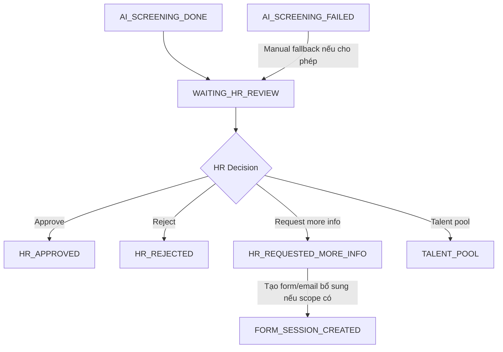

# 12. HR Review Specification

## 1. Mục tiêu tài liệu

Tài liệu này mô tả specification cho module `hr-review` trong Recruitment Phase 1 của Interview Assistant / Recruitment Core Backend.

Tài liệu làm nền cho các phần implementation sau này:

- HR Review API.
- HR Review UI.
- Entity/table `HrReviewDecision` / `hr_reviews`.
- Workflow-state cho các quyết định HR.
- Audit-log và workflow event liên quan đến HR decision.

Tài liệu này không tạo code, không tạo controller/service/module/entity thật và không tạo migration.

HR Review là bước cuối của Recruitment Phase 1. HR/Admin xem dữ liệu đã xử lý an toàn, gồm candidate info, JD/JD version, clean CV, mapping result, form answers, AI screening result và timeline/audit để ra quyết định nghiệp vụ cuối trong phạm vi Phase 1.

## 2. Module scope

| Hạng mục | Nội dung |
| -------- | -------- |
| Module name đề xuất | `hr-review` |
| Entity/table chính | `HrReviewDecision` / `hr_reviews` |
| Vị trí triển khai | Nằm trong `NestJS Recruitment Core Backend` |
| Workflow center | HR Review xoay quanh `application_id`; `Application` là trung tâm workflow |
| Dữ liệu review | Candidate info, JD/JD version, clean CV, mapping result, form answers, AI screening result, timeline/audit |
| CV boundary | HR Review chỉ dùng clean CV; không dùng original CV/quarantine CV |
| Decision boundary | HR Review là quyết định cuối cùng trong Phase 1 |
| AI boundary | AI Screening chỉ hỗ trợ, không thay thế quyết định HR |
| Interview boundary | HR Review không thay thế interview/evaluation/BM04 phase sau |
| Next phase | Sau `HR_APPROVED`, hội đồng chuyên môn, phỏng vấn, offer, VOffice, onboarding là phase sau |
| Workflow engine | Core backend điều phối flow; không đưa `n8n` vào HR Review flow |

Ghi rõ: AI chỉ hỗ trợ HR Review bằng score, recommendation, reasons, risks và missing info; HR/Admin mới là actor đưa ra quyết định cuối cùng trong Phase 1.

Ngoài scope:

| Ngoài scope | Lý do |
| ----------- | ----- |
| Tạo interview session tự động | Chỉ ghi là later/extension sau `HR_APPROVED`, không thuộc file này |
| Phỏng vấn vòng 1/2 | Thuộc phase interview sau HR Review |
| Offer/VOffice/onboarding | Nằm sau HR Review và ngoài phạm vi Phase 1 |
| Sync AMIS | Nếu có, là later/extension point vì Phase 1 dừng tại HR Review |
| BM04/evaluation | Thuộc `evaluations` và interview flow hiện hữu |
| Sửa `sessions`, `evaluations`, `export`, `submissions` | Các module này cần giữ ổn định cho workflow hiện tại |

## 3. Review queue

Review queue là danh sách hồ sơ đang chờ HR xử lý. Nguồn chính là các `Application` có state `WAITING_HR_REVIEW`. Queue cũng có thể nhận các hồ sơ cần review thủ công do AI lỗi, duplicate nghi vấn, mapping uncertain hoặc HR override nếu workflow cho phép.

| Queue type | Điều kiện vào queue | Người xử lý | Ghi chú |
| ---------- | ------------------- | ----------- | ------- |
| `WAITING_HR_REVIEW` | `AI_SCREENING_DONE` đã có result hợp lệ và application chuyển sang `WAITING_HR_REVIEW` | HR/Admin | Luồng chuẩn sau AI Screening |
| `AI_SCREENING_FAILED_MANUAL_REVIEW` | AI lỗi nhiều lần hoặc được chuyển thủ công từ `AI_SCREENING_FAILED` | HR/Admin | Phải có audit reason khi vào queue |
| `PROFILE_DUPLICATE_NEEDS_REVIEW` | Duplicate profile nghi vấn hoặc policy yêu cầu HR xem | HR/Admin | Có thể block hoặc cho xử lý song song tùy policy |
| `MAPPING_UNCERTAIN` | Mapping thiếu confidence, result cần HR xem nếu có rule | HR/Admin | Assumption: optional trong MVP |
| `REQUEST_MORE_INFO_RETURNED` | Candidate đã bổ sung thông tin sau `HR_REQUESTED_MORE_INFO` nếu có flow bổ sung | HR/Admin | Có thể quay lại review hoặc tạo form/AI rerun tùy rule |

Filter/sort cho queue:

| Filter | Mô tả |
| ------ | ----- |
| `status` | Lọc theo trạng thái application |
| `jobPostingId` | Lọc theo tin tuyển dụng |
| `sourceChannel` | Lọc theo nguồn VCS Portal/Facebook/LinkedIn/TopCV/VietnamWorks |
| `mappingScoreFrom/mappingScoreTo` | Lọc theo điểm mapping |
| `aiScoreFrom/aiScoreTo` | Lọc theo điểm AI |
| `createdAtFrom/createdAtTo` | Lọc theo thời gian ứng tuyển |
| `riskLevel` | Lọc theo risk nếu AI có trả |
| `assignedReviewerId` | Lọc theo HR phụ trách nếu có |

Queue list item tối thiểu:

| Field | Mô tả |
| ----- | ----- |
| `applicationId` | ID application |
| `candidateName` | Tên ứng viên |
| `candidateEmail` | Email ứng viên |
| `candidatePhone` | Số điện thoại ứng viên |
| `jobTitle` | Tên vị trí/JD |
| `sourceChannel` | Nguồn ứng tuyển |
| `applicationStatus` | State hiện tại |
| `mappingScore` | Điểm mapping |
| `aiFinalScore` | Điểm AI Screening |
| `aiRecommendation` | Recommendation AI |
| `riskLevel` | Risk cao nhất nếu có |
| `createdAt` | Thời điểm application được tạo |
| `updatedAt` | Thời điểm cập nhật gần nhất |

Ghi chú triển khai:

- Queue nên ưu tiên sort theo risk, ngày apply, điểm AI/mapping hoặc SLA nếu có.
- Queue không trả raw CV, raw prompt hoặc dữ liệu nhạy cảm không cần thiết.

## 4. Review detail

Review detail là màn hình/tài nguyên cho HR xem đầy đủ hồ sơ để ra quyết định. Response phải phục vụ HR decision mà không cần truy cập raw/original CV.

| Nhóm thông tin | Nội dung cần hiển thị | Source |
| -------------- | --------------------- | ------ |
| Candidate info | Họ tên, email, phone, birth year nếu có, candidate profile/parsed profile, source channel, duplicate warning nếu có | `candidates`, `applications`, `parsed_profiles`, duplicate checks |
| JD / Job Posting | Job title, JD version, position, level, requirements, benefits nếu cần, posting channel/source | `job_postings`, `job_description_versions`, `positions`, `levels` |
| Clean CV | Clean CV document id, file name, version, clean CV preview/download, parse status | `cv_documents`, `parsed_profiles` |
| Mapping result | Score, threshold, threshold result, recommendation, strengths, gaps, missing requirements, evidence | `mapping_results` |
| Form answer | Form session id, submitted at, danh sách câu hỏi/câu trả lời, required question status, warning nếu thiếu/không hợp lệ | `form_sessions`, `form_answers`, `question_set_items` |
| AI Screening result | Final score, recommendation, summary, reasons, strengths, gaps, risks, missing info, suggested HR actions, confidence | `ai_screening_results` |
| Timeline / Audit | Workflow timeline, important audit events, error/retry history nếu có | `workflow_events`, `audit_logs` |

### Candidate info

Review detail cần hiển thị:

- Họ tên.
- Email.
- Phone.
- Birth year nếu có.
- Candidate profile/parsed profile.
- Source channel.
- Duplicate warning nếu có.

### JD / Job Posting

Review detail cần hiển thị:

- Job title.
- JD version.
- Position.
- Level.
- Requirements.
- Benefits nếu cần.
- Posting channel/source.

### Clean CV

Review detail cần hiển thị:

- Clean CV document id.
- File name.
- Version.
- Clean CV preview/download.
- Parse status.

Ghi rõ: không hiển thị original/quarantine CV trong HR Review UI thông thường.

### Mapping result

Review detail cần hiển thị:

- Score.
- Threshold.
- Threshold result.
- Recommendation.
- Strengths.
- Gaps.
- Missing requirements.
- Evidence.

### Form answer

Review detail cần hiển thị:

- Form session id.
- Submitted at.
- Danh sách câu hỏi/câu trả lời.
- Required question status.
- Any warning nếu câu trả lời thiếu/không hợp lệ.

### AI Screening result

Review detail cần hiển thị:

- Final score.
- Recommendation.
- Summary.
- Reasons.
- Strengths.
- Gaps.
- Risks.
- Missing info.
- Suggested HR actions.
- Confidence.

### Timeline / Audit

Review detail cần hiển thị:

- Workflow timeline.
- Important audit events.
- Error/retry history nếu có.

## 5. Decision

| Decision | Ý nghĩa | State sau quyết định | Ghi chú |
| -------- | ------- | -------------------- | ------- |
| `APPROVE` | HR duyệt hồ sơ để đi tiếp sang phase sau | `HR_APPROVED` | Phase sau có thể tạo task hội đồng chuyên môn/interview/session, nhưng không thuộc Phase 1 |
| `REJECT` | HR loại hồ sơ | `HR_REJECTED` | Có thể gửi email fail nếu notification scope có |
| `REQUEST_MORE_INFO` | HR yêu cầu ứng viên bổ sung thông tin | `HR_REQUESTED_MORE_INFO` | Không nhất thiết terminal nếu có flow bổ sung |
| `TALENT_POOL` | HR đưa hồ sơ vào nguồn ứng viên tiềm năng | `TALENT_POOL` | Có thể là terminal trong Phase 1 |

### `APPROVE`

- HR duyệt hồ sơ để đi tiếp sang phase sau.
- State: `HR_APPROVED`.
- Phase sau có thể tạo task hội đồng chuyên môn/interview/session, nhưng không thuộc Phase 1.

### `REJECT`

- HR loại hồ sơ.
- State: `HR_REJECTED`.
- Có thể gửi email fail nếu notification scope có.

### `REQUEST_MORE_INFO`

- HR yêu cầu ứng viên bổ sung thông tin.
- State: `HR_REQUESTED_MORE_INFO`.
- Có thể tạo form bổ sung hoặc gửi email yêu cầu bổ sung nếu scope có.
- Không phải terminal nếu cho phép ứng viên bổ sung.

### `TALENT_POOL`

- HR đưa hồ sơ vào nguồn ứng viên tiềm năng.
- State: `TALENT_POOL`.
- Có thể là terminal trong Phase 1.

Ghi rõ:

- AI recommendation chỉ là tham khảo.
- HR có thể quyết định khác AI, nhưng cần comment/reason.
- Mỗi decision phải ghi audit.

## 6. Decision entity: HrReviewDecision

| Field | Type đề xuất | Required | Mô tả |
| ----- | ------------ | -------- | ----- |
| `id` | `uuid` | Yes | Khóa chính |
| `applicationId` | `uuid` | Yes | Hồ sơ ứng tuyển được review |
| `reviewerId` | `uuid` | Yes | HR/Admin đưa ra quyết định |
| `decision` | `enum` | Yes | `APPROVE`, `REJECT`, `REQUEST_MORE_INFO`, `TALENT_POOL` |
| `comment` | `text` | No/Conditional | Ghi chú của HR |
| `reasonCodes` | `jsonb` | No/Conditional | Danh sách lý do chuẩn hóa |
| `attachments` | `jsonb` | No | File/note đính kèm nếu có |
| `previousStatus` | `varchar` | Yes | Trạng thái trước quyết định |
| `nextStatus` | `varchar` | Yes | Trạng thái sau quyết định |
| `mappingResultId` | `uuid` | No | Mapping result được tham chiếu khi ra quyết định |
| `aiScreeningResultId` | `uuid` | No | AI result được tham chiếu khi ra quyết định |
| `createdAt` | `timestamp` | Yes | Thời điểm quyết định |
| `updatedAt` | `timestamp` | No | Nếu cho phép chỉnh sửa comment/attachment |

Mô tả field:

- `applicationId`: hồ sơ ứng tuyển được review.
- `reviewerId`: HR/Admin đưa ra quyết định.
- `decision`: `APPROVE`, `REJECT`, `REQUEST_MORE_INFO`, `TALENT_POOL`.
- `comment`: ghi chú của HR.
- `reasonCodes`: danh sách lý do chuẩn hóa.
- `attachments`: optional, nếu HR cần đính kèm file/note.
- `previousStatus`: trạng thái trước khi quyết định.
- `nextStatus`: trạng thái sau quyết định.
- `mappingResultId`: mapping result được tham chiếu khi ra quyết định.
- `aiScreeningResultId`: AI result được tham chiếu khi ra quyết định.

Reason code đề xuất:

| Decision | Reason code ví dụ |
| -------- | ----------------- |
| `APPROVE` | `GOOD_MATCH`, `RELEVANT_EXPERIENCE`, `STRONG_FORM_ANSWER`, `HR_OVERRIDE_APPROVE` |
| `REJECT` | `LOW_MATCH`, `MISSING_REQUIRED_SKILL`, `INVALID_PROFILE`, `SALARY_NOT_FIT`, `HR_OVERRIDE_REJECT` |
| `REQUEST_MORE_INFO` | `MISSING_INFO`, `NEED_CLARIFICATION`, `CV_INCOMPLETE`, `FORM_ANSWER_INSUFFICIENT` |
| `TALENT_POOL` | `POTENTIAL_FUTURE_FIT`, `NOT_FIT_CURRENT_JD`, `LEVEL_NOT_MATCH` |

Ghi chú triển khai:

- Không nên mutate im lặng decision cũ nếu đã terminal.
- Nếu có override, nên tạo decision mới hoặc audit override rõ.

## 7. State transition

| From state | Event | To state | Actor | Điều kiện |
| ---------- | ----- | -------- | ----- | --------- |
| `WAITING_HR_REVIEW` | `HR_APPROVED` | `HR_APPROVED` | HR/Admin | HR duyệt hồ sơ, có quyền và request hợp lệ |
| `WAITING_HR_REVIEW` | `HR_REJECTED` | `HR_REJECTED` | HR/Admin | HR loại hồ sơ, có comment/reason theo rule |
| `WAITING_HR_REVIEW` | `HR_REQUESTED_MORE_INFO` | `HR_REQUESTED_MORE_INFO` | HR/Admin | HR yêu cầu bổ sung, có message/reason |
| `WAITING_HR_REVIEW` | `HR_SENT_TO_TALENT_POOL` | `TALENT_POOL` | HR/Admin | HR đưa vào talent pool, có reason |
| `AI_SCREENING_FAILED` | `HR_REVIEW_MANUAL_FALLBACK` | `WAITING_HR_REVIEW` | HR/Admin | Manual fallback được cho phép và có audit reason |
| `HR_REQUESTED_MORE_INFO` | `ADDITIONAL_FORM_CREATED` | `FORM_SESSION_CREATED` | HR/Admin/System | Có flow bổ sung bằng form |
| `HR_REQUESTED_MORE_INFO` | `MORE_INFO_RETURNED` | `WAITING_HR_REVIEW` | System/HR | Ứng viên bổ sung xong và AI/HR xem lại |

Ghi rõ:

- `HR_APPROVED`, `HR_REJECTED`, `TALENT_POOL` có thể coi là terminal trong Phase 1.
- `HR_REQUESTED_MORE_INFO` không nhất thiết terminal nếu có bổ sung thông tin.
- Không cho quyết định HR khi application chưa đủ điều kiện review, trừ Admin override có audit.



## 8. Role / Permission

| Action | HR | Admin | Interviewer | Candidate | System |
| ------ | -- | ----- | ----------- | --------- | ------ |
| Xem review queue | Yes | Yes | No mặc định | No | No |
| Xem review detail | Yes | Yes | Optional theo phân quyền | No | No |
| Xem clean CV | Yes theo application | Yes | Optional theo phân quyền | No | No |
| Xem mapping result | Yes | Yes | Optional theo phân quyền | No | No |
| Xem form answers | Yes | Yes | Optional theo phân quyền | No | No |
| Xem AI result | Yes | Yes | Optional theo phân quyền | No | No |
| Approve | Yes | Yes | No | No | No |
| Reject | Yes | Yes | No | No | No |
| Request more info | Yes | Yes | No | No | No |
| Talent pool | Yes | Yes | No | No | No |
| Xem audit/timeline | Yes theo quyền | Yes | Optional read-only | No | System write |
| Override state nếu có | No mặc định | Yes | No | No | System recovery có kiểm soát |
| Export review data nếu scope có | Optional | Yes | No mặc định | No | No |

Rule:

- HR/Admin được thao tác review.
- Candidate không được xem review detail, mapping result, AI result.
- Interviewer không phải role chính trong Phase 1 intake; chỉ xem nếu được phân quyền.
- System có thể chuyển state tự động nhưng không đưa ra HR decision.
- Admin có thể override nhưng phải ghi audit.
- Quyền xem clean CV phải check theo application/candidate, không chỉ check role chung.

## 9. Comment, reason và attachment

HR decision nên có comment hoặc reason code. Reject/request more info nên bắt buộc có lý do. Approve có thể optional comment nhưng khuyến nghị ghi note. Attachment là optional, nếu cần lưu thêm tài liệu nội bộ.

Attachment nếu có phải là file an toàn, không dùng làm CV replacement nếu chưa qua CV processing.

| Decision | Comment required? | Reason code required? | Attachment |
| -------- | ----------------- | --------------------- | ---------- |
| `APPROVE` | Optional/Recommended | Optional | Optional |
| `REJECT` | Yes | Yes | Optional |
| `REQUEST_MORE_INFO` | Yes | Yes | Optional |
| `TALENT_POOL` | Recommended | Yes | Optional |

Ghi rõ:

- Comment/reason không được chứa thông tin nhạy cảm không cần thiết.
- Attachment phải có access control.
- Mọi thay đổi comment/attachment phải ghi audit nếu cho phép chỉnh sửa.
- Attachment không thay thế clean CV hoặc parsed profile nếu chưa đi qua flow xử lý file an toàn.

## 10. Notification

Notification sau HR decision phụ thuộc scope Phase 1. Tối thiểu có thể gửi email cho candidate trong các case reject/request more info nếu được chốt. Approve có thể không gửi candidate nếu phase sau xử lý lịch phỏng vấn. Talent pool có thể gửi hoặc không tùy HR policy.

| Decision/Event | Có gửi notification? | Recipient | Channel | Nội dung |
| -------------- | -------------------- | --------- | ------- | -------- |
| `HR_REJECTED` | Có thể gửi nếu scope có | Candidate | Email/SMTP | Thông báo hồ sơ chưa phù hợp, không đưa mapping/AI score chi tiết |
| `HR_REQUESTED_MORE_INFO` | Có nếu có flow bổ sung | Candidate | Email/SMTP hoặc channel phù hợp | Yêu cầu bổ sung thông tin, link/form/deadline nếu có |
| `HR_APPROVED` | Có thể notify internal phase sau | HR/internal owner | Email/in-app nếu có | Hồ sơ đã approved để xử lý phase sau |
| `TALENT_POOL` | Optional | Candidate hoặc internal HR | Email/in-app tùy policy | Thông báo/lưu hồ sơ tiềm năng nếu policy cho phép |
| `AI_SCREENING_FAILED_MANUAL_REVIEW` | Có thể gửi | HR owner/Admin | Email/in-app nếu có | Hồ sơ cần HR review thủ công do AI lỗi |
| Review assigned | Có nếu có phân công HR | Assigned reviewer | Email/in-app nếu có | Hồ sơ mới được assign vào queue |

Ghi rõ:

- SMTP/email provider là external system.
- Notification failure không nên rollback HR decision; cần ghi delivery failed và retry nếu cần.
- Không đưa mapping/AI score chi tiết vào email cho candidate.
- Nội dung email phải theo template và có audit/delivery log nếu notification spec yêu cầu.

## 11. API contract

| Method | Path | Auth/Role | Mục đích |
| ------ | ---- | --------- | -------- |
| `GET` | `/api/hr/applications/waiting-review` | `HR`, `ADMIN` | Danh sách application chờ HR review |
| `GET` | `/api/hr/applications/:applicationId/review` | `HR`, `ADMIN` | Review detail tổng hợp |
| `POST` | `/api/hr/applications/:applicationId/approve` | `HR`, `ADMIN` | HR approve application |
| `POST` | `/api/hr/applications/:applicationId/reject` | `HR`, `ADMIN` | HR reject application |
| `POST` | `/api/hr/applications/:applicationId/request-more-info` | `HR`, `ADMIN` | HR yêu cầu bổ sung thông tin |
| `POST` | `/api/hr/applications/:applicationId/talent-pool` | `HR`, `ADMIN` | HR đưa hồ sơ vào talent pool |
| `GET` | `/api/applications/:applicationId/timeline` | `HR`, `ADMIN` | Xem workflow timeline |
| `GET` | `/api/applications/:applicationId/audit-logs` | `HR`, `ADMIN` | Xem audit logs theo quyền |

Endpoint bắt buộc:

```http
GET  /api/hr/applications/waiting-review
GET  /api/hr/applications/:applicationId/review
POST /api/hr/applications/:applicationId/approve
POST /api/hr/applications/:applicationId/reject
POST /api/hr/applications/:applicationId/request-more-info
POST /api/hr/applications/:applicationId/talent-pool
GET  /api/applications/:applicationId/timeline
GET  /api/applications/:applicationId/audit-logs
```

### Waiting review list

Request:

```http
GET /api/hr/applications/waiting-review?page=1&limit=20&jobPostingId=uuid&sourceChannel=VCS_PORTAL&sortBy=createdAt&sortOrder=DESC
```

Response:

```json
{
  "success": true,
  "data": [
    {
      "applicationId": "uuid",
      "candidateName": "Nguyen Van A",
      "candidateEmail": "a@example.com",
      "jobTitle": "Backend Developer",
      "sourceChannel": "VCS_PORTAL",
      "status": "WAITING_HR_REVIEW",
      "mappingScore": 82,
      "aiFinalScore": 78,
      "aiRecommendation": "WAITING_HR_REVIEW",
      "createdAt": "2026-06-18T10:00:00.000Z"
    }
  ],
  "pagination": {
    "page": 1,
    "limit": 20,
    "total": 1,
    "totalPages": 1
  }
}
```

### Review detail

Response phải có:

```json
{
  "success": true,
  "data": {
    "applicationId": "uuid",
    "status": "WAITING_HR_REVIEW",
    "candidate": {
      "id": "uuid",
      "name": "Nguyen Van A",
      "email": "a@example.com",
      "phone": "0900000000"
    },
    "jobPosting": {
      "id": "uuid",
      "title": "Backend Developer"
    },
    "jobDescriptionVersion": {
      "id": "uuid",
      "versionNo": 1,
      "snapshot": {}
    },
    "cleanCv": {
      "cvDocumentId": "uuid",
      "versionNo": 1,
      "fileName": "clean_cv.pdf",
      "downloadUrl": "/api/applications/uuid/cv/uuid/clean-file"
    },
    "mappingResult": {
      "mappingResultId": "uuid",
      "score": 82,
      "threshold": 70,
      "recommendation": "ELIGIBLE_FOR_FORM",
      "strengths": [],
      "gaps": []
    },
    "formSession": {
      "formSessionId": "uuid",
      "status": "FORM_SUBMITTED",
      "submittedAt": "2026-06-18T10:00:00.000Z"
    },
    "formAnswers": [],
    "aiScreeningResult": {
      "aiScreeningResultId": "uuid",
      "finalScore": 78,
      "recommendation": "WAITING_HR_REVIEW",
      "summary": "Ứng viên phù hợp mức khá."
    },
    "timeline": []
  }
}
```

### Approve

Request:

```json
{
  "comment": "Ứng viên phù hợp để chuyển sang phase phỏng vấn.",
  "reasonCodes": ["GOOD_MATCH", "RELEVANT_EXPERIENCE"],
  "attachments": []
}
```

Response:

```json
{
  "success": true,
  "data": {
    "applicationId": "uuid",
    "hrReviewDecisionId": "uuid",
    "decision": "APPROVE",
    "status": "HR_APPROVED",
    "reviewerId": "uuid",
    "createdAt": "2026-06-18T10:00:00.000Z"
  }
}
```

### Reject

Request:

```json
{
  "comment": "Ứng viên chưa đáp ứng yêu cầu kinh nghiệm chính của JD.",
  "reasonCodes": ["MISSING_REQUIRED_SKILL"],
  "sendNotification": true
}
```

Response cần có `decision = REJECT`, `status = HR_REJECTED`.

### Request more info

Request:

```json
{
  "comment": "Cần bổ sung thông tin về kinh nghiệm Kafka và thời gian có thể đi làm.",
  "reasonCodes": ["NEED_CLARIFICATION"],
  "sendNotification": true,
  "createAdditionalForm": true
}
```

Response cần có `decision = REQUEST_MORE_INFO`, `status = HR_REQUESTED_MORE_INFO`.

### Talent pool

Request:

```json
{
  "comment": "Ứng viên tiềm năng nhưng chưa phù hợp JD hiện tại.",
  "reasonCodes": ["POTENTIAL_FUTURE_FIT"]
}
```

Response cần có `decision = TALENT_POOL`, `status = TALENT_POOL`.

Ghi chú API:

- Decision APIs nên hỗ trợ `Idempotency-Key`.
- Không cho Candidate gọi HR Review API.
- API clean CV trong review detail phải là endpoint application-owned, không dùng raw upload filename public.

## 12. UI behavior

| UI area | Behavior |
| ------- | -------- |
| Review queue table | Hiển thị danh sách hồ sơ chờ review với score, risk, job, source, thời gian |
| Search/filter/sort | Cho lọc theo status, job, source, score, risk, assigned reviewer |
| Review detail panel/page | Hiển thị tổng hợp candidate, JD, clean CV, mapping, form, AI, timeline |
| Clean CV preview/download | Chỉ hiển thị clean CV, có permission check theo application |
| Mapping result summary | Hiển thị score, threshold, strengths, gaps, evidence |
| Form answers section | Hiển thị câu hỏi/câu trả lời, submittedAt, warning nếu có |
| AI screening summary/risk section | Hiển thị final score, recommendation, summary, risks, missing info, suggested actions |
| Timeline/audit section | Hiển thị workflow timeline và audit quan trọng |
| Decision action buttons | `Approve`, `Reject`, `Request more info`, `Talent pool` theo quyền |
| Confirm modal | Bắt buộc confirm trước khi approve/reject/request more info/talent pool |
| Required comment/reason validation | Bắt comment/reason cho reject/request more info/talent pool theo rule |
| Error state | Hiển thị lỗi khi application không còn ở trạng thái review |
| Read-only state | Sau terminal decision, UI read-only hoặc yêu cầu Admin override |

UI rule:

- Không hiển thị original CV.
- Không hiển thị raw prompt AI.
- Không cho decision button nếu user không có quyền.
- Nếu application đã có HR decision terminal, UI chuyển read-only hoặc require Admin override.

## 13. Data model liên quan

| Entity/Table | Vai trò trong HR Review |
| ------------ | ----------------------- |
| `applications` | Trung tâm workflow, chứa status hiện tại và link candidate/job/JD/CV |
| `candidates` | Thông tin định danh và profile ứng viên |
| `job_postings` | Tin tuyển dụng ứng viên apply |
| `job_description_versions` | Snapshot JD được dùng để review |
| `cv_documents` | Clean CV document, version, metadata an toàn |
| `mapping_results` | Kết quả mapping CV-JD |
| `form_sessions` | Phiên form đã submitted |
| `form_answers` | Câu trả lời pre-screening |
| `ai_screening_results` | Kết quả AI Screening |
| `hr_reviews` | Quyết định HR Review |
| `workflow_events` | Timeline trạng thái application |
| `audit_logs` | Audit hành động nghiệp vụ/kỹ thuật |
| `users` | HR/Admin/reviewer actor |

Field cần nhắc:

| Field | Vai trò |
| ----- | ------- |
| `applications.status` | State chính của workflow |
| `applications.candidate_id` | Link candidate |
| `applications.job_posting_id` | Link job posting |
| `applications.job_description_version_id` | Link JD version |
| `applications.current_cv_document_id` | Clean/current CV document nếu có |
| `hr_reviews.application_id` | Application được quyết định |
| `hr_reviews.reviewer_id` | User HR/Admin ra quyết định |
| `hr_reviews.decision` | `APPROVE`, `REJECT`, `REQUEST_MORE_INFO`, `TALENT_POOL` |
| `hr_reviews.comment` | Ghi chú HR |
| `hr_reviews.reason_codes` | Reason codes chuẩn hóa |
| `hr_reviews.created_at` | Thời điểm quyết định |

## 14. Audit / Workflow event

| Event | Khi nào ghi | Metadata cần có |
| ----- | ----------- | --------------- |
| `HR_REVIEW_VIEWED` | HR/Admin mở review detail | `applicationId`, `actorId`, `requestId`, `ipAddress`, `userAgent` |
| `HR_APPROVED` | HR quyết định approve | `applicationId`, `hrReviewDecisionId`, `previousStatus`, `nextStatus`, `reviewerId`, `reasonCodes` |
| `HR_REJECTED` | HR quyết định reject | `applicationId`, `hrReviewDecisionId`, `previousStatus`, `nextStatus`, `reviewerId`, `reasonCodes` |
| `HR_REQUESTED_MORE_INFO` | HR yêu cầu bổ sung | `applicationId`, `hrReviewDecisionId`, `previousStatus`, `nextStatus`, `reviewerId`, `reasonCodes` |
| `HR_SENT_TO_TALENT_POOL` | HR đưa vào talent pool | `applicationId`, `hrReviewDecisionId`, `previousStatus`, `nextStatus`, `reviewerId`, `reasonCodes` |
| `HR_DECISION_NOTIFICATION_SENT` | Notification sau decision gửi thành công | `applicationId`, `decision`, `recipient`, `channel`, `template` |
| `HR_DECISION_NOTIFICATION_FAILED` | Notification sau decision gửi lỗi | `applicationId`, `decision`, `recipient`, `channel`, `errorCode`, `errorMessage` |
| `HR_DECISION_OVERRIDDEN` | Admin override decision nếu có | `applicationId`, previous/new decision, `actorId`, `reasonCodes` |
| `HR_REVIEW_ATTACHMENT_ADDED` | HR thêm attachment nếu có | `applicationId`, `hrReviewDecisionId`, attachment metadata |

Metadata bắt buộc khi phù hợp:

- `applicationId`
- `candidateId`
- `jobPostingId`
- `jobDescriptionVersionId`
- `mappingResultId`
- `aiScreeningResultId`
- `formSessionId`
- `hrReviewDecisionId`
- `decision`
- `previousStatus`
- `nextStatus`
- `reviewerId`
- `reasonCodes`
- `actorType`
- `actorId`
- `requestId`
- `ipAddress`
- `userAgent`

Ghi rõ:

- `WorkflowEvent` ghi state transition.
- `AuditLog` ghi hành động HR và actor.
- HR decision phải audit bắt buộc.
- Không ghi nội dung CV hoặc raw AI prompt vào audit log.

## 15. Idempotency / Invalid transition rule

### Idempotency

| Rule | Nội dung |
| ---- | -------- |
| Decision request key | Decision request nên có `Idempotency-Key` hoặc kiểm tra latest decision |
| Retry cùng request | Nếu cùng request approve/reject bị retry do network, không tạo decision trùng |
| Terminal decision | Nếu đã có terminal decision, reject decision mới trừ khi Admin override được cho phép |
| Notification retry | Notification retry không tạo HR decision mới |
| Request more info | Có thể tạo form/email bổ sung nhưng phải idempotent theo decision/request key |
| Latest decision | HR Review detail nên hiển thị latest decision và decision history nếu có |

### Invalid transitions

| Invalid transition | Lý do | Cách xử lý |
| ------------------ | ----- | ---------- |
| Approve khi application chưa `WAITING_HR_REVIEW` | Chưa đủ điều kiện review | Reject action, trừ Admin override có audit |
| Reject khi application đã `HR_APPROVED` | Terminal decision đã có | Reject action, trừ reopen/override rule |
| Request more info khi application đã `HR_REJECTED` | Đã terminal reject | Reject action, yêu cầu Admin override nếu policy cho phép |
| Talent pool khi application đã `HR_APPROVED` | Đã terminal approve | Reject action, yêu cầu Admin override nếu policy cho phép |
| HR Review khi chưa có AI result | Thiếu dữ liệu screening | Chỉ cho manual fallback từ `AI_SCREENING_FAILED` khi có audit reason |
| HR Review nếu chỉ có original CV mà không có clean CV | Không được dùng raw/quarantine CV | Reject review action, yêu cầu CV processing hoàn tất hoặc manual fallback riêng |
| Sửa decision terminal không có quyền | Phá audit và quyết định nghiệp vụ | Reject action |
| Candidate gọi HR Review API | Candidate không có quyền | Trả `FORBIDDEN` hoặc `UNAUTHORIZED` |

Ghi chú triển khai:

- Admin override phải ghi `HR_DECISION_OVERRIDDEN`.
- Override không nên xóa decision cũ.

## 16. Security / Data access

| Rule | Nội dung |
| ---- | -------- |
| HR/Admin decision only | Chỉ HR/Admin có quyền mới thao tác decision |
| Interviewer limited | Interviewer chỉ xem nếu được phân quyền |
| Candidate denied | Candidate không được truy cập HR Review |
| Clean CV permission | Clean CV access phải check application-level permission |
| No original CV | Original CV/quarantine CV không được hiển thị |
| No public mapping/AI | Mapping/AI result không expose public |
| Sensitive HR comment | HR comment/reason có thể chứa thông tin nhạy cảm, cần giới hạn quyền xem |
| Attachment security | Attachment nếu có phải qua validation/storage/security riêng |
| Decision audit | Mọi decision phải audit |
| Log minimization | Không log raw CV/full prompt trong audit |
| Candidate notification | Không gửi AI score/mapping score chi tiết cho candidate notification |

Ghi chú triển khai:

- Review detail API phải check quyền theo application, không chỉ check role chung.
- Clean CV download nên dùng endpoint có authorization hoặc signed URL ngắn hạn.
- Raw AI response/prompt chỉ dành cho debug có quyền đặc biệt nếu cần.

## 17. Compatibility với source hiện tại

| Source hiện tại | Compatibility / Action |
| --------------- | ---------------------- |
| `auth/users/roles` | Reuse cho HR/Admin, JWT và role guard |
| `candidates` | Reuse candidate info/profile, nhưng không làm workflow center |
| `evaluations` | Là BM04/interview evaluation, không dùng làm HR Review decision của Phase 1 |
| `sessions` | HR Review Phase 1 không tạo/sửa interview session |
| `uploads` | HR Review chỉ xem clean CV qua API mới theo application permission |
| `ai` module | AI result Phase 1 nằm ở `AiScreeningResult`, không nhồi vào `evaluations` |
| `hr-review` | Cần tạo module mới trong phase implement |
| `hr_reviews` | Cần tạo table/entity mới trong phase implement |
| `sessions/evaluations/export/submissions` | Không sửa mạnh, giữ ổn định cho interview flow hiện tại |

Ghi chú triển khai:

- Source hiện tại có upload download theo filename và role chung; HR Review Phase 1 cần application-level permission cho clean CV.
- Source hiện tại có evaluations cho interview, nhưng `HrReviewDecision` là decision intake Phase 1, khác BM04/evaluation.
- Nếu sau `HR_APPROVED` cần tạo session/interview, đó là later/extension, không implement trong spec này.

## 18. Conflict / Assumption

| Vấn đề | File liên quan | Cách xử lý |
| ------ | -------------- | ---------- |
| HR Review bắt buộc sau AI Screening done hay cho manual review khi AI failed | `11_ai_screening_specification.md`, `05_workflow_state_machine.md` | Default: HR Review chạy sau `AI_SCREENING_DONE`; manual review từ `AI_SCREENING_FAILED` chỉ khi có fallback/audit |
| `HR_APPROVED` có tự động tạo interview session/task phase sau không | Architecture spec, business flow, `07_api_contract_specification.md` | Default: không tự động tạo interview session trong Phase 1; đây là later/extension |
| Reject có gửi email ngay trong Phase 1 không | Business flow, notification scope | Assumption: email reject optional theo notification scope |
| Request more info có tạo form bổ sung không | `10_form_prescreening_specification.md`, workflow state | Assumption: có thể tạo form bổ sung hoặc email nếu scope có; phải idempotent |
| Talent pool có terminal không | `05_workflow_state_machine.md` | Default: `TALENT_POOL` là terminal trong Phase 1 |
| Có cho HR đổi quyết định sau approve/reject không | Domain model, workflow state | Default: không sửa terminal decision nếu không có Admin override |
| Attachment trong HR comment có nằm trong MVP không | Chưa chốt ở architecture/API | Assumption: optional, có thể bỏ MVP; nếu có phải qua security/storage riêng |
| Interviewer có quyền xem HR Review hay không | Baseline role matrix | Default: Interviewer không phải role chính; chỉ xem nếu được phân quyền read-only |
| AMIS sync có xảy ra sau HR approved trong Phase 1 hay later | Architecture spec, context summary | Default: AMIS là later/extension point, không triển khai trong Phase 1 |

Không phát hiện conflict ảnh hưởng trực tiếp đến HR Review specification ở mức specification. Các điểm còn mở được ghi nhận là assumption để xử lý khi implement thực tế.

## 19. Kết luận

HR Review Phase 1 là bước cuối của luồng tuyển dụng tự động từ JD đến sàng lọc ban đầu. HR/Admin xem candidate info, JD, clean CV, mapping result, form answer, AI result và timeline để đưa ra quyết định approve, reject, request more info hoặc talent pool. Mọi quyết định phải lưu vào `HrReviewDecision`, cập nhật `Application.status` và ghi audit đầy đủ.
