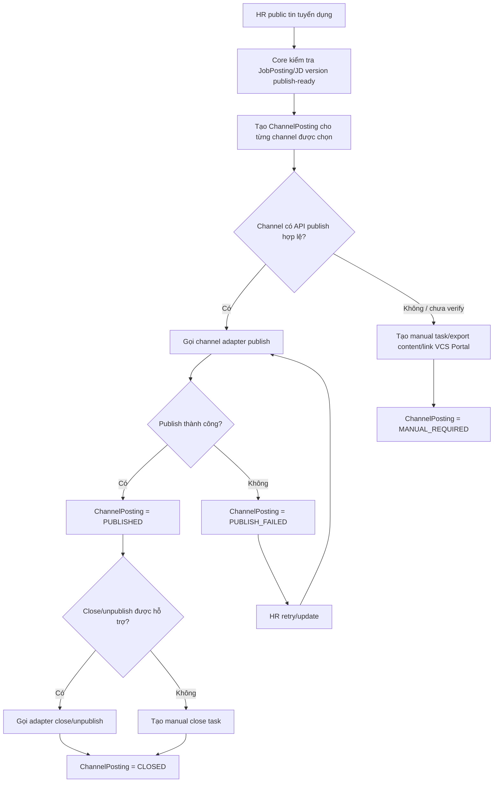
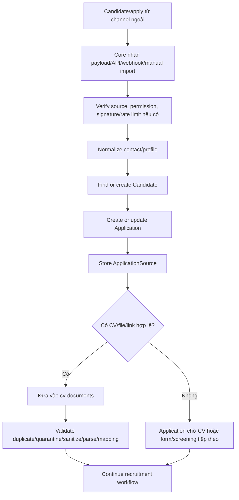

# 13. Channel Posting and Bot Specification

## 1. Mục tiêu tài liệu

Tài liệu này đặc tả Phase 1 cho channel posting, channel ingestion và candidate support bot trong dự án Interview Assistant / Recruitment Core.

Mục tiêu chính:

- Làm nền tảng cho các module `channel-publishing`, `channel-ingestion`, `channel-accounts`, `channel-postings`, `bot-conversations` và `bot-knowledge`.
- Cho phép HR đăng tin tuyển dụng đa kênh nhưng vẫn giữ Recruitment Core Backend là source of truth.
- Chuẩn hóa mọi lead/apply/CV từ kênh ngoài về `Candidate`, `Application`, `ApplicationSource` và `CVDocument`.
- Ghi nhận trạng thái publish, ingestion, conversation và audit theo từng kênh.
- Cung cấp phạm vi bot hỗ trợ ứng viên ở mức JD/FAQ/process, không thay thế HR Review, không đưa ra quyết định tuyển dụng.

Tài liệu này chỉ là specification. Không tạo code, migration, module, service, controller hoặc entity trong Phase 1 tại bước này.

## 2. Module scope

| Module | Scope Phase 1 | Source of truth | Ghi chú |
| --- | --- | --- | --- |
| `channel-publishing` | Tạo yêu cầu publish job posting tới từng channel, lưu trạng thái publish, retry/close nếu channel hỗ trợ | Recruitment Core Backend | Channel bên ngoài chỉ nhận bản publish/copy/link, không sở hữu dữ liệu job posting |
| `channel-ingestion` | Nhận apply/lead/CV từ VCS Portal hoặc kênh ngoài qua webhook/API/manual import/export/email/CSV | Recruitment Core Backend | Mọi dữ liệu ứng viên phải normalize về `Candidate` + `Application` |
| `channel-accounts` | Lưu cấu hình channel, adapter type, trạng thái kết nối và thông tin an toàn cần thiết | Recruitment Core Backend | Credential phải dùng env/secret manager hoặc config an toàn, không lưu plain API key |
| `channel-postings` | Lưu mapping giữa `JobPosting` nội bộ và external posting theo channel | Recruitment Core Backend | External channel không được ghi DB trực tiếp |
| `bot-conversations` | Ghi nhận conversation, message, handoff và trạng thái bot/HR takeover | Recruitment Core Backend | Bot không thay HR Review, không tiết lộ mapping/AI score |
| `bot-knowledge` | Quản lý nguồn kiến thức bot từ JD, job posting, FAQ, policy tuyển dụng Phase 1 | Recruitment Core Backend | Bot chỉ trả lời trong phạm vi knowledge được duyệt |
| `notifications` | Notify HR khi publish fail, manual task required, ingestion fail hoặc bot cần handoff | Recruitment Core Backend | Telegram reminder hiện tại không phải channel bot platform |
| `applications` | Tạo/cập nhật Application từ mọi nguồn apply | Recruitment Core Backend | Không được bỏ qua `Application` khi ingest từ channel ngoài |
| `cv-documents` | Nhận CV từ channel/manual import và đưa qua pipeline an toàn | Recruitment Core Backend | CV từ channel vẫn phải quarantine/sanitize/parse như upload trực tiếp |

In scope:

- Channel posting trong NestJS Recruitment Core Backend.
- Bot config/log trong Recruitment Core.
- External channel chỉ là endpoint, source hoặc nơi giao tiếp.
- Mọi apply/CV từ external channel phải tạo hoặc link `Candidate` + `Application`.
- VCS Portal là kênh apply/upload CV chính.
- Facebook, LinkedIn, TopCV, VietnamWorks phụ thuộc năng lực API/webhook/export thực tế.
- Nếu channel không có API hợp lệ, fallback sang manual/export/link về VCS Portal.

Out of scope:

- Scraping trái phép hoặc ingest dữ liệu trái điều khoản sử dụng của channel.
- Spam automation, bulk messaging trái policy channel.
- Quyết định tuyển dụng tự động.
- Thay thế HR Review.
- Interview/session/evaluation/offer/onboarding.
- Chỉnh sửa các module `sessions`, `evaluations`, `export`, `submissions`.

## 3. Channel list

| Channel code | Vai trò Phase 1 | Apply/CV | Bot/inbox | Ghi chú |
| --- | --- | --- | --- | --- |
| `VCS_PORTAL` | Main owned channel để public job posting, candidate apply và upload CV | Core-controlled apply form/upload CV | Có thể hỗ trợ bot/FAQ nếu portal có UI/integration phù hợp | Là kênh chính, ưu tiên link apply về đây khi channel ngoài chưa có API |
| `FACEBOOK` | Posting/inbox/comment/lead nếu có legal integration phù hợp | `TBD / Need verification` cho lead/webhook/CV/file access | `TBD / Need verification` theo inbox/comment API và policy | Không được giả định API publish/chatbot có sẵn trước khi verify |
| `LINKEDIN` | Publish hoặc manual posting tùy API/permission | `TBD / Need verification` cho apply webhook/export | `TBD / Need verification` theo API/policy | Có thể fallback manual post + link VCS Portal |
| `TOPCV` | Job board channel, nhận apply/CV nếu có API/export/email/webhook hợp lệ | `TBD / Need verification` | `LATER` hoặc `TBD / Need verification` | Không fetch CV nếu không có quyền/API hợp lệ |
| `VIETNAMWORKS` | Job board channel, nhận apply/CV nếu có API/export/email/webhook hợp lệ | `TBD / Need verification` | `LATER` hoặc `TBD / Need verification` | Không fetch CV nếu không có quyền/API hợp lệ |

Nguyên tắc:

- VCS Portal là kênh apply/upload CV chính.
- Channel ngoài không phải source of truth.
- Production readiness của Facebook, LinkedIn, TopCV và VietnamWorks phải được verify theo API, webhook, export, email forwarding, rate limit, policy và legal permission thực tế.
- Nếu không verify được capability, hệ thống dùng fallback manual task, export content, import CSV/email hoặc link apply về VCS Portal.

## 4. Posting flow

Luồng nghiệp vụ:

```text
HR public tin tuyển dụng
-> Core kiểm tra JobPosting/JD version publish-ready
-> Core tạo ChannelPosting cho từng channel được chọn
-> Với channel có API: gọi adapter publish
-> Với channel chưa có API: tạo manual task/export content/link về VCS Portal
-> Lưu trạng thái publish từng channel
-> HR theo dõi trạng thái publish
```



| Step | Actor | Action | Output | Trạng thái gợi ý |
| --- | --- | --- | --- | --- |
| 1 | HR/Admin | Chọn `JobPosting` đã publish-ready | Publish request | `DRAFT` hoặc existing channel state |
| 2 | Core | Kiểm tra JD version, job posting, quyền HR/Admin | Validation result | Nếu fail: không tạo publish |
| 3 | Core | Tạo hoặc reuse `ChannelPosting` theo `jobPostingId + channel` | Internal channel posting record | `PUBLISHING` hoặc `MANUAL_REQUIRED` |
| 4 | Core adapter | Nếu channel có API hợp lệ, gọi publish adapter | External posting hoặc error | `PUBLISHED` / `PUBLISH_FAILED` |
| 5 | Core fallback | Nếu không có API hợp lệ, tạo manual task/export content/link VCS Portal | Manual posting instruction | `MANUAL_REQUIRED` |
| 6 | HR/Admin | Theo dõi trạng thái từng channel | Dashboard/status view | Không đổi `Application.status` |
| 7 | HR/Admin/System | Retry hoặc update nếu publish fail/cần refresh content | Adapter retry/manual update | `PUBLISHING`, `UPDATED`, `PUBLISH_FAILED` |
| 8 | HR/Admin/System | Close/unpublish khi job đóng nếu channel hỗ trợ | External close hoặc manual close task | `CLOSED` hoặc `MANUAL_REQUIRED` |

## 5. Channel capability matrix

| Channel | API publish | Apply webhook | CV fetch/import | Chat bot/inbox | Fallback đề xuất | Ghi chú |
| --- | --- | --- | --- | --- | --- | --- |
| `VCS_PORTAL` | `SUPPORTED` | `SUPPORTED` | `SUPPORTED` | `SUPPORTED` hoặc `LATER` theo UI Portal | Core-controlled portal flow | Main channel, dữ liệu đi trực tiếp qua Core API |
| `FACEBOOK` | `TBD` | `TBD` | `TBD` | `TBD` | `LINK_TO_VCS_PORTAL`, `MANUAL_POSTING_TASK`, `EXPORT_POST_CONTENT` | Need verification API, permission, webhook, inbox/comment policy |
| `LINKEDIN` | `TBD` hoặc `MANUAL_REQUIRED` | `TBD` | `TBD` | `TBD` hoặc `LATER` | `LINK_TO_VCS_PORTAL`, `MANUAL_POSTING_TASK`, `EXPORT_POST_CONTENT` | Need verification official integration and posting/apply permissions |
| `TOPCV` | `TBD` | `TBD` | `TBD` | `LATER` | `EMAIL_PARSING`, `CSV_IMPORT`, `MANUAL_IMPORT_CV`, `LINK_TO_VCS_PORTAL` | Need verification API/export/email/webhook contract |
| `VIETNAMWORKS` | `TBD` | `TBD` | `TBD` | `LATER` | `EMAIL_PARSING`, `CSV_IMPORT`, `MANUAL_IMPORT_CV`, `LINK_TO_VCS_PORTAL` | Need verification API/export/email/webhook contract |

Capability status:

- `SUPPORTED`: được Core kiểm soát hoặc đã verify integration hợp lệ.
- `TBD`: cần verify API, permission, policy, format, rate limit và legal use trước production.
- `MANUAL_REQUIRED`: không có API hợp lệ hoặc chưa được cấp quyền, cần HR thao tác thủ công.
- `LATER`: không thuộc Phase 1 MVP hoặc chưa cần triển khai.
- `NOT_SUPPORTED`: không hỗ trợ trong Phase 1 hoặc bị policy/channel cấm.

## 6. Fallback mode

| Fallback mode | Khi dùng | Output | Rule |
| --- | --- | --- | --- |
| `LINK_TO_VCS_PORTAL` | Channel ngoài chưa có apply webhook/API hợp lệ | Link apply về VCS Portal | Candidate apply qua Portal rồi tạo `Candidate` + `Application` trong Core |
| `MANUAL_POSTING_TASK` | Không có API publish hoặc API chưa verify | Task cho HR copy/paste nội dung lên channel | Vẫn tạo `ChannelPosting` với `MANUAL_REQUIRED` để tracking |
| `EXPORT_POST_CONTENT` | HR cần nội dung chuẩn để đăng thủ công | Job content export theo format channel | External post không sở hữu job posting |
| `MANUAL_IMPORT_CV` | HR tải CV từ channel hợp lệ rồi import vào Core | Import batch + application source | Mỗi CV/apply vẫn phải tạo/link `Application` |
| `EMAIL_PARSING` | Channel gửi CV/apply qua email được phép cấu hình | Parsed email payload | Email attachment vẫn đi qua CV pipeline an toàn |
| `CSV_IMPORT` | Channel/job board cung cấp export CSV hợp lệ | Import rows | Idempotency theo batch/row/external id |
| `WEBHOOK_LATER` | Channel có khả năng webhook nhưng chưa triển khai | Backlog integration task | Không giả lập webhook nếu chưa verify |

Fallback rule:

- Fallback vẫn lưu trong `ChannelPosting`.
- Manual import vẫn tạo hoặc link `Application`.
- Không để dữ liệu ứng viên nằm ngoài Core như bản ghi chính.
- Nguồn channel phải lưu trong `ApplicationSource`.
- Không cho WordPress/Facebook/LinkedIn/TopCV/VietnamWorks ghi trực tiếp database.

## 7. Candidate ingestion

Luồng nghiệp vụ:

```text
Candidate/apply từ channel ngoài
-> Core nhận payload/API/webhook/manual import
-> Normalize contact/profile
-> Find or create Candidate
-> Create or update Application
-> Store ApplicationSource
-> Nếu có CV: đưa vào CV processing pipeline
-> Continue validate/duplicate/quarantine/sanitize/parse/mapping
```



| Source type | Mô tả | Ingestion path | Required output |
| --- | --- | --- | --- |
| `VCS_PORTAL_FORM` | Candidate apply qua VCS Portal | Core API/form submit | `Candidate`, `Application`, optional `CVDocument` |
| `FACEBOOK_LEAD` | Lead từ Facebook nếu legal integration hợp lệ | Webhook/API/manual export | `ApplicationSource`, `Candidate`, `Application` |
| `FACEBOOK_MESSAGE` | Candidate gửi thông tin qua inbox/comment nếu policy cho phép | Conversation/manual HR import | `ChannelConversation`, optional `ApplicationSource` |
| `LINKEDIN_APPLY` | Apply từ LinkedIn nếu integration/export hợp lệ | API/webhook/export/manual import | `ApplicationSource`, `Candidate`, `Application` |
| `TOPCV_APPLY` | Apply/CV từ TopCV nếu API/export/email hợp lệ | API/webhook/email/CSV/manual import | `ApplicationSource`, `Candidate`, `Application`, optional `CVDocument` |
| `VIETNAMWORKS_APPLY` | Apply/CV từ VietnamWorks nếu API/export/email hợp lệ | API/webhook/email/CSV/manual import | `ApplicationSource`, `Candidate`, `Application`, optional `CVDocument` |
| `CSV_IMPORT` | HR import CSV từ channel hợp lệ | Import batch | `ApplicationSource`, `Candidate`, `Application` |
| `EMAIL_CV` | CV/apply được gửi qua email cấu hình hợp lệ | Email parsing | `ApplicationSource`, `Candidate`, `Application`, `CVDocument` |
| `MANUAL_HR_IMPORT` | HR nhập tay hoặc upload CV thay ứng viên | HR/Admin UI/API | `ApplicationSource`, `Candidate`, `Application`, optional `CVDocument` |

Rules:

- Mọi ingestion phải tạo hoặc link `Candidate` và `Application`.
- Nếu có CV, file phải đi qua `cv-documents` và CV processing pipeline.
- Không bypass malware scan, quarantine, safe CV storage, sanitize, parser, duplicate detection hoặc mapping pipeline.
- Duplicate detection dùng email/phone + JD/job posting + external id nếu có.
- Raw payload chỉ lưu có kiểm soát, phân quyền PII và không dùng làm source of truth thay `Application`.
- Nếu chỉ có conversation chưa đủ thông tin apply, tạo `ChannelConversation` trước; chỉ tạo `Application` khi có job posting/candidate/contact/apply intent đủ tối thiểu hoặc HR xác nhận manual import.

## 8. External identity

| Field | Scope | Mục đích |
| --- | --- | --- |
| `channel` | `ChannelPosting`, `ApplicationSource`, `ChannelConversation`, `ChannelMessage` | Xác định nguồn kênh |
| `externalPostingId` | `ChannelPosting` | Mapping tới bài đăng ngoài nếu có |
| `externalApplicationId` | `ApplicationSource` | Chống duplicate apply từ channel |
| `externalCandidateId` | `ApplicationSource` | Mapping candidate ngoài nếu channel cung cấp |
| `externalLeadId` | `ApplicationSource` | Mapping lead/campaign lead từ channel |
| `externalConversationId` | `ChannelConversation` | Mapping thread/inbox/comment conversation |
| `externalMessageId` | `ChannelMessage` | Chống duplicate message/reply |
| `campaignId` | `ChannelPosting`, `ApplicationSource`, `ChannelConversation` | Liên kết campaign nếu channel có |
| `sourceChannel` | `ApplicationSource`, `Application.metadata` | Báo cáo nguồn ứng viên |
| `sourceType` | `ApplicationSource` | Phân biệt form, lead, message, CSV, email, manual |
| `publishedUrl` | `ChannelPosting` | Link bài đăng ngoài hoặc VCS Portal |
| `rawPayload` | Source/log tables | Lưu payload có kiểm soát để debug/audit |
| `receivedAt` | `ApplicationSource`, `ChannelMessage` | Thời điểm Core nhận dữ liệu |
| `lastSyncAt` | `ChannelPosting`, `ApplicationSource`, `ChannelConversation` | Thời điểm đồng bộ gần nhất |

Rules:

- External ID giúp idempotency và duplicate prevention, nhưng không thay thế `application_id`.
- `Application` vẫn là bản ghi apply chính trong Recruitment Core.
- Ưu tiên dùng `ApplicationSource` nếu domain/migration đã định nghĩa. Nếu cần tên cụ thể hơn cho channel, `ChannelApplicationSource` chỉ là alias/extension concept, không tạo duplicate table song song.
- `ChannelPosting` map job posting nội bộ với posting ngoài.
- `ChannelConversation` map thread/inbox/comment bên ngoài với candidate/application nếu định danh được.
- Không dùng external channel ID làm primary key nội bộ.

## 9. Bot scope

| Bot được phép trả lời | Điều kiện |
| --- | --- |
| Thông tin JD/job posting | Chỉ dùng JD/job posting đã public hoặc knowledge được duyệt |
| Skill/experience requirement | Chỉ diễn giải từ JD/job posting, không thêm tiêu chí ngoài |
| Level/position | Chỉ theo job posting/JD |
| Benefits | Chỉ nếu JD/job posting/policy được duyệt có nêu |
| Quy trình tuyển dụng Phase 1 | Chỉ mô tả bước apply, CV processing, pre-screening, HR review ở mức chung |
| Hướng dẫn apply/upload CV | Ưu tiên link về VCS Portal hoặc hướng dẫn chính thức |
| Deadline | Chỉ nếu job posting có deadline rõ ràng |
| Pre-screening form access guidance | Chỉ hướng dẫn truy cập khi form đã được gửi/available |
| HR/Admin FAQ | Chỉ dùng nguồn FAQ/policy được duyệt |

| Bot không được làm | Lý do |
| --- | --- |
| Cam kết pass/fail hoặc cơ hội trúng tuyển | Quyết định thuộc HR Review |
| Đưa offer/salary ngoài JD/policy | Không có thẩm quyền và dễ sai lệch |
| Thu thập dữ liệu nhạy cảm không cần thiết | Tuân thủ privacy/compliance |
| Giải thích quyết định HR Review cá nhân | Thuộc HR, cần handoff |
| Tiết lộ mapping score, AI score hoặc screening score | Không public cho candidate |
| So sánh hoặc tiết lộ thông tin ứng viên khác | PII/confidential |
| Spam hoặc bulk message trái policy channel | Compliance/rate limit |
| Trả lời ngoài phạm vi channel/JD/FAQ/policy được duyệt | Giảm hallucination và rủi ro pháp lý |

Bot Phase 1 là candidate support bot, không phải AI recruiter tự động ra quyết định.

## 10. Bot escalation

| Case | Detection gợi ý | Action |
| --- | --- | --- |
| Insufficient info | Không tìm thấy câu trả lời trong JD/FAQ/policy | Mark `NEEDS_HR_HANDOFF`, notify HR, lưu reason |
| Salary/offer ngoài JD | Candidate hỏi offer, deal, salary ngoài thông tin public | Mark `NEEDS_HR_HANDOFF`, gợi ý HR trả lời |
| Complaint/negative feedback | Từ khóa complaint, dissatisfaction, legal concern | Notify HR/Admin, lưu conversation reason |
| Candidate yêu cầu người thật | Explicit request human/HR | Mark `NEEDS_HR_HANDOFF`, dừng auto reply sau takeover |
| Sensitive/legal intent | Hỏi dữ liệu nhạy cảm, khiếu nại pháp lý, thông tin riêng | Escalate HR/Admin, không tự trả lời chi tiết |
| Candidate gửi CV/file qua chat | Có file/link CV trong message | Link candidate/application nếu định danh được, yêu cầu upload chính thức hoặc HR import an toàn |
| Personal application status | Hỏi trạng thái hồ sơ cá nhân | Nếu không có policy/status public, handoff HR |
| Low confidence | Bot confidence dưới threshold | Mark `NEEDS_HR_HANDOFF`, không bịa câu trả lời |
| API/reply fail | Channel reply failed, rate limited, permission error | Notify HR, lưu error, chuyển manual reply nếu UI hỗ trợ |

Escalation rules:

- Khi handoff, set conversation status `NEEDS_HR_HANDOFF`.
- Notify HR/Admin theo job posting/channel.
- Link `Candidate`/`Application` nếu định danh được bằng email/phone/external id.
- Lưu `handoffReason`.
- Dừng auto reply sau HR takeover để tránh gửi chồng message.
- HR có thể reply thủ công nếu UI/channel integration hỗ trợ.

## 11. Conversation log

| Object | Required fields | Mục đích |
| --- | --- | --- |
| `ChannelConversation` | `id`, `channel`, `externalConversationId`, `jobPostingId`, `candidateId`, `applicationId`, `status`, `assignedHrUserId`, `lastMessageAt`, `handoffReason`, `createdAt`, `updatedAt` | Thread/inbox/comment conversation theo channel |
| `ChannelMessage` | `id`, `conversationId`, `channel`, `externalMessageId`, `direction`, `senderType`, `senderExternalId`, `messageType`, `content`, `attachments`, `rawPayload`, `sentAt`, `receivedAt`, `createdAt` | Lưu message inbound/outbound/bot/HR |
| `BotKnowledgeSource` | `id`, `sourceType`, `jobPostingId`, `jdVersionId`, `title`, `content`, `status`, `approvedBy`, `approvedAt`, `createdAt`, `updatedAt` | Nguồn kiến thức bot được duyệt |
| `ChannelBotConfig` hoặc `channel_accounts.config` | `channel`, `enabled`, `mode`, `autoReplyEnabled`, `confidenceThreshold`, `allowedKnowledgeSourceIds`, `handoffRules`, `createdAt`, `updatedAt` | Cấu hình bot theo channel/account |
| `Candidate` | `id`, `email`, `phone`, `fullName`, `metadata` | Liên kết conversation với ứng viên nếu xác định được |
| `Application` | `id`, `candidateId`, `jobPostingId`, `status`, `metadata` | Liên kết conversation với apply nếu xác định được |
| `JobPosting` | `id`, `title`, `status`, `publishedAt`, `closedAt` | Cung cấp context tuyển dụng cho conversation |

Retention/security:

- Conversation log chứa PII nên cần phân quyền HR/Admin và audit access.
- `rawPayload` chỉ dùng debug/audit, không hiển thị rộng rãi.
- Attachment/file link từ channel không được tin cậy trực tiếp; nếu dùng làm CV phải safe fetch, validate, quarantine và xử lý bằng CV pipeline.
- Retention policy cần xác định theo legal/company policy trước production.

## 12. Compliance rule

| Rule | Yêu cầu |
| --- | --- |
| No spam | Không gửi bulk/auto message nếu channel không cho phép hoặc candidate không consent |
| Respect channel policy | Không publish, inbox, fetch CV, scrape hoặc automate ngoài capability/API được phép |
| No illegal scraping | Không crawl/scrape profile/job board/CV trái điều khoản |
| No unsupported data access | Không lấy CV/contact/message nếu chưa có quyền hợp lệ |
| Rate limit | Tôn trọng rate limit và retry policy của channel |
| Legal integration only | Chỉ dùng API/webhook/export/email được phép |
| Consent/source tracking | Lưu source/consent nếu channel hoặc policy yêu cầu |
| Sensitive data | Bot không hỏi hoặc gửi dữ liệu nhạy cảm không cần thiết |
| Scope control | Bot không trả lời vượt JD/FAQ/policy được duyệt |
| No AI/HR result disclosure | Không tiết lộ mapping score, AI screening score, HR decision nội bộ |
| Unsubscribe/stop | Nếu có message campaign, phải hỗ trợ stop/unsubscribe theo policy |
| Webhook signature | Webhook phải verify signature/secret và có replay protection |
| Credential safety | Không lưu plain API key; dùng env/secret manager/config an toàn |
| Auditability | Publish/import/reply/handoff phải có audit hoặc workflow event |

## 13. API contract

Endpoint list:

```text
GET  /api/channel-accounts
POST /api/channel-accounts
PUT  /api/channel-accounts/:id

POST /api/job-postings/:id/channels/:channel/publish
GET  /api/job-postings/:id/channels
GET  /api/job-postings/:id/channels/:channel/status
POST /api/job-postings/:id/channels/:channel/retry
POST /api/job-postings/:id/channels/:channel/close

POST /api/channels/:channel/webhook
POST /api/channels/:channel/import-applications
GET  /api/channels/:channel/import-jobs

GET  /api/channel-conversations
GET  /api/channel-conversations/:id
POST /api/channel-conversations/:id/reply
POST /api/channel-conversations/:id/handoff-hr

GET  /api/bot-knowledge
POST /api/bot-knowledge
PUT  /api/bot-knowledge/:id
```

| Endpoint group | Auth/permission | Ghi chú |
| --- | --- | --- |
| `GET/POST/PUT /api/channel-accounts` | Admin hoặc authorized HR theo policy | Quản lý cấu hình channel/account, không public |
| `POST /api/job-postings/:id/channels/:channel/publish` | HR/Admin | Publish hoặc tạo fallback/manual task |
| `GET /api/job-postings/:id/channels` | HR/Admin | Xem trạng thái publish toàn bộ channel |
| `GET /api/job-postings/:id/channels/:channel/status` | HR/Admin | Xem trạng thái một channel |
| `POST /api/job-postings/:id/channels/:channel/retry` | HR/Admin | Retry publish/sync khi fail |
| `POST /api/job-postings/:id/channels/:channel/close` | HR/Admin | Close/unpublish nếu channel hỗ trợ, nếu không tạo manual task |
| `POST /api/channels/:channel/webhook` | System/Webhook signature | Không dùng public unauthenticated webhook; cần signature/replay protection |
| `POST /api/channels/:channel/import-applications` | HR/Admin/System | Manual/CSV/email/API import, có idempotency |
| `GET /api/channels/:channel/import-jobs` | HR/Admin/System | Xem import job/batch trạng thái |
| `GET /api/channel-conversations` | HR/Admin | Danh sách conversation theo channel/job/status |
| `GET /api/channel-conversations/:id` | HR/Admin | Chi tiết thread/message |
| `POST /api/channel-conversations/:id/reply` | HR/Admin | HR manual reply nếu channel/UI hỗ trợ |
| `POST /api/channel-conversations/:id/handoff-hr` | HR/Admin/System | Bot/system/HR chuyển handoff |
| `GET/POST/PUT /api/bot-knowledge` | HR/Admin hoặc Admin policy | Quản lý source knowledge được duyệt |

Publish request example:

```json
{
  "channel": "FACEBOOK",
  "mode": "AUTO_OR_FALLBACK",
  "fallbackMode": "LINK_TO_VCS_PORTAL",
  "contentOverride": {
    "title": "Senior Backend Engineer",
    "summary": "Build recruitment core services",
    "applyUrl": "https://portal.example.com/jobs/job_123/apply"
  }
}
```

Publish response example:

```json
{
  "jobPostingId": "job_123",
  "channel": "FACEBOOK",
  "status": "MANUAL_REQUIRED",
  "fallbackMode": "LINK_TO_VCS_PORTAL",
  "publishedUrl": null,
  "externalPostingId": null,
  "manualTask": {
    "title": "Post job to Facebook manually",
    "applyUrl": "https://portal.example.com/jobs/job_123/apply"
  }
}
```

Webhook ingestion normalized contract:

```json
{
  "channel": "TOPCV",
  "sourceType": "TOPCV_APPLY",
  "externalApplicationId": "topcv_apply_789",
  "externalCandidateId": "topcv_candidate_456",
  "jobPostingId": "job_123",
  "candidate": {
    "fullName": "Nguyen Van A",
    "email": "candidate@example.com",
    "phone": "+84901234567"
  },
  "cv": {
    "fileUrl": "https://channel.example.com/cv/789",
    "fileName": "nguyen-van-a.pdf",
    "contentType": "application/pdf"
  },
  "rawPayload": {
    "provider": "TOPCV",
    "eventId": "evt_001"
  },
  "receivedAt": "2026-06-18T09:00:00+07:00"
}
```

Webhook ingestion response example:

```json
{
  "status": "APPLICATION_CREATED",
  "candidateId": "cand_123",
  "applicationId": "app_456",
  "applicationSourceId": "src_789",
  "cvDocumentId": "cv_001",
  "duplicate": false
}
```

Conversation reply example:

```json
{
  "message": "Cảm ơn bạn đã quan tâm. Bạn vui lòng nộp hồ sơ qua VCS Portal để hệ thống ghi nhận đầy đủ thông tin.",
  "senderType": "HR",
  "attachments": [],
  "handoff": false
}
```

Conversation reply response example:

```json
{
  "conversationId": "conv_123",
  "messageId": "msg_456",
  "status": "OPEN",
  "channelDeliveryStatus": "SENT"
}
```

## 14. Data model liên quan

| Table/Object | Fields liên quan | Ghi chú |
| --- | --- | --- |
| `job_postings` | `id`, `jdVersionId`, `title`, `status`, `publishedAt`, `closedAt`, `metadata` | Source job posting nội bộ |
| `channel_postings` | `id`, `jobPostingId`, `channel`, `status`, `externalPostingId`, `publishedUrl`, `fallbackMode`, `lastError`, `lastSyncAt`, `createdBy`, `createdAt`, `updatedAt` | Mapping publish theo từng channel |
| `channel_accounts` | `id`, `channel`, `name`, `status`, `config`, `credentialRef`, `createdBy`, `createdAt`, `updatedAt` | Config account/adapter an toàn |
| `application_sources` hoặc `channel_application_sources` | `id`, `applicationId`, `channel`, `sourceType`, `externalApplicationId`, `externalCandidateId`, `externalLeadId`, `campaignId`, `rawPayload`, `receivedAt`, `lastSyncAt` | Ưu tiên `application_sources`; alias channel nếu cần |
| `applications` | `id`, `candidateId`, `jobPostingId`, `status`, `source`, `metadata`, `createdAt`, `updatedAt` | Apply chính trong Core |
| `candidates` | `id`, `fullName`, `email`, `phone`, `metadata`, `createdAt`, `updatedAt` | Candidate chính trong Core |
| `cv_documents` | `id`, `applicationId`, `candidateId`, `source`, `originalFileName`, `fileHash`, `status`, `storagePath`, `createdAt` | CV phải đi qua safe processing |
| `channel_conversations` | `id`, `channel`, `externalConversationId`, `jobPostingId`, `candidateId`, `applicationId`, `status`, `assignedHrUserId`, `handoffReason`, `lastMessageAt`, `createdAt`, `updatedAt` | Thread/inbox/comment |
| `channel_messages` | `id`, `conversationId`, `channel`, `externalMessageId`, `direction`, `senderType`, `messageType`, `content`, `attachments`, `rawPayload`, `sentAt`, `receivedAt`, `createdAt` | Message log |
| `bot_knowledge_sources` | `id`, `sourceType`, `jobPostingId`, `jdVersionId`, `title`, `content`, `status`, `approvedBy`, `approvedAt`, `createdAt`, `updatedAt` | Knowledge được duyệt |
| `audit_logs` | `actorId`, `action`, `entityType`, `entityId`, `metadata`, `createdAt` | Audit publish/import/reply/handoff |
| `workflow_events` | `applicationId`, `eventType`, `actorType`, `actorId`, `metadata`, `createdAt` | Theo dõi workflow application |

Data ownership:

- `job_postings`, `applications`, `candidates`, `cv_documents` thuộc Core.
- `channel_postings`, `application_sources`, `channel_conversations`, `channel_messages` chỉ lưu mapping/source/log.
- External channel không được ghi trực tiếp DB và không được thay thế trạng thái Core.

## 15. State / Status liên quan

| Status group | Values | Ý nghĩa |
| --- | --- | --- |
| `ChannelPostingStatus` | `DRAFT`, `PUBLISHING`, `PUBLISHED`, `PUBLISH_FAILED`, `MANUAL_REQUIRED`, `UPDATED`, `CLOSED` | Trạng thái publish theo channel |
| `ChannelIngestionStatus` | `RECEIVED`, `NORMALIZED`, `APPLICATION_CREATED`, `DUPLICATE_DETECTED`, `CV_FETCH_PENDING`, `CV_FETCH_FAILED`, `FAILED` | Trạng thái ingest apply/CV từ channel |
| `ConversationStatus` | `OPEN`, `BOT_ACTIVE`, `NEEDS_HR_HANDOFF`, `HR_TAKEOVER`, `CLOSED` | Trạng thái conversation/bot/HR |
| `BotKnowledgeStatus` | `DRAFT`, `ACTIVE`, `INACTIVE`, `ARCHIVED` | Trạng thái nguồn knowledge |

Workflow relation:

- Channel ingestion thành công tạo workflow event `APPLICATION_CREATED`.
- Nếu có CV, workflow tiếp tục qua CV processing spec: validate file, `CV_UPLOADED` -> `CV_STORED_QUARANTINE` -> synchronous malware scan; malware thì `MALWARE_DETECTED`/`CV_REJECTED_MALWARE`, scan failed thì `CV_SCAN_FAILED`, scan pass thì async sanitize/parse trước khi mapping.
- `ChannelPostingStatus` không thay thế `JobPosting.status`; nó chỉ là trạng thái publish theo channel.
- `ConversationStatus` không thay thế `Application.status`; conversation chỉ hỗ trợ giao tiếp và handoff.
- Duplicate ingestion có thể tạo `DUPLICATE_DETECTED` và link về application hiện có thay vì tạo mới.

## 16. Idempotency / Duplicate rule

| Area | Idempotency key | Rule |
| --- | --- | --- |
| Publish | `jobPostingId + channel` | Một job posting chỉ có một active `ChannelPosting` mỗi channel |
| Publish retry | `jobPostingId + channel + externalPostingId` | Retry không tạo duplicate external post nếu đã có `externalPostingId` |
| Webhook apply | `channel + externalApplicationId` hoặc `channel + externalLeadId` | Nếu đã xử lý, return existing `ApplicationSource`/`Application` |
| Manual import | `channel + importBatchId + rowId` | Import lại cùng batch/row không tạo duplicate |
| CV document | `applicationId + originalFileHash` | Không lưu trùng CV giống hệt cho cùng application |
| Conversation | `channel + externalConversationId` | Một external thread map một `ChannelConversation` |
| Message | `channel + externalMessageId` | Không lưu duplicate inbound/outbound message |
| Bot reply | `conversationId + sourceMessageId + botResponseHash` | Tránh bot reply lặp khi retry delivery |

Duplicate rules:

- Candidate duplicate ưu tiên email, sau đó phone, sau đó external candidate id nếu trusted.
- Application duplicate ưu tiên `jobPostingId + candidateId`, sau đó `jobPostingId + email/phone`, sau đó external application/lead id.
- Nếu external id khác nhưng email/phone + job posting trùng, mark `DUPLICATE_DETECTED` và yêu cầu HR review nếu dữ liệu conflict.
- Raw payload conflict không được ghi đè dữ liệu đã verify nếu thiếu confirmation.
- Không tạo application mới chỉ vì một message mới trong cùng conversation.

## 17. Security / Permission

| Area | Rule |
| --- | --- |
| Channel config | Chỉ Admin/authorized HR được tạo/sửa `channel_accounts` |
| Webhook | Verify signature/secret, timestamp và replay protection |
| Credentials | Không lưu plain API key/token; dùng env/secret manager hoặc credential reference |
| Raw payload | PII access control, audit access, không expose ra public response |
| CV from channel | Phải đi qua quarantine/sanitize/validate; không trust file URL trực tiếp |
| File fetch | Safe fetch, content-type validation, size limit, extension validation, malware scan nếu pipeline yêu cầu |
| Bot disclosure | Bot không tiết lộ mapping score, AI screening score, HR decision hoặc thông tin ứng viên khác |
| Bot data request | Bot không hỏi dữ liệu nhạy cảm không cần thiết |
| HR reply | HR manual reply/conversation takeover phải audit |
| Rate limit | Public/webhook/import endpoints phải rate limit theo source |
| Public access | Không có public publish/import endpoint không xác thực |
| Anti-spam | Không gửi spam/bulk message trái policy channel |

## 18. Compatibility với source hiện tại

| Source hiện tại | Compatibility rule |
| --- | --- |
| Chưa có `channel-*` modules | Phase 1 cần thêm spec/module sau, tài liệu này không tạo code |
| Telegram notification hiện tại | Chỉ là reminder/notification, không phải bot/channel platform |
| `candidates` | Có thể reuse để normalize candidate từ channel |
| Upload/parser hiện tại | Có thể reuse, nhưng CV từ channel vẫn phải đi qua CV processing mới: validate/quarantine/sanitize/parse/mapping |
| Auth/users/roles | Có thể reuse cho HR/Admin/System permission |
| WebSocket pattern hiện tại | Có thể reuse pattern realtime/progress, nhưng không dùng session room làm channel conversation room |
| Notification service | Có thể mở rộng abstraction cho channel publish fail, manual required, ingestion fail, handoff |
| `sessions` | Không chỉnh sửa cho channel posting/bot Phase 1 |
| `evaluations` | Không chỉnh sửa và không lộ evaluation/AI score ra bot |
| `export` | Không chỉnh sửa trong task này; export content/manual import là spec mới thuộc channel scope |
| `submissions` | Không chỉnh sửa cho channel ingestion |

Compatibility constraints:

- Không chỉnh sửa source specs hoặc source code trong bước tạo tài liệu này.
- Không dùng external channel làm source of truth.
- Không cho WordPress/Facebook/LinkedIn/TopCV/VietnamWorks ghi trực tiếp DB.
- Không bỏ qua `Application` khi nhận apply/CV từ channel ngoài.

## 19. Conflict / Assumption

| Topic | Conflict/Risk | Assumption Phase 1 |
| --- | --- | --- |
| Channel API publish | Chưa xác nhận API publish hợp lệ cho Facebook/LinkedIn/TopCV/VietnamWorks | External channels để `TBD / Need verification`; fallback manual/export/link VCS Portal |
| Apply webhook | Chưa xác nhận webhook/apply event theo từng channel | Chỉ triển khai khi có legal API/webhook contract |
| CV fetch/import | Channel có thể không cho fetch CV qua API | Dùng email/export/CSV/manual import nếu hợp lệ |
| Inbox/bot | Inbox/comment chatbot phụ thuộc permission/policy từng channel | Bot Phase 1 chỉ bật nơi có integration hợp lệ; còn lại HR manual reply |
| VCS Portal implementation | Chưa chốt WordPress hay UI riêng | VCS Portal vẫn là main owned channel, Core là source of truth |
| Bot MVP | Chưa chốt auto reply đầy đủ hay HR suggestion mode | Bot chỉ dùng JD/FAQ/process được duyệt và escalate khi thiếu tự tin |
| Email parsing/CSV import | Format thực tế chưa chốt | Cần adapter/import job riêng sau khi có sample |
| Bot auto reply vs HR suggestion | Rủi ro bot trả lời sai hoặc vượt policy | Mặc định cần confidence threshold, approved knowledge và handoff |
| `ChannelBotConfig` | Có thể là table riêng hoặc nằm trong `channel_accounts.config` | Dùng `ChannelBotConfig` concept; implement có thể chọn cách ít duplicate nhất |
| `application_sources` vs `channel_application_sources` | Có thể trùng naming nếu tạo mới | Ưu tiên `application_sources`; `ChannelApplicationSource` chỉ là alias nếu cần |

Assumptions:

- VCS Portal là main channel cho apply/upload CV.
- Facebook, LinkedIn, TopCV và VietnamWorks đều là `TBD / Need verification` cho API/webhook/bot capability cho tới khi có contract thực tế.
- Nếu không có API hợp lệ, fallback sang manual task, export/import hoặc link apply về VCS Portal.
- Bot chỉ trả lời theo JD/FAQ/process/policy được duyệt và escalate sang HR.
- `ApplicationSource` là object chính để lưu source channel; không tạo duplicate table nếu domain đã có.

## 20. Kết luận

Channel Posting and Bot Phase 1 phải coi Recruitment Core là source of truth. Các kênh như VCS Portal, Facebook, LinkedIn, TopCV và VietnamWorks chỉ đóng vai trò đăng tin, nhận lead/apply hoặc giao tiếp với ứng viên. Mọi apply/CV từ kênh ngoài phải chuẩn hóa về `Application`, đi qua CV processing an toàn và được audit. Nếu kênh chưa có API hợp lệ, hệ thống phải fallback sang manual task, export/import hoặc link apply về VCS Portal.
