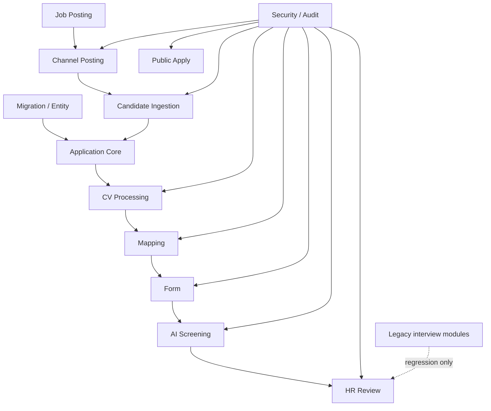

# 15. Implementation Task Breakdown

## 1. Mục tiêu tài liệu

Tài liệu này chia nhỏ kế hoạch triển khai Recruitment Phase 1 cho Interview Assistant / Recruitment Core Backend.

File này dùng để tạo prompt thực thi Codex theo từng batch sau này. Đây là tài liệu kế hoạch triển khai, không implement code, không tạo migration thật, không tạo service/controller/entity thật.

Mục tiêu là giảm rủi ro phá source hiện tại bằng cách:

- Chia task nhỏ, ít module/file mỗi batch.
- Có dependency rõ giữa migration/entity, service, controller/DTO, security/audit và test.
- Có checkpoint build/test/review trước khi chuyển batch.
- Bảo toàn flow interview hiện tại, đặc biệt `sessions`, `evaluations`, `export`, `submissions`.
- Giữ `Application` là trung tâm workflow và Recruitment Core là source of truth.

## 2. Nguyên tắc chia task

| STT | Nguyên tắc | Nội dung |
| --- | ---------- | -------- |
| 1 | Chia theo phase nhỏ | Mỗi phase tập trung một lớp nghiệp vụ hoặc hạ tầng rõ ràng. |
| 2 | Giới hạn phạm vi batch | Mỗi batch chỉ sửa số lượng module/file giới hạn để dễ review và rollback. |
| 3 | Migration/entity trước | Tạo enum/entity/migration nền trước khi viết service. |
| 4 | Service/business logic sau entity | Business rule cần dựa trên schema/entity đã rõ. |
| 5 | Controller/DTO/API sau service | API chỉ mở khi service contract và validation đã có. |
| 6 | Test sau từng module hoặc nhóm module | Không dồn toàn bộ test về cuối nếu module có side effect. |
| 7 | Không sửa mạnh module legacy | Không rewrite `sessions`, `evaluations`, `export`, `submissions` nếu chưa thật sự cần. |
| 8 | Dependency rõ | Mỗi task phải nêu Task ID phụ thuộc để tránh implement ngược thứ tự. |
| 9 | Checkpoint build/test | Mỗi batch phải có checkpoint build/test/lint phù hợp trước khi sang batch sau. |
| 10 | Security/audit xuyên suốt | Audit, permission, rate limit, idempotency và error response phải đi cùng module, không để cuối cùng mới thêm. |
| 11 | Channel API thật là later/verified | Không implement external channel API thật nếu chưa xác minh capability; trước mắt dùng adapter interface, fallback hoặc manual mode. |
| 12 | Public endpoint bảo vệ riêng | Public apply, form token và webhook phải có validation, rate limit, idempotency và security rule. |

## 3. Implementation phases

| Phase | Tên phase | Mục tiêu | Output chính |
| ----- | --------- | -------- | ------------ |
| Phase A | Foundation & Migration | Chuẩn hóa migration strategy; thêm enum/entity/migration nền tảng; thêm `Application`, JD, Job Posting, CV Document, Audit/Workflow. | Entity/migration nền, shared enum/status, config migration được kiểm soát. |
| Phase B | JD / Job Posting / Application Core | CRUD JD; JD version; job posting; application intake core; timeline/status cơ bản. | Module `job-descriptions`, `job-postings`, `applications`, status/timeline. |
| Phase C | CV Processing | Upload CV theo `application_id`; validate file; quarantine; hash; scan stub/ClamAV adapter; clean CV; parse CV sạch; CV versioning. | Module `cv-documents`, `cv-sanitization`, parser wrapper, clean CV access. |
| Phase D | Mapping CV-JD | Internal mapping module; input contract; run/get/rerun; save `MappingResult`; update workflow state. | Module `mapping`, `mapping-results`, idempotent mapping API. |
| Phase E | Form Pre-screening | Question set; form session token; public access; submit answer; notification gửi link form. | Module `question-sets`, `form-sessions`, `form-answers`, public form token flow. |
| Phase F | AI Screening | AI Screening sau `FORM_SUBMITTED`; reuse AI service/prompt config; JSON schema validation; save `AiScreeningResult`. | Module `ai-screening`, prompt key, result persistence. |
| Phase G | HR Review | Review queue; review detail; decision approve/reject/request more info/talent pool; audit HR decision. | Module `hr-review`, `HrReviewDecision`, terminal transition guard. |
| Phase H | Channel Posting & Bot Foundation | Channel posting data model/API; capability matrix/fallback; candidate ingestion chuẩn hóa về `Application`; conversation log/bot handoff foundation. | Module `channel-*`, `bot-*`, fallback/manual task skeleton. |
| Phase I | Security / Audit / Hardening | Role matrix enforcement; public endpoint security; rate limit; audit coverage; error response hardening; PII handling. | Audit service coverage, guards/throttles, safe errors, PII masking rules. |
| Phase J | Test / Stabilization / Regression | Unit/integration/e2e test; regression existing interview modules; build/lint/test; review migration rollback. | Build/test pass, migration run/revert checked, regression notes. |

## 4. Suggested implementation order

```text
1. Đọc source convention và package scripts.
2. Chuẩn hóa migration config / ghi nhận synchronize=true risk.
3. Tạo enum/entity/migration nền.
4. Implement service core.
5. Implement controller/DTO.
6. Implement workflow/audit.
7. Implement security/rate limit.
8. Implement test.
9. Chạy build/lint/test checkpoint.
10. Review diff và rủi ro trước batch tiếp theo.
```

| Order | Nhóm việc | Lý do |
| ----- | --------- | ----- |
| 1 | Entity/migration trước service | Service cần schema, relation và enum ổn định để tránh rewrite. |
| 2 | Service trước controller | Business rule nên test được trước khi mở API surface. |
| 3 | DTO/validation trước public API | Public endpoint cần validate chặt trước khi xử lý file/token/webhook. |
| 4 | Audit/workflow update cùng service | Transition và action quan trọng phải ghi nhận ngay khi business logic chạy. |
| 5 | Security/rate limit cùng API | Không mở public apply/form/webhook nếu chưa có guard/throttle/idempotency. |
| 6 | Test cuối từng batch | Bắt lỗi compile/regression sớm, tránh gom lỗi nhiều module. |
| 7 | Legacy regression sau batch rủi ro | Các batch đụng app root, auth, upload, AI hoặc shared module cần kiểm tra interview flow cũ. |

## 5. Task list tổng thể

| Task ID | Phase | Module | Mô tả task | File dự kiến | Dependency | Risk |
| ------- | ----- | ------ | ---------- | ------------ | ---------- | ---- |
| `P1-A01` | A | Source verification | Check package scripts/build/test/migration command và folder convention. | `package.json`, `apps/backend/package.json`, `turbo.json`, `apps/backend/src` | None | Low |
| `P1-A02` | A | Migration config | Check TypeORM runtime/config, migration path, `synchronize=true` risk. | `apps/backend/src/app.module.ts`, `apps/backend/src/config/typeorm.config.ts` | `P1-A01` | High |
| `P1-A03` | A | Runtime config | Kiểm soát `synchronize=true` cho staging/production, không phá local dev nếu chưa chốt. | `apps/backend/src/app.module.ts`, env config | `P1-A02` | High |
| `P1-A04` | A | Shared enum/status | Tạo enum/status dùng chung cho application, CV, mapping, form, AI, HR, channel. | `apps/backend/src/recruitment-common` hoặc inspect convention first | `P1-A01` | Medium |
| `P1-A05` | A | Migration foundation | Tạo migration các bảng nền theo migration plan. | `apps/backend/src/migrations` | `P1-A04` | High |
| `P1-A06` | A | `applications` entity | Tạo entity `Application` làm workflow center. | `apps/backend/src/applications/entities` | `P1-A05` | High |
| `P1-A07` | A | JD entities | Tạo entity `JobDescription`, `JobDescriptionVersion`, `JobPosting`. | `apps/backend/src/job-descriptions/entities`, `apps/backend/src/job-postings/entities` | `P1-A05` | Medium |
| `P1-A08` | A | CV entities | Tạo entity `CvDocument`, `ParsedProfile` hoặc JSONB boundary theo migration plan. | `apps/backend/src/cv-documents/entities` | `P1-A06` | High |
| `P1-A09` | A | Screening entities | Tạo entity `MappingResult`, `FormSession`, `FormAnswer`, `AiScreeningResult`, `HrReviewDecision`. | `apps/backend/src/mapping/entities`, `apps/backend/src/form-sessions/entities`, `apps/backend/src/ai-screening/entities`, `apps/backend/src/hr-review/entities` | `P1-A06`, `P1-A07`, `P1-A08` | High |
| `P1-A10` | A | Workflow/Audit entities | Tạo entity `WorkflowEvent`, `AuditLog`. | `apps/backend/src/workflow-state/entities`, `apps/backend/src/audit-logs/entities` | `P1-A06` | Medium |
| `P1-A11` | A | Index/constraint | Thêm index/unique theo migration plan: application duplicate, token hash, audit timeline, channel external id. | `apps/backend/src/migrations` | `P1-A06`-`P1-A10` | High |
| `P1-A12` | A | Seed config | Seed prompt key/channel config nếu cần, additive-only. | `apps/backend/src/ai`, `apps/backend/src/channel-accounts` hoặc inspect convention first | `P1-A09` | Medium |
| `P1-B01` | B | `job-descriptions` module | Tạo module/service CRUD JD. | `apps/backend/src/job-descriptions` | `P1-A07` | Medium |
| `P1-B02` | B | JD version service | Tạo service versioning/snapshot JD. | `apps/backend/src/job-descriptions` | `P1-B01` | Medium |
| `P1-B03` | B | `job-postings` module | Tạo service CRUD job posting, publish-ready state, close state. | `apps/backend/src/job-postings` | `P1-B02` | Medium |
| `P1-B04` | B | Public job detail | Tạo public read API cho published job detail. | `apps/backend/src/job-postings` | `P1-B03` | Medium |
| `P1-B05` | B | `applications` module | Tạo service tạo/link `Candidate` + `Application` từ apply/manual source. | `apps/backend/src/applications` | `P1-A06`, `P1-B03` | High |
| `P1-B06` | B | Application source | Tạo handling `ApplicationSource`/source channel metadata. | `apps/backend/src/applications` hoặc `apps/backend/src/application-sources` | `P1-B05` | Medium |
| `P1-B07` | B | Application timeline | Tạo service `WorkflowEvent`/timeline đọc theo `applicationId`. | `apps/backend/src/workflow-state` | `P1-A10`, `P1-B05` | Medium |
| `P1-B08` | B | Application API | DTO/controller list/detail/status/timeline cơ bản. | `apps/backend/src/applications` | `P1-B05`, `P1-B07` | Medium |
| `P1-C01` | C | CV upload API | Tạo application-centric CV upload API, không dùng `/api/uploads/:filename` cho raw CV. | `apps/backend/src/cv-documents` | `P1-B05` | High |
| `P1-C02` | C | File validation | Validate MIME/extension/size/magic bytes/path traversal/server filename. | `apps/backend/src/cv-documents`, `apps/backend/src/cv-sanitization` | `P1-C01` | High |
| `P1-C03` | C | Quarantine storage | Lưu original CV vào quarantine storage boundary. | `apps/backend/src/cv-documents`, storage config | `P1-C02` | High |
| `P1-C04` | C | SHA-256 hash | Tính original/clean hash, hỗ trợ idempotency. | `apps/backend/src/cv-documents` | `P1-C03` | Medium |
| `P1-C05` | C | Scanner interface | Tạo scanner interface + stub implementation; later ClamAV adapter. | `apps/backend/src/cv-sanitization` | `P1-C03` | High |
| `P1-C06` | C | Clean CV service | Tạo clean/safe CV service, không dùng original cho nghiệp vụ. | `apps/backend/src/cv-sanitization` | `P1-C05` | High |
| `P1-C07` | C | Parser wrapper | Reuse `file-parser` nhưng chỉ parse clean CV. | `apps/backend/src/cv-parsing` hoặc `apps/backend/src/cv-documents` | `P1-C06` | Medium |
| `P1-C08` | C | CV versioning | Lưu version mới khi upload lại, không ghi mất bản cũ. | `apps/backend/src/cv-documents` | `P1-C04` | Medium |
| `P1-C09` | C | Clean CV access API | API xem/download clean CV theo `applicationId`/`cvDocumentId` có ownership check. | `apps/backend/src/cv-documents` | `P1-C06`, `P1-I04` | High |
| `P1-D01` | D | `mapping` module | Tạo module/service mapping nội bộ. | `apps/backend/src/mapping` | `P1-C07`, `P1-B02` | Medium |
| `P1-D02` | D | Mapping input builder | Build input từ `Application`, JD version, clean CV/parsed profile. | `apps/backend/src/mapping` | `P1-D01` | Medium |
| `P1-D03` | D | Scoring mode contract | Implement scoring/rule contract, có thể hỗ trợ deterministic MVP hoặc AI-assisted mode. | `apps/backend/src/mapping` | `P1-D02` | Medium |
| `P1-D04` | D | AI prompt reuse | Nếu dùng AI, thêm prompt key/schema validation, không gửi original CV. | `apps/backend/src/ai`, `apps/backend/src/mapping` | `P1-D02` | High |
| `P1-D05` | D | Result save | Lưu `MappingResult`, strengths/gaps/recommendation/status. | `apps/backend/src/mapping` | `P1-D03` | Medium |
| `P1-D06` | D | Run/get/rerun API | Controller/DTO cho run/get/rerun mapping. | `apps/backend/src/mapping` | `P1-D05` | Medium |
| `P1-D07` | D | Mapping idempotency | Key theo `applicationId + cleanCvDocumentId + jobDescriptionVersionId`. | `apps/backend/src/mapping` | `P1-D06` | Medium |
| `P1-E01` | E | `question-sets` module | Tạo question set/question set item cho pre-screening. | `apps/backend/src/question-sets` | `P1-B02` | Medium |
| `P1-E02` | E | `form-sessions` module | Tạo form session theo `Application` và question set. | `apps/backend/src/form-sessions` | `P1-E01`, `P1-D05` | Medium |
| `P1-E03` | E | Token generation/hash/expiry | Random token, lưu `tokenHash`, expiry, submit once. | `apps/backend/src/form-sessions` | `P1-E02` | High |
| `P1-E04` | E | Public form access | `GET /api/forms/access/:token`, không expose mapping/AI/CV/HR data. | `apps/backend/src/form-sessions` | `P1-E03`, `P1-I02` | High |
| `P1-E05` | E | Save draft | Nếu MVP chọn có draft, implement `PUT /api/forms/access/:token/answers`; nếu không, ghi pending. | `apps/backend/src/form-answers` | `P1-E04` | Medium |
| `P1-E06` | E | Submit form | Submit answer once, validate required answers, update workflow. | `apps/backend/src/form-answers`, `apps/backend/src/form-sessions` | `P1-E04` | High |
| `P1-E07` | E | Notification send link | Reuse/extend notification to send form link; delivery audit. | `apps/backend/src/notification`, `apps/backend/src/form-sessions` | `P1-E03` | Medium |
| `P1-F01` | F | AI prompt key | Thêm prompt key/config cho AI Screening. | `apps/backend/src/ai`, seed config | `P1-A12` | Medium |
| `P1-F02` | F | AI input builder | Build input từ JD version, clean CV/parsed profile, mapping, form answers. | `apps/backend/src/ai-screening` | `P1-E06`, `P1-D05`, `P1-C07` | High |
| `P1-F03` | F | JSON schema validation | Validate AI output schema/version trước khi lưu. | `apps/backend/src/ai-screening` | `P1-F02` | High |
| `P1-F04` | F | Save AI result | Lưu `AiScreeningResult`, raw result có kiểm soát, status/error. | `apps/backend/src/ai-screening` | `P1-F03` | Medium |
| `P1-F05` | F | Run/get/rerun API | API run/get/rerun AI Screening, rerun có reason/audit. | `apps/backend/src/ai-screening` | `P1-F04` | Medium |
| `P1-F06` | F | Failure/manual fallback | Failure/retry/manual fallback sang HR Review nếu policy cho phép. | `apps/backend/src/ai-screening`, `apps/backend/src/workflow-state` | `P1-F05` | Medium |
| `P1-G01` | G | Waiting queue | Query hồ sơ `WAITING_HR_REVIEW`. | `apps/backend/src/hr-review` | `P1-F04` | Medium |
| `P1-G02` | G | Review detail | Tổng hợp Candidate/Application/clean CV/mapping/form/AI/timeline. | `apps/backend/src/hr-review` | `P1-G01`, `P1-C09` | High |
| `P1-G03` | G | Decision APIs | Approve/reject/request more info/talent pool. | `apps/backend/src/hr-review` | `P1-G02` | High |
| `P1-G04` | G | `HrReviewDecision` persistence | Lưu decision, comment/reason, terminal status. | `apps/backend/src/hr-review` | `P1-G03` | Medium |
| `P1-G05` | G | Notification optional | Gửi notification nội bộ hoặc candidate nếu policy cho phép, không lộ score/decision chi tiết trái policy. | `apps/backend/src/notification`, `apps/backend/src/hr-review` | `P1-G04` | Medium |
| `P1-G06` | G | HR audit | Audit HR decision/view/download/override. | `apps/backend/src/hr-review`, `apps/backend/src/audit-logs` | `P1-G03`, `P1-I06` | Medium |
| `P1-H01` | H | Channel accounts | Config account/adapter/credentialRef, không lưu plain secret. | `apps/backend/src/channel-accounts` | `P1-A10`, `P1-I01` | Medium |
| `P1-H02` | H | Channel posting | `ChannelPosting` service/API, status/fallback. | `apps/backend/src/channel-postings`, `apps/backend/src/channel-publishing` | `P1-B03`, `P1-H01` | Medium |
| `P1-H03` | H | Manual fallback/export | Manual task/export content/link VCS Portal cho channel chưa verify API. | `apps/backend/src/channel-publishing` | `P1-H02` | Medium |
| `P1-H04` | H | Webhook skeleton | Webhook endpoint skeleton với signature/token/rate/idempotency hook. | `apps/backend/src/channel-ingestion` | `P1-H01`, `P1-I03` | High |
| `P1-H05` | H | Import applications | Import CSV/email/manual/API payload và normalize về `Application`. | `apps/backend/src/channel-ingestion` | `P1-B05`, `P1-H04` | High |
| `P1-H06` | H | Conversation log | `ChannelConversation`, `ChannelMessage` service/API. | `apps/backend/src/bot-conversations` hoặc `apps/backend/src/channel-conversations` | `P1-H01` | Medium |
| `P1-H07` | H | Bot knowledge source | `BotKnowledgeSource` CRUD/config, approved source only. | `apps/backend/src/bot-knowledge` | `P1-B02`, `P1-H06` | Medium |
| `P1-H08` | H | Bot handoff | Handoff HR state/reason, no spam/auto external send until adapter verified. | `apps/backend/src/bot-conversations` | `P1-H06`, `P1-H07` | High |
| `P1-I01` | I | Role guards | Enforce role matrix for Admin/HR/Interviewer/Candidate/Public/System. | `apps/backend/src/auth`, module controllers | `P1-B08` | Medium |
| `P1-I02` | I | Public rate limit | Throttle public apply/form endpoints lower than global. | `apps/backend/src/applications`, `apps/backend/src/form-sessions` | `P1-B08`, `P1-E04` | High |
| `P1-I03` | I | Webhook security | Signature/shared secret/replay/IP allowlist where possible. | `apps/backend/src/channel-ingestion` | `P1-H04` | High |
| `P1-I04` | I | File access ownership | Ownership check for clean CV access; no raw CV serving. | `apps/backend/src/cv-documents` | `P1-C09` | High |
| `P1-I05` | I | Audit log service | Central audit service with redaction and metadata policy. | `apps/backend/src/audit-logs` | `P1-A10` | Medium |
| `P1-I06` | I | Audit coverage | Add audit calls for apply/CV/mapping/form/AI/HR/channel/bot. | Cross-module minimal edits | `P1-I05` | High |
| `P1-I07` | I | Error response hardening | Safe error envelope for public APIs, no stack/path/secret leak. | Cross-module filters/interceptors or module-level handling | `P1-I02`, `P1-I03` | Medium |
| `P1-I08` | I | PII masking/logging rule | Mask email/phone, avoid raw CV/prompt/token logs. | `apps/backend/src/audit-logs`, logging utilities | `P1-I05` | Medium |
| `P1-J01` | J | Unit tests core | Unit tests service core: applications, CV, mapping, form, AI, HR. | `apps/backend/src/**/*.spec.ts` | Previous module tasks | Medium |
| `P1-J02` | J | Integration tests API | API tests for public apply/form/webhook and HR APIs. | `apps/backend/test` or inspect existing convention first | Previous module tasks | Medium |
| `P1-J03` | J | Migration test | Test migration compile/run/revert locally. | package scripts, migrations | `P1-A05`-`P1-A11` | High |
| `P1-J04` | J | Public endpoint tests | Rate limit, token invalid/expired, file validation, safe errors. | `apps/backend/src` or `apps/backend/test` | `P1-I02`, `P1-I07` | Medium |
| `P1-J05` | J | Existing modules regression | Regression auth/candidates/sessions/evaluations/export/submissions. | Existing test suite or manual smoke notes | All high-risk batches | High |

## 6. Codex execution batches

| Batch | Phạm vi | Task ID | Không được làm | Checkpoint sau batch |
| ----- | ------- | ------- | -------------- | -------------------- |
| Batch 0 | Source verification | `P1-A01`, `P1-A02` | Không sửa code nếu chỉ analysis. | Ghi note về scripts, folder convention, migration config. |
| Batch 1 | Migration/entity foundation | `P1-A03`-`P1-A12` | Không tạo controller API. Không drop/rename dữ liệu cũ. | Backend build/typecheck, migration compile, review migration `up/down`. |
| Batch 2 | Application/JD/JobPosting core | `P1-B01`-`P1-B08` | Không động đến CV/mapping/form. | Build/test module core, review auth/DTO/workflow. |
| Batch 3 | CV processing MVP | `P1-C01`-`P1-C09` | Không mapping. Không expose raw CV. | Build/test CV, file validation, clean CV permission review. |
| Batch 4 | Mapping MVP | `P1-D01`-`P1-D07` | Không form/AI Screening. Không dùng original CV. | Build/test mapping, idempotency and audit review. |
| Batch 5 | Form pre-screening | `P1-E01`-`P1-E07` | Không AI. Không dùng `interview_sessions.accessToken`. | Public token tests, rate limit, token hash review. |
| Batch 6 | AI Screening | `P1-F01`-`P1-F06` | Không HR decision. Không log prompt đầy đủ. | Schema validation tests, AI failure fallback review. |
| Batch 7 | HR Review | `P1-G01`-`P1-G06` | Không tạo interview session/offer. Không expose result cho candidate. | Decision state tests, terminal transition and audit review. |
| Batch 8 | Channel posting/fallback | `P1-H01`-`P1-H05` | Không claim external API thật nếu chưa xác minh. Không để channel là source of truth. | Fallback/manual mode tests, webhook skeleton security review. |
| Batch 9 | Bot/conversation foundation | `P1-H06`-`P1-H08` | Không spam/auto external send nếu chưa có adapter thật. | Conversation/handoff tests, bot scope review. |
| Batch 10 | Security/audit hardening | `P1-I01`-`P1-I08` | Không rewrite auth core; chỉ guard/policy tối thiểu. | Security regression, audit coverage checklist. |
| Batch 11 | Final test/regression/stabilization | `P1-J01`-`P1-J05` | Không thêm feature mới. | Root/backend build, lint, typecheck, test, migration run/revert, do-not-touch review. |

## 7. Build checkpoints

Các command đã xác nhận từ scripts hiện tại:

- Root: `pnpm build`, `pnpm lint`, `pnpm typecheck`, `pnpm backend:dev`.
- Backend: `pnpm --filter @interview-assistant/backend build`, `pnpm --filter @interview-assistant/backend lint`, `pnpm --filter @interview-assistant/backend typecheck`, `pnpm --filter @interview-assistant/backend test`.
- Backend migration scripts: `pnpm --filter @interview-assistant/backend migration:run`, `pnpm --filter @interview-assistant/backend migration:revert`, `pnpm --filter @interview-assistant/backend migration:generate`.
- Ghi chú: migration scripts dùng `dist/config/typeorm.config.js`, nên cần chạy backend build trước migration command. `migration:generate` có thể cần inspect thêm cách truyền tên/path migration trước khi dùng trong batch thực thi.

| Checkpoint | Khi nào chạy | Command đề xuất | Mục đích |
| ---------- | ------------ | --------------- | -------- |
| Migration/entity | Sau Batch 1 | `pnpm --filter @interview-assistant/backend build` | Compile Nest + migration TS config. |
| Migration run/revert | Sau Batch 1 và trước final | `pnpm --filter @interview-assistant/backend migration:run`; `pnpm --filter @interview-assistant/backend migration:revert` | Kiểm tra migration chạy và rollback được. |
| Core API | Sau Batch 2 | `pnpm --filter @interview-assistant/backend test`; `pnpm --filter @interview-assistant/backend typecheck` | Kiểm tra service/controller JD/Application. |
| CV processing | Sau Batch 3 | `pnpm --filter @interview-assistant/backend test`; `pnpm --filter @interview-assistant/backend build` | Kiểm tra upload/validation/storage/parser compile. |
| Mapping | Sau Batch 4 | `pnpm --filter @interview-assistant/backend test` | Kiểm tra mapping idempotency và result persistence. |
| Form | Sau Batch 5 | `pnpm --filter @interview-assistant/backend test` | Kiểm tra token hash/expiry/submit once/public errors. |
| AI Screening | Sau Batch 6 | `pnpm --filter @interview-assistant/backend test`; `pnpm --filter @interview-assistant/backend typecheck` | Kiểm tra schema validation và failure states. |
| HR Review | Sau Batch 7 | `pnpm --filter @interview-assistant/backend test` | Kiểm tra terminal decisions và invalid transition. |
| Channel/Bot | Sau Batch 8-9 | `pnpm --filter @interview-assistant/backend test`; `pnpm --filter @interview-assistant/backend lint` | Kiểm tra fallback/webhook/conversation skeleton. |
| Trước final merge | Sau Batch 11 | `pnpm build`; `pnpm lint`; `pnpm typecheck`; `pnpm --filter @interview-assistant/backend test` | Full workspace/backend confidence. |

Checklist mỗi checkpoint:

- Build pass.
- TypeScript compile pass.
- Migration compile pass.
- No lint error.
- No existing test regression.
- Swagger/API docs vẫn boot nếu có smoke test.

## 8. Review checkpoints

| Review checkpoint | Nội dung cần review | Reviewer focus |
| ----------------- | ------------------- | -------------- |
| Migration review | Bảng, FK, index, unique, nullable/default, rollback `down()`. | Additive-first, không drop/rename, không phá data cũ. |
| Entity review | Relation, enum, cascade, nullable/default, naming. | `Application` là trung tâm; `Candidate` không thành workflow center. |
| API review | Auth role, DTO validation, response envelope, error code. | Public/internal/system boundary rõ. |
| Security review | Public endpoint, token, webhook, file access. | Rate limit, idempotency, no stack/path/secret leak. |
| Workflow review | State transition hợp lệ. | Không nhảy state tùy ý; retry idempotent. |
| Audit review | Event đầy đủ, metadata đủ, không log PII quá mức. | Có `applicationId` khi có context; không raw CV/token/prompt. |
| CV review | Raw/clean separation. | Original chỉ quarantine/scanner/sanitizer; clean CV mới cho HR/mapping/AI. |
| AI review | Prompt contract, schema validation, raw result handling. | Không gửi original CV; không expose raw result cho candidate. |
| HR review | Terminal decision, invalid transition. | HR Review là điểm cuối Phase 1; không tự tạo offer/interview nếu chưa chốt. |
| Channel review | Không claim API chưa xác minh, fallback đúng. | External channel không là source of truth. |
| Regression review | Không phá `sessions/evaluations/export/submissions`. | Diff trong legacy module phải tối thiểu và có lý do. |

## 9. Do-not-touch list

| Module/File group | Rule | Lý do |
| ----------------- | ---- | ----- |
| `sessions` | Không rewrite flow interview session; chỉ reference/integration tối thiểu nếu cần. | Phase 1 dừng tại HR Review, không phải interview flow. |
| `session_questions` | Không đổi schema/logic activation hiện tại. | Tránh phá candidate/interviewer interview flow. |
| `session_survey_questions` | Không reuse trực tiếp cho pre-screening form. | Form Phase 1 phải dùng `form-sessions` riêng. |
| `evaluations` | Không biến BM04 evaluation thành AI Screening/HR Review. | Evaluation thuộc phase interview sau. |
| `export` | Không sửa BM04 export nếu không có task riêng. | Export hiện phục vụ interview evaluation. |
| `submissions` | Không sửa code runner/submission flow. | Không thuộc Recruitment Phase 1 intake. |
| `anti_cheat_events` | Không dùng thay audit log recruitment. | Anti-cheat chỉ dành cho session/interview. |
| Existing interview flow | Không thay đổi behavior public session token/candidate interview. | Bảo toàn sản phẩm hiện tại. |
| Existing BM04 export | Không đổi template/mapping. | Rủi ro regression cao. |
| Existing candidate upload legacy API | Không refactor nếu chưa có kế hoạch riêng. | Phase 1 thêm application-centric upload mới trước. |
| Existing AI evaluation prompt | Không sửa nếu chưa cần. | Mapping/AI Screening dùng prompt key mới. |
| Existing websocket session room | Không reuse làm channel conversation room. | Room hiện bám `session:{sessionId}`. |
| Existing auth core | Reuse guard/role, không rewrite auth. | Auth hiện là nền ổn định. |
| `app.module.ts` | Nếu cần register module mới, sửa tối thiểu. | App root có nhiều legacy imports, tránh churn. |

Có thể thêm integration/reference nếu cần, nhưng không rewrite module cũ chỉ để phục vụ Recruitment Phase 1.

## 10. Risk tasks

| Task ID | Risk | Vì sao rủi ro | Mitigation |
| ------- | ---- | ------------- | ---------- |
| `P1-A03` | High | Tắt/chỉnh `synchronize=true` có thể làm lệch dev/prod behavior. | Feature/config theo env, migration-first, document rõ, test migration. |
| `P1-A05`-`P1-A11` | High | Migration nhiều bảng/FK/index dễ lỗi rollback hoặc FK order. | Additive-first, không drop/rename, migration có `up/down`, review DB plan. |
| `P1-B05` | High | Application core chạm `Candidate` và duplicate rule. | Không alter sâu `candidates`; link additive; test duplicate. |
| `P1-C01` | High | Reuse upload route cũ có nguy cơ expose raw CV. | Tạo API application-owned mới; không dùng `/api/uploads/:filename` cho raw CV. |
| `P1-C03`-`P1-C06` | High | File storage/quarantine/safe split ảnh hưởng security và path handling. | Storage boundary rõ, server-side key, no raw public access. |
| `P1-C07` | Medium | CV parser `.xls` mismatch từ baseline. | Không support `.xls` nếu parser chưa có; validate allowlist `.pdf`, `.docx`, `.xlsx`. |
| `P1-F03` | High | AI JSON schema validation sai có thể lưu output lỗi. | Schema/version chặt, safe fallback, test invalid JSON. |
| `P1-B04`, `P1-C01`, `P1-E04` | High | Public endpoint dễ abuse/leak. | DTO validation, rate limit, idempotency, safe error response. |
| `P1-E03`-`P1-E06` | High | Form token leak/brute-force/submit duplicate. | Store `tokenHash`, expiry, submit once, lock/idempotency, rate limit. |
| `P1-H04`-`P1-H05` | High | Webhook ingestion có PII, spoofing, duplicate. | Signature/token, replay protection, schema validation, idempotency. |
| `P1-H08` | High | Channel bot auto-reply có thể spam hoặc trả sai. | Skeleton/handoff only until adapter/policy verified, approved knowledge only. |
| `P1-C09`, `P1-I04` | High | Clean CV download permission nếu sai sẽ lộ PII. | Ownership check, short signed URL/API streaming, audit download. |
| `P1-I05`-`P1-I08` | High | Audit log PII có thể ghi quá nhiều dữ liệu nhạy cảm. | Redaction, metadata minimal, no raw CV/token/prompt. |
| Any task touching `sessions/evaluations/export` | High | Dễ phá interview flow hiện tại. | Avoid; nếu bắt buộc thì minimal diff + regression test. |

## 11. Dependency map



| Dependency | Ý nghĩa |
| ---------- | ------- |
| Migration/Entity -> Application Core -> CV Processing -> Mapping -> Form -> AI Screening -> HR Review | Main path Phase 1. |
| Job Posting -> Channel Posting -> Candidate Ingestion -> Application Core | Channel flow phụ; mọi apply/CV vẫn quy về `Application`. |
| Security/Audit -> Public Apply -> CV -> Mapping -> Form -> AI -> HR Review -> Channel | Security/audit chạy xuyên suốt, không phải phase cuối độc lập. |

## 12. Definition of done

| Nhóm | Done khi |
| ---- | -------- |
| Migration | Có `up/down`, chạy được local, rollback được, không phụ thuộc `synchronize=true`. |
| Entity | Compile, relation/enum/nullable/default đúng spec, không biến `Candidate` thành workflow center. |
| Service | Có business rule, idempotency, workflow/audit hook, unit test tối thiểu. |
| Controller/API | Có auth/role, DTO validation, response/error code an toàn. |
| DTO/Validation | Validate required fields, enum, file constraints, public payload schema. |
| Workflow state | Transition hợp lệ, ghi `WorkflowEvent`, không nhảy state tùy ý. |
| Audit log | Ghi đủ event quan trọng, metadata đủ, không log raw CV/token/secret/full prompt. |
| Security/rate limit | Public API có throttle/idempotency; webhook có signature/token hook; file access có ownership check. |
| Test | Unit/integration tests cho module mới; public endpoint/security tests cho API public. |
| Documentation | Task/update hoặc API docs cập nhật nếu batch implement tạo endpoint mới. |
| Regression | Existing interview flow vẫn build/test pass; không phá `sessions/evaluations/export/submissions`. |

## 13. Conflict / Assumption

| Vấn đề | File liên quan | Cách xử lý |
| ------ | -------------- | ---------- |
| Source folder convention là `apps/backend/src/<module>` hay `apps/backend/src/modules/<module>` | `00_source_baseline_analysis.md`, source tree | Source hiện tại dùng `apps/backend/src/<module>`. Ưu tiên tạo module mới dưới convention này. |
| Package build/test command chính xác | `package.json`, `apps/backend/package.json`, `turbo.json` | Root có `pnpm build/lint/typecheck`; backend có `build/lint/typecheck/test/migration:*`. |
| Migration path hiện tại có lệch không | baseline, TypeORM config | Migration config chính là `apps/backend/src/config/typeorm.config.ts`; baseline ghi có migration lệch path cũ cần xử lý cẩn trọng. |
| Có tắt `synchronize=true` ngay không hay chỉ staging/production | architecture, baseline, security spec | Assumption: kiểm soát theo env trước, production/staging không dùng `synchronize=true`; tránh phá local dev bất ngờ. |
| Có alter `candidates` không | domain model, baseline | Assumption: không alter sâu `candidates`; thêm relation/additive nếu thật cần. |
| Có support `.xls` không | CV processing, baseline | Assumption: không support `.xls` nếu parser chưa có; allowlist `.pdf`, `.docx`, `.xlsx`. |
| Form save draft có trong MVP không | form spec, API contract | Assumption: draft là optional; submit once là bắt buộc. |
| Channel/bot làm ngay hay skeleton/fallback | channel spec | Assumption: giai đoạn đầu dùng fallback/skeleton/manual mode; không claim API thật nếu chưa verify. |
| AMIS sync có nằm trong Phase 1 không | architecture/business flow | AMIS sync để later, không nằm trong Phase 1 vì Phase 1 dừng tại HR Review. |
| HR approved có tạo interview session không | business flow, HR review spec | Assumption: HR approved chưa tự tạo interview session trong Phase 1; phase sau mới nối interview flow. |
| Có thêm role mới ngoài Admin/HR/Interviewer không | security spec, baseline | Assumption: không thêm role mới nếu chưa cần; dùng role hiện có và policy/scope rõ. |

Không phát hiện conflict ảnh hưởng trực tiếp đến implementation task breakdown ở mức planning. Các điểm còn mở được ghi nhận là assumption để xử lý trước từng batch thực thi Codex.

## 14. Kết luận

Implementation Phase 1 cần triển khai theo batch nhỏ, bắt đầu từ migration/entity, sau đó tới service, controller/DTO, security/audit và test. Các module mới phải xoay quanh `Application` làm trung tâm, không phá flow interview hiện tại. Mỗi batch Codex cần có phạm vi rõ, dependency rõ, build checkpoint và review checkpoint trước khi chuyển sang batch tiếp theo.
