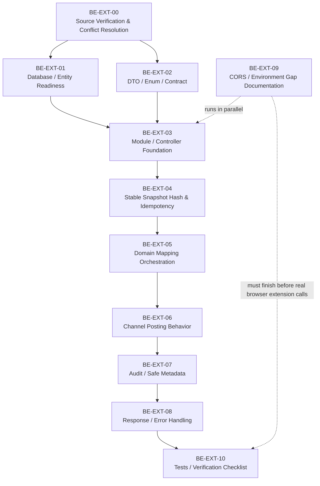

# 17. Extension Integration Implementation Task Breakdown

## 1. Mục tiêu tài liệu

File này chia nhỏ kế hoạch implement backend module `extension-integration` từ specification `16_extension_integration_module_specification.md`.

Mục tiêu:

- Biến spec backend extension integration thành các batch/task đủ nhỏ để implement an toàn.
- Đặt các task confirm/gap lên trước khi viết code.
- Không tự chốt các phần còn `CẦN CONFIRM`.
- Không bịa AMIS domain, AMIS URL, AMIS selector, AMIS API hoặc field mapping.
- Bảo toàn Recruitment Core là source of truth.
- Không ảnh hưởng legacy interview/evaluation flow.

Tài liệu này chỉ là task breakdown. Không implement code, không sửa backend source, không tạo extension source, không tạo migration thật và không sửa legacy modules trong task này.

## 2. Implementation boundary

Module `extension-integration` thuộc backend Recruitment Core.

Boundary bắt buộc:

- Module nhận request từ Browser Extension.
- Module không thay thế toàn bộ `JobDescription`, `JobPosting`, `ChannelPosting`, `AuditLog` modules.
- Module chỉ orchestrate các service/domain hiện có.
- Module không xử lý CV.
- Module không xử lý Mapping CV-JD.
- Module không xử lý Form Pre-screening.
- Module không xử lý AI Screening.
- Module không xử lý HR Review.
- Module không ảnh hưởng legacy interview/evaluation modules.
- Module không scrape AMIS.
- Module không gọi AMIS API khi chưa khảo sát/confirm.
- Module không tự publish external channels chưa verified.

Do-not-touch trong implementation MVP:

- `sessions`
- `evaluations`
- `export`
- `submissions`
- interview session public token flow
- BM04 export flow
- existing code runner/submission flow

Implementation nếu được thực hiện sau này phải nằm theo convention source hiện tại: `apps/backend/src/<module-name>`, dự kiến là `apps/backend/src/extension-integration`.

## 3. Current known gaps

| Gap | Impact | Required action |
| --- | --- | --- |
| Chưa có `ExtensionIntegrationModule` trong current backend source | Không có module nhận request extension | Implement module mới sau batch confirm |
| Chưa có endpoint `/api/extension/amis/job-postings/sync-and-publish` trong current backend source | Extension không gọi được BE | Implement controller endpoint mới |
| Extension API contract cũ mô tả endpoint/module như đã tồn tại | Spec/source lệch nhau | BE-EXT-00 phải ghi rõ source hiện tại và cập nhật/đánh dấu conflict trước code |
| User đã chốt `NOT_CONFIGURED`, không dùng `MANUAL_REQUIRED` trong MVP | Current source/spec cũ có thể vẫn nhắc `MANUAL_REQUIRED` | Normalize enum/status sang `NOT_CONFIGURED`; ghi `MANUAL_REQUIRED` là later/not used in MVP |
| User đã chốt bổ sung `ITVIEC` vào enum MVP | Current backend enum có thể chưa có `ITVIEC` | Bổ sung/normalize enum channel khi implement |
| User đã chốt resultCode `CREATED`, `UPDATED`, `DUPLICATE_OR_IDEMPOTENT_REPLAY` | Spec/source cũ có thể vẫn dùng `OK` | Cập nhật DTO/response/state; `OK` chỉ backward compatibility nếu cần |
| User đã chốt DTO field `channels` | Extension/API specs cũ có thể còn old selected-channel field | Replace contract field thành `channels`; chỉ dùng "selected channels" như UI description nếu cần |
| Auth/token/CORS còn pending | Extension chưa gọi được từ browser thật | Tạo task riêng, không hardcode extension ID/domain |
| AMIS field mapping chưa khảo sát | Không capture thật từ AMIS | Không bịa mapping; backend chỉ nhận DTO contract tối thiểu |
| `amisRecruitmentId` source chưa khảo sát | Idempotency phụ thuộc external id chưa chắc ổn định | CẦN KHẢO SÁT AMIS trước dùng production thật |
| Requirements JSON schema chưa chốt rõ | Payload validation có thể lệch BE/UI | Chốt DTO/schema tối thiểu trước implement validation sâu |
| Rich text transform chưa chốt | Description/benefits có thể mất format hoặc chứa HTML không an toàn | Backend nhận contract tối thiểu; transform thật cần confirm |
| User đã chốt AMIS external reference lưu ở bảng riêng | Current source chưa chắc có `external_references`/`recruitment_external_references` | Tạo migration/entity task cho bảng riêng; không lưu trực tiếp trên `JobPosting` làm source chính |
| User đã chốt `Idempotency-Key` required và là key chính | Source/spec cũ có thể coi header là optional metadata | Thiết kế idempotency records/replay behavior trước implement |
| Current CORS đang theo `FRONTEND_URL` | `chrome-extension://<extension-id>` chưa được allow | Cần env/config task sau khi có extension ID |
| File numbering đã có `17_frontend_implementation_task_breakdown_until_batch_c.md` | Duplicate numeric prefix trong folder docs | Chấp nhận theo request hoặc renumber bằng task docs riêng |

## 4. Proposed implementation batches

### BE-EXT-00. Source Verification & Conflict Resolution

Mục tiêu:
Xác minh source hiện tại và chốt các conflict trước khi implement.

Tasks:

- BE-EXT-00-01: Search source để xác nhận module/endpoint extension có tồn tại hay chưa.
- BE-EXT-00-02: Ghi rõ kết quả hiện tại: chưa thấy `ExtensionIntegrationModule`, `ExtensionIntegrationController`, route `sync-and-publish` trong current source.
- BE-EXT-00-03: Kiểm tra entity/service hiện có: `JobDescription`, `JobDescriptionVersion`, `JobPosting`, `ChannelPosting`, `AuditLog`.
- BE-EXT-00-04: Kiểm tra source có module `channel-postings` riêng hay channel result hiện đang nằm trong `job-postings` controller/service.
- BE-EXT-00-05: Kiểm tra enum channel hiện tại có `VCS_PORTAL`, `FACEBOOK`, `TOPCV`, `ITVIEC`, `VIETNAMWORKS`, `LINKEDIN` chưa.
- BE-EXT-00-06: Kiểm tra enum channel status hiện tại có `PUBLISHED`, `UPDATED`, `CLOSED`, `NOT_CONFIGURED`, `MANUAL_REQUIRED` chưa.
- BE-EXT-00-07: Ghi final decision: MVP dùng `NOT_CONFIGURED`; `MANUAL_REQUIRED` là later/not used in MVP.
- BE-EXT-00-08: Ghi final decision: resultCode chính thức là `CREATED`, `UPDATED`, `DUPLICATE_OR_IDEMPOTENT_REPLAY`; không dùng `OK` làm resultCode chính.
- BE-EXT-00-09: Ghi final decision: DTO field là `channels`; không dùng old selected-channel DTO field.
- BE-EXT-00-10: Kiểm tra response envelope hiện tại `{ success, data, meta }` và error envelope hiện tại.
- BE-EXT-00-11: Kiểm tra audit service/event convention hiện tại.
- BE-EXT-00-12: Kiểm tra CORS hiện tại và ghi rõ chưa xử lý extension origin production.
- BE-EXT-00-13: Ghi lại conflict giữa `06_extension_backend_api_contract.md` và current source nếu contract cũ vẫn nói endpoint đã implemented.

Acceptance:

- Có kết luận rõ module/endpoint có hay chưa.
- Có source finding rõ cho enum/status/resultCode/DTO field name so với decisions đã chốt.
- Không implement nếu source còn lệch mà chưa có task normalize cụ thể.
- Không tự sửa source/spec cũ để giả vờ aligned.

### BE-EXT-01. Database / Entity Readiness

Mục tiêu:
Chuẩn bị database/entity cho external AMIS reference và idempotency.

Tasks:

- BE-EXT-01-01: Kiểm tra source hiện có bảng/entity external reference riêng chưa.
- BE-EXT-01-02: Nếu chưa có, tạo migration/entity task cho bảng riêng:
  - `external_references`
  - hoặc `recruitment_external_references`
  - tên cuối cùng cần align convention backend.
- BE-EXT-01-03: Schema tối thiểu của external reference:
  - `sourceSystem`
  - `externalEntityType`
  - `externalId`
  - `externalUrl`
  - `internalEntityType`
  - `internalEntityId`
  - `lastSnapshotHash`
  - `lastIdempotencyKey`
  - `lastSyncedAt`
  - `metadata`
  - `createdAt`
  - `updatedAt`
- BE-EXT-01-04: Add unique `sourceSystem + externalEntityType + externalId`.
- BE-EXT-01-05: Add index `internalEntityType + internalEntityId`.
- BE-EXT-01-06: Không lưu trực tiếp `sourceSystem`, `externalRecruitmentId`, `externalUrl`, `lastSnapshotHash`, `lastSyncedAt` trên `JobPosting` làm source chính. `JobPosting` chỉ được cache nếu có nhu cầu query nhanh.
- BE-EXT-01-07: Cân nhắc tạo bảng/entity `extension_idempotency_records`.
- BE-EXT-01-08: Schema tối thiểu của idempotency record:
  - `idempotencyKey`
  - `sourceSystem`
  - `requestHash`
  - `status` (`PROCESSING`, `SUCCEEDED`, `FAILED`)
  - `responseData`
  - `actorUserId`
  - `createdAt`
  - `updatedAt`
- BE-EXT-01-09: Nếu chưa tạo bảng idempotency riêng, phải ghi rõ implementation strategy thay thế trước BE-EXT-04.
- BE-EXT-01-10: Kiểm tra `JobDescriptionVersion` có hỗ trợ active version/version number/status chưa.
- BE-EXT-01-11: Kiểm tra `ChannelPosting` có link được với `JobPosting` chưa.
- BE-EXT-01-12: Nếu cần migration, đảm bảo migration không drop/rename dữ liệu cũ và có rollback path.

Acceptance:

- Có cách lưu AMIS external id rõ ràng.
- External mapping source of truth là bảng riêng, không phải `JobPosting`.
- Có cách kiểm tra replay theo required `Idempotency-Key`.
- Migration proposal không phá dữ liệu cũ.
- Nếu schema chưa đủ và chưa được duyệt migration, các batch service/controller bị block.

### BE-EXT-02. DTO / Enum / Contract

Mục tiêu:
Định nghĩa DTO và enum backend cho endpoint extension.

Tasks:

- BE-EXT-02-01: Tạo enum `ExtensionSourceSystem` với `AMIS` nếu không reuse enum hiện có.
- BE-EXT-02-02: Tạo enum `ExtensionSyncAction` với MVP chỉ `PUBLISH`.
- BE-EXT-02-03: Không thêm `UPDATE`/`CLOSE` trong MVP nếu decision vẫn là PUBLISH only.
- BE-EXT-02-04: Tạo enum `ExtensionSyncResultCode` với values đã confirm:
  - `CREATED`
  - `UPDATED`
  - `DUPLICATE_OR_IDEMPOTENT_REPLAY`
- BE-EXT-02-05: Không dùng `OK` làm resultCode chính; chỉ xử lý backward compatibility nếu implementation cần.
- BE-EXT-02-06: Kiểm tra/bổ sung channel enum theo decision đã confirm:
  - `VCS_PORTAL`
  - `FACEBOOK`
  - `TOPCV`
  - `ITVIEC`
  - `VIETNAMWORKS`
  - `LINKEDIN`
- BE-EXT-02-07: Kiểm tra/bổ sung channel status theo quyết định:
  - `PUBLISHED`
  - `UPDATED`
  - `CLOSED`
  - `NOT_CONFIGURED`
  - `MANUAL_REQUIRED` chỉ later/not used in MVP.
- BE-EXT-02-08: Tạo `SyncAmisJobPostingDto`.
- BE-EXT-02-09: Tạo `AmisJobSnapshotDto`.
- BE-EXT-02-10: Tạo response DTO/interface cho result và channel posting result.
- BE-EXT-02-11: Validate required fields:
  - `sourceSystem` required, chỉ `AMIS`.
  - `amisRecruitmentId` required.
  - `action` required, chỉ `PUBLISH`.
  - `snapshot.title` required.
  - `snapshot.description` required.
  - `snapshot.requirements` required và là JSON object.
  - `snapshot.requirements.rawText` required, non-empty string.
  - `channels` required, không rỗng, chỉ nhận enum hợp lệ.
- BE-EXT-02-12: Không validate AMIS domain/URL/selector/field mapping thật ở backend nếu chưa khảo sát.
- BE-EXT-02-13: Không nhận plain string cho `requirements` nếu đã chốt backend contract là JSON object.
- BE-EXT-02-14: Nếu rich text chưa chốt, backend chỉ nhận string/safe contract tối thiểu và không tự transform HTML phức tạp.

Acceptance:

- DTO khớp spec đã được chốt từ BE-EXT-00.
- Invalid request trả 400 theo error envelope hiện tại.
- Không thêm enum/resultCode/status ngoài decisions đã confirm.
- Không bịa AMIS field mapping.

### BE-EXT-03. Module / Controller Foundation

Mục tiêu:
Tạo module và endpoint extension.

Tasks:

- BE-EXT-03-01: Tạo `apps/backend/src/extension-integration/extension-integration.module.ts`.
- BE-EXT-03-02: Tạo `extension-integration.controller.ts`.
- BE-EXT-03-03: Tạo `extension-integration.service.ts`.
- BE-EXT-03-04: Tạo DTO folder theo spec module structure.
- BE-EXT-03-05: Register module vào backend app module với diff tối thiểu.
- BE-EXT-03-06: Implement route:
  `POST /api/extension/amis/job-postings/sync-and-publish`
- BE-EXT-03-07: Áp dụng JWT guard.
- BE-EXT-03-08: Áp dụng role guard cho `ADMIN`, `HR`.
- BE-EXT-03-09: Đảm bảo `INTERVIEWER` bị forbidden.
- BE-EXT-03-10: Đọc optional headers:
  - `X-Request-Id`
  - `X-Extension-Version`
- BE-EXT-03-11: Đọc và validate required header `Idempotency-Key`.
- BE-EXT-03-12: Nếu thiếu `Idempotency-Key`, trả 400 theo error envelope.
- BE-EXT-03-13: Nếu body có `idempotencyKey`, header vẫn ưu tiên; body support là implementation detail cần chốt khi viết DTO.
- BE-EXT-03-14: Không mở public endpoint không auth.

Acceptance:

- Route tồn tại sau implementation.
- Không token -> 401.
- Thiếu `Idempotency-Key` -> 400.
- Role không hợp lệ -> 403.
- `ADMIN`/`HR` gọi được nếu payload hợp lệ.
- `INTERVIEWER` không gọi được.
- Module mới không import hoặc chỉnh legacy `sessions`, `evaluations`, `export`, `submissions`.

### BE-EXT-04. Required Idempotency-Key & Stable Snapshot Hash

Mục tiêu:
Implement idempotency chính bằng required `Idempotency-Key`; dùng stable snapshot hash cho change detection/versioning.

Tasks:

- BE-EXT-04-01: Tạo hoặc reuse idempotency record lookup theo `Idempotency-Key`.
- BE-EXT-04-02: Tạo util stable JSON stringify cho normalized request/snapshot.
- BE-EXT-04-03: Tạo util SHA-256 request hash và snapshot hash.
- BE-EXT-04-04: Loại bỏ volatile metadata khỏi snapshot hash:
  - `capturedAt`
  - `extensionVersion`
  - `requestId`
  - browser/runtime metadata
  - UI-only values
- BE-EXT-04-05: Không loại bỏ business fields như title/description/requirements.
- BE-EXT-04-06: Nếu `Idempotency-Key` đã tồn tại và request hash giống:
  - Không tạo JD/JD Version/JobPosting/ChannelPosting mới.
  - Trả replay result `DUPLICATE_OR_IDEMPOTENT_REPLAY` hoặc responseData đã lưu.
- BE-EXT-04-07: Nếu `Idempotency-Key` đã tồn tại nhưng request hash khác:
  - Trả `409 IDEMPOTENCY_CONFLICT`.
- BE-EXT-04-08: Tìm existing external reference theo `sourceSystem=AMIS + externalEntityType=JOB_POSTING + externalId=amisRecruitmentId`.
- BE-EXT-04-09: Nếu found và snapshot hash không đổi:
  - Không tạo JD/JD Version/JobPosting mới.
  - Không tạo ChannelPosting duplicate.
  - Trả `DUPLICATE_OR_IDEMPOTENT_REPLAY` hoặc replay response gần nhất theo policy đã ghi.
- BE-EXT-04-10: Nếu found và snapshot hash thay đổi:
  - Update JD theo domain service hiện có.
  - Tạo JD Version active mới nếu workflow đã confirm.
  - Update `lastSnapshotHash`, `lastSyncedAt`, `lastIdempotencyKey` trên external reference.
  - Trả `UPDATED`.
- BE-EXT-04-11: Nếu not found:
  - Tạo JD.
  - Tạo JD Version.
  - Tạo JobPosting.
  - Lưu external reference vào bảng riêng.
  - Trả `CREATED`.
- BE-EXT-04-12: Nếu same AMIS external id map tới nhiều posting, trả conflict/requires review và audit.

Acceptance:

- Replay cùng `Idempotency-Key` không duplicate.
- Same `Idempotency-Key` + different body trả conflict.
- Snapshot changed tạo/update version đúng policy đã chốt và trả `UPDATED`.
- AMIS job mới tạo đủ domain records tối thiểu và trả `CREATED`.
- `Idempotency-Key` là key chính; snapshot hash chỉ phục vụ change detection/versioning.

### BE-EXT-05. Domain Mapping Orchestration

Mục tiêu:
Map AMIS Job Snapshot sang domain backend mà không bypass domain validation.

Tasks:

- BE-EXT-05-01: Map `snapshot.title` sang JD/JobPosting title theo domain hiện tại.
- BE-EXT-05-02: Map `snapshot.description`.
- BE-EXT-05-03: Map `snapshot.requirements` JSON object.
- BE-EXT-05-04: Map optional `benefits` nếu domain hỗ trợ và schema đã confirm.
- BE-EXT-05-05: Map optional `location` nếu domain hỗ trợ và rule đã confirm.
- BE-EXT-05-06: Map optional `deadline` nếu domain hỗ trợ và date format đã confirm.
- BE-EXT-05-07: Map optional `salaryRange`, `department`, `level`, `employmentType`, `headcount` chỉ khi field/entity/rule đã confirm.
- BE-EXT-05-08: Không map `contactInfo` trong MVP nếu policy chưa có.
- BE-EXT-05-09: Không map `questions` trong MVP.
- BE-EXT-05-10: Reuse service hiện có nếu có.
- BE-EXT-05-11: Không bypass validation hiện có của JD/JobPosting services.
- BE-EXT-05-12: Không gọi CV/Application/Mapping/Form/AI/HR Review modules.

Acceptance:

- Mapping tối thiểu đủ để tạo public VCS Portal job.
- Không lưu dữ liệu ngoài scope.
- Không phá CRUD JD/JobPosting hiện có.
- Extension snapshot không trở thành source of truth ngoài Core.

### BE-EXT-06. Channel Posting Behavior

Mục tiêu:
Tạo channel posting result theo `channels`.

Tasks:

- BE-EXT-06-01: Với `VCS_PORTAL`, gọi publishing/public job service hiện có.
- BE-EXT-06-02: Trả `PUBLISHED` + `publishedUrl` nếu publish thành công.
- BE-EXT-06-03: Với external channels chưa verify:
  - `FACEBOOK`
  - `TOPCV`
  - `ITVIEC`
  - `VIETNAMWORKS`
  - `LINKEDIN`
  tạo channel result status `NOT_CONFIGURED`.
- BE-EXT-06-04: `MANUAL_REQUIRED` là later/not used in MVP; không map external unconfigured channel sang `MANUAL_REQUIRED` trong MVP.
- BE-EXT-06-05: Không fail toàn bộ request nếu external channel chưa cấu hình.
- BE-EXT-06-06: Nếu VCS Portal publish fail, trả lỗi hoặc channel failure theo convention hiện tại; không che lỗi.
- BE-EXT-06-07: Không gọi external channel API trực tiếp trong MVP.
- BE-EXT-06-08: Không tạo claim rằng Facebook/TopCV/ITVIEC/VietnamWorks/LinkedIn đã có API hợp lệ khi chưa verify.

Acceptance:

- `VCS_PORTAL` có public URL nếu publish thành công.
- External channels trả warning/status riêng.
- Request vẫn success nếu Core sync/VCS Portal publish thành công và chỉ external channels chưa cấu hình.
- Channel result không biến external channel thành source of truth.

### BE-EXT-07. Audit / Safe Metadata

Mục tiêu:
Ghi audit an toàn cho extension sync/publish.

Tasks:

- BE-EXT-07-01: Ghi `EXTENSION_AMIS_SYNC_REQUESTED`.
- BE-EXT-07-02: Ghi `EXTENSION_AMIS_SYNC_SUCCEEDED`.
- BE-EXT-07-03: Ghi `EXTENSION_AMIS_SYNC_FAILED`.
- BE-EXT-07-04: Nếu publish event riêng có convention, ghi thêm publish events.
- BE-EXT-07-05: Metadata được phép:
  - `actorUserId`
  - `role` nếu compliance confirm cần lưu
  - `sourceSystem`
  - `amisRecruitmentId`
  - `action`
  - `requestId`
  - `extensionVersion`
  - `channels`
  - `resultCode`
  - channel statuses nếu compliance confirm cần lưu
  - `snapshotHash`
  - `jobDescriptionId`
  - `jobDescriptionVersionId`
  - `jobPostingId`
- BE-EXT-07-06: Không lưu:
  - full request payload
  - full JD content
  - token/JWT
  - AMIS cookie/session
  - raw HTML
  - channel secret
  - CV content
  - candidate PII không liên quan
- BE-EXT-07-07: Audit failed event khi exception xảy ra sau khi request vào được controller/service.
- BE-EXT-07-08: Không dùng `anti_cheat_events` thay audit log recruitment.

Acceptance:

- Audit có đủ trace để support/debug.
- Audit không chứa full payload/token/raw HTML.
- Failed request vẫn có audit failed nếu vào được controller/service.
- Metadata policy khớp security spec.

### BE-EXT-08. Response / Error Handling

Mục tiêu:
Chuẩn hóa response cho extension.

Tasks:

- BE-EXT-08-01: Response success dùng envelope `{ success, data, meta }`.
- BE-EXT-08-02: Response data gồm các field đã chốt:
  - `resultCode`
  - `jobDescriptionId`
  - `jobDescriptionVersionId`
  - `jobPostingId`
  - `amisRecruitmentId`
  - `snapshotHash`
  - `snapshotChanged` nếu được confirm
  - `channelPostings` hoặc `channels` theo contract đã chốt
  - `warnings`
- BE-EXT-08-03: Validation error trả 400.
- BE-EXT-08-04: Không token trả 401.
- BE-EXT-08-05: Role sai trả 403.
- BE-EXT-08-06: Conflict idempotency hoặc ambiguous AMIS reference trả 409 nếu được implement.
- BE-EXT-08-07: Server error không expose stack trace.
- BE-EXT-08-08: `resultCode` chỉ dùng `CREATED`, `UPDATED`, `DUPLICATE_OR_IDEMPOTENT_REPLAY`.
- BE-EXT-08-09: Duplicate replay trả success-like response, không trả HTTP error.
- BE-EXT-08-10: Missing `Idempotency-Key` trả 400.
- BE-EXT-08-11: Channel `NOT_CONFIGURED` nằm trong channel result/warning, không là whole-request failure; `MANUAL_REQUIRED` later/not used in MVP.

Acceptance:

- Extension có thể map response vào UI state file 09.
- Duplicate replay không bị trả error HTTP.
- Error envelope khớp backend convention hiện tại.
- Không leak stack trace/secret/internal path.

### BE-EXT-09. CORS / Environment Gap Documentation

Mục tiêu:
Ghi rõ CORS/env hiện tại và task cần xử lý trước khi extension gọi thật.

Tasks:

- BE-EXT-09-01: Xác nhận CORS hiện tại đang dùng `FRONTEND_URL`.
- BE-EXT-09-02: Ghi gap cần allow `chrome-extension://<extension-id>`.
- BE-EXT-09-03: Không mở wildcard production.
- BE-EXT-09-04: Nếu chưa có extension ID, để config pending.
- BE-EXT-09-05: Đề xuất env var như `EXTENSION_ALLOWED_ORIGINS`, nhưng không hardcode giá trị giả.
- BE-EXT-09-06: Chốt BE API base URL strategy cho local/dev/staging/prod.
- BE-EXT-09-07: Cập nhật decision log nếu user/product/security confirm.

Acceptance:

- CORS gap được ghi rõ.
- Không hardcode extension ID giả.
- Không tự bịa BE production domain.
- Extension browser call chỉ coi là ready sau khi origin/base URL được confirm.

### BE-EXT-10. Tests / Verification Checklist

Mục tiêu:
Tạo checklist verification cho implementation sau.

Ghi chú theo repo rules hiện tại:

- Không tạo hoặc sửa `*.spec.ts` / `*.test.ts`.
- Không chạy build.
- Không chạy lint.
- Khi có code change thật, chạy `pnpm typecheck`, kiểm tra runtime logs và smoke test API/browser theo `AGENTS.md`.

Tasks:

- BE-EXT-10-01: Verify no token -> 401.
- BE-EXT-10-02: Verify role `INTERVIEWER` -> 403.
- BE-EXT-10-03: Verify role `HR`/`ADMIN` -> allowed.
- BE-EXT-10-04: Verify missing `Idempotency-Key` -> 400.
- BE-EXT-10-05: Verify missing required fields -> 400.
- BE-EXT-10-06: Verify unsupported `sourceSystem` -> 400.
- BE-EXT-10-07: Verify unsupported action other than `PUBLISH` -> 400.
- BE-EXT-10-08: Verify new AMIS job -> `CREATED`.
- BE-EXT-10-09: Verify same `Idempotency-Key` replay -> `DUPLICATE_OR_IDEMPOTENT_REPLAY`, no duplicate domain records.
- BE-EXT-10-10: Verify same `Idempotency-Key` + different body -> 409 conflict.
- BE-EXT-10-11: Verify new idempotency key + same AMIS snapshot -> behavior follows BE-EXT-04 policy and does not duplicate records.
- BE-EXT-10-12: Verify changed snapshot -> `UPDATED` and new JD version/update behavior theo policy đã chốt.
- BE-EXT-10-13: Verify `VCS_PORTAL` -> `PUBLISHED` + public URL nếu service hỗ trợ.
- BE-EXT-10-14: Verify external channels -> `NOT_CONFIGURED`.
- BE-EXT-10-15: Verify audit metadata safe.
- BE-EXT-10-16: Run allowed verification after code change:
  - `pnpm typecheck`
  - inspect `apps/backend/dev.log`
  - API smoke via `curl` against `:3002`
  - browser smoke against frontend `:4000` if flow/UI surface is affected
- BE-EXT-10-17: Do not run `pnpm build`, `pnpm lint`, or create unit test files under current repo instructions.

Acceptance:

- Toàn bộ checklist phù hợp behavior đã chốt.
- Không ảnh hưởng modules cũ.
- Runtime logs không có reload error sau code change thật.
- API/browser smoke xác nhận endpoint hoạt động end-to-end trong phạm vi cho phép.

## 5. Dependency map

Dependency notes:

- `BE-EXT-00` blocks implementation if source/spec conflicts remain unresolved.
- `BE-EXT-01` and `BE-EXT-02` can proceed in parallel after `BE-EXT-00` decisions.
- `BE-EXT-09` can run in parallel but must be done before a real Browser Extension calls backend from `chrome-extension://...`.

## 6. Minimum implementation path

MVP backend path tối thiểu:

1. Resolve source/spec conflict: endpoint currently not found in backend source, so implementation is new.
2. Normalize enum/status to confirmed `NOT_CONFIGURED`; mark `MANUAL_REQUIRED` later/not used in MVP.
3. Add `ITVIEC` to channel enum if missing.
4. Add resultCode enum: `CREATED`, `UPDATED`, `DUPLICATE_OR_IDEMPOTENT_REPLAY`.
5. Use DTO field `channels`; remove old selected-channel DTO field from backend contract.
6. Add external reference table/entity if missing.
7. Decide/create idempotency record storage for required `Idempotency-Key`.
8. Add DTO/enums after confirm/source alignment.
9. Add module/controller/service.
10. Add auth/role guard.
11. Add required `Idempotency-Key` validation.
12. Add stable snapshot hash for change detection/versioning.
13. Add domain mapping for required fields only.
14. Add VCS Portal publish + external channel `NOT_CONFIGURED` behavior.
15. Add audit safe metadata.
16. Run allowed verification checklist.

## 7. Non-goals

Không làm trong backend `extension-integration` MVP:

- Không auto publish Facebook.
- Không auto publish TopCV.
- Không auto publish ITviec.
- Không auto publish VietnamWorks.
- Không auto publish LinkedIn.
- Không scrape AMIS.
- Không gọi AMIS internal API nếu chưa confirm.
- Không xử lý browser extension code.
- Không xử lý CV.
- Không Mapping CV-JD.
- Không Form Pre-screening.
- Không AI Screening.
- Không HR Review.
- Không interview/evaluation flow.
- Không UPDATE/CLOSE nếu decision MVP đang là PUBLISH only.
- Không tự thêm resultCode ngoài `CREATED`, `UPDATED`, `DUPLICATE_OR_IDEMPOTENT_REPLAY`.
- Không lưu token/JWT/AMIS cookie/raw HTML/full snapshot trong audit.
- Không dùng external channel làm source of truth.

## 8. Open Questions before implementation

1. Tên bảng external reference cuối cùng là `external_references` hay `recruitment_external_references` theo convention backend?
2. Có tạo bảng riêng `extension_idempotency_records` không, hay lưu replay bằng cơ chế tương đương?
3. Nếu new `Idempotency-Key` gửi cùng AMIS id + same snapshot hash đã sync trước đó, response là `DUPLICATE_OR_IDEMPOTENT_REPLAY` hay replay response gần nhất?
4. Description lưu plain text hay safe HTML?
5. Benefits có cần trong MVP không?
6. `department`, `level`, `employmentType`, `location`, `salaryRange`, `deadline`, `headcount` map vào field/entity nào?
7. CORS extension origin xử lý ở task backend này hay sau khi có extension ID?
8. Extension auth dùng JWT login hiện tại, Google OAuth/SSO, reuse web token hay flow riêng?
9. Token storage/lifecycle/logout/refresh cho extension là gì?
10. VCS Portal publish service hiện tại gọi bằng service nào?
11. Nếu VCS Portal publish fail nhưng Core sync thành công, rollback hay trả partial/failure?
12. Có cần audit publish events riêng hay chỉ sync events?
13. Có cần transaction bao quanh JD/JD Version/JobPosting/ChannelPosting không?
14. Có cần API get sync status theo `amisRecruitmentId` không, hay để later?
15. AMIS domain, URL pattern, selector/API/source và field mapping thật là gì? `CẦN KHẢO SÁT AMIS`.

## 9. Tasks có thể bắt đầu ngay

Các task không cần AMIS khảo sát và có thể bắt đầu khi chuyển sang implementation planning/source analysis:

- BE-EXT-00-01 đến BE-EXT-00-13: Source verification và conflict documentation.
- BE-EXT-01-01 đến BE-EXT-01-02: Inspect entity/schema external reference hiện có.
- BE-EXT-02-04 đến BE-EXT-02-07: Inspect enum/result/status gap.
- BE-EXT-09-01 đến BE-EXT-09-04: Document CORS/env current gap.

Các task này chỉ đọc source/spec và ghi nhận quyết định. Không cần implement code nếu chưa được yêu cầu.

## 10. Tasks bị block bởi confirm / AMIS khảo sát

Blocked bởi user/product/engineering confirm:

- Chọn tên bảng external reference theo convention backend.
- Chọn có tạo bảng `extension_idempotency_records` riêng hay dùng cơ chế tương đương.
- Chọn behavior cho new `Idempotency-Key` + same AMIS snapshot đã sync trước đó.
- Chọn transaction/rollback behavior khi VCS Portal publish fail.
- Chọn auth flow/token storage/CORS extension origin.

Blocked bởi AMIS khảo sát:

- AMIS domain allowlist.
- AMIS recruitment URL pattern.
- Source của `amisRecruitmentId`.
- AMIS capture source: API, page state, DOM, manual confirmation hoặc hybrid.
- Field mapping thật cho title/description/requirements/benefits/location/deadline/salary/headcount.
- Rich text transform strategy từ AMIS sang BE contract.

Không được implement các phần blocked bằng assumption giả.

## 11. Implementation readiness checklist

Chỉ bắt đầu code implementation khi:

- `BE-EXT-00` hoàn tất và conflict đã được ghi rõ.
- Enum/status/resultCode/DTO field name đã được confirm và reflected trong DTO/API docs.
- Entity/schema external AMIS reference đã được xác định.
- Required DTO contract đã chốt.
- Auth role rule `ADMIN`/`HR` được confirm cho endpoint mới.
- External channel behavior được confirm là warning/status riêng, không fail toàn request.
- CORS/env gap đã có quyết định nếu cần browser extension gọi thật.
- Không có yêu cầu sửa legacy modules.

Nếu một mục chưa xong, tạo task confirm/gap thay vì implement workaround.

## 12. Current backend checkpoint status

Trạng thái checkpoint hiện tại được lưu chi tiết ở `docs/recruitment-phase1/18_extension_integration_backend_checkpoint.md`.

| Batch | Status | Ghi chú |
| --- | --- | --- |
| `BE-EXT-00` | DONE | Source verification/conflict resolution đã hoàn tất. |
| `BE-EXT-01` | DONE | Đã có external reference và idempotency record readiness. |
| `BE-EXT-02` | DONE | Đã có DTO/enums/contract foundation; dùng `channels`. |
| `BE-EXT-03` | DONE | Đã có module/controller/service foundation và endpoint thật. |
| `BE-EXT-04` | DONE | Đã có stable hash utilities và idempotency service foundation. |
| `BE-EXT-05` | NOT_STARTED | Tạm dừng để xây extension trước. |
| `BE-EXT-06` | NOT_STARTED | Chưa implement ChannelPosting behavior. |
| `BE-EXT-07` | NOT_STARTED | Chưa implement audit/safe metadata. |
| `BE-EXT-08` | NOT_STARTED | Chưa implement success response thật. |
| `BE-EXT-09` | LATER | CORS/env/auth-token extension origin để sau. |
| `BE-EXT-10` | PARTIAL | Chỉ mới compile/hash utility verification; chưa runtime sync success. |
