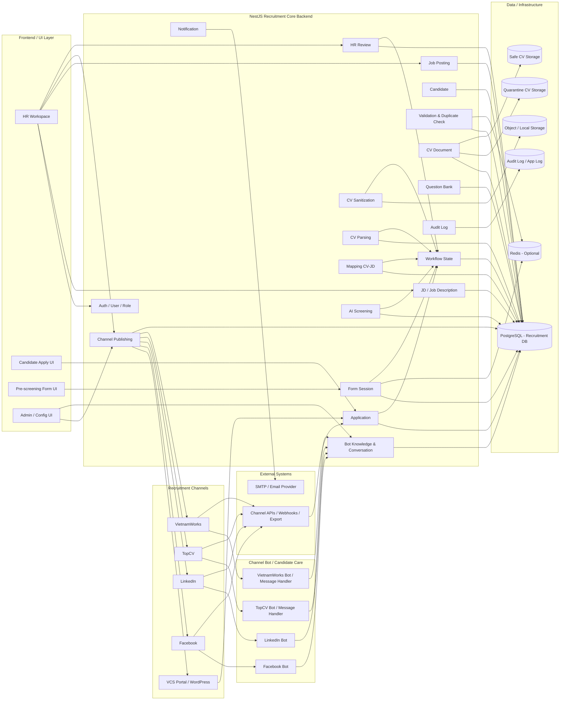
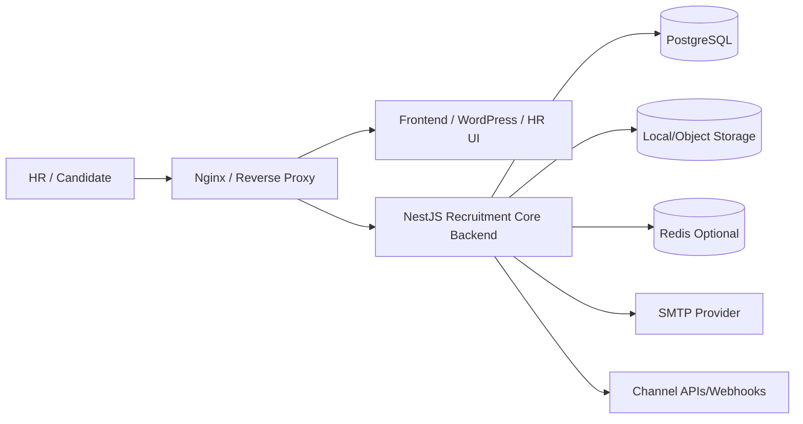

# Architecture Specification - VCS Recruitment Phase 1

## 1. Mục tiêu tài liệu

Tài liệu này chốt **Architecture Specification cho Phase 1** của hệ thống tuyển dụng VCS.

Phase 1 tập trung triển khai các bước nghiệp vụ từ:

```text
HR tạo/chỉnh JD
→ HR cấu hình bộ câu hỏi
→ HR đăng tin lên VCS Portal và các kênh khác
→ Ứng viên apply + upload CV
→ Core validate hồ sơ
→ Check trùng application
→ Lưu CV gốc vào quarantine
→ Scan mã độc + tạo CV sạch
→ Parse CV sạch + check trùng hồ sơ
→ Mapping CV-JD nội bộ
→ Quyết định đạt/không đạt mapping
→ Nếu đạt mapping: gửi form pre-screening
→ Ứng viên trả lời form
→ AI Screening
→ HR Review
```

Phạm vi Phase 1 **dừng tại HR Review**. Các phần hội đồng chuyên môn, phỏng vấn vòng 1, phiếu đánh giá 8 trang, phỏng vấn vòng 2, offer, ký VOffice và onboarding sẽ thuộc phase sau.

---

## 2. Căn cứ chốt kiến trúc

Kiến trúc Phase 1 được chốt dựa trên 3 nhóm thông tin:

| Nguồn | Nội dung sử dụng |
|---|---|
| Flow nghiệp vụ hiện tại | Các bước tuyển dụng tổng thể, nguyên tắc `Application` là trung tâm, CV gốc lưu quarantine, mapping CV-JD là module nội bộ. |
| Architecture MVP đã chốt | Extend trực tiếp từ source NestJS hiện tại, không dùng n8n trong MVP, backend là modular monolith. |
| Backend source hiện tại | Source đang là NestJS Interview Assistant có sẵn Auth, Candidate, Upload/Parse CV, AI, Question Bank, Session/Interview, Evaluation, Notification. |

---

## 3. Quyết định kiến trúc chính

| STT | Quyết định | Nội dung chốt |
|---:|---|---|
| 1 | Backend chính | Dùng **NestJS Recruitment Core Backend**, extend từ source backend hiện tại. |
| 2 | Kiến trúc backend | Dùng mô hình **modular monolith** cho Phase 1, chưa tách microservice sớm. |
| 3 | Workflow orchestration | **Không dùng n8n trong Phase 1**. Core tự điều phối flow bằng service/module nội bộ. |
| 4 | Entity trung tâm | `Application` là trung tâm của flow tuyển dụng. |
| 5 | Mapping CV-JD | Là **module nội bộ trong NestJS**, không xem là external system. |
| 6 | CV gốc | Lưu ở quarantine, không dùng trực tiếp cho parse/mapping/AI/HR review. |
| 7 | CV sạch | Là input chính cho parse, mapping, AI screening và HR review. |
| 8 | Đăng tin đa kênh | Core quản lý job posting và trạng thái phân phối sang VCS Portal, Facebook, LinkedIn, TopCV, VietnamWorks. |
| 9 | Thu CV đa nguồn | CV/apply từ kênh ngoài được chuẩn hóa về `Candidate` và `Application`. |
| 10 | Bot chăm sóc ứng viên | Mỗi kênh có chatbot/channel inbox riêng, nhưng knowledge base và context lấy từ JD, job posting và workflow trong Core. |
| 11 | HR quyết định cuối Phase 1 | AI chỉ hỗ trợ sàng lọc; HR Review là điểm quyết định nghiệp vụ cuối của Phase 1. |

---

## 4. Kiến trúc tổng thể Phase 1



---

## 5. Phân lớp kiến trúc

## 5.1. Recruitment Channels

| Component | Vai trò |
|---|---|
| VCS Portal / WordPress | Kênh chính để hiển thị job posting và nhận apply/upload CV. |
| Facebook | Kênh đăng tin tuyển dụng và nhắn tin với ứng viên. |
| LinkedIn | Kênh đăng tin tuyển dụng, tiếp cận ứng viên và nhận tương tác/apply nếu có thể tích hợp. |
| TopCV | Kênh đăng tin tuyển dụng và lấy CV/apply nếu có hỗ trợ API/export. |
| VietnamWorks | Kênh đăng tin tuyển dụng và lấy CV/apply nếu có hỗ trợ API/export. |

Nguyên tắc: mọi hồ sơ từ các kênh ngoài sau khi lấy về đều phải được chuẩn hóa về Core dưới dạng `Application`.

---

## 5.2. Frontend / UI Layer

| UI | Actor | Vai trò |
|---|---|---|
| HR Workspace | HR | Quản lý JD, job posting, hồ sơ ứng tuyển, mapping result, AI result và HR Review. |
| Candidate Apply UI | Ứng viên | Xem JD/job posting, nhập thông tin apply và upload CV. |
| Pre-screening Form UI | Ứng viên | Trả lời bộ câu hỏi pre-screening qua form token. |
| Admin / Config UI | Admin/HR Admin | Cấu hình kênh đăng tin, token/API, bot, email template, threshold mapping. |

---

## 5.3. NestJS Recruitment Core Backend

Backend Phase 1 là ứng dụng NestJS hiện tại được mở rộng thành Recruitment Core.

| Module | Trách nhiệm |
|---|---|
| `auth` / `users` | Đăng nhập, JWT, Google OAuth, user, role guard. |
| `job-descriptions` | Quản lý JD, JD version, yêu cầu tuyển dụng, mô tả công việc. |
| `job-postings` | Quản lý tin tuyển dụng public, trạng thái draft/published/closed. |
| `channel-publishing` | Điều phối đăng tin đa kênh, lưu trạng thái publish từng kênh. |
| `channel-ingestion` | Nhận CV/apply từ các kênh ngoài nếu có API/webhook/export/email parsing. |
| `bot-conversations` | Quản lý hội thoại ứng viên theo kênh, bot answer, handoff cho HR. |
| `bot-knowledge` | Chuẩn hóa knowledge base từ JD, job posting, FAQ, quy trình tuyển dụng. |
| `candidates` | Quản lý thông tin ứng viên ở mức người. Có thể kế thừa từ source hiện tại. |
| `applications` | Quản lý hồ sơ ứng tuyển theo JD. Đây là entity trung tâm của Phase 1. |
| `validation-rate-limit` | Validate hồ sơ, email/SĐT, file upload, rate limit upload lại. |
| `cv-documents` | Quản lý CV gốc, CV sạch, version, hash, metadata, storage path. |
| `cv-sanitization` | Scan mã độc, extract text an toàn, render lại CV sạch. |
| `cv-parsing` | Parse CV sạch thành dữ liệu có cấu trúc. Có thể reuse `FileParserService` hiện tại. |
| `mapping` | Mapping CV-JD nội bộ, tính score, strengths, gaps, recommendation. |
| `question-bank` | Quản lý bộ câu hỏi theo JD/vị trí/level. Có thể reuse question bank hiện tại. |
| `form-sessions` | Tạo form token/link, quản lý trạng thái form, expiry, submission. |
| `form-answers` | Lưu câu trả lời pre-screening theo `application_id`. |
| `ai-screening` | Đánh giá tổng hợp JD + CV sạch + mapping result + form answer. |
| `hr-review` | HR xem hồ sơ, duyệt/loại/yêu cầu bổ sung/talent pool. |
| `notifications` | Gửi email form, reminder, thông báo HR, kết quả sơ bộ. |
| `workflow-state` | Quản lý trạng thái application xuyên suốt Phase 1. |
| `audit-logs` | Ghi lịch sử thao tác, lịch sử trạng thái, lỗi tích hợp và log nghiệp vụ. |

---

## 5.4. Data / Infrastructure

| Thành phần | Bắt buộc Phase 1? | Vai trò |
|---|---:|---|
| PostgreSQL | Có | Database chính cho toàn bộ Recruitment Core. |
| Object Storage / Local Storage | Có | Lưu CV gốc, CV sạch, file đính kèm. |
| Quarantine CV Storage | Có | Vùng lưu CV gốc, không dùng trực tiếp cho nghiệp vụ sau. |
| Safe CV Storage | Có | Vùng lưu CV sạch sau scan/sanitize. |
| Redis | Optional | Rate limit, form token cache, lock chống submit trùng, queue nhẹ. Có thể dùng PostgreSQL trước nếu muốn tối giản. |
| Audit Log / App Log | Có | Lưu log nghiệp vụ và kỹ thuật. Phase 1 có thể lưu trong PostgreSQL + log file. |

---

## 5.5. External Systems

| External System | Vai trò | Ghi chú Phase 1 |
|---|---|---|
| SMTP / Email Provider | Gửi form pre-screening, reminder, thông báo HR/ứng viên. | Bắt buộc để gửi form. |
| Facebook API / Page Inbox | Đăng tin, nhận message, bot chăm sóc ứng viên. | Phụ thuộc quyền API/page hiện có. |
| LinkedIn API / Integration | Đăng tin, nhận tương tác/apply nếu có. | Cần kiểm tra khả năng API thực tế. |
| TopCV Integration | Đăng tin, nhận CV/apply nếu có. | Có thể bắt đầu bằng export/manual import nếu chưa có API. |
| VietnamWorks Integration | Đăng tin, nhận CV/apply nếu có. | Có thể bắt đầu bằng export/manual import nếu chưa có API. |
| AMIS API | Không thuộc Phase 1 nếu phase dừng tại HR Review. | Chuẩn bị module sau, chưa cần triển khai sâu ở Phase 1. |
| VOffice | Không thuộc Phase 1. | Thuộc phase offer/ký duyệt sau. |

---

## 6. Flow kỹ thuật Phase 1 theo kiến trúc chốt

## 6.1. Tạo JD và cấu hình câu hỏi

```text
1. HR đăng nhập HR Workspace.
2. HR tạo/chỉnh JD trong `job-descriptions`.
3. Backend tạo JD version.
4. HR cấu hình bộ câu hỏi pre-screening theo JD/vị trí/level.
5. `question-bank` lưu question set và mapping với JD/job posting.
```

Output chính:

```text
- JD version
- Question set
- Job posting draft
```

---

## 6.2. Đăng tin đa kênh

```text
1. HR tạo job posting từ JD version.
2. HR chọn kênh đăng: VCS Portal, Facebook, LinkedIn, TopCV, VietnamWorks.
3. `channel-publishing` build payload theo từng kênh.
4. Core publish lên VCS Portal.
5. Core gọi API/webhook/export connector của từng kênh nếu có.
6. Với kênh chưa có API, hệ thống lưu trạng thái `MANUAL_REQUIRED` hoặc cho phép export nội dung đăng tin.
7. Core lưu trạng thái publish từng kênh.
```

Trạng thái publish đề xuất:

```text
DRAFT
PUBLISHING
PUBLISHED
PUBLISH_FAILED
MANUAL_REQUIRED
CLOSED
```

---

## 6.3. Bot chăm sóc ứng viên theo kênh

```text
1. Ứng viên nhắn tin trên Facebook/LinkedIn/TopCV/VietnamWorks.
2. Channel webhook hoặc message polling đưa message về Core.
3. `bot-conversations` xác định kênh, job posting, ứng viên, context hội thoại.
4. `bot-knowledge` lấy dữ liệu từ JD, job posting, FAQ, quy trình tuyển dụng.
5. Bot trả lời các câu hỏi liên quan đến:
   - Mô tả công việc
   - Yêu cầu kỹ năng/kinh nghiệm
   - Level/vị trí
   - Quyền lợi nếu có trong tin đăng
   - Quy trình apply
   - Cách nộp CV
6. Nếu bot không đủ thông tin hoặc ứng viên cần trao đổi sâu, tạo handoff task cho HR.
```

Nguyên tắc bot:

```text
- Không tự cam kết offer/lương nếu không có dữ liệu được cấu hình.
- Không tự ý đưa thông tin ngoài JD/job posting/FAQ.
- Câu hỏi ngoài phạm vi tuyển dụng phải chuyển HR hoặc trả lời không có thông tin.
- Toàn bộ hội thoại cần gắn với channel, candidate lead hoặc application nếu đã apply.
```

---

## 6.4. Ứng viên apply và upload CV

```text
1. Ứng viên apply từ VCS Portal hoặc kênh ngoài.
2. `applications` nhận request apply.
3. Core tạo hoặc tìm `Candidate` theo email/SĐT.
4. Core tạo `Application` theo candidate + job posting/JD.
5. File CV gốc được tiếp nhận nhưng chưa dùng trực tiếp cho nghiệp vụ sau.
```

Nguồn apply đề xuất:

```text
VCS_PORTAL
FACEBOOK
LINKEDIN
TOPCV
VIETNAMWORKS
MANUAL_IMPORT
EMAIL_IMPORT
```

---

## 6.5. Validate và check trùng application

```text
1. Core validate thông tin bắt buộc: họ tên, email/SĐT, JD/job posting, CV file.
2. Validate file type, size, MIME.
3. Check trùng application theo candidate + JD/job posting.
4. Nếu chưa có application: tạo mới.
5. Nếu đã có application: kiểm tra rule upload lại.
6. Nếu vượt giới hạn upload lại: reject.
7. Nếu còn lượt upload: tạo CV version mới cho application hiện có.
```

Rule check trùng cần tách 3 lớp:

| Lớp | Vị trí | Mục đích |
|---|---|---|
| Email/SĐT theo JD | Ngay sau apply | Xác định application mới hay upload lại. |
| Hash file CV | Sau khi lưu quarantine | Phát hiện cùng file đã upload. |
| Parsed profile | Sau khi parse CV sạch | Phát hiện cùng người/hồ sơ dù đổi file hoặc đổi tên file. |

---

## 6.6. CV quarantine, scan mã độc và tạo CV sạch

```text
1. `cv-documents` lưu CV gốc vào quarantine storage.
2. Backend tính hash file CV gốc.
3. `cv-sanitization` scan mã độc.
4. Nếu CV nguy hiểm: cập nhật trạng thái reject và dừng flow.
5. Nếu CV an toàn: extract nội dung.
6. Hệ thống render/tạo lại file CV sạch theo format an toàn.
7. CV sạch được lưu vào safe storage.
8. Các bước sau chỉ dùng CV sạch.
```

Nguyên tắc:

```text
CV gốc không truyền vào parser, mapping, AI screening hoặc HR review.
```

---

## 6.7. Parse CV sạch và check trùng hồ sơ

```text
1. `cv-parsing` đọc CV sạch.
2. Extract email, phone, tên, kỹ năng, kinh nghiệm, học vấn, link portfolio nếu có.
3. Lưu parsed profile vào application/candidate profile.
4. Check trùng hồ sơ theo parsed data.
5. Nếu trùng nghiêm trọng: đưa vào trạng thái cần HR xử lý duplicate.
6. Nếu không trùng hoặc duplicate chấp nhận được: đi tiếp mapping.
```

---

## 6.8. Mapping CV-JD nội bộ

```text
1. `mapping` nhận `application_id`.
2. Module lấy JD version đang gắn với application.
3. Module lấy CV sạch và parsed profile.
4. Chuẩn hóa input mapping.
5. Chạy matching logic.
6. Lưu mapping result gồm score, strengths, gaps, recommendation.
7. Cập nhật workflow state.
8. Nếu đạt threshold: chuyển sang `ELIGIBLE_FOR_FORM`.
9. Nếu không đạt: chuyển sang rejected/talent pool/HR review ngoại lệ tùy cấu hình.
```

API nội bộ đề xuất:

```http
POST /api/applications/:applicationId/mapping/run
GET  /api/applications/:applicationId/mapping-result
```

---

## 6.9. Gửi form pre-screening

```text
1. Khi application đạt mapping threshold, Core tạo form session.
2. Form session gắn với application_id và question set.
3. Core tạo token/link public có thời hạn.
4. `notifications` gửi email hoặc message link form cho ứng viên.
5. Ứng viên mở link và trả lời form.
6. `form-answers` lưu câu trả lời theo application_id.
```

Trạng thái form đề xuất:

```text
FORM_SESSION_CREATED
FORM_SENT
FORM_OPENED
FORM_SUBMITTED
FORM_EXPIRED
```

---

## 6.10. AI Screening và HR Review

```text
1. Sau khi ứng viên submit form, Core kích hoạt `ai-screening`.
2. AI Screening lấy input gồm:
   - JD version
   - CV sạch / parsed profile
   - Mapping result
   - Form answer
3. AI tạo final score, recommendation, risk/gap, summary.
4. Application chuyển sang `WAITING_HR_REVIEW`.
5. HR mở HR Review UI.
6. HR xem CV sạch, mapping result, form answer, AI screening result.
7. HR ra quyết định:
   - Duyệt đi tiếp phase sau
   - Loại
   - Yêu cầu bổ sung
   - Đưa vào talent pool
```

---

## 7. Data model đề xuất cho Phase 1

## 7.1. Trục dữ liệu trung tâm

```text
Candidate
    └── Application
            ├── JD Version
            ├── Job Posting
            ├── Source Channel
            ├── CV Document Versions
            │       ├── Original CV - quarantine
            │       └── Clean CV - safe
            ├── Parsed Profile
            ├── Mapping Result
            ├── Form Session
            ├── Form Answer
            ├── AI Screening Result
            ├── HR Review Decision
            └── Workflow / Audit Logs
```

---

## 7.2. Bảng/entity cần có

| Entity/Table | Mục đích |
|---|---|
| `users` | User HR/Admin/Interviewer, có thể reuse source hiện tại. |
| `candidates` | Thông tin ứng viên, có thể extend từ source hiện tại. |
| `job_descriptions` | JD gốc. |
| `job_description_versions` | Version JD dùng cho từng job posting/application. |
| `job_postings` | Tin tuyển dụng public. |
| `job_posting_channels` | Trạng thái publish của từng job posting trên từng kênh. |
| `channel_accounts` | Cấu hình tài khoản/API/token/page/group theo kênh. |
| `candidate_leads` | Lead từ kênh chat trước khi trở thành application. |
| `channel_conversations` | Hội thoại giữa ứng viên và bot/HR theo kênh. |
| `channel_messages` | Message chi tiết trong từng conversation. |
| `bot_knowledge_sources` | Nguồn tri thức bot: JD, posting, FAQ, policy. |
| `applications` | Hồ sơ ứng tuyển theo candidate + JD/job posting. |
| `application_sources` | Nguồn application: portal, Facebook, LinkedIn, TopCV, VietnamWorks, import. |
| `cv_documents` | CV gốc/CV sạch, version, hash, storage path. |
| `parsed_profiles` | Dữ liệu parse từ CV sạch. |
| `duplicate_checks` | Kết quả check trùng application/file/profile. |
| `mapping_results` | Kết quả mapping CV-JD. |
| `question_sets` | Bộ câu hỏi theo JD/vị trí/level. |
| `question_set_items` | Danh sách câu hỏi trong bộ câu hỏi. |
| `form_sessions` | Link/token form pre-screening. |
| `form_answers` | Câu trả lời form. |
| `ai_screening_results` | Kết quả AI screening. |
| `hr_reviews` | Quyết định và comment HR. |
| `workflow_events` | Lịch sử trạng thái application. |
| `audit_logs` | Log nghiệp vụ/kỹ thuật. |

---

## 8. Trạng thái application Phase 1

```text
APPLICATION_CREATED
APPLICATION_VALIDATING
APPLICATION_REJECTED_INVALID
APPLICATION_DUPLICATE_CHECKING
APPLICATION_DUPLICATE_FOUND
APPLICATION_OVERWRITTEN
APPLICATION_REJECTED_RATE_LIMIT

CV_UPLOADED
CV_STORED_QUARANTINE
CV_SCAN_REQUESTED
CV_SCAN_PASSED
CV_REJECTED_MALWARE
CV_SANITIZING
CV_SANITIZED
CV_SANITIZE_FAILED
CV_PARSED
PROFILE_DUPLICATE_CHECKED
PROFILE_DUPLICATE_NEEDS_REVIEW

MAPPING_REQUESTED
MAPPING_DONE
MAPPING_FAILED
MAPPING_REJECTED
ELIGIBLE_FOR_FORM

FORM_SESSION_CREATED
FORM_SENT
FORM_OPENED
FORM_SUBMITTED
FORM_EXPIRED

AI_SCREENING_REQUESTED
AI_SCREENING_DONE
AI_SCREENING_FAILED
WAITING_HR_REVIEW

HR_APPROVED
HR_REJECTED
HR_REQUESTED_MORE_INFO
TALENT_POOL
```

---

## 9. API nhóm chính đề xuất

## 9.1. JD / Job Description

```http
GET    /api/job-descriptions
POST   /api/job-descriptions
GET    /api/job-descriptions/:id
PUT    /api/job-descriptions/:id
POST   /api/job-descriptions/:id/versions
GET    /api/job-descriptions/:id/versions
```

## 9.2. Question Set

```http
GET    /api/question-sets
POST   /api/question-sets
GET    /api/question-sets/:id
PUT    /api/question-sets/:id
POST   /api/job-descriptions/:jdId/question-sets
GET    /api/job-descriptions/:jdId/question-sets
```

## 9.3. Job Posting / Multi-channel Publish

```http
GET    /api/job-postings
POST   /api/job-postings
GET    /api/job-postings/:id
PUT    /api/job-postings/:id
POST   /api/job-postings/:id/publish
POST   /api/job-postings/:id/close
GET    /api/job-postings/:id/channels
POST   /api/job-postings/:id/channels/:channel/publish
GET    /api/job-postings/:id/channels/:channel/status
```

## 9.4. Channel Config / Ingestion

```http
GET    /api/channel-accounts
POST   /api/channel-accounts
PUT    /api/channel-accounts/:id
POST   /api/channels/:channel/webhook
POST   /api/channels/:channel/import-applications
GET    /api/channels/:channel/import-jobs
```

## 9.5. Bot Conversation

```http
GET    /api/channel-conversations
GET    /api/channel-conversations/:id
POST   /api/channel-conversations/:id/reply
POST   /api/channel-conversations/:id/handoff-hr
POST   /api/bot/answer
GET    /api/bot/knowledge-sources
POST   /api/bot/knowledge-sources
```

## 9.6. Application / Apply

```http
POST   /api/job-postings/:jobPostingId/apply
GET    /api/applications
GET    /api/applications/:id
PATCH  /api/applications/:id/status
GET    /api/applications/:id/timeline
```

## 9.7. CV Document / Sanitization / Parsing

```http
POST   /api/applications/:applicationId/cv
GET    /api/applications/:applicationId/cv
GET    /api/applications/:applicationId/cv/:cvDocumentId
POST   /api/applications/:applicationId/cv/:cvDocumentId/sanitize
POST   /api/applications/:applicationId/cv/:cvDocumentId/parse
GET    /api/applications/:applicationId/parsed-profile
```

## 9.8. Mapping

```http
POST   /api/applications/:applicationId/mapping/run
GET    /api/applications/:applicationId/mapping-result
```

## 9.9. Form Session

```http
POST   /api/applications/:applicationId/form-sessions
GET    /api/forms/access/:token
POST   /api/forms/access/:token/answers
POST   /api/forms/access/:token/submit
```

## 9.10. AI Screening

```http
POST   /api/applications/:applicationId/ai-screening/run
GET    /api/applications/:applicationId/ai-screening-result
```

## 9.11. HR Review

```http
GET    /api/hr/applications/waiting-review
GET    /api/hr/applications/:applicationId/review
POST   /api/hr/applications/:applicationId/approve
POST   /api/hr/applications/:applicationId/reject
POST   /api/hr/applications/:applicationId/request-more-info
POST   /api/hr/applications/:applicationId/talent-pool
```

---

## 10. Tận dụng source backend hiện tại

Source hiện tại là NestJS Interview Assistant, có thể tận dụng các phần sau:

| Phần hiện có | Cách tận dụng trong Phase 1 |
|---|---|
| Auth/JWT/Google OAuth | Reuse cho HR/Admin login. |
| User role `ADMIN`, `INTERVIEWER`, `HR` | Reuse và bổ sung quyền nếu cần. |
| Candidates module | Extend thành candidate profile tuyển dụng. |
| Upload CV/profile | Reuse upload base, nhưng bổ sung quarantine/safe storage. |
| FileParserService | Reuse parse PDF/DOCX/XLSX, bổ sung parse từ CV sạch. |
| AI Service / Claude prompt config | Reuse cho parse/enrich, mapping, AI screening, bot answer. |
| Questions / Categories / Levels / Positions | Reuse làm nền cho question bank và cấu hình câu hỏi theo vị trí/level. |
| Sessions / Survey | Có thể tham khảo cho form token/public access, nhưng Phase 1 nên tách `form-sessions` riêng. |
| Evaluations | Chưa dùng trực tiếp ở Phase 1, để phase phỏng vấn/chấm điểm sau. |
| Notification | Reuse ý tưởng notification, bổ sung email provider thay vì chỉ Telegram. |
| WebSocket | Chưa bắt buộc Phase 1, có thể dùng sau cho realtime HR dashboard/chat. |

Lưu ý cần chỉnh trước khi production:

```text
- Tắt TypeORM synchronize=true ở môi trường nghiêm túc.
- Dùng migration chuẩn cho các entity mới.
- Chuẩn hóa upload MIME/extension, đặc biệt .xls.
- Bổ sung quarantine/safe storage thay vì dùng trực tiếp upload folder.
- Chuẩn hóa audit log và workflow state.
```

---

## 11. Bảo mật và kiểm soát rủi ro

| Nhóm rủi ro | Kiểm soát đề xuất |
|---|---|
| CV chứa mã độc | Lưu quarantine, scan mã độc, render CV sạch, không dùng CV gốc cho xử lý sau. |
| Upload file nguy hiểm | Validate MIME/extension/size, giới hạn file, path traversal guard. |
| Token form bị lộ | Token random, có expiry, chỉ truy cập được form đúng application. |
| Bot trả lời sai phạm vi | Bot chỉ dùng knowledge source được cấu hình; câu hỏi ngoài phạm vi chuyển HR. |
| Gọi API kênh ngoài thất bại | Lưu publish/import status, retry có kiểm soát, không làm hỏng application core. |
| Duplicate application | Check email/SĐT + JD, hash file, parsed profile. |
| Lộ thông tin ứng viên | Role guard, audit log, phân quyền HR/Admin, không expose CV gốc. |
| AI hallucination | AI screening và bot answer phải lưu reasoning/nguồn, HR là người quyết định cuối. |
| Gọi trùng workflow | Dùng idempotency key cho publish, form send, mapping, AI screening. |

---

## 12. Deployment đề xuất cho Phase 1



MVP có thể triển khai tối thiểu:

```text
- 01 NestJS backend service
- 01 PostgreSQL database
- 01 storage volume hoặc object storage
- 01 WordPress/VCS Portal
- 01 HR UI nếu đã có frontend riêng
- SMTP/email provider
- Redis optional
```

---

## 13. Thứ tự triển khai kỹ thuật đề xuất

| Thứ tự | Nhóm triển khai | Mục tiêu |
|---:|---|---|
| 1 | Chuẩn hóa DB/migration/source config | Tắt synchronize cho môi trường nghiêm túc, chuẩn bị migration. |
| 2 | `applications` + workflow state | Tạo trục trung tâm cho toàn bộ flow. |
| 3 | JD / Job Posting / Question Set | Hoàn thiện đầu vào tuyển dụng. |
| 4 | Apply API + Candidate/Application | Cho phép ứng viên apply/upload CV. |
| 5 | CV Document + Quarantine/Safe Storage | Quản lý CV version, hash, metadata. |
| 6 | CV Sanitization + Parsing | Tạo CV sạch và parse dữ liệu. |
| 7 | Duplicate Check | Check trùng application/file/profile. |
| 8 | Mapping CV-JD | Chấm điểm CV-JD nội bộ. |
| 9 | Form Session + Notification | Gửi form pre-screening và nhận câu trả lời. |
| 10 | AI Screening | Đánh giá tổng hợp sau form. |
| 11 | HR Review | HR xem và quyết định. |
| 12 | Channel Publishing | Đăng tin đa kênh, trước mắt có thể hỗ trợ manual/export nếu API chưa sẵn sàng. |
| 13 | Channel Ingestion | Tự động lấy CV/apply từ kênh ngoài nếu có API/webhook/export. |
| 14 | Bot Conversation | Bot chăm sóc ứng viên theo kênh. |
| 15 | Audit/Monitoring | Bổ sung log, dashboard trạng thái, lỗi tích hợp. |

---

## 14. Kết luận kiến trúc chốt Phase 1

Architecture Phase 1 được chốt theo hướng:

```text
Recruitment Channels
    ├── VCS Portal
    ├── Facebook
    ├── LinkedIn
    ├── TopCV
    └── VietnamWorks
        ↓
NestJS Recruitment Core Backend
    ├── JD / Job Posting
    ├── Multi-channel Publishing
    ├── Candidate / Application
    ├── CV Quarantine / Sanitization / Parsing
    ├── Mapping CV-JD
    ├── Form Pre-screening
    ├── AI Screening
    ├── HR Review
    ├── Bot Conversation
    └── Workflow / Audit
        ↓
PostgreSQL / Storage / Redis optional / SMTP / Channel APIs
```

Điểm chốt cuối cùng:

```text
- Phase 1 dừng tại HR Review.
- Backend là NestJS modular monolith, extend từ source hiện tại.
- Không dùng n8n ở Phase 1.
- Application là entity trung tâm.
- Mapping CV-JD là module nội bộ.
- CV gốc lưu quarantine, CV sạch dùng cho xử lý nghiệp vụ.
- Bước đăng tin được mở rộng thành đăng tin đa kênh.
- Có cơ chế lấy CV từ kênh ngoài nếu kênh hỗ trợ.
- Có bot chăm sóc ứng viên theo từng kênh, dùng knowledge từ JD/job posting/FAQ.
```
