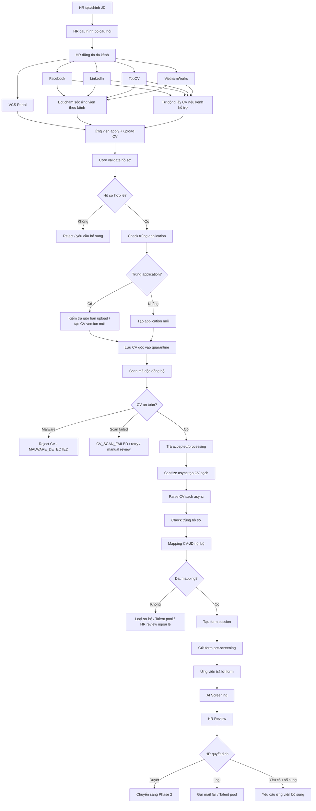

# Luồng nghiệp vụ tuyển dụng VCS - Phase 1

## 1. Mục tiêu tài liệu

Tài liệu này mô tả luồng nghiệp vụ **Phase 1** của hệ thống tuyển dụng VCS.

Phase 1 tập trung vào các bước từ khi HR tạo/chỉnh JD, cấu hình bộ câu hỏi, đăng tin tuyển dụng đa kênh, tiếp nhận hồ sơ ứng viên, xử lý CV an toàn, mapping CV-JD, gửi form pre-screening, AI Screening và HR Review.

Phạm vi Phase 1 dừng tại bước **HR Review**. Các bước sau như hội đồng chuyên môn chấm hồ sơ, phỏng vấn vòng 1, phiếu đánh giá 8 trang, phỏng vấn vòng 2, offer, ký VOffice và onboarding sẽ thuộc phase sau.

---

## 2. Phạm vi Phase 1

### 2.1. Các bước nghiệp vụ thuộc Phase 1

| Bước | Tên bước | Ghi chú |
|---:|---|---|
| 1 | HR tạo/chỉnh JD | Tạo hoặc cập nhật JD/vị trí tuyển dụng. |
| 2 | HR cấu hình bộ câu hỏi theo JD/vị trí/level | Bộ câu hỏi dùng cho pre-screening form. |
| 3 | HR đăng tin lên VCS Portal và các kênh khác | Bao gồm VCS Portal, Facebook, LinkedIn, TopCV, VietnamWorks. |
| 4 | Ứng viên apply + upload CV | Ứng viên apply từ VCS Portal hoặc từ các kênh tuyển dụng ngoài nếu có tích hợp. |
| 5 | Core validate hồ sơ | Validate thông tin apply, file CV, JD, dữ liệu bắt buộc. |
| 6 | Check trùng application | Kiểm tra ứng viên đã apply cùng JD trước đó chưa. |
| 7 | Lưu CV gốc vào quarantine | CV gốc không dùng trực tiếp cho các bước nghiệp vụ sau. |
| 8 | Scan mã độc đồng bộ | Trả `MALWARE_DETECTED` nếu phát hiện malware; scan pass thì accepted/processing. |
| 9 | Sanitize/parse CV sạch async | Tạo bản CV an toàn để parse/mapping/AI/HR review, sau đó trích xuất dữ liệu ứng viên và kiểm tra trùng hồ sơ. |
| 10 | Mapping CV-JD nội bộ | Mapping chạy trong Core, theo `application_id`. |
| 11 | Quyết định đạt/không đạt mapping | Dựa trên threshold theo JD/vị trí/level. |
| 12 | Nếu đạt mapping: gửi form pre-screening | Tạo form session và gửi link/token cho ứng viên. |
| 13 | Ứng viên trả lời form | Ứng viên trả lời câu hỏi bổ sung. |
| 14 | AI Screening | AI đánh giá tổng hợp JD + CV sạch + mapping + form answer. |
| 15 | HR Review | HR xem hồ sơ và ra quyết định nghiệp vụ. |

### 2.2. Ngoài phạm vi Phase 1

Các bước sau chưa triển khai trong Phase 1:

```text
- Tạo task chấm hồ sơ chuyên môn
- Hội đồng chuyên môn chấm hồ sơ
- Tạo/phỏng vấn vòng 1
- Điền phiếu đánh giá 8 trang
- Xác định tuyến phỏng vấn vòng 2
- Phỏng vấn vòng 2
- Offer proposal
- Generate offer letter
- Trình ký VOffice
- BGĐ ký duyệt
- HR gửi mail offer
- Chốt ngày onboard
- Bàn giao Onboarding
```

---

## 3. Nguyên tắc nghiệp vụ Phase 1

| STT | Nguyên tắc | Mô tả |
|---:|---|---|
| 1 | `Application` là trung tâm | Mỗi hồ sơ ứng tuyển được quản lý theo `application_id`. Mọi dữ liệu như CV, mapping result, form answer, AI screening và HR review đều gắn với application. |
| 2 | Core là nơi điều phối chính | Recruitment Core Backend chịu trách nhiệm validate, điều phối trạng thái và kích hoạt các bước tự động. |
| 3 | CV gốc không dùng trực tiếp | CV gốc chỉ lưu ở quarantine. Các bước parse, mapping, AI và HR review dùng CV sạch. |
| 4 | Mapping CV-JD là module nội bộ | Mapping được xử lý trong NestJS Recruitment Core Backend, không xem là external service. |
| 5 | Đăng tin đa kênh | Tin tuyển dụng được public trên VCS Portal và có thể được đồng bộ sang Facebook, LinkedIn, TopCV, VietnamWorks. |
| 6 | Thu CV đa nguồn | Hồ sơ ứng viên có thể đến từ VCS Portal hoặc từ các kênh tuyển dụng ngoài nếu kênh hỗ trợ API/webhook/export/email integration. |
| 7 | Bot chăm sóc ứng viên theo kênh | Mỗi kênh có thể có bot/chat handler để trả lời câu hỏi liên quan tới JD, vị trí, yêu cầu nghề nghiệp và quy trình tuyển dụng. |
| 8 | HR vẫn giữ quyền quyết định | AI và automation chỉ hỗ trợ sàng lọc. Quyết định cuối của Phase 1 là HR Review. |

---

## 4. Tác nhân tham gia

| Tác nhân | Vai trò trong Phase 1 |
|---|---|
| HR | Tạo/chỉnh JD, cấu hình câu hỏi, đăng tin, theo dõi hồ sơ, review ứng viên. |
| Ứng viên | Xem tin tuyển dụng, apply, upload CV, trả lời form pre-screening. |
| Recruitment Core Backend | Điều phối workflow, validate hồ sơ, quản lý application, CV, mapping, form, AI screening và HR review. |
| VCS Portal | Kênh chính hiển thị tin tuyển dụng và nhận apply/upload CV. |
| Facebook / LinkedIn / TopCV / VietnamWorks | Kênh đăng tin và/hoặc nguồn nhận CV/apply nếu có khả năng tích hợp. |
| Bot chăm sóc ứng viên | Trả lời tự động các câu hỏi về JD, yêu cầu nghề nghiệp, quyền lợi, quy trình tuyển dụng; chuyển HR khi vượt khả năng trả lời. |
| Mapping CV-JD Module | Chấm điểm phù hợp giữa CV sạch và JD. |
| AI Screening Module | Đánh giá tổng hợp sau khi có CV sạch, mapping result và form answer. |
| Notification Module | Gửi email/link form, reminder, thông báo kết quả hoặc yêu cầu bổ sung. |

---

## 5. Flow tổng quan Phase 1

```text
HR tạo/chỉnh JD
→ HR cấu hình bộ câu hỏi theo JD/vị trí/level
→ HR đăng tin lên VCS Portal và các kênh khác
→ Hệ thống/Bot chăm sóc ứng viên theo từng kênh
→ Ứng viên apply + upload CV
→ Core validate hồ sơ
→ Check trùng application
→ Lưu CV gốc vào quarantine
→ Scan mã độc đồng bộ trong request upload
→ Nếu malware: trả MALWARE_DETECTED và dừng CV version hiện tại
→ Nếu scan pass: trả accepted/processing
→ Sanitize async tạo CV sạch
→ Parse CV sạch async + check trùng hồ sơ
→ Mapping CV-JD nội bộ
→ Quyết định đạt/không đạt mapping
→ Nếu đạt mapping: gửi form pre-screening
→ Ứng viên trả lời form
→ AI Screening
→ HR Review
```

---

## 6. Flow chi tiết theo giai đoạn

## 6.1. Giai đoạn 1 - Tạo JD, cấu hình câu hỏi và đăng tin đa kênh

| Bước | Tên bước | Tác nhân chính | Mô tả | Output |
|---:|---|---|---|---|
| 1 | HR tạo/chỉnh JD | HR | HR tạo mới hoặc chỉnh sửa JD cho vị trí cần tuyển. JD cần có thông tin vị trí, level, mô tả công việc, yêu cầu kỹ năng, kinh nghiệm, quyền lợi, địa điểm, hình thức làm việc. | JD sẵn sàng sử dụng |
| 2 | HR cấu hình bộ câu hỏi | HR | HR cấu hình câu hỏi pre-screening theo JD, vị trí, level hoặc nhóm năng lực. Bộ câu hỏi này sẽ được gửi cho ứng viên sau khi CV đạt mapping sơ bộ. | Bộ câu hỏi gắn với JD/vị trí/level |
| 3 | HR đăng tin tuyển dụng đa kênh | HR / Recruitment Core | HR public tin lên VCS Portal. Hệ thống đồng bộ hoặc hỗ trợ đăng tin sang Facebook, LinkedIn, TopCV, VietnamWorks tùy khả năng tích hợp của từng kênh. | Tin tuyển dụng được public trên một hoặc nhiều kênh |

### 6.1.1. Đăng tin đa kênh

Tại bước đăng tin, hệ thống cần quản lý trạng thái publish theo từng kênh.

| Kênh | Hành vi mong muốn | Ghi chú nghiệp vụ |
|---|---|---|
| VCS Portal | Public tin tuyển dụng chính thức | Đây là kênh gốc, nên có URL apply chuẩn để điều hướng ứng viên. |
| Facebook | Đăng bài lên page/group hoặc tạo campaign nếu có tích hợp | Có thể gắn link apply về VCS Portal. |
| LinkedIn | Đăng tin hoặc chia sẻ bài tuyển dụng | Tùy khả năng API/tài khoản doanh nghiệp. |
| TopCV | Đăng tin hoặc đồng bộ tin tuyển dụng | Tùy khả năng tích hợp với TopCV. |
| VietnamWorks | Đăng tin hoặc đồng bộ tin tuyển dụng | Tùy khả năng tích hợp với VietnamWorks. |

Mỗi bản ghi publish theo kênh nên có trạng thái:

```text
DRAFT
PUBLISHING
PUBLISHED
PUBLISH_FAILED
UPDATED
CLOSED
```

### 6.1.2. Bot chăm sóc ứng viên theo kênh

Mỗi kênh tuyển dụng cần có cơ chế bot hoặc chat handler để chăm sóc ứng viên.

| Nội dung bot trả lời | Mô tả |
|---|---|
| Thông tin JD | Mô tả công việc, trách nhiệm, yêu cầu kỹ năng, kinh nghiệm. |
| Thông tin nghề nghiệp | Level, career path, năng lực cần có, định hướng phát triển. |
| Quyền lợi | Lương thưởng, phúc lợi, môi trường làm việc nếu JD có cấu hình. |
| Quy trình tuyển dụng | Apply CV, pre-screening form, HR review, phỏng vấn. |
| Hướng dẫn apply | Gửi link apply về VCS Portal hoặc hướng dẫn upload CV. |
| Chuyển HR | Khi câu hỏi ngoài phạm vi hoặc ứng viên cần trao đổi trực tiếp. |

Nguồn tri thức của bot nên lấy từ:

```text
- JD đang đăng tuyển
- Bộ câu hỏi và thông tin pre-screening được phép công khai
- Chính sách tuyển dụng được HR cấu hình
- FAQ tuyển dụng
- Quy trình tuyển dụng của VCS
```

---

## 6.2. Giai đoạn 2 - Ứng viên apply và hệ thống tiếp nhận hồ sơ

| Bước | Tên bước | Tác nhân chính | Mô tả | Output |
|---:|---|---|---|---|
| 4 | Ứng viên apply + upload CV | Ứng viên | Ứng viên apply từ VCS Portal hoặc từ kênh ngoài nếu hệ thống lấy được CV/apply từ kênh đó. Ứng viên nhập thông tin cá nhân và upload CV. | Hồ sơ apply ban đầu |
| 5 | Core validate hồ sơ | Recruitment Core | Core kiểm tra dữ liệu bắt buộc, email, SĐT, JD, file CV, định dạng, dung lượng, MIME type. | Hồ sơ hợp lệ hoặc bị reject |
| 6 | Check trùng application | Recruitment Core | Core kiểm tra ứng viên đã apply cùng JD trước đó chưa dựa theo email/SĐT/JD. | Application mới hoặc upload lại CV |

### 6.2.1. Nguồn hồ sơ ứng viên

| Nguồn | Cách nhận hồ sơ |
|---|---|
| VCS Portal | Ứng viên apply trực tiếp trên form của Portal. |
| Facebook | Lấy hồ sơ nếu có form lead/API/webhook; nếu không thì bot điều hướng về VCS Portal. |
| LinkedIn | Lấy hồ sơ nếu tài khoản/API hỗ trợ; nếu không thì điều hướng ứng viên về VCS Portal. |
| TopCV | Lấy CV/apply qua API/export/email/parser nếu có khả năng tích hợp. |
| VietnamWorks | Lấy CV/apply qua API/export/email/parser nếu có khả năng tích hợp. |

Nguyên tắc quy chuẩn:

```text
Dù ứng viên đến từ kênh nào, Core vẫn phải tạo hoặc cập nhật application theo application_id.
```

### 6.2.2. Validate hồ sơ

Các thông tin cần validate:

```text
- JD / job_posting_id tồn tại và đang mở tuyển
- Họ tên ứng viên
- Email
- Số điện thoại
- File CV
- Định dạng file CV
- Dung lượng file
- Nguồn ứng tuyển
- Số lượt upload lại trong ngày nếu là application cũ
```

Nếu hồ sơ không hợp lệ:

```text
- Hệ thống thông báo lỗi cho ứng viên nếu apply trực tiếp.
- Nếu CV đến từ kênh ngoài, hệ thống ghi trạng thái lỗi để HR xử lý hoặc bot yêu cầu ứng viên bổ sung.
- Flow không đi tiếp sang xử lý CV.
```

---

## 6.3. Giai đoạn 3 - Xử lý CV gốc và tạo CV sạch

| Bước | Tên bước | Tác nhân chính | Mô tả | Output |
|---:|---|---|---|---|
| 7 | Lưu CV gốc vào quarantine | Recruitment Core / CV Document Module | CV gốc được lưu vào vùng cách ly để audit, không dùng trực tiếp cho parse/mapping/AI/HR review. | CV gốc lưu quarantine |
| 8 | Scan mã độc đồng bộ | CV Sanitization Module / Scanner | Upload API chạy scan malware trước khi trả response. Nếu phát hiện malware, cập nhật `CV_REJECTED_MALWARE`, ghi audit và trả `MALWARE_DETECTED`. Nếu scan failed/timeout, chuyển `CV_SCAN_FAILED`, không sanitize/parse. | Scan result |
| 9 | Sanitize async tạo CV sạch | CV Sanitization Module / Worker | Sau khi scan pass, hệ thống trả accepted/processing rồi worker tạo clean CV. Với PDF có thể dùng Ghostscript Docker sanitizer, nhưng Ghostscript không phải malware scanner. | CV sạch |
| 10 | Parse CV sạch + check trùng hồ sơ | Recruitment Core | Parse CV sạch async để trích xuất thông tin ứng viên, sau đó check trùng hồ sơ theo dữ liệu đã parse. Parse fail sau retry có thể email ứng viên upload lại hoặc manual review. | Parsed profile + duplicate result |

### 6.3.1. Nguyên tắc CV sạch

```text
- CV gốc chỉ lưu trong quarantine.
- CV gốc không được dùng trực tiếp cho parse, mapping, AI hoặc HR review.
- Malware scan chạy trước sanitizer; scan failed không được coi là malware và không được đi sanitize/parse.
- CV sạch là file được tạo lại sau khi scan pass và extract/render nội dung an toàn.
- Ghostscript có thể tạo clean PDF sau scan pass, nhưng không thay thế scanner.
- HR Review chỉ hiển thị CV sạch.
```

### 6.3.2. Check trùng hồ sơ sau parse

Dữ liệu có thể dùng để check trùng:

```text
- Email trong form apply
- SĐT trong form apply
- Email extract từ CV
- SĐT extract từ CV
- Họ tên
- Ngày sinh nếu có
- LinkedIn/GitHub/portfolio nếu có
- Hash nội dung text đã chuẩn hóa
```

Nếu phát hiện trùng hồ sơ:

```text
- Hệ thống gắn cờ duplicate profile.
- HR có thể xem cảnh báo trong Application Detail.
- Tùy rule, hệ thống có thể merge, giữ version mới, hoặc yêu cầu HR quyết định.
```

---

## 6.4. Giai đoạn 4 - Mapping CV-JD và quyết định gửi form

| Bước | Tên bước | Tác nhân chính | Mô tả | Output |
|---:|---|---|---|---|
| 10 | Mapping CV-JD nội bộ | Mapping Module | Module mapping lấy JD version và CV sạch/parsed profile theo `application_id` để tính điểm phù hợp. | Mapping result |
| 11 | Quyết định đạt/không đạt mapping | Recruitment Core / Workflow State | Core kiểm tra mapping score so với threshold theo JD/vị trí/level. | Đạt hoặc không đạt mapping |
| 12 | Nếu đạt mapping: gửi form pre-screening | Form Session / Notification | Core tạo form session, sinh token/link và gửi cho ứng viên qua email hoặc kênh phù hợp. | Form pre-screening được gửi |

### 6.4.1. Mapping result cần có

| Thông tin | Mô tả |
|---|---|
| `application_id` | Hồ sơ ứng tuyển được mapping. |
| `jd_version_id` | Phiên bản JD được dùng để mapping. |
| `clean_cv_document_id` | CV sạch được dùng để mapping. |
| `score` | Điểm phù hợp tổng thể. |
| `strengths` | Điểm mạnh của ứng viên so với JD. |
| `gaps` | Khoảng thiếu so với JD. |
| `recommendation` | Đề xuất: gửi form, HR review ngoại lệ, loại sơ bộ, talent pool. |
| `status` | Trạng thái mapping. |

### 6.4.2. Quyết định sau mapping

| Kết quả mapping | Hành động |
|---|---|
| Đạt threshold | Tạo form session và gửi form pre-screening. |
| Không đạt threshold | Loại sơ bộ, đưa vào talent pool hoặc chuyển HR review ngoại lệ tùy cấu hình. |
| Mapping lỗi | Ghi lỗi, retry nếu cần, hoặc đưa vào hàng đợi xử lý thủ công. |

---

## 6.5. Giai đoạn 5 - Pre-screening Form, AI Screening và HR Review

| Bước | Tên bước | Tác nhân chính | Mô tả | Output |
|---:|---|---|---|---|
| 13 | Ứng viên trả lời form | Ứng viên | Ứng viên mở link/token form và trả lời bộ câu hỏi pre-screening. | Form answer |
| 14 | AI Screening | AI Screening Module | AI đánh giá tổng hợp dựa trên JD, CV sạch, mapping result và câu trả lời form. | AI screening result |
| 15 | HR Review | HR | HR xem toàn bộ hồ sơ đã xử lý và ra quyết định cho ứng viên. | HR decision |

### 6.5.1. Form pre-screening

Form pre-screening được tạo theo `form_session` và gắn với `application_id`.

Form cần hỗ trợ:

```text
- Link/token truy cập riêng cho từng ứng viên
- Trạng thái mở form
- Trạng thái đã submit
- Trạng thái hết hạn
- Lưu câu trả lời theo từng câu hỏi
- Chống submit trùng
```

### 6.5.2. AI Screening

AI Screening sử dụng các dữ liệu:

```text
- JD / JD version
- CV sạch
- Parsed profile
- Mapping result
- Form answer
```

AI Screening cần trả về:

```text
- Final score
- Recommendation
- Summary đánh giá
- Điểm mạnh
- Điểm thiếu
- Rủi ro/cảnh báo nếu có
- Lý do đề xuất cho HR
```

### 6.5.3. HR Review

HR xem các thông tin sau:

```text
- Thông tin ứng viên
- Nguồn ứng tuyển
- JD ứng tuyển
- CV sạch
- Lịch sử upload CV/version
- Duplicate warning nếu có
- Mapping result
- Form answer
- AI screening result
- Workflow timeline/audit log
```

HR có thể ra quyết định:

| Quyết định HR | Ý nghĩa |
|---|---|
| Duyệt đi tiếp | Hồ sơ đủ điều kiện chuyển sang phase sau: chấm hồ sơ chuyên môn/phỏng vấn. |
| Loại | Hồ sơ bị loại ở bước HR Review. |
| Yêu cầu bổ sung | Yêu cầu ứng viên bổ sung thông tin/CV/form. |
| Đưa vào talent pool | Không đi tiếp hiện tại nhưng lưu lại cho cơ hội phù hợp sau. |

---

## 7. Mermaid diagram Phase 1



---

## 8. Các điểm quyết định chính trong Phase 1

| STT | Điểm quyết định | Điều kiện pass | Nếu fail |
|---:|---|---|---|
| 1 | Tin tuyển dụng có đủ điều kiện public? | JD hợp lệ, có thông tin bắt buộc, có trạng thái mở tuyển | Không cho public hoặc báo HR bổ sung |
| 2 | Publish đa kênh thành công? | Kênh trả về trạng thái published/success | Ghi `PUBLISH_FAILED`, cho phép retry hoặc xử lý thủ công |
| 3 | Hồ sơ hợp lệ? | Có đủ thông tin apply và CV hợp lệ | Reject / yêu cầu bổ sung |
| 4 | Trùng application? | Không trùng hoặc còn lượt upload lại | Reject nếu vượt giới hạn upload |
| 5 | CV an toàn? | Scan malware pass | Malware thì trả `MALWARE_DETECTED`; scan failed thì retry/manual review, không sanitize/parse |
| 6 | Trùng hồ sơ sau parse? | Không trùng hoặc HR chấp nhận xử lý tiếp | Gắn cờ duplicate, merge hoặc chuyển HR xử lý |
| 7 | Đạt mapping? | Mapping score đạt threshold | Loại sơ bộ / Talent pool / HR review ngoại lệ |
| 8 | Form submitted? | Ứng viên gửi form trong thời hạn | Form expired / gửi reminder / HR xử lý |
| 9 | AI Screening thành công? | AI trả result hợp lệ | Retry / chuyển HR review thủ công |
| 10 | HR duyệt? | HR đồng ý cho hồ sơ đi tiếp | Loại / yêu cầu bổ sung / talent pool |

---

## 9. Trạng thái nghiệp vụ đề xuất cho Phase 1

| Nhóm | Trạng thái đề xuất |
|---|---|
| JD / Job Posting | `JD_DRAFT`, `JD_READY`, `JOB_POSTING_DRAFT`, `JOB_POSTING_PUBLISHED`, `JOB_POSTING_CLOSED` |
| Multi-channel Posting | `CHANNEL_PUBLISHING`, `CHANNEL_PUBLISHED`, `CHANNEL_PUBLISH_FAILED`, `CHANNEL_SYNCING_APPLICATIONS`, `CHANNEL_SYNC_FAILED` |
| Bot / Conversation | `BOT_ACTIVE`, `BOT_ESCALATED_TO_HR`, `BOT_RESOLVED`, `BOT_FAILED` |
| Application | `APPLICATION_CREATED`, `APPLICATION_VALIDATING`, `APPLICATION_DUPLICATE_CHECKING`, `APPLICATION_OVERWRITTEN`, `APPLICATION_REJECTED_RATE_LIMIT` |
| CV | `CV_UPLOADED`, `CV_STORED_QUARANTINE`, `CV_SCAN_REQUESTED`, `CV_SCAN_PASSED`, `CV_SCAN_FAILED`, `CV_REJECTED_MALWARE`, `CV_SANITIZING`, `CV_SANITIZED`, `CV_SANITIZE_FAILED`, `CV_PARSED`, `CV_PARSE_FAILED` |
| Duplicate | `PROFILE_DUPLICATE_CHECKING`, `PROFILE_DUPLICATE_CHECKED`, `PROFILE_DUPLICATE_CONFIRMED` |
| Mapping | `MAPPING_REQUESTED`, `MAPPING_DONE`, `MAPPING_FAILED`, `MAPPING_REJECTED`, `ELIGIBLE_FOR_FORM` |
| Form | `FORM_SESSION_CREATED`, `FORM_SENT`, `FORM_OPENED`, `FORM_SUBMITTED`, `FORM_EXPIRED` |
| AI / HR | `AI_SCREENING_REQUESTED`, `AI_SCREENING_DONE`, `AI_SCREENING_FAILED`, `WAITING_HR_REVIEW`, `HR_APPROVED`, `HR_REJECTED`, `HR_REQUESTED_MORE_INFO`, `TALENT_POOL` |

---

## 10. UI liên quan trong Phase 1

| STT | UI / Màn hình | Actor | Mục đích |
|---:|---|---|---|
| 1 | Login | HR/Admin | Đăng nhập và phân quyền. |
| 2 | HR Dashboard | HR | Xem tổng quan tin tuyển dụng, hồ sơ mới, hồ sơ chờ review. |
| 3 | JD List | HR | Quản lý danh sách JD. |
| 4 | Create/Edit JD | HR | Tạo hoặc chỉnh sửa JD. |
| 5 | Question Set Config | HR | Cấu hình bộ câu hỏi theo JD/vị trí/level. |
| 6 | Job Posting + Multi-channel Publish | HR | Tạo tin tuyển dụng và chọn kênh đăng. |
| 7 | Channel Config | HR/Admin | Cấu hình tài khoản/API/token từng kênh. |
| 8 | Bot Config | HR/Admin | Cấu hình bot chăm sóc ứng viên theo kênh. |
| 9 | Candidate Conversation Inbox | HR/Bot Operator | Xem hội thoại ứng viên, bot trả lời, chuyển HR khi cần. |
| 10 | VCS Portal Job List | Ứng viên | Xem danh sách việc làm. |
| 11 | VCS Portal Job Detail | Ứng viên | Xem JD và apply. |
| 12 | Apply Form + Upload CV | Ứng viên | Gửi hồ sơ ứng tuyển. |
| 13 | Application List | HR | Xem danh sách hồ sơ ứng tuyển. |
| 14 | Application Detail | HR | Xem chi tiết application, CV, trạng thái xử lý. |
| 15 | CV Processing Status | HR/Admin | Theo dõi validate, scan, sanitize, parse, duplicate. |
| 16 | Mapping Result | HR | Xem điểm mapping và recommendation. |
| 17 | Pre-screening Form | Ứng viên | Trả lời câu hỏi bổ sung. |
| 18 | AI Screening Result | HR | Xem kết quả đánh giá AI. |
| 19 | HR Review Detail | HR | Ra quyết định duyệt/loại/yêu cầu bổ sung/talent pool. |
| 20 | Workflow / Audit Timeline | HR/Admin | Xem lịch sử trạng thái và log nghiệp vụ. |

---

## 11. Module backend liên quan

| Module | Vai trò trong Phase 1 |
|---|---|
| `auth` | Đăng nhập, phân quyền HR/Admin. |
| `jobs` / `job-descriptions` | Quản lý JD và JD version. |
| `job-postings` | Quản lý tin tuyển dụng và trạng thái public. |
| `channel-publishing` | Đăng tin sang Facebook, LinkedIn, TopCV, VietnamWorks. |
| `channel-applications` | Đồng bộ/lấy CV và hồ sơ ứng viên từ kênh ngoài nếu có thể. |
| `candidate-conversations` | Quản lý hội thoại ứng viên theo kênh. |
| `candidate-bot` | Bot trả lời câu hỏi ứng viên dựa trên JD/FAQ/quy trình tuyển dụng. |
| `candidates` | Quản lý thông tin ứng viên. |
| `applications` | Quản lý hồ sơ ứng tuyển theo từng JD, entity trung tâm của flow. |
| `validation-rate-limit` | Validate hồ sơ, check trùng application, giới hạn upload lại. |
| `cv-documents` | Quản lý CV gốc, CV sạch, version, hash, metadata. |
| `cv-sanitization` | Scan mã độc, extract nội dung, tạo CV sạch. |
| `mapping` | Mapping CV-JD nội bộ. |
| `question-bank` | Quản lý câu hỏi theo JD/vị trí/level. |
| `form-sessions` | Tạo link/token form và quản lý trạng thái form. |
| `form-answers` | Lưu câu trả lời pre-screening. |
| `ai-screening` | Đánh giá tổng hợp sau form. |
| `hr-review` | HR duyệt, loại, yêu cầu bổ sung, talent pool. |
| `notifications` | Gửi email form, reminder, thông báo kết quả. |
| `workflow-state` | Quản lý trạng thái application xuyên suốt Phase 1. |
| `audit-logs` | Ghi lịch sử xử lý và log nghiệp vụ. |

---

## 12. Dữ liệu trung tâm trong Phase 1

```text
Candidate
    └── Application
            ├── JD Version
            ├── Job Posting Source
            ├── Channel Publish Status
            ├── Candidate Conversation
            ├── CV Document Versions
            │       ├── Original CV - quarantine
            │       └── Clean CV - safe
            ├── Parsed Profile
            ├── Duplicate Result
            ├── Mapping Result
            ├── Form Session
            ├── Form Answer
            ├── AI Screening Result
            ├── HR Review Decision
            └── Workflow / Audit Log
```

---

## 13. Kết quả đầu ra của Phase 1

Sau khi hoàn thành Phase 1, hệ thống cần đạt các kết quả sau:

```text
- HR tạo/chỉnh được JD.
- HR cấu hình được bộ câu hỏi theo JD/vị trí/level.
- HR đăng tin lên VCS Portal và quản lý trạng thái đăng tin đa kênh.
- Hệ thống có cơ chế nhận hồ sơ từ VCS Portal và kênh ngoài nếu có thể.
- Bot có thể trả lời câu hỏi ứng viên theo từng kênh và chuyển HR khi cần.
- Ứng viên apply và upload CV.
- Core validate hồ sơ và check trùng application.
- CV gốc được lưu quarantine.
- Hệ thống scan mã độc và tạo CV sạch.
- CV sạch được parse và check trùng hồ sơ.
- Mapping CV-JD nội bộ chạy theo application_id.
- Nếu đạt mapping, hệ thống gửi form pre-screening.
- Ứng viên trả lời form.
- AI Screening tạo kết quả đánh giá tổng hợp.
- HR Review ra quyết định duyệt, loại, yêu cầu bổ sung hoặc đưa vào talent pool.
```

---

## 14. Kết luận

Phase 1 là phần lõi của hệ thống tuyển dụng tự động VCS, tập trung vào việc tự động hóa các bước lặp lại trước khi chuyển hồ sơ sang đánh giá chuyên môn.

Luồng phase này có 3 điểm chốt quan trọng:

```text
1. Application là trung tâm của toàn bộ flow.
2. CV gốc không dùng trực tiếp, mọi xử lý sau dùng CV sạch.
3. HR là người ra quyết định cuối ở cuối Phase 1.
```

Bản mô tả này có thể dùng làm đầu vào cho các tài liệu tiếp theo:

```text
- Thiết kế module backend
- Thiết kế database
- Thiết kế API
- Thiết kế UI/UX
- Development plan
- Test case nghiệp vụ
```
